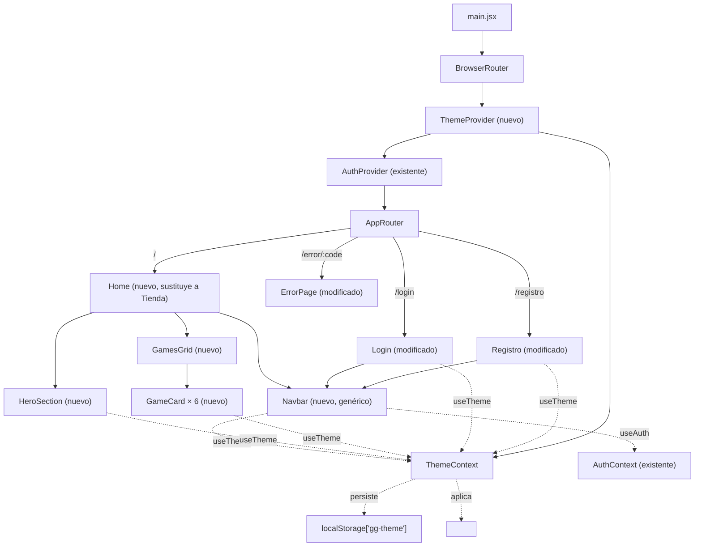
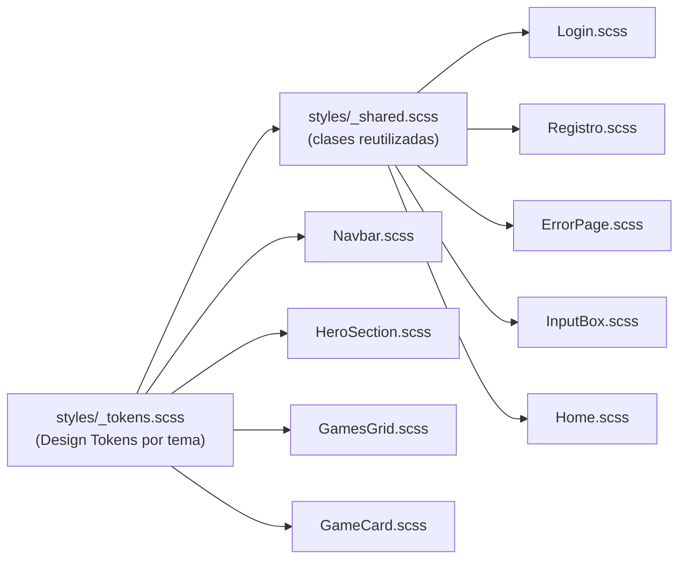

# Design Document: Home con temas visuales (home-diseno)

## Overview

Esta feature es exclusivamente de frontend (`GalinGames_react/`); no introduce cambios de API ni de modelo de datos en el backend. Se construye:

1. Un **sistema de temas** (`ThemeContext`/`ThemeProvider`, patrón idéntico a `AuthContext`) que expone el tema activo (`'azul' | 'rojo'`) y lo persiste en `localStorage`, materializado como variables CSS (custom properties) sobre el atributo `data-theme` del elemento raíz.
2. Un **Navbar genérico reutilizable** (componente propio, no acoplado a Home) que consume `ThemeContext` y `AuthContext`, usado por Home, Login y Registro.
3. Una **Home pública** nueva (`Home` → `HeroSection` + `GamesGrid` → `GameCard` × 6) que sustituye la ruta protegida actual de `Tienda.jsx`.
4. La **migración a SCSS** de las hojas de estilo tocadas por esta feature (`Login.css`, `Registro.css`, `ErrorPage.css`, `InputBox.css`), con una hoja de Design Tokens centralizada y un parcial de estilos compartidos, sustituyendo los nombres de clase ambiguos actuales (`color-fondo`, `marginForm`, `botonRegistro`...) por una nomenclatura descriptiva.

El resultado: dos paletas visuales completas, intercambiables sin recarga de página y persistentes, aplicadas de forma consistente en las cuatro páginas públicas de la aplicación (`/`, `/login`, `/registro`, `/error/:code`).

---

## Architecture



Flujo de estilos (quién consume los Design Tokens):



`_tokens.scss` define, para cada tema, un bloque `[data-theme="azul"] { --color-acento: ...; }` / `[data-theme="rojo"] { ... }`. El resto de hojas SCSS solo leen `var(--color-...)`; ninguna declara un color de tema por su cuenta (Requisitos 1.6, 1.7, 9.3, 9.6).

---

## Components and Interfaces

### Árbol de archivos (nuevo/modificado)

```
GalinGames_react/src/
├── globalState/
│   ├── authContext.jsx                          (sin cambios)
│   └── themeContext.jsx                         [NUEVO]
├── hooks/
│   ├── useAuth.js                                (sin cambios)
│   └── useTheme.js                               [NUEVO]
├── styles/                                       [NUEVO — carpeta]
│   ├── _tokens.scss                              [NUEVO] Design Tokens (Req 9.3)
│   └── _shared.scss                              [NUEVO] clases reutilizadas (Req 9.8)
├── Componentes/
│   ├── compGlobales/
│   │   ├── NavbarComponente/                     [NUEVO — carpeta]
│   │   │   ├── Navbar.jsx                        [MODIFICADO] (Req 4 — iconos carrito/usuario)
│   │   │   ├── Navbar.scss                       [MODIFICADO] (Req 4)
│   │   │   ├── NavbarIconos.jsx                   [MODIFICADO] (+ IconoCarrito, Req 4.1-4.2)
│   │   │   ├── ThemeToggle.jsx
│   │   │   └── ThemeToggle.scss
│   │   ├── InputBoxComponente/
│   │   │   ├── InputBox.jsx                      [MODIFICADO] (Req 7.5, 7bis.5, 7bis.6 — nueva prop `ocultarLabel`)
│   │   │   └── InputBox.css → InputBox.scss      [MODIFICADO] (Req 7.5, 9.2)
│   │   └── ErrorPageComponente/
│   │       ├── ErrorPage.jsx                      (import de estilos actualizado)
│   │       └── ErrorPage.css → ErrorPage.scss     [MODIFICADO] (Req 9.2)
│   ├── zonaCliente/
│   │   ├── LoginComponente/
│   │   │   ├── Login.jsx                          [MODIFICADO] (Req 7ter — layout dividido, sin Navbar)
│   │   │   └── Login.css → Login.scss             [MODIFICADO] (Req 7ter, 9.2)
│   │   └── RegistroComponente/
│   │       ├── Registro.jsx                       [MODIFICADO] (Req 7bis — layout dividido, sin Navbar)
│   │       └── Registro.css → Registro.scss       [MODIFICADO] (Req 7bis, 9.2)
│   ├── zonaHome/                                 [NUEVO — carpeta, sustituye a zonaTienda]
│   │   ├── HomeComponente/
│   │   │   ├── Home.jsx
│   │   │   └── Home.scss
│   │   ├── HeroSectionComponente/
│   │   │   ├── HeroSection.jsx
│   │   │   └── HeroSection.scss
│   │   ├── GamesGridComponente/
│   │   │   ├── GamesGrid.jsx
│   │   │   └── GamesGrid.scss
│   │   └── GameCardComponente/
│   │       ├── GameCard.jsx
│   │       └── GameCard.scss
│   └── zonaTienda/                               [ELIMINADO] (Req 5.5)
│       └── TiendaComponente/Tienda.jsx           [ELIMINADO]
├── router/
│   └── AppRouter.jsx                             [MODIFICADO]
└── main.jsx                                      [MODIFICADO]

GalinGames_react/package.json                     [MODIFICADO] (+ sass como devDependency)
```

### `themeContext.jsx` — contrato

Mismo patrón que `authContext.jsx` (`AuthContext`/`AuthProvider`/`useAuth`):

```js
export const ThemeContext = createContext(null)

export function ThemeProvider({ children }) {
  // useState inicializado de forma síncrona leyendo localStorage (evita parpadeo, Req 2.2)
  const [theme, setTheme] = useState(() => readThemeFromStorage()) // 'azul' | 'rojo'

  // useLayoutEffect (no useEffect): aplica data-theme al <html> ANTES del primer
  // pintado del navegador, evitando el parpadeo de un tema a otro (Req 2.2).
  useLayoutEffect(() => {
    document.documentElement.setAttribute('data-theme', theme)
  }, [theme])

  const toggleTheme = useCallback(() => {
    setTheme((prev) => {
      const next = prev === 'azul' ? 'rojo' : 'azul'
      localStorage.setItem('gg-theme', next)
      return next
    })
  }, [])

  return <ThemeContext.Provider value={{ theme, toggleTheme }}>{children}</ThemeContext.Provider>
}

function readThemeFromStorage() {
  const stored = localStorage.getItem('gg-theme')
  return stored === 'azul' || stored === 'rojo' ? stored : 'azul' // Req 1.5, 2.3
}
```

`useTheme.js` replica `useAuth.js`: `useContext(ThemeContext)`, lanza `Error('useTheme debe usarse dentro de ThemeProvider')` si el contexto es `null`.

### `Navbar.jsx` — contrato

Componente sin props obligatorias (lee todo de `useAuth()`; ya no necesita `useTheme()` directamente — esa lógica vive ahora en `ThemeToggle`):

```js
function Navbar() {
  const { isAuthenticated, user, logout } = useAuth()
  // ...
}
```

Estructura semántica: `<header className="navbar"><nav className="navbar__nav">...</nav></header>`, con:
- `ThemeToggle` en la posición del logotipo (ver decisión más abajo) — ya no hay un `<Link to="/">` separado envolviendo el logo.
- Enlaces "Inicio" (Link real a `/`), y "Juegos"/"Novedades"/"Comunidad" como `<span className="navbar__link navbar__link--proximamente" aria-disabled="true">` (Req 3.4, sin `href="#"`).
- Zona de sesión (Req 4, revisado): `isAuthenticated ? <span>{user.username}</span> + botón "Cerrar sesión" (onClick={logout}) : <span aria-disabled="true"><IconoCarrito /></span> + <Link to="/login" className="navbar__icono-usuario" aria-label="Iniciar sesión"><IconoUsuario /></Link>` — el estado autenticado no cambia; el estado sin sesión sustituye los dos enlaces de texto por dos iconos (ver contrato de `IconoCarrito` más abajo).
- Botón hamburguesa + panel colapsable solo visible bajo el breakpoint móvil (Req 3.6), controlado con un `useState` local (`menuAbierto`).

### `ThemeToggle.jsx` — contrato (revisado)

**Decisión de diseño (ajuste solicitado por el usuario sobre la Phase 2 ya implementada):** el propio logotipo pasa a ser el control de cambio de tema — deja de existir un interruptor visual independiente (pista/pulgar) separado del logo. Al pulsar el logotipo se alterna el tema (persistido en `localStorage`, comportamiento ya cubierto por Requisito 2); al pasar el cursor por encima, un efecto de zoom 3D (`scale` + `rotateY` + sombra de acento) indica que es interactivo. Como contrapartida, el logotipo deja de navegar a `/` — el enlace "Inicio" del propio Navbar ya cubre esa navegación (Requisito 3.3), por lo que no se pierde ninguna vía de acceso al inicio.

```js
function ThemeToggle() {
  const { theme, toggleTheme } = useTheme()
  const logoSrc = theme === 'azul' ? '/logo1.png' : '/logo2.png'
  return (
    <button
      type="button"
      className="theme-toggle"
      onClick={toggleTheme}
      aria-pressed={theme === 'rojo'}
      aria-label={`Cambiar a tema ${theme === 'azul' ? 'rojo' : 'azul'}`}
    >
      
    </button>
  )
}
```

`ThemeToggle.scss` aplica el recorte/`mix-blend-mode` que antes vivía en `Navbar.scss` → `.navbar__logo` (Requisito 3.1, ya no aplica ahí porque el logo ya no se renderiza en `Navbar.jsx`), más `perspective` en el botón y `transform: scale(1.15) rotateY(10deg)` + `filter: drop-shadow(...)` en `:hover`/`:focus-visible` sobre `.theme-toggle__logo`, envuelto en el mixin `transicion-suave` (Requisito 8.4 — sin animación si `prefers-reduced-motion`).

### `Home.jsx` / `HeroSection.jsx` / `GamesGrid.jsx` / `GameCard.jsx`

- `Home.jsx`: `<><Navbar /><main className="home"><HeroSection /><GamesGrid /></main></>` — sin lógica propia más allá de componer las piezas (Req 9.5).
- `HeroSection.jsx`: sin props; usa `useTheme()` para elegir `mando.png`/`mando2.png`; botón "Ver todos" como `<span aria-disabled="true">` (Req 5.4). **Revisado:** ya no incluye la etiqueta "TENDENCIAS" (se movió a `GamesGrid.jsx`, ver Req 5.2/6.6 y decisión más abajo).
- `GamesGrid.jsx`: define un array constante de 6 entradas `{ src, alt }` (Req 6.1) y mapea a `<GameCard />`, dentro de un `<section>` cuyo `<h2>` es ahora el texto visible **"TENDENCIAS ›"** (antes vivía, mal ubicado, como etiqueta del Hero — el usuario aclaró que es el título de la sección del grid, no del Hero).
- `GameCard.jsx`: props `{ src, alt }`; usa `useState` local para el fallback de carga:

```js
function GameCard({ src, alt }) {
  const [error, setError] = useState(false)
  return (
    <div className="game-card">
      {error ? (
        <div className="game-card__fallback" role="img" aria-label={alt}>{alt}</div>
      ) : (
         setError(true)} />
      )}
    </div>
  )
}
```

(Cubre Req 6.4 — estado de reserva sin icono de imagen rota.)

### Cambios en `Navbar.jsx` / `Navbar.scss` / `NavbarIconos.jsx` (Requisito 4 revisado)

Nuevo icono `IconoCarrito` en `NavbarIconos.jsx`, mismo patrón SVG en línea que `IconoBusqueda`/`IconoGlobo`/`IconoUsuario` ya existentes (sin librería externa, `aria-hidden="true"` porque el nombre accesible lo aporta el elemento contenedor):

```js
export function IconoCarrito() {
  return (
    <svg className="navbar__icono" viewBox="0 0 24 24" width="18" height="18" fill="none" stroke="currentColor" strokeWidth="2" strokeLinecap="round" strokeLinejoin="round" aria-hidden="true">
      <circle cx="9" cy="21" r="1" />
      <circle cx="20" cy="21" r="1" />
      <path d="M1 1h4l2.68 13.39a2 2 0 0 0 2 1.61h9.72a2 2 0 0 0 2-1.61L23 6H6" />
    </svg>
  )
}
```

Bloque `else` de la zona de sesión en `Navbar.jsx` (Req 4.1-4.4):

```diff
- <div className="navbar__sesion">
-   <Link to="/login" className="navbar__link navbar__link--sesion" onClick={cerrarMenu}>
-     <IconoUsuario />
-     Iniciar sesión
-   </Link>
-   <Link to="/registro" className="boton-primario navbar__boton-registro" onClick={cerrarMenu}>
-     Registrarse
-   </Link>
- </div>
+ <div className="navbar__sesion">
+   <span className="navbar__icono-carrito" aria-disabled="true" title="Carrito (próximamente)">
+     <IconoCarrito />
+   </span>
+   <Link to="/login" className="navbar__icono-usuario" onClick={cerrarMenu} aria-label="Iniciar sesión">
+     <IconoUsuario />
+   </Link>
+ </div>
```

- **Icono de carrito inerte** (Req 4.1-4.2): `<span aria-disabled="true">`, mismo patrón "próximamente" que `.navbar__link--proximamente` (Req 3.4) — sin `onClick`, sin `href`.
- **Icono de usuario → `/login`** (Req 4.1, 4.3-4.4): `<Link>` real (navegación funcional, a diferencia del carrito), con `aria-label` porque su único contenido visual es el SVG (sin texto). Nueva clase `.navbar__icono-usuario` en `Navbar.scss`: `border-radius: 50%`, `background: var(--color-fondo-elevado)` (mismo token semitransparente que `.pagina-dividida__cerrar`, Req 9.6), `padding` para que el círculo tenga aire alrededor del icono.
- **Estado autenticado sin cambios** (Req 4.5): el bloque `isAuthenticated ? (...)` no se toca.
- **`.navbar__boton-registro`** deja de usarse en este bloque; se elimina de `Navbar.scss` por quedar sin ninguna referencia (evita la regla CSS muerta, mismo criterio ya aplicado en Task 12.1 al retirar `ProtectedRoute` sin uso).

### Menú desplegable de usuario en `Navbar.jsx` (Requisitos 4.5bis-4.5quater, 4.6, 4.6bis)

**Decisión de diseño (petición del usuario tras ver el Requisito 4 en funcionamiento):** la zona de sesión deja de distinguir visualmente entre autenticado/no autenticado — siempre son los mismos dos iconos (carrito + usuario). Lo único que cambia con sesión iniciada es el comportamiento del icono de usuario: en vez de un `<Link to="/login">`, pasa a ser un `<button>` que abre un menú desplegable (`navbar__dropdown`) con `Soporte`/`Mi cuenta`/`Mis pedidos` (inertes, `aria-disabled`) y `Cerrar sesión` (real, llama a `logout()` del `AuthContext` ya existente).

```js
const [menuUsuarioAbierto, setMenuUsuarioAbierto] = useState(false)
const menuUsuarioRef = useRef(null)

useEffect(() => {
  if (!menuUsuarioAbierto) return undefined
  const handleClickFuera = (e) => {
    if (menuUsuarioRef.current && !menuUsuarioRef.current.contains(e.target)) setMenuUsuarioAbierto(false)
  }
  const handleTecla = (e) => { if (e.key === 'Escape') setMenuUsuarioAbierto(false) }
  document.addEventListener('mousedown', handleClickFuera)
  document.addEventListener('keydown', handleTecla)
  return () => {
    document.removeEventListener('mousedown', handleClickFuera)
    document.removeEventListener('keydown', handleTecla)
  }
}, [menuUsuarioAbierto])
```

- `user` deja de desestructurarse de `useAuth()` en `Navbar.jsx` (ya no se muestra el `username` como texto).
- `.navbar__icono-usuario` (círculo semitransparente ya existente) pasa a resetear `border`/`padding`/`font` explícitamente, porque ahora es tanto un `<Link>` (sin sesión) como un `<button>` real (con sesión) — sin el reset, heredaría el estilo de botón por defecto de `index.scss`.
- Cierre del menú: clic fuera (`mousedown` + `ref.contains`) y tecla `Escape` (Requisito 4.6bis), además del cierre explícito al pulsar "Cerrar sesión" o cualquier enlace real del menú móvil (`cerrarMenu()` ya existente, ahora también resetea `menuUsuarioAbierto`).
- `.navbar__usuario`/`.navbar__cerrar-sesion` (CSS del diseño anterior: texto de username + botón con borde) se eliminan de `Navbar.scss` al quedar sin ninguna referencia.

### Banner de email verificado — verde y con auto-ocultado (Requisitos 7ter.16, 7ter.17)

`emailVerificado` pasa de una constante derivada de `searchParams` en cada render a un `useState` inicializado una vez desde esa misma URL, con un `useEffect` que lo apaga a los 60 segundos:

```js
const [emailVerificado, setEmailVerificado] = useState(() => searchParams.get('verificado') === 'true')

useEffect(() => {
  if (!emailVerificado) return undefined
  const timeoutId = setTimeout(() => setEmailVerificado(false), 60000)
  return () => clearTimeout(timeoutId)
}, [emailVerificado])
```

Nueva clase `.texto-tema--exito` en `_shared.scss` (`color: #4caf50`, verde fijo independiente del tema activo — igual criterio que el rojo fijo `#ffb3b3` ya usado para `[role='alert']` en `Login.scss`).

### Cambios en `ErrorPage.jsx`

Solo capa visual (Req 9.2): se sustituye el patrón `<div className="fondo-gaming" />` + `<div style={{...inline flex centering...}}>` por `<><Navbar /><main className="pagina-tematica"><div className="tarjeta-tema">...</div></main></>`, reutilizando las clases del nuevo `_shared.scss`. La lógica interna no se toca. Es el **único** de los tres formularios/páginas públicas que conserva el patrón "Navbar + tarjeta" — Login y Registro pasan al layout dividido descrito a continuación.

**Nota histórica:** `Login.jsx`/`Registro.jsx` se implementaron originalmente con este mismo patrón (Phase 4 de `tasks.md`, Requisito 7). El Requisito 7bis sustituyó primero Registro y el Requisito 7ter sustituye ahora también Login por el layout dividido — ver siguiente sección.

### Layout dividido de `Login.jsx` / `Registro.jsx` (Requisitos 7bis, 7ter)

**Decisión de diseño:** Login y Registro comparten ahora exactamente el mismo layout de dos mitades sin Navbar — el `ThemeToggle` reutilizado como única cabecera, el formulario pegado a la izquierda directamente sobre `var(--color-fondo)` (sin tarjeta), y `downwalker-registro.jpg` ocupando la mitad derecha con un botón "X" de vuelta a Home. Como el Requisito 9.8 exige extraer a un parcial compartido cualquier estilo usado por más de un componente, este layout se define **una sola vez** en `_shared.scss` como `.pagina-dividida` (en vez de duplicar ~60 líneas de SCSS casi idénticas en `Login.scss` y `Registro.scss`).

```js
// Registro.jsx
function Registro() {
  // ...mismo estado y handleSubmit que antes, sin tocar...
  const navigate = useNavigate() // ya existía

  return (
    <div className="pagina-dividida">
      <ThemeToggle />
      <div className="pagina-dividida__formulario">
        {successMessage ? (
          <p className="texto-tema" role="status">{successMessage}</p>
        ) : (
          <form onSubmit={handleSubmit} autoComplete="off">
            <h1 className="titulo-tema">Datos de la cuenta</h1>
            {CAMPOS_FORM.map(({ name, label, type }) => (
              <InputBox key={name} nameInput={name} labelInput={label} typeInput={type}
                placeholderInput={label} ocultarLabel eventoOnChange={handleFieldChange(name)} />
            ))}
            {/* checkboxes, errores y botón "Registrarse" igual que antes */}
            <Link to="/" className="pagina-dividida__volver">‹ Volver al inicio</Link>
          </form>
        )}
      </div>
      <div className="pagina-dividida__imagen">
        <button type="button" className="pagina-dividida__cerrar" onClick={() => navigate('/')} aria-label="Volver al inicio">
          ×
        </button>
      </div>
    </div>
  )
}
```

```js
// Login.jsx — mismo esqueleto, campos y enlaces propios
function Login() {
  // ...mismo estado y handleSubmit que antes, sin tocar...
  const navigate = useNavigate() // ya existía

  if (unexpectedStatus) return <ErrorPage code={unexpectedStatus} /> // sin cambios

  return (
    <div className="pagina-dividida">
      <ThemeToggle />
      <div className="pagina-dividida__formulario">
        <form onSubmit={handleSubmit} autoComplete="off">
          <h1 className="titulo-tema">Iniciar sesión</h1>
          {emailVerificado && <p className="texto-tema" role="status">¡Email verificado correctamente! Ya puedes iniciar sesión.</p>}
          <InputBox nameInput="username" labelInput="Nombre de usuario" typeInput="text"
            placeholderInput="Nombre de usuario" ocultarLabel eventoOnChange={handleUsernameChange} />
          <InputBox nameInput="password" labelInput="Contraseña" typeInput="password"
            placeholderInput="Contraseña" ocultarLabel eventoOnChange={handlePasswordChange} />
          {/* errores, cuenta atrás y botón "Entrar" igual que antes */}
          <Link to="#" className="texto-tema texto-tema--condiciones pagina-dividida__enlace-secundario" aria-disabled="true">¿Has olvidado tu contraseña?</Link>
          <Link to="/registro" className="texto-tema texto-tema--condiciones pagina-dividida__enlace-secundario">¿Aún no tienes cuenta?</Link>
          <Link to="/" className="pagina-dividida__volver">‹ Volver al inicio</Link>
        </form>
      </div>
      <div className="pagina-dividida__imagen">
        <button type="button" className="pagina-dividida__cerrar" onClick={() => navigate('/')} aria-label="Volver al inicio">
          ×
        </button>
      </div>
    </div>
  )
}
```

Puntos clave (valida Requisitos 7bis.1-7bis.14 y, en espejo, 7ter.1-7ter.13):

- **Sin `<Navbar />`** (7bis.1/7ter.1): se elimina el import y el uso de `Navbar` en ambos ficheros; el único control de cabecera es `<ThemeToggle />`, importado directamente desde `NavbarComponente/ThemeToggle.jsx` (mismo componente que usa `Navbar.jsx`, sin duplicarlo — 7bis.2/7ter.2). `ThemeToggle` no necesita `AuthContext`, así que **Registro** deja de depender de `useAuth`/`AuthProvider` por completo (nunca lo necesitó más que a través de `Navbar`). **Login sí sigue necesitando `useAuth()`** — no por el Navbar, sino porque `handleSubmit` llama a `authContext.login(...)` tras un login correcto (Requisito 7ter.9, lógica ya existente que no se toca); ese import/uso se mantiene sin cambios.
- **Posicionamiento del logo**: `ThemeToggle.scss` ya define `position: absolute; left: 1.5rem; top: 0.4rem` relativo a su ancestro posicionado más cercano. En `Navbar.jsx` ese ancestro es `.navbar__nav`; en Login/Registro pasa a ser `.pagina-dividida` (nuevo `position: relative` en `_shared.scss`), así que `ThemeToggle` no necesita ningún cambio propio — solo un contenedor padre posicionado.
- **Layout 50/50** (7bis.3/7.7 / 7ter.3/7ter.7): `.pagina-dividida` es un `display: flex` con `&__formulario` y `&__imagen` al 50% de ancho cada uno; bajo el breakpoint móvil (768px, mismo valor que el resto de la feature) pasa a `flex-direction: column`, apilando formulario e imagen.
- **Sin tarjeta** (7bis.4/7ter.4): ninguno de los dos formularios usa ya `.tarjeta-tema` — `.pagina-dividida__formulario` solo aporta el padding/max-width del formulario, heredando `var(--color-fondo)`/`var(--color-texto)` de `.pagina-dividida` (sin fondo elevado ni borde propio).
- **Placeholders en vez de labels** (7bis.5-6 / 7ter.5-6): nueva prop booleana `ocultarLabel` en `InputBox` (ver contrato actualizado más abajo), pasada ahora tanto por `Registro.jsx` como por `Login.jsx` — el `<label>` sigue existiendo en el DOM (asociado por `htmlFor`, nombre accesible real) pero se oculta visualmente con `.visualmente-oculto` (`index.scss`, Requisito 8.5).
- **Imagen decorativa compartida**: `downwalker-registro.jpg` se aplica como `background-image` de `.pagina-dividida__imagen` (no ``) **dentro del propio `_shared.scss`** — ni `Login.scss` ni `Registro.scss` declaran la imagen por separado, así que ambas páginas quedan sincronizadas si el asset cambia en el futuro. El contenedor no lleva `aria-hidden="true"`: aplicarlo ocultaría también al botón "X" que vive dentro de él (ver Design Decisions).
- **Botón "X" de vuelta a Home** (7bis.12,14 / 7ter.12-13): `.pagina-dividida__cerrar`, `<button>` real posicionado `position: absolute; top/right` dentro de `.pagina-dividida__imagen` (que pasa a `position: relative`), con `onClick={() => navigate('/')}` y `aria-label="Volver al inicio"` — el símbolo "×" visual no es su nombre accesible. Fondo redondeado semitransparente vía `var(--color-fondo-elevado)` + `border-radius: 50%`.
- **Enlace "‹ Volver al inicio"** (7bis.13 / 7ter.12): `<Link to="/" className="pagina-dividida__volver">`, común a ambos formularios.
- **Enlaces propios de Login** (7ter.10-11): "¿Has olvidado tu contraseña?" se implementa como `<Link>` con `aria-disabled="true"` y `to="#"` — mismo patrón "próximamente" ya usado en el Navbar (Req 3.4), ya que no existe backend de recuperación de contraseña. "¿Aún no tienes cuenta?" sustituye textualmente al antiguo "¿No tienes cuenta? Regístrate" (mismo `to="/registro"`).
- **Vuelta a Registro** (7bis.11): el enlace "¿Ya tienes cuenta? Inicia sesión" de Registro no cambia de comportamiento, solo se mantiene fuera de la tarjeta eliminada.
- **Pantalla de éxito de Registro**: como Registro ya no tiene Navbar en ningún estado, la vista de éxito reutiliza el mismo `.pagina-dividida` (con la imagen, el botón "X" y el `ThemeToggle` visibles) en vez de su propio `<Navbar />` + `.tarjeta-tema` de la Phase 4.
- **`unexpectedStatus` de Login**: sigue devolviendo `<ErrorPage code={unexpectedStatus} />` sin cambios — `ErrorPage` conserva su propio Navbar (no forma parte de 7bis/7ter), así que ese caso de error visualmente "sale" del layout dividido, igual que ya pasaba con `.tarjeta-tema` antes de este cambio.

### Contrato actualizado de `InputBox.jsx`

```diff
- function InputBox(props){
+ function InputBox({ ocultarLabel, ...props }){
    return(
      <div className="mb-3">
        <label
          htmlFor={props.nameInput}
-         className="form-label videojuego-text">{props.labelInput}
+         className={`form-label texto-tema${ocultarLabel ? ' visualmente-oculto' : ''}`}>{props.labelInput}
        </label>
        <input type={props.typeInput} className="form-control" id={props.nameInput}
          placeholder={props.placeholderInput} onChange={props.eventoOnChange} required />
      </div>
    )
  }
```

Dos cambios en el mismo diff, por motivos distintos:
1. **`ocultarLabel`** (nuevo, opt-in): sin la prop (caso de `Login.jsx`, que no cambia), el comportamiento es idéntico al actual — label visible. Con `ocultarLabel` (caso de `Registro.jsx`), se añade `.visualmente-oculto`.
2. **`videojuego-text` → `texto-tema`**: se corrige de paso una referencia a una clase que la Phase 4 (Tasks 15/16) ya dejó huérfana en `Login.css`/`Registro.css` (ninguna hoja `.scss` de esta feature vuelve a definir `.videojuego-text`) — documentado como nota pendiente en `tasks.md` Task 13.1 y no corregido entonces porque quedaba fuera del alcance literal de esa tarea. Al tocar este mismo fichero para el Requisito 7bis, se aprovecha para cerrar ese hueco: el label de `InputBox` vuelve a recibir la tipografía/color del tema activo en vez de quedar sin estilo.

**Placeholders concisos** (7bis.5, 7ter.5, revisado): `placeholderInput` deja de generarse como `` `Introduce tu ${label.toLowerCase()}...` `` y pasa a reutilizar `label` tal cual (`"Email"`, `"Contraseña"`, `"Repetir Contraseña"`, etc.) — el propio array `CAMPOS_FORM` de `Registro.jsx` ya definía esos textos cortos para `labelInput`, así que no hace falta ninguna lista de placeholders nueva.

**Estilo visual de `InputBox.scss`** (Req 7.5 revisado): además del `:focus`, `.form-control` pasa a declarar explícitamente `background-color: var(--color-fondo-elevado)`, `border: 1px solid var(--color-texto-tenue)`, `color: var(--color-texto)` y `&::placeholder { color: var(--color-texto-tenue); opacity: 1; }` — sustituyendo el blanco plano por defecto de Bootstrap (que hasta ahora solo se sobreescribía en `:focus`) por un campo oscuro con borde visible, acorde a la referencia visual aportada por el usuario.

### `BotonesSocial.jsx` / `SocialIconos.jsx` — contrato (Requisito 7ter.14, solo Login_Form)

```js
// compGlobales/SocialLoginComponente/BotonesSocial.jsx
const PROVEEDORES = [
  { nombre: 'Facebook', Icono: IconoFacebook, clase: 'facebook' },
  { nombre: 'Google', Icono: IconoGoogle, clase: 'google' },
  { nombre: 'Apple', Icono: IconoApple, clase: 'apple' },
  { nombre: 'Discord', Icono: IconoDiscord, clase: 'discord' },
]

function BotonesSocial() {
  return (
    <>
      <div className="pagina-dividida__social">
        {PROVEEDORES.map((proveedor) => {
          const IconoProveedor = proveedor.Icono
          return (
            <span key={proveedor.nombre} className={`pagina-dividida__social-boton pagina-dividida__social-boton--${proveedor.clase}`}
              aria-disabled="true" title={`Continuar con ${proveedor.nombre} (próximamente)`}>
              <IconoProveedor />
            </span>
          )
        })}
      </div>
      <div className="pagina-dividida__divisor"><span>o</span></div>
    </>
  )
}
```

- Cada botón es un `<span aria-disabled="true">` (no `<button>`/`<a>`), mismo patrón "próximamente" que `IconoCarrito` del Navbar — no hay backend de OAuth.
- Los 4 iconos (`SocialIconos.jsx`) son SVG en línea aproximando cada marca, mismo patrón que `NavbarIconos.jsx` (sin librería externa, `aria-hidden="true"`).
- **Solo `Login.jsx` importa y renderiza `<BotonesSocial />`** (entre el `<h1>` y el primer `<InputBox>`) — `Registro.jsx` no lo usa: la referencia visual que compartió el usuario para la pantalla de registro no incluía accesos sociales, solo la de login los mostraba explícitamente.
- Los colores de fondo de cada botón (`#1877f2` Facebook, blanco Google, negro Apple, `#5865f2` Discord) son colores de marca fijos, no Design_Tokens del tema — excepción deliberada a la regla general (Req 9.6), justificada porque son logotipos de terceros reconocibles por su color de marca, no elementos propios de la identidad visual de GalinGames.

### `_shared.scss` — nueva clase `.pagina-dividida` (Requisitos 7bis, 7ter, 9.8)

```scss
// Añadido a src/styles/_shared.scss (mismo fichero que .pagina-tematica/.tarjeta-tema).
// Reutilizada literalmente por Login.jsx y Registro.jsx (Requisitos 7bis, 7ter) — se
// centraliza aquí en vez de duplicarse en Login.scss/Registro.scss (Requisito 9.8).

$pagina-dividida-breakpoint-movil: 768px; // mismo valor que Navbar.scss/GamesGrid.scss

.pagina-dividida {
  position: relative; // ancla ThemeToggle (top-left)
  display: flex;
  min-height: 100vh;
  width: 100%;
  background: var(--color-fondo); // sin degradado de .pagina-tematica: fondo plano
  color: var(--color-texto);

  @media (max-width: $pagina-dividida-breakpoint-movil) {
    flex-direction: column;
  }

  &__formulario {
    width: 50%;
    display: flex;
    align-items: center;
    box-sizing: border-box;
    padding: 6rem 3rem 3rem; // top generoso para no chocar con el ThemeToggle
    @media (max-width: $pagina-dividida-breakpoint-movil) { width: 100%; }

    form { width: 100%; max-width: 420px; }
  }

  &__imagen {
    position: relative; // ancla .pagina-dividida__cerrar
    width: 50%;
    min-height: 100vh;
    background: url('/downwalker-registro.jpg') center / cover no-repeat;
    @media (max-width: $pagina-dividida-breakpoint-movil) { width: 100%; min-height: 40vh; }
  }

  &__cerrar {
    position: absolute;
    top: 1.25rem;
    right: 1.25rem;
    width: 2.5rem;
    height: 2.5rem;
    border-radius: 50%;
    border: none;
    background: var(--color-fondo-elevado); // mismo token semitransparente que .tarjeta-tema
    color: var(--color-texto);
    font-size: 1.5rem;
    line-height: 1;
    cursor: pointer;
    @include transicion-suave(background-color 0.15s, transform 0.15s);

    &:hover, &:focus-visible {
      background: var(--color-acento);
      transform: scale(1.08);
    }
  }

  &__volver,
  &__enlace-secundario {
    display: inline-block;
    margin-top: 0.75rem;
    color: var(--color-texto-tenue);

    &:hover { color: var(--color-acento); }
  }
}
```

Notas de la implementación:

- No usa `.pagina-tematica`/`.tarjeta-tema` (Requisitos 7bis.4/7ter.4 los excluyen explícitamente), pero convive en el mismo fichero `_shared.scss` que ambas.
- `Login.scss` y `Registro.scss` quedan reducidos a un `@use '../../../styles/shared' as *;` (para `.pagina-dividida`, `.titulo-tema`, `.texto-tema`, `.boton-primario`, etc.) más, en el caso de Login, la regla `[role='alert']` ya existente de la Phase 4 (sin cambios) anidada donde corresponda; Registro sigue sin ninguna regla propia.
- `.pagina-dividida__cerrar` reutiliza `var(--color-fondo-elevado)` (mismo token "semitransparente" que Navbar/tarjetas) en vez de inventar una nueva opacidad — consistente con el Requisito 9.6.
- `.pagina-dividida__enlace-secundario` (nuevo, usado solo por Login para "¿Has olvidado tu contraseña?"/"¿Aún no tienes cuenta?") comparte estilo con `.pagina-dividida__volver` vía selector combinado, evitando declarar la regla dos veces.

### Cambios en `AppRouter.jsx`

```diff
- import Tienda from '../Componentes/zonaTienda/TiendaComponente/Tienda'
+ import Home from '../Componentes/zonaHome/HomeComponente/Home'
  ...
- <Route path="/" element={<ProtectedRoute><Tienda /></ProtectedRoute>} />
+ <Route path="/" element={<Home />} />
```

`ProtectedRoute` deja de usarse en esta ruta pero se mantiene definido en el archivo por si una futura zona de usuario autenticado lo necesita (no forma parte del alcance de esta feature retirarlo).

### Cambios en `main.jsx`

```diff
  <BrowserRouter>
+   <ThemeProvider>
      <AuthProvider>
        <AppRouter />
      </AuthProvider>
+   </ThemeProvider>
  </BrowserRouter>
```

---

## Design Tokens

`styles/_tokens.scss` define, mediante bloques `[data-theme="..."]` sobre `:root`, las siguientes variables (nombres definitivos, Req 9.3):

| Token | Tema Azul | Tema Rojo | Uso |
|---|---|---|---|
| `--color-fondo` | `#0b0618` | `#0d0505` | fondo general de página |
| `--color-fondo-elevado` | `rgba(15, 8, 30, 0.55)` | `rgba(20, 8, 8, 0.55)` | Navbar y tarjetas (semitransparente, Req 3.8) |
| `--color-acento` | `#2dd4ff` | `#ff2b4e` | color principal interactivo: bordes, foco, enlaces (Req 1.6) |
| `--color-acento-secundario` | `#7d2ae8` | `#b3121f` | degradado de botones primarios y tarjetas (Req 1.7) |
| `--color-texto` | `#ffffff` | `#ffffff` | texto principal |
| `--color-texto-tenue` | `rgba(255,255,255,0.72)` | `rgba(255,255,255,0.72)` | texto secundario/etiquetas |
| `--sombra-acento` | `0 4px 24px rgba(45,212,255,0.35)` | `0 4px 24px rgba(255,43,78,0.35)` | resplandor de tarjetas y botones al hover/focus |

Todas las hojas SCSS de componentes consumen exclusivamente `var(--color-*)`/`var(--sombra-acento)`; ningún componente declara un valor de color de tema propio (Req 9.6). El único punto donde existe un valor de color "crudo" es dentro de los dos bloques `[data-theme]` de `_tokens.scss`.

`styles/_shared.scss` (Req 9.8) centraliza, consumiendo los tokens anteriores, las clases reutilizadas por Home/Login/Registro/ErrorPage:

| Clase nueva | Sustituye a | Usada por |
|---|---|---|
| `.pagina-tematica` | `.fondo-gaming` + wrapper inline | Login, Registro, ErrorPage |
| `.tarjeta-tema` | `.color-fondo` + `.marginForm` + `.contenido-registro` + `.form-box` | Login, Registro, ErrorPage |
| `.titulo-tema` | `.videojuego-title` | Login, Registro, ErrorPage |
| `.texto-tema` | `.videojuego-text` | Login, Registro, ErrorPage |
| `.texto-tema--condiciones` | `.videojuego-conditions` | Registro |
| `.boton-primario` | `.botonRegistro` | Login, Registro, ErrorPage, Navbar (Registrarse), HeroSection (Ver todos, si se decide sólido) |

Justificación de la consolidación en la sección Design Decisions.

---

## Error Handling

- **Tema corrupto en `localStorage`** (Req 2.3): `readThemeFromStorage()` valida contra el allowlist estricto `['azul', 'rojo']`; cualquier otro valor (incluido `null`, cadenas vacías o JSON inválido) se descarta silenciosamente y se usa `'azul'`, sin `try/catch` necesario porque `localStorage.getItem` nunca lanza para una clave inexistente.
- **Parpadeo de tema al cargar** (Req 2.2): se evita computando el estado inicial de `theme` de forma síncrona en `useState(() => ...)` y aplicando el atributo `data-theme` en `useLayoutEffect` (se ejecuta antes del primer pintado del navegador), no en `useEffect`.
- **Imagen de portada rota** (Req 6.4): `onError` en el `` de `GameCard` conmuta a un estado de reserva local (`role="img"` + `aria-label`) en vez de dejar el icono de imagen rota del navegador.
- **`logo1.png` con fondo no transparente** (Nota de `requirements.md`): se documenta como decisión técnica en la siguiente sección — no es un error en tiempo de ejecución, sino una limitación del propio asset que se mitiga con CSS.

---

## Accessibility (Requisito 8)

- Contraste: `--color-texto: #ffffff` sobre `--color-fondo`/`--color-fondo-elevado` (ambos muy oscuros) supera 4.5:1 en ambos temas; se verificará visualmente en el checkpoint de implementación.
- Foco visible: `_shared.scss` define un `:focus-visible` común (outline de 2px en `var(--color-acento)`) aplicado a enlaces, botones y al `ThemeToggle`.
- Imágenes: `GameCard` y el logotipo del Navbar llevan `alt` descriptivo (Req 8.3); los fondos decorativos de `.pagina-tematica`/`.hero` se aplican vía `background-image`/CSS (no ``), por lo que no requieren `alt` en absoluto.
- `prefers-reduced-motion` (Req 8.4): `_shared.scss` envuelve las transiciones de color/transform (cambio de tema, hover de tarjetas) en `@media (prefers-reduced-motion: no-preference) { ... }`.
- Landmarks (Req 8.5): `Navbar` renderiza `<header>`/`<nav>`; `Home` renderiza `<main>`; `HeroSection` usa `<h1>` para "LO MÁS JUGADO"; `GamesGrid` usa `<h2>` de sección (visualmente oculto si no está en el mockup, pero presente para lectores de pantalla).

---

## Security

- Esta feature no añade endpoints, peticiones de red nuevas ni entrada de usuario libre; el único dato "externo" es el valor de `localStorage['gg-theme']`, validado contra un allowlist antes de usarse (ver Error Handling) — no se interpola en HTML ni se usa para construir rutas o selectores dinámicamente.
- Los enlaces de navegación sin página funcional (Req 3.4, 5.4) se implementan como elementos no interactivos (`<span aria-disabled="true">`), evitando el antipatrón `href="#"`/`javascript:void(0)` que generaría manejadores de click adicionales o saltos de foco inesperados.
- No se modifica `authService.js`, `authContext.jsx` ni ningún endpoint del backend: la superficie de autenticación ya auditada en `.specs/login-autenticacion/` permanece intacta (Req 7.4).

---

## Design Decisions

| Decisión | Alternativa considerada | Razón de la elección |
|---|---|---|
| Variables CSS (custom properties) sobre `[data-theme]`, generadas desde SCSS | Dos builds de Tailwind/CSS separados, o clases `.tema-azul`/`.tema-rojo` repetidas en cada componente | Un único atributo en `<html>` recalcula en cascada todos los colores sin re-renderizar componentes ni duplicar reglas; es el patrón estándar para theming dinámico en tiempo de ejecución (a diferencia de SCSS puro, que solo resuelve variables en tiempo de compilación). |
| `useLayoutEffect` (no `useEffect`) para aplicar `data-theme` | Script inline en `index.html` que lee `localStorage` antes de montar React | `useLayoutEffect` evita el parpadeo igual de eficazmente sin tocar `index.html` ni duplicar la lógica de lectura de `localStorage` fuera de React. |
| Consolidar `color-fondo` + `marginForm` + `contenido-registro` + `form-box` en una sola clase `.tarjeta-tema` | Mantener las cuatro clases actuales, solo renombradas 1:1 | Las cuatro siempre se usaban juntas en el mismo elemento (acoplamiento de hecho); consolidarlas en una reduce el HTML repetitivo y dificulta usarlas por separado de forma inconsistente. |
| Nueva carpeta `zonaHome/` con `Home`/`HeroSection`/`GamesGrid`/`GameCard` como componentes separados | Un único `Home.jsx` con tres secciones inline | Cumple explícitamente el Requisito 9.5; además permite testear cada pieza (p. ej. el fallback de imagen de `GameCard`) de forma aislada. |
| `logo1.png` (fondo difuminado no transparente) se muestra recortado con `object-fit: cover` sobre un contenedor de tamaño fijo, con `mix-blend-mode: screen` como ajuste adicional | Editar el archivo de imagen para quitarle el fondo | Esta feature no incluye edición de imágenes (fuera del alcance de un agente de código); el recorte + blend es la mejor aproximación posible solo con CSS. El resultado final se ajusta visualmente durante el checkpoint de implementación (`object-position`) y, si no es satisfactorio, queda documentado como mejora futura (regenerar el asset con fondo transparente). |
| `mando.png`/`mando2.png` como `background-image` de `.hero__imagen-mando` (no ``) | `` con `object-fit` | Igual que en el mockup, la imagen se recorta libremente contra los márgenes del Hero sin dejar espacio en blanco; al ser puramente decorativa no necesita `alt` (Req 8.3 ya cubre esto). |
| Botón "Ver todos" y enlaces "Juegos"/"Novedades"/"Comunidad" como elementos inertes (`aria-disabled`) en vez de deshabilitar visualmente | Ocultarlos por completo hasta que existan páginas reales | Mantiene la fidelidad visual con el mockup (Requisitos 3.4/5.4 piden "consistente en ambos temas"), a la vez que evita prometer una navegación que no existe todavía. |
| `sass` como única dependencia nueva, sin cambios en `vite.config.js` | `sass-embedded` o un preprocesador basado en PostCSS/Tailwind | Vite detecta y compila `.scss` automáticamente en cuanto detecta el paquete `sass` instalado; no requiere configuración adicional y es la opción oficialmente documentada por Vite. |
| El logotipo pasa a ser el propio `ThemeToggle` (con efecto de zoom 3D al hover), en vez de un interruptor visual independiente junto al logo | Mantener el interruptor pista/pulgar de la Phase 2 junto a un logo que solo navega a `/` | Petición explícita del usuario tras revisar la Phase 2: simplifica el Navbar a un único elemento interactivo reconocible en vez de dos controles distintos. El logotipo deja de navegar a `/`, pero el enlace "Inicio" ya cubre esa función (Requisito 3.3), así que no se pierde acceso a la home. |
| Navbar en 3 zonas independientes (`position: absolute` para logo y enlaces centrados, `margin-left: auto` para la zona de sesión), sin `max-width`/`margin: auto` en `.navbar__nav` | `justify-content: space-between` con los enlaces y la sesión agrupados en un mismo wrapper flex | El reparto original no coincidía con el mockup (feedback visual directo del usuario): con `space-between`, el "centro" real dependía del ancho ocupado por logo y sesión, no del centro geométrico de la barra. `position: absolute` desacopla cada zona del flujo del resto. |
| `.theme-toggle__logo--azul` usa `object-fit: cover` con `object-position` ajustado; `--rojo` usa `object-fit: contain` — mismo tamaño de caja, distinta caja de recorte por tema | Una única caja/estrategia igual para ambos temas | `logo1.png` tiene mucho lienzo vacío/difuminado alrededor del símbolo (a diferencia de `logo2.png`, ya recortado y transparente); con `contain` para ambos, el símbolo de `logo1` se veía notablemente más pequeño a pesar de ocupar la misma caja. Se descartó compensarlo con `transform: scale()` porque, combinado con el zoom del hover, provocaba un doble escalado que pixelaba/difuminaba la imagen — el recorte nativo vía `cover` no tiene ese problema. |
| Posición vertical del logo con `top` fijo (sin `top: 50%` + `transform: translateY(-50%)`) | Centrado vertical clásico dentro de `.navbar__nav` | El Navbar está pegado al borde superior real de la ventana (`position: sticky; top: 0`); con centrado simétrico, la mitad del desbordamiento vertical del logo (mucho más alto que la barra) quedaba por ENCIMA del navbar y se recortaba contra el borde del viewport. Un `top` fijo ancla el borde superior del logo justo debajo del navbar y deja que desborde libremente hacia abajo, sobre el `border-bottom` coloreado (efecto pedido explícitamente). |
| Tramo de ancho intermedio (entre el móvil completo y el escritorio ancho) donde solo las categorías se sustituyen por un icono de tres líneas centrado | Un único breakpoint móvil que colapsa todo de golpe (diseño original) | Con el logotipo mucho más grande, el escritorio "ancho" ya no tenía sitio para los 4 enlaces + búsqueda/idioma/sesión en una sola fila en anchos intermedios (bug de recorte reportado por el usuario). Sustituir solo los enlaces por un icono centrado (sugerencia del propio usuario) libera espacio sin renunciar a mostrar búsqueda/idioma/sesión hasta que de verdad haga falta el colapso completo. |
| "TENDENCIAS ›" como `<h2>` visible de `GamesGrid.jsx`, en vez de etiqueta del `HeroSection.jsx` | Mantener "TENDENCIAS" agrupado con "LO MÁS JUGADO" en el Hero (diseño original) | Corrección del propio usuario: "TENDENCIAS" es el título de la sección del grid de juegos, no del bloque hero/mando — deben vivir en el mismo contenedor padre que las 6 tarjetas, debajo del Hero. |
| Registro (Requisito 7bis) sin `.pagina-tematica`/`.tarjeta-tema`, con layout propio `.pagina-dividida` de dos mitades | Reutilizar `.pagina-tematica`/`.tarjeta-tema` como ErrorPage, solo cambiando el ancho de la tarjeta | Petición explícita del usuario: Registro deja de compartir el patrón "Navbar + tarjeta centrada" con ErrorPage — pasa a un layout más directo (sin tarjeta, sin Navbar) con la imagen `downwalker-registro.jpg` como mitad derecha. Forzarlo dentro de `.tarjeta-tema` habría requerido tantos overrides que ya no sería la misma clase compartida. |
| `ThemeToggle` reutilizado suelto (fuera de `Navbar.jsx`) como única cabecera de Registro | Crear un componente `LogoSolo`/`ThemeToggleMini` nuevo y duplicado | `ThemeToggle` ya es un componente independiente que no depende de `Navbar` ni de `AuthContext` (Requisito 3.9 ya lo aisló en su propio fichero); reutilizarlo tal cual evita duplicar la lógica de `theme`/`toggleTheme`/recorte de logo por tema. Registro solo necesita darle un ancestro `position: relative` para que se posicione igual que dentro del Navbar. |
| Label de `InputBox` oculto visualmente con `.visualmente-oculto` (prop `ocultarLabel`) en vez de con `aria-label` en el `<input>` | Quitar el `<label>` del DOM y usar solo `aria-label` en el `<input>` | Un `<label htmlFor>` real sigue siendo el nombre accesible más robusto (asocia clic en el texto con el campo, funciona igual en todos los lectores de pantalla) y ya era la implementación existente; ocultarlo visualmente logra el mismo resultado visual que quitarlo, sin perder esa asociación nativa ni tener que duplicar el texto entre `label` y `aria-label`. |
| Botón "X" de vuelta a Home como elemento hermano de la imagen decorativa (no envuelto en el `aria-hidden="true"` del contenedor de imagen) | Envolver imagen + botón en un único contenedor `aria-hidden="true"` (como sugería la redacción inicial del Requisito 7bis.10) | `aria-hidden="true"` oculta también a sus hijos del árbol de accesibilidad y de la navegación por teclado en la mayoría de lectores de pantalla — habría hecho el botón "X" inalcanzable pese a pedir explícitamente que fuera accesible por teclado (7bis.14). Como el fondo es un `background-image` CSS (no un ``), el contenedor no necesita `aria-hidden` para empezar: los navegadores ya lo ignoran en el árbol de accesibilidad al no tener rol implícito. |
| Login (Requisito 7ter) recibe el mismo layout dividido que Registro, extraído a `.pagina-dividida` en `_shared.scss` | Duplicar el layout de dos mitades directamente en `Login.scss` (copiar/pegar desde `Registro.scss`) | Petición explícita del usuario ("calcado" al diseño de Registro); duplicar ~60 líneas de SCSS casi idénticas entre dos ficheros violaría directamente el Requisito 9.8 (estilos compartidos por más de un componente SHALL extraerse a un parcial reutilizable). |
| Zona de sesión sin autenticar: icono de carrito inerte + icono de usuario circular que navega a `/login`, sustituyendo los enlaces de texto "Iniciar sesión"/"Registrarse" | Mantener los enlaces de texto y solo añadir los iconos como decoración adicional | Petición explícita del usuario; al haber un único destino posible sin sesión (`/login`, desde donde ahora se accede a Registro vía el enlace "¿Aún no tienes cuenta?", Req 7ter.10), un solo icono de usuario cubre lo que antes cubrían dos elementos separados, simplificando la zona de sesión del Navbar. |
| Enlace "¿Has olvidado tu contraseña?" como elemento inerte (`aria-disabled`), no como enlace a una página real | Implementar un flujo de recuperación de contraseña nuevo | No existe ningún endpoint de recuperación de contraseña en `GalinGames_nodejs/` ni está cubierto por `.specs/login-autenticacion/`; construirlo está fuera del alcance de este ajuste visual. Se sigue el mismo patrón "próximamente" ya usado en el Navbar (Requisito 3.4) en vez de enlazar a una ruta inexistente o silenciar la petición del usuario. |
| `.pagina-dividida__imagen` con dos capas superpuestas (`::before` en `cover` + `blur`/`brightness` de fondo, `::after` en `contain` nítido encima) en vez de una sola capa `cover` o `contain` | Seguir alternando entre `cover` (recorta/zoom si el panel es más ancho que alto) y `contain` (franjas planas del color de fondo si no coincide la proporción) | El usuario pidió explícitamente panel más ancho y cero recorte/zoom a la vez, algo matemáticamente incompatible con una sola capa cuando la altura del panel está fijada a `100vh`. El patrón de dos capas (mismo que la vista de álbum de Spotify/Apple Music) desacopla "llenar todo el panel sin franjas" (la capa `cover` desenfocada) de "mostrar la imagen completa sin recortar" (la capa `contain` nítida), permitiendo cambiar el ancho del panel libremente sin afectar a ninguna de las dos propiedades. |

---

## Cobertura de Requisitos

| Requisito | Cubierto por |
|---|---|
| 1 (Selector de tema) | `ThemeContext`, `ThemeToggle`, Design Tokens |
| 2 (Persistencia) | `readThemeFromStorage`, `useLayoutEffect`, Error Handling |
| 3 (Navbar) | `Navbar.jsx`/`Navbar.scss`, `position: sticky` + `backdrop-filter` |
| 4 (Zona de sesión) | `Navbar.jsx` (bloque de sesión), `NavbarIconos.jsx` (`IconoCarrito`) |
| 5 (Home pública) | `Home.jsx`, `HeroSection.jsx`, cambios en `AppRouter.jsx` |
| 6 (Grid de 6 juegos) | `GamesGrid.jsx`, `GameCard.jsx` |
| 7 (Login — SUPERSEDED, ver 7ter) | Implementado en Phase 4; conservado por trazabilidad histórica |
| 7bis (Layout dividido de Registro) | `.pagina-dividida` en `_shared.scss`, cambios en `Registro.jsx`/`Registro.scss`, contrato actualizado de `InputBox.jsx`, reutilización de `ThemeToggle.jsx` |
| 7ter (Layout dividido de Login) | `.pagina-dividida` en `_shared.scss` (compartida con 7bis), cambios en `Login.jsx`/`Login.scss` |
| 8 (Accesibilidad) | Sección Accessibility |
| 9 (SCSS y separación de componentes) | Árbol de archivos, `_tokens.scss`, `_shared.scss`, sección Design Tokens |

Todos los requisitos de `requirements.md` quedan cubiertos por al menos una parte de este diseño.

---

## Impacto en tests existentes

- `Login.test.jsx`: con el Requisito 7ter, `Login` deja de renderizar `<Navbar />`, pero **sigue llamando a `useAuth()` directamente** (para `authContext.login(...)` tras un login correcto) — su helper `renderLogin()` sigue necesitando `<AuthProvider>`, igual que antes. Lo que sí necesita añadir es `<ThemeProvider>`, porque ahora renderiza `<ThemeToggle />` (que llama a `useTheme()`) en vez de `<Navbar />`. Los `screen.getByLabelText(/nombre de usuario/i)`/`getByLabelText(/contraseña/i)` existentes siguen funcionando: el `<label>` se oculta solo visualmente (`.visualmente-oculto`), no del árbol de accesibilidad.
- `Registro.test.jsx`: sin cambios respecto a la versión anterior de este documento — sigue necesitando solo `<ThemeProvider>` (nunca tuvo `<AuthProvider>`).
- `ErrorPage.test.jsx`: sin cambios — sigue necesitando `<AuthProvider>` + `<ThemeProvider>` porque `ErrorPage` conserva su propio `<Navbar />` (ni 7bis ni 7ter le afectan).
- `Navbar.test.jsx` (ya existente, Task 7.7): los casos que verifican "Sin sesión: muestra 'Iniciar sesión' y 'Registrarse'" dejan de ser válidos tal cual — deben actualizarse para verificar el icono de usuario (`getByLabelText('Iniciar sesión')`, ahora un `<Link>` sin texto visible) en su lugar. Se detalla como tarea explícita en `tasks.md`.
