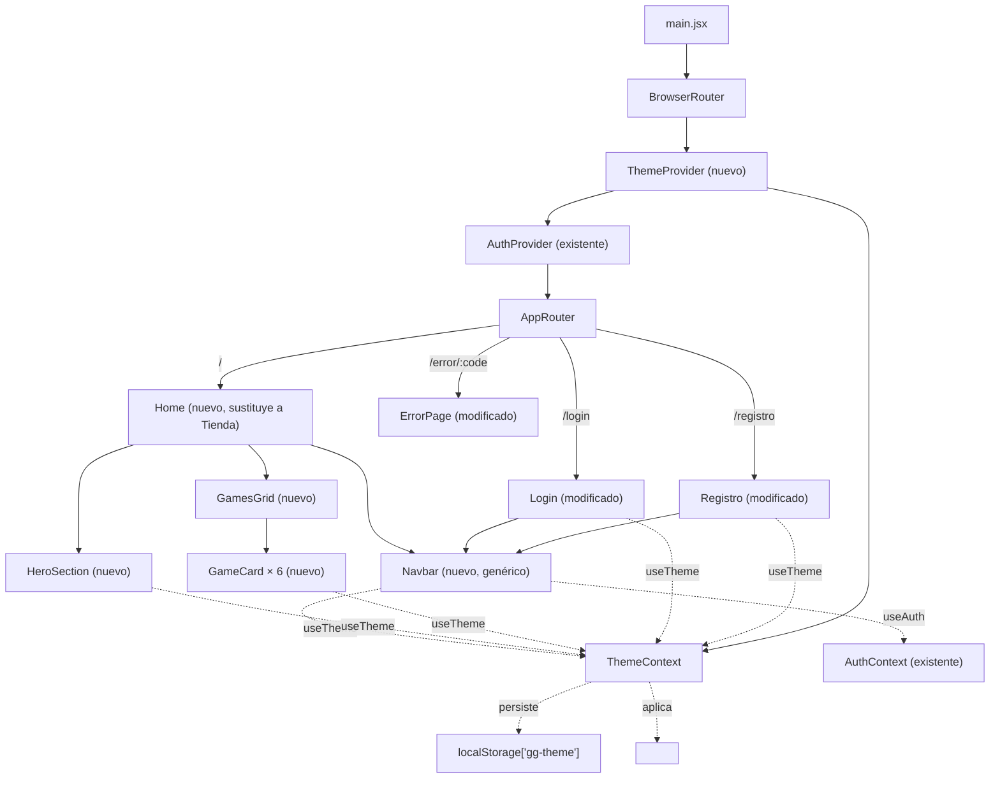
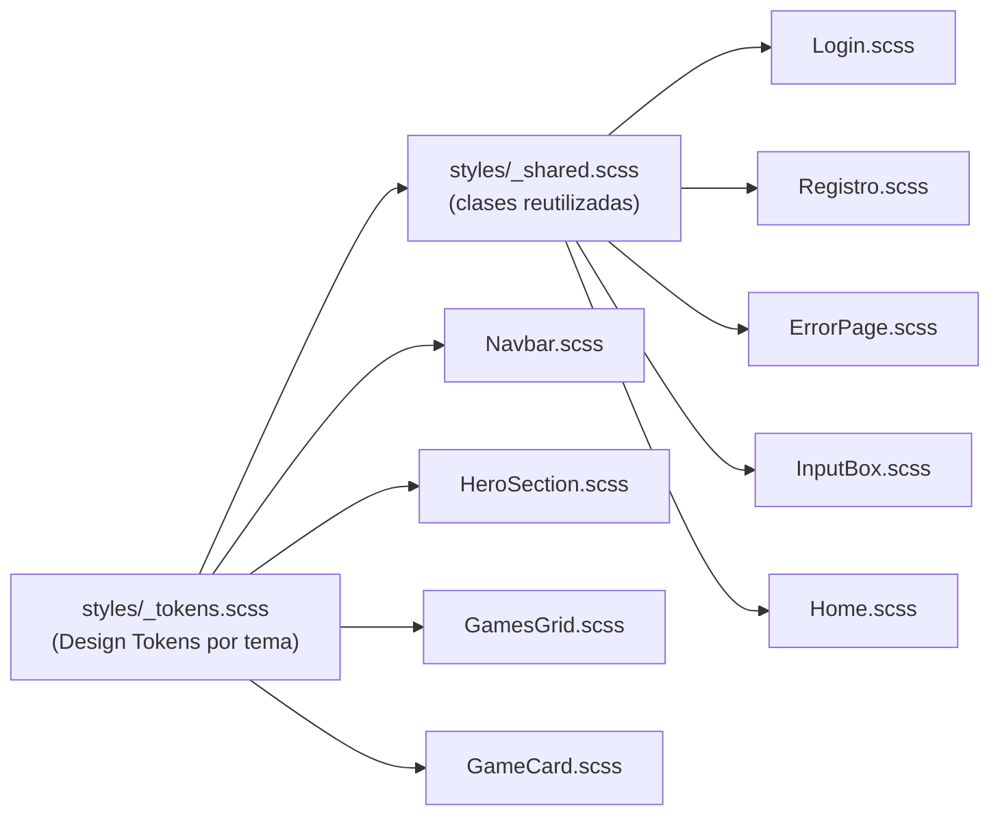

# Design Document: Home con temas visuales (home-diseno)

## Overview

Esta feature es exclusivamente de frontend (`GalinGames_react/`); no introduce cambios de API ni de modelo de datos en el backend. Se construye:

1. Un **sistema de temas** (`ThemeContext`/`ThemeProvider`, patrón idéntico a `AuthContext`) que expone el tema activo (`'azul' | 'rojo'`) y lo persiste en `localStorage`, materializado como variables CSS (custom properties) sobre el atributo `data-theme` del elemento raíz.
2. Un **Navbar genérico reutilizable** (componente propio, no acoplado a Home) que consume `ThemeContext` y `AuthContext`, usado por Home, Login y Registro.
3. Una **Home pública** nueva (`Home` → `HeroSection` + `GamesGrid` → `GameCard` × 6) que sustituye la ruta protegida actual de `Tienda.jsx`.
4. La **migración a SCSS** de las hojas de estilo tocadas por esta feature (`Login.css`, `Registro.css`, `ErrorPage.css`, `InputBox.css`), con una hoja de Design Tokens centralizada y un parcial de estilos compartidos, sustituyendo los nombres de clase ambiguos actuales (`color-fondo`, `marginForm`, `botonRegistro`...) por una nomenclatura descriptiva.

El resultado: dos paletas visuales completas, intercambiables sin recarga de página y persistentes, aplicadas de forma consistente en las cuatro páginas públicas de la aplicación (`/`, `/login`, `/registro`, `/error/:code`).

---

## Architecture



Flujo de estilos (quién consume los Design Tokens):



`_tokens.scss` define, para cada tema, un bloque `[data-theme="azul"] { --color-acento: ...; }` / `[data-theme="rojo"] { ... }`. El resto de hojas SCSS solo leen `var(--color-...)`; ninguna declara un color de tema por su cuenta (Requisitos 1.6, 1.7, 9.3, 9.6).

---

## Components and Interfaces

### Árbol de archivos (nuevo/modificado)

```
GalinGames_react/src/
├── globalState/
│   ├── authContext.jsx                          (sin cambios)
│   └── themeContext.jsx                         [NUEVO]
├── hooks/
│   ├── useAuth.js                                (sin cambios)
│   └── useTheme.js                               [NUEVO]
├── styles/                                       [NUEVO — carpeta]
│   ├── _tokens.scss                              [NUEVO] Design Tokens (Req 9.3)
│   └── _shared.scss                              [NUEVO] clases reutilizadas (Req 9.8)
├── Componentes/
│   ├── compGlobales/
│   │   ├── NavbarComponente/                     [NUEVO — carpeta]
│   │   │   ├── Navbar.jsx
│   │   │   ├── Navbar.scss
│   │   │   ├── ThemeToggle.jsx
│   │   │   └── ThemeToggle.scss
│   │   ├── InputBoxComponente/
│   │   │   ├── InputBox.jsx                      (sin cambios de lógica)
│   │   │   └── InputBox.css → InputBox.scss      [MODIFICADO] (Req 7.5, 9.2)
│   │   └── ErrorPageComponente/
│   │       ├── ErrorPage.jsx                      (import de estilos actualizado)
│   │       └── ErrorPage.css → ErrorPage.scss     [MODIFICADO] (Req 9.2)
│   ├── zonaCliente/
│   │   ├── LoginComponente/
│   │   │   ├── Login.jsx                          [MODIFICADO] (Req 7.1)
│   │   │   └── Login.css → Login.scss             [MODIFICADO] (Req 7.2, 9.2)
│   │   └── RegistroComponente/
│   │       ├── Registro.jsx                       [MODIFICADO] (Req 7.1)
│   │       └── Registro.css → Registro.scss       [MODIFICADO] (Req 7.2, 9.2)
│   ├── zonaHome/                                 [NUEVO — carpeta, sustituye a zonaTienda]
│   │   ├── HomeComponente/
│   │   │   ├── Home.jsx
│   │   │   └── Home.scss
│   │   ├── HeroSectionComponente/
│   │   │   ├── HeroSection.jsx
│   │   │   └── HeroSection.scss
│   │   ├── GamesGridComponente/
│   │   │   ├── GamesGrid.jsx
│   │   │   └── GamesGrid.scss
│   │   └── GameCardComponente/
│   │       ├── GameCard.jsx
│   │       └── GameCard.scss
│   └── zonaTienda/                               [ELIMINADO] (Req 5.5)
│       └── TiendaComponente/Tienda.jsx           [ELIMINADO]
├── router/
│   └── AppRouter.jsx                             [MODIFICADO]
└── main.jsx                                      [MODIFICADO]

GalinGames_react/package.json                     [MODIFICADO] (+ sass como devDependency)
```

### `themeContext.jsx` — contrato

Mismo patrón que `authContext.jsx` (`AuthContext`/`AuthProvider`/`useAuth`):

```js
export const ThemeContext = createContext(null)

export function ThemeProvider({ children }) {
  // useState inicializado de forma síncrona leyendo localStorage (evita parpadeo, Req 2.2)
  const [theme, setTheme] = useState(() => readThemeFromStorage()) // 'azul' | 'rojo'

  // useLayoutEffect (no useEffect): aplica data-theme al <html> ANTES del primer
  // pintado del navegador, evitando el parpadeo de un tema a otro (Req 2.2).
  useLayoutEffect(() => {
    document.documentElement.setAttribute('data-theme', theme)
  }, [theme])

  const toggleTheme = useCallback(() => {
    setTheme((prev) => {
      const next = prev === 'azul' ? 'rojo' : 'azul'
      localStorage.setItem('gg-theme', next)
      return next
    })
  }, [])

  return <ThemeContext.Provider value={{ theme, toggleTheme }}>{children}</ThemeContext.Provider>
}

function readThemeFromStorage() {
  const stored = localStorage.getItem('gg-theme')
  return stored === 'azul' || stored === 'rojo' ? stored : 'azul' // Req 1.5, 2.3
}
```

`useTheme.js` replica `useAuth.js`: `useContext(ThemeContext)`, lanza `Error('useTheme debe usarse dentro de ThemeProvider')` si el contexto es `null`.

### `Navbar.jsx` — contrato

Componente sin props obligatorias (lee todo de `useAuth()`; ya no necesita `useTheme()` directamente — esa lógica vive ahora en `ThemeToggle`):

```js
function Navbar() {
  const { isAuthenticated, user, logout } = useAuth()
  // ...
}
```

Estructura semántica: `<header className="navbar"><nav className="navbar__nav">...</nav></header>`, con:
- `ThemeToggle` en la posición del logotipo (ver decisión más abajo) — ya no hay un `<Link to="/">` separado envolviendo el logo.
- Enlaces "Inicio" (Link real a `/`), y "Juegos"/"Novedades"/"Comunidad" como `<span className="navbar__link navbar__link--proximamente" aria-disabled="true">` (Req 3.4, sin `href="#"`).
- Zona de sesión (Req 4): `isAuthenticated ? <span>{user.username}</span> + botón "Cerrar sesión" (onClick={logout}) : <Link to="/login">Iniciar sesión</Link> + <Link to="/registro" className="boton-primario">Registrarse</Link>`.
- Botón hamburguesa + panel colapsable solo visible bajo el breakpoint móvil (Req 3.6), controlado con un `useState` local (`menuAbierto`).

### `ThemeToggle.jsx` — contrato (revisado)

**Decisión de diseño (ajuste solicitado por el usuario sobre la Phase 2 ya implementada):** el propio logotipo pasa a ser el control de cambio de tema — deja de existir un interruptor visual independiente (pista/pulgar) separado del logo. Al pulsar el logotipo se alterna el tema (persistido en `localStorage`, comportamiento ya cubierto por Requisito 2); al pasar el cursor por encima, un efecto de zoom 3D (`scale` + `rotateY` + sombra de acento) indica que es interactivo. Como contrapartida, el logotipo deja de navegar a `/` — el enlace "Inicio" del propio Navbar ya cubre esa navegación (Requisito 3.3), por lo que no se pierde ninguna vía de acceso al inicio.

```js
function ThemeToggle() {
  const { theme, toggleTheme } = useTheme()
  const logoSrc = theme === 'azul' ? '/logo1.png' : '/logo2.png'
  return (
    <button
      type="button"
      className="theme-toggle"
      onClick={toggleTheme}
      aria-pressed={theme === 'rojo'}
      aria-label={`Cambiar a tema ${theme === 'azul' ? 'rojo' : 'azul'}`}
    >
      
    </button>
  )
}
```

`ThemeToggle.scss` aplica el recorte/`mix-blend-mode` que antes vivía en `Navbar.scss` → `.navbar__logo` (Requisito 3.1, ya no aplica ahí porque el logo ya no se renderiza en `Navbar.jsx`), más `perspective` en el botón y `transform: scale(1.15) rotateY(10deg)` + `filter: drop-shadow(...)` en `:hover`/`:focus-visible` sobre `.theme-toggle__logo`, envuelto en el mixin `transicion-suave` (Requisito 8.4 — sin animación si `prefers-reduced-motion`).

### `Home.jsx` / `HeroSection.jsx` / `GamesGrid.jsx` / `GameCard.jsx`

- `Home.jsx`: `<><Navbar /><main className="home"><HeroSection /><GamesGrid /></main></>` — sin lógica propia más allá de componer las piezas (Req 9.5).
- `HeroSection.jsx`: sin props; usa `useTheme()` para elegir `mando.png`/`mando2.png`; botón "Ver todos" como `<span aria-disabled="true">` (Req 5.4). **Revisado:** ya no incluye la etiqueta "TENDENCIAS" (se movió a `GamesGrid.jsx`, ver Req 5.2/6.6 y decisión más abajo).
- `GamesGrid.jsx`: define un array constante de 6 entradas `{ src, alt }` (Req 6.1) y mapea a `<GameCard />`, dentro de un `<section>` cuyo `<h2>` es ahora el texto visible **"TENDENCIAS ›"** (antes vivía, mal ubicado, como etiqueta del Hero — el usuario aclaró que es el título de la sección del grid, no del Hero).
- `GameCard.jsx`: props `{ src, alt }`; usa `useState` local para el fallback de carga:

```js
function GameCard({ src, alt }) {
  const [error, setError] = useState(false)
  return (
    <div className="game-card">
      {error ? (
        <div className="game-card__fallback" role="img" aria-label={alt}>{alt}</div>
      ) : (
         setError(true)} />
      )}
    </div>
  )
}
```

(Cubre Req 6.4 — estado de reserva sin icono de imagen rota.)

### Cambios en `Login.jsx` / `Registro.jsx` / `ErrorPage.jsx`

Solo capa visual (Req 7.4): se sustituye el patrón `<div className="fondo-gaming" />` + `<div style={{...inline flex centering...}}>` por `<><Navbar /><main className="pagina-tematica"><div className="tarjeta-tema">...</div></main></>`, reutilizando las clases del nuevo `_shared.scss`. La lógica interna (estado, `handleSubmit`, llamadas a `authService`, mensajes de error) no se toca.

### Cambios en `AppRouter.jsx`

```diff
- import Tienda from '../Componentes/zonaTienda/TiendaComponente/Tienda'
+ import Home from '../Componentes/zonaHome/HomeComponente/Home'
  ...
- <Route path="/" element={<ProtectedRoute><Tienda /></ProtectedRoute>} />
+ <Route path="/" element={<Home />} />
```

`ProtectedRoute` deja de usarse en esta ruta pero se mantiene definido en el archivo por si una futura zona de usuario autenticado lo necesita (no forma parte del alcance de esta feature retirarlo).

### Cambios en `main.jsx`

```diff
  <BrowserRouter>
+   <ThemeProvider>
      <AuthProvider>
        <AppRouter />
      </AuthProvider>
+   </ThemeProvider>
  </BrowserRouter>
```

---

## Design Tokens

`styles/_tokens.scss` define, mediante bloques `[data-theme="..."]` sobre `:root`, las siguientes variables (nombres definitivos, Req 9.3):

| Token | Tema Azul | Tema Rojo | Uso |
|---|---|---|---|
| `--color-fondo` | `#0b0618` | `#0d0505` | fondo general de página |
| `--color-fondo-elevado` | `rgba(15, 8, 30, 0.55)` | `rgba(20, 8, 8, 0.55)` | Navbar y tarjetas (semitransparente, Req 3.8) |
| `--color-acento` | `#2dd4ff` | `#ff2b4e` | color principal interactivo: bordes, foco, enlaces (Req 1.6) |
| `--color-acento-secundario` | `#7d2ae8` | `#b3121f` | degradado de botones primarios y tarjetas (Req 1.7) |
| `--color-texto` | `#ffffff` | `#ffffff` | texto principal |
| `--color-texto-tenue` | `rgba(255,255,255,0.72)` | `rgba(255,255,255,0.72)` | texto secundario/etiquetas |
| `--sombra-acento` | `0 4px 24px rgba(45,212,255,0.35)` | `0 4px 24px rgba(255,43,78,0.35)` | resplandor de tarjetas y botones al hover/focus |

Todas las hojas SCSS de componentes consumen exclusivamente `var(--color-*)`/`var(--sombra-acento)`; ningún componente declara un valor de color de tema propio (Req 9.6). El único punto donde existe un valor de color "crudo" es dentro de los dos bloques `[data-theme]` de `_tokens.scss`.

`styles/_shared.scss` (Req 9.8) centraliza, consumiendo los tokens anteriores, las clases reutilizadas por Home/Login/Registro/ErrorPage:

| Clase nueva | Sustituye a | Usada por |
|---|---|---|
| `.pagina-tematica` | `.fondo-gaming` + wrapper inline | Login, Registro, ErrorPage |
| `.tarjeta-tema` | `.color-fondo` + `.marginForm` + `.contenido-registro` + `.form-box` | Login, Registro, ErrorPage |
| `.titulo-tema` | `.videojuego-title` | Login, Registro, ErrorPage |
| `.texto-tema` | `.videojuego-text` | Login, Registro, ErrorPage |
| `.texto-tema--condiciones` | `.videojuego-conditions` | Registro |
| `.boton-primario` | `.botonRegistro` | Login, Registro, ErrorPage, Navbar (Registrarse), HeroSection (Ver todos, si se decide sólido) |

Justificación de la consolidación en la sección Design Decisions.

---

## Error Handling

- **Tema corrupto en `localStorage`** (Req 2.3): `readThemeFromStorage()` valida contra el allowlist estricto `['azul', 'rojo']`; cualquier otro valor (incluido `null`, cadenas vacías o JSON inválido) se descarta silenciosamente y se usa `'azul'`, sin `try/catch` necesario porque `localStorage.getItem` nunca lanza para una clave inexistente.
- **Parpadeo de tema al cargar** (Req 2.2): se evita computando el estado inicial de `theme` de forma síncrona en `useState(() => ...)` y aplicando el atributo `data-theme` en `useLayoutEffect` (se ejecuta antes del primer pintado del navegador), no en `useEffect`.
- **Imagen de portada rota** (Req 6.4): `onError` en el `` de `GameCard` conmuta a un estado de reserva local (`role="img"` + `aria-label`) en vez de dejar el icono de imagen rota del navegador.
- **`logo1.png` con fondo no transparente** (Nota de `requirements.md`): se documenta como decisión técnica en la siguiente sección — no es un error en tiempo de ejecución, sino una limitación del propio asset que se mitiga con CSS.

---

## Accessibility (Requisito 8)

- Contraste: `--color-texto: #ffffff` sobre `--color-fondo`/`--color-fondo-elevado` (ambos muy oscuros) supera 4.5:1 en ambos temas; se verificará visualmente en el checkpoint de implementación.
- Foco visible: `_shared.scss` define un `:focus-visible` común (outline de 2px en `var(--color-acento)`) aplicado a enlaces, botones y al `ThemeToggle`.
- Imágenes: `GameCard` y el logotipo del Navbar llevan `alt` descriptivo (Req 8.3); los fondos decorativos de `.pagina-tematica`/`.hero` se aplican vía `background-image`/CSS (no ``), por lo que no requieren `alt` en absoluto.
- `prefers-reduced-motion` (Req 8.4): `_shared.scss` envuelve las transiciones de color/transform (cambio de tema, hover de tarjetas) en `@media (prefers-reduced-motion: no-preference) { ... }`.
- Landmarks (Req 8.5): `Navbar` renderiza `<header>`/`<nav>`; `Home` renderiza `<main>`; `HeroSection` usa `<h1>` para "LO MÁS JUGADO"; `GamesGrid` usa `<h2>` de sección (visualmente oculto si no está en el mockup, pero presente para lectores de pantalla).

---

## Security

- Esta feature no añade endpoints, peticiones de red nuevas ni entrada de usuario libre; el único dato "externo" es el valor de `localStorage['gg-theme']`, validado contra un allowlist antes de usarse (ver Error Handling) — no se interpola en HTML ni se usa para construir rutas o selectores dinámicamente.
- Los enlaces de navegación sin página funcional (Req 3.4, 5.4) se implementan como elementos no interactivos (`<span aria-disabled="true">`), evitando el antipatrón `href="#"`/`javascript:void(0)` que generaría manejadores de click adicionales o saltos de foco inesperados.
- No se modifica `authService.js`, `authContext.jsx` ni ningún endpoint del backend: la superficie de autenticación ya auditada en `.specs/login-autenticacion/` permanece intacta (Req 7.4).

---

## Design Decisions

| Decisión | Alternativa considerada | Razón de la elección |
|---|---|---|
| Variables CSS (custom properties) sobre `[data-theme]`, generadas desde SCSS | Dos builds de Tailwind/CSS separados, o clases `.tema-azul`/`.tema-rojo` repetidas en cada componente | Un único atributo en `<html>` recalcula en cascada todos los colores sin re-renderizar componentes ni duplicar reglas; es el patrón estándar para theming dinámico en tiempo de ejecución (a diferencia de SCSS puro, que solo resuelve variables en tiempo de compilación). |
| `useLayoutEffect` (no `useEffect`) para aplicar `data-theme` | Script inline en `index.html` que lee `localStorage` antes de montar React | `useLayoutEffect` evita el parpadeo igual de eficazmente sin tocar `index.html` ni duplicar la lógica de lectura de `localStorage` fuera de React. |
| Consolidar `color-fondo` + `marginForm` + `contenido-registro` + `form-box` en una sola clase `.tarjeta-tema` | Mantener las cuatro clases actuales, solo renombradas 1:1 | Las cuatro siempre se usaban juntas en el mismo elemento (acoplamiento de hecho); consolidarlas en una reduce el HTML repetitivo y dificulta usarlas por separado de forma inconsistente. |
| Nueva carpeta `zonaHome/` con `Home`/`HeroSection`/`GamesGrid`/`GameCard` como componentes separados | Un único `Home.jsx` con tres secciones inline | Cumple explícitamente el Requisito 9.5; además permite testear cada pieza (p. ej. el fallback de imagen de `GameCard`) de forma aislada. |
| `logo1.png` (fondo difuminado no transparente) se muestra recortado con `object-fit: cover` sobre un contenedor de tamaño fijo, con `mix-blend-mode: screen` como ajuste adicional | Editar el archivo de imagen para quitarle el fondo | Esta feature no incluye edición de imágenes (fuera del alcance de un agente de código); el recorte + blend es la mejor aproximación posible solo con CSS. El resultado final se ajusta visualmente durante el checkpoint de implementación (`object-position`) y, si no es satisfactorio, queda documentado como mejora futura (regenerar el asset con fondo transparente). |
| `mando.png`/`mando2.png` como `background-image` de `.hero__imagen-mando` (no ``) | `` con `object-fit` | Igual que en el mockup, la imagen se recorta libremente contra los márgenes del Hero sin dejar espacio en blanco; al ser puramente decorativa no necesita `alt` (Req 8.3 ya cubre esto). |
| Botón "Ver todos" y enlaces "Juegos"/"Novedades"/"Comunidad" como elementos inertes (`aria-disabled`) en vez de deshabilitar visualmente | Ocultarlos por completo hasta que existan páginas reales | Mantiene la fidelidad visual con el mockup (Requisitos 3.4/5.4 piden "consistente en ambos temas"), a la vez que evita prometer una navegación que no existe todavía. |
| `sass` como única dependencia nueva, sin cambios en `vite.config.js` | `sass-embedded` o un preprocesador basado en PostCSS/Tailwind | Vite detecta y compila `.scss` automáticamente en cuanto detecta el paquete `sass` instalado; no requiere configuración adicional y es la opción oficialmente documentada por Vite. |
| El logotipo pasa a ser el propio `ThemeToggle` (con efecto de zoom 3D al hover), en vez de un interruptor visual independiente junto al logo | Mantener el interruptor pista/pulgar de la Phase 2 junto a un logo que solo navega a `/` | Petición explícita del usuario tras revisar la Phase 2: simplifica el Navbar a un único elemento interactivo reconocible en vez de dos controles distintos. El logotipo deja de navegar a `/`, pero el enlace "Inicio" ya cubre esa función (Requisito 3.3), así que no se pierde acceso a la home. |
| Navbar en 3 zonas independientes (`position: absolute` para logo y enlaces centrados, `margin-left: auto` para la zona de sesión), sin `max-width`/`margin: auto` en `.navbar__nav` | `justify-content: space-between` con los enlaces y la sesión agrupados en un mismo wrapper flex | El reparto original no coincidía con el mockup (feedback visual directo del usuario): con `space-between`, el "centro" real dependía del ancho ocupado por logo y sesión, no del centro geométrico de la barra. `position: absolute` desacopla cada zona del flujo del resto. |
| `.theme-toggle__logo--azul` usa `object-fit: cover` con `object-position` ajustado; `--rojo` usa `object-fit: contain` — mismo tamaño de caja, distinta caja de recorte por tema | Una única caja/estrategia igual para ambos temas | `logo1.png` tiene mucho lienzo vacío/difuminado alrededor del símbolo (a diferencia de `logo2.png`, ya recortado y transparente); con `contain` para ambos, el símbolo de `logo1` se veía notablemente más pequeño a pesar de ocupar la misma caja. Se descartó compensarlo con `transform: scale()` porque, combinado con el zoom del hover, provocaba un doble escalado que pixelaba/difuminaba la imagen — el recorte nativo vía `cover` no tiene ese problema. |
| Posición vertical del logo con `top` fijo (sin `top: 50%` + `transform: translateY(-50%)`) | Centrado vertical clásico dentro de `.navbar__nav` | El Navbar está pegado al borde superior real de la ventana (`position: sticky; top: 0`); con centrado simétrico, la mitad del desbordamiento vertical del logo (mucho más alto que la barra) quedaba por ENCIMA del navbar y se recortaba contra el borde del viewport. Un `top` fijo ancla el borde superior del logo justo debajo del navbar y deja que desborde libremente hacia abajo, sobre el `border-bottom` coloreado (efecto pedido explícitamente). |
| Tramo de ancho intermedio (entre el móvil completo y el escritorio ancho) donde solo las categorías se sustituyen por un icono de tres líneas centrado | Un único breakpoint móvil que colapsa todo de golpe (diseño original) | Con el logotipo mucho más grande, el escritorio "ancho" ya no tenía sitio para los 4 enlaces + búsqueda/idioma/sesión en una sola fila en anchos intermedios (bug de recorte reportado por el usuario). Sustituir solo los enlaces por un icono centrado (sugerencia del propio usuario) libera espacio sin renunciar a mostrar búsqueda/idioma/sesión hasta que de verdad haga falta el colapso completo. |
| "TENDENCIAS ›" como `<h2>` visible de `GamesGrid.jsx`, en vez de etiqueta del `HeroSection.jsx` | Mantener "TENDENCIAS" agrupado con "LO MÁS JUGADO" en el Hero (diseño original) | Corrección del propio usuario: "TENDENCIAS" es el título de la sección del grid de juegos, no del bloque hero/mando — deben vivir en el mismo contenedor padre que las 6 tarjetas, debajo del Hero. |

---

## Cobertura de Requisitos

| Requisito | Cubierto por |
|---|---|
| 1 (Selector de tema) | `ThemeContext`, `ThemeToggle`, Design Tokens |
| 2 (Persistencia) | `readThemeFromStorage`, `useLayoutEffect`, Error Handling |
| 3 (Navbar) | `Navbar.jsx`/`Navbar.scss`, `position: sticky` + `backdrop-filter` |
| 4 (Zona de sesión) | `Navbar.jsx` (bloque de sesión) |
| 5 (Home pública) | `Home.jsx`, `HeroSection.jsx`, cambios en `AppRouter.jsx` |
| 6 (Grid de 6 juegos) | `GamesGrid.jsx`, `GameCard.jsx` |
| 7 (Login/Registro con el nuevo sistema) | Cambios en `Login.jsx`/`Registro.jsx`, `_shared.scss`, `InputBox.scss` |
| 8 (Accesibilidad) | Sección Accessibility |
| 9 (SCSS y separación de componentes) | Árbol de archivos, `_tokens.scss`, `_shared.scss`, sección Design Tokens |

Todos los requisitos de `requirements.md` quedan cubiertos por al menos una parte de este diseño.

---

## Impacto en tests existentes

Los helpers `renderLogin()`/`renderRegistro()` en `Login.test.jsx`/`Registro.test.jsx` (incluidas las Propiedades 12/16 ya existentes) envuelven el árbol en `<MemoryRouter><AuthProvider>...</AuthProvider></MemoryRouter>`, sin `ThemeProvider`. En cuanto `Login`/`Registro` rendericen `<Navbar />` (que llama a `useTheme()`), esos tests fallarían con `useTheme debe usarse dentro de ThemeProvider` si no se actualizan para envolver también con `<ThemeProvider>`. Esto se detalla como tarea explícita en `tasks.md` para no romper la suite de la Fase 4 ya verificada.
