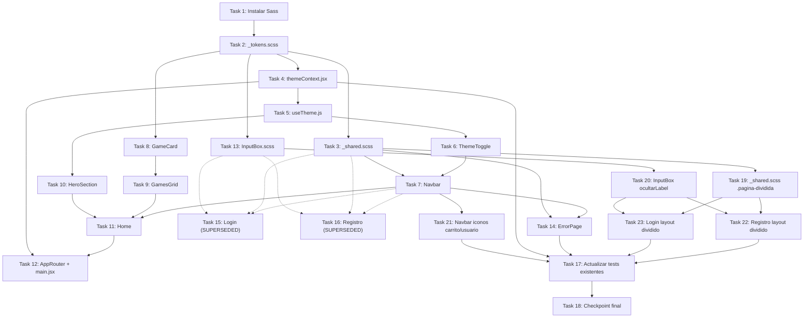

# Implementation Plan: Home con temas visuales (home-diseno)

## Overview

Plan de implementación de la nueva Home pública de GalinGames con dos temas visuales intercambiables (azul/violeta y rojo/gris/negro), un Navbar genérico reutilizable, y la migración a SCSS de las hojas de estilo existentes tocadas por esta feature. Todo el trabajo es frontend (`GalinGames_react/`); no hay cambios de backend. El orden sigue las dependencias reales: primero la infraestructura de tema y estilos compartidos, después el Navbar (que todo lo demás reutiliza), después la Home en sí, y la migración visual inicial de Login/Registro/ErrorPage (Phase 4).

Tras completar y mergear la Phase 4 (PR #17), el usuario pidió un rediseño adicional de Login y Registro (Requisitos 7bis/7ter/4 revisado en `requirements.md`): ambos formularios abandonan el patrón "Navbar + tarjeta" por un layout dividido (formulario sin tarjeta + imagen `downwalker-registro.jpg`), y la zona de sesión del Navbar sustituye "Iniciar sesión"/"Registrarse" por iconos de carrito/usuario. Este rediseño se cubre en la nueva **Phase 4bis** (Tasks 19-23), que sustituye funcionalmente a las Tasks 15/16 de la Phase 4 (conservadas como `[x]`/SUPERSEDED por trazabilidad histórica, ver Notes). La Phase 5 (tests + checkpoint final) se actualizó para depender de la Phase 4bis en vez de las tareas de Login/Registro ya superadas.

---

## Tasks

### Phase 1 — Fundamentos: tema y estilos compartidos

---

- [x] 1. Instalar Sass en el frontend
  **Dependencias:** Ninguna
  **Requisitos:** Req 9.1

  - [x] 1.1 Ejecutar `npm install -D sass` en `GalinGames_react/`
    - Verificar que queda registrado en `package.json`/`package-lock.json`
    - _Requisitos: 9.1_

---

- [x] 2. `src/styles/_tokens.scss` — Design Tokens de ambos temas
  **Dependencias:** Task 1
  **Requisitos:** Req 1.6, 1.7, 9.3, 9.6

  - [x] 2.1 Crear `src/styles/_tokens.scss` con dos bloques `[data-theme="azul"]` y `[data-theme="rojo"]` sobre `:root`, definiendo las variables CSS de la tabla de `design.md` → Design Tokens: `--color-fondo`, `--color-fondo-elevado`, `--color-acento`, `--color-acento-secundario`, `--color-texto`, `--color-texto-tenue`, `--sombra-acento`
    - _Requisitos: 1.6, 1.7, 9.3_

  - [x] 2.2 Importar `_tokens.scss` desde `src/index.css` (o convertir `index.css` a `index.scss` e importarlo ahí) para que las variables estén disponibles globalmente antes de cualquier componente
    - _Requisitos: 9.6_
    - _Nota: se convirtió `index.css` a `index.scss` (con `@use './styles/tokens';`) y se actualizó el import en `main.jsx`. Los valores por defecto de `:root` (sin atributo) son los del tema azul, sirviendo de fallback antes de que `ThemeProvider` aplique `data-theme` vía `useLayoutEffect`._

---

- [x] 3. `src/styles/_shared.scss` — clases reutilizadas entre Login/Registro/ErrorPage
  **Dependencias:** Task 2
  **Requisitos:** Req 7.2, 9.3, 9.4, 9.8, 8.2, 8.4

  - [x] 3.1 Definir `.pagina-tematica` (fondo de página con degradado radial usando `var(--color-fondo)`, sustituye a `.fondo-gaming`), `.pagina-tematica__contenido` (contenedor centrado)
    - _Requisitos: 7.2_

  - [x] 3.2 Definir `.tarjeta-tema` (consolida `.color-fondo` + `.marginForm` + `.contenido-registro` + `.form-box`: fondo `var(--color-fondo-elevado)`, borde y sombra usando `var(--color-acento)`/`var(--sombra-acento)`, `backdrop-filter: blur(...)`)
    - _Requisitos: 7.2, 9.3_

  - [x] 3.3 Definir `.titulo-tema` (sustituye `.videojuego-title`), `.texto-tema` (sustituye `.videojuego-text`) y `.texto-tema--condiciones` (sustituye `.videojuego-conditions`), con la tipografía definitiva del nuevo sistema de diseño (sustituyendo `Press Start 2P`/`VT323`/`Share Tech Mono`)
    - _Requisitos: 7.2_
    - _Nota: se usó `'Rajdhani', 'Segoe UI', system-ui, sans-serif` como pila tipográfica (fuente gaming moderna de trazo anguloso, coherente con el mockup, sin depender de que la fuente esté instalada localmente — con fallbacks del sistema). Si se desea la fuente exacta `Rajdhani` renderizada, quedaría pendiente añadir su `@font-face`/Google Fonts en una tarea futura; no bloquea esta feature porque los fallbacks ya son legibles y consistentes._

  - [x] 3.4 Definir `.boton-primario` (sustituye `.botonRegistro`): degradado `var(--color-acento)` → `var(--color-acento-secundario)`, estados `:hover`/`:focus-visible` anidados
    - _Requisitos: 1.7, 9.3, 9.4_

  - [x] 3.5 Definir la regla común de foco visible (`:focus-visible { outline: 2px solid var(--color-acento); }`) aplicada a enlaces, botones y controles interactivos
    - _Requisitos: 8.2_

  - [x] 3.6 Envolver las transiciones de color/transform de `.tarjeta-tema`, `.boton-primario` y demás elementos animados en `@media (prefers-reduced-motion: no-preference) { ... }`
    - _Requisitos: 8.4_
    - _Nota: implementado como mixin `transicion-suave($propiedades...)` reutilizado por `.tarjeta-tema` y `.boton-primario`, en vez de repetir el media query en cada regla._

---

- [x] 4. `src/globalState/themeContext.jsx` — ThemeProvider
  **Dependencias:** Task 2
  **Requisitos:** Req 1.2, 1.5, 2.1, 2.2, 2.3, 2.4

  - [x] 4.1 Implementar `ThemeContext` y `ThemeProvider` siguiendo el contrato de `design.md` (`useState` inicializado de forma síncrona con `readThemeFromStorage()`, `useLayoutEffect` aplicando `data-theme` al `<html>`, `toggleTheme` con `useCallback` que persiste en `localStorage['gg-theme']`)
    - `readThemeFromStorage()` valida contra el allowlist `['azul', 'rojo']`; cualquier otro valor usa `'azul'` por defecto
    - _Requisitos: 1.2, 1.5, 2.1, 2.2, 2.3_

  - [x] 4.2 Exportar el shape del contexto: `{ theme, toggleTheme }`
    - _Requisitos: 2.4_

  - [x]* 4.3 Escribir tests unitarios de `themeContext.jsx` (mismo patrón que `authContext.test.jsx`)
    - `ThemeProvider` aplica `data-theme="azul"` por defecto sin nada en localStorage
    - `ThemeProvider` aplica `data-theme="rojo"` si `localStorage.getItem('gg-theme') === 'rojo'`
    - Un valor corrupto en localStorage (`'purpura'`) hace que se use `'azul'`
    - `toggleTheme()` alterna el tema y actualiza `localStorage`
    - Cambiar de tema no borra `localStorage['session']` (independencia de Requisito 2.4); cerrar sesión no borra `localStorage['gg-theme']`
    - _Requisitos: 1.2, 1.5, 2.1, 2.3, 2.4_

---

- [x] 5. `src/hooks/useTheme.js`
  **Dependencias:** Task 4
  **Requisitos:** (infraestructura, mismo patrón que `useAuth.js`)

  - [x] 5.1 Implementar y exportar `useTheme()`: `useContext(ThemeContext)`, lanza `Error('useTheme debe usarse dentro de ThemeProvider')` si el contexto es `null`

---

### Phase 2 — Navbar genérico

---

- [x] 6. `NavbarComponente/ThemeToggle.jsx` — botón de cambio de tema
  **Dependencias:** Task 5
  **Requisitos:** Req 1.1, 1.2, 1.4

  - [x] 6.1 Implementar `ThemeToggle.jsx` según el contrato de `design.md`: botón con `onClick={toggleTheme}`, `aria-pressed={theme === 'rojo'}`, `aria-label` dinámico indicando el tema destino
    - _Requisitos: 1.2, 1.4_

  - [x] 6.2 Crear `ThemeToggle.scss` (icono/indicador visual del tema activo, usando `var(--color-acento)`)
    - _Requisitos: 1.1_
    - _Nota: se extrajo el mixin `transicion-suave` de `_shared.scss` a un nuevo parcial `src/styles/_mixins.scss` (usado por ambos), para que `ThemeToggle.scss`/`Navbar.scss` no tuvieran que tirar de las clases de `_shared.scss` solo para acceder al mixin — mantiene la separación de `design.md` (Navbar solo depende de tokens/mixins, no de las clases de página de Login/Registro/ErrorPage)._
    - _**Revisión posterior (a petición del usuario, tras revisar la Phase 2):** el interruptor pista/pulgar se sustituyó por el propio logotipo (`` dentro del botón, `src` según `theme`) con efecto de zoom 3D (`scale` + `rotateY` + `drop-shadow`) en `:hover`/`:focus-visible`. `ThemeToggle.scss` pasó a asumir el recorte/`mix-blend-mode` que antes vivía en `Navbar.scss` → `.navbar__logo`. Ver decisión actualizada en `design.md` y Task 7.1._

  - [x]* 6.3 Escribir tests de `ThemeToggle.jsx`
    - Al hacer click invoca `toggleTheme`
    - `aria-pressed` refleja el tema activo
    - Es activable con teclado (Enter/Espacio) — usar `userEvent` para simular ambas teclas
    - _Requisitos: 1.2, 1.4_

---

- [x] 7. `NavbarComponente/Navbar.jsx` — componente genérico
  **Dependencias:** Task 6, Task 3
  **Requisitos:** Req 3.1, 3.2, 3.3, 3.4, 3.5, 3.6, 3.7, 3.8, 3.9, 4.1, 4.2, 4.3, 4.4, 8.5

  - [x] 7.1 Implementar la estructura semántica base: `<header className="navbar"><nav>...</nav></header>` con el logotipo (`` dentro de `Link to="/"`, `src` según `theme` — `/logo1.png` en `azul`, `/logo2.png` en `rojo`) y el contenedor de tamaño fijo con `object-fit: cover` para evitar la caja de fondo de `logo1.png` (Req 3.1)
    - _Requisitos: 3.1, 8.5_
    - _Nota: `object-position: 50% 32%` y `mix-blend-mode: screen` como primer ajuste; el recorte fino queda para el checkpoint visual (Task 12.4), tal como anticipaba la nota de `tasks.md`._
    - _**Revisión posterior (a petición del usuario):** el logotipo ya no vive en `Navbar.jsx` envuelto en `Link to="/"` — se retiró de ahí y pasó a ser el contenido de `ThemeToggle` (Task 6.2), que ahora ocupa la posición donde estaba el logo. El logotipo deja de navegar a `/`; el enlace "Inicio" (Task 7.2) sigue cubriendo esa navegación. Ver Requisitos 1.1/1.4/3.1 actualizados y decisión en `design.md`._

  - [x] 7.2 Añadir los enlaces de navegación: `Link to="/"` real para "Inicio"; `<span className="navbar__link navbar__link--proximamente" aria-disabled="true">` para "Juegos", "Novedades" y "Comunidad"
    - _Requisitos: 3.2, 3.3, 3.4_

  - [x] 7.3 Integrar `<ThemeToggle />` en el Navbar
    - _Requisitos: 3.5 (mismo conjunto de elementos en ambos temas)_
    - _Nota: tras la revisión de Task 7.1, `<ThemeToggle />` se renderiza una sola vez, en la posición del logotipo, en vez de (además) dentro de `.navbar__acciones`._

  - [x] 7.4 Implementar la zona de sesión: `isAuthenticated ? (username + botón "Cerrar sesión" → logout()) : (Link "Iniciar sesión" a /login + Link "Registrarse" a /registro con clase .boton-primario)`
    - _Requisitos: 4.1, 4.2, 4.3, 4.4_

  - [x] 7.5 Implementar el menú móvil: botón hamburguesa + panel colapsable con `useState` local, visible solo bajo el breakpoint de 768px definido en `Navbar.scss`, sin ocultar logotipo/ThemeToggle/zona de sesión
    - _Requisitos: 3.6_

  - [x] 7.6 Crear `Navbar.scss`: `position: sticky; top: 0;`, `background-color: var(--color-fondo-elevado)`, `backdrop-filter: blur(...)` (+ `-webkit-backdrop-filter`), `z-index` por encima del contenido, sin declarar colores de tema propios (solo `var(--color-*)`)
    - _Requisitos: 3.7, 3.8, 9.6_
    - _Nota (ajuste sobre `design.md`): `Navbar.scss` sí importa `_shared.scss` (además de `_mixins.scss`), para reutilizar literalmente la regla `.boton-primario` en "Registrarse" en vez de duplicarla — el diagrama de `design.md` lo mostraba conectado solo a `_tokens.scss`, pero el Requisito 9.8 pide explícitamente extraer a un parcial reutilizable los botones compartidos entre componentes en lugar de duplicar su CSS. Gracias al sistema de módulos de Sass (`@use`), la CSS de `_shared.scss` solo se emite una vez en el bundle final aunque varios ficheros la importen, así que no hay duplicación real en el CSS compilado._
    - _**Revisión posterior (feedback visual del usuario tras probar la Home real):** el reparto de elementos no coincidía con el mockup. Rehecho como layout de 3 zonas independientes sobre `.navbar__nav` (`position: relative`, sin `max-width`/`margin: auto` para que las zonas lleguen al borde real de la pantalla, no al de un contenedor centrado): (1) `ThemeToggle` (logo) con `position: absolute; left: 1.5rem` pegado al borde izquierdo — al estar en `position: absolute` no fuerza la altura de la barra ni se recorta al hacer zoom en el hover; (2) `.navbar__enlaces` centrado con `position: absolute; left: 50%; transform: translate(-50%, -50%)` y `gap` reducido de `1.5rem` a `1rem`; (3) `.navbar__acciones` empujado al borde derecho con `margin-left: auto` (ya no compite con unos enlaces que ahora están fuera del flujo). `.navbar__menu-movil` pasa a `display: contents` en escritorio para que sus hijos participen directamente del flex de `.navbar__nav`; el bloque `@media` móvil revierte tanto eso como el `position: absolute` de los enlaces, devolviendo el panel colapsable a su comportamiento apilado original. Además, el logotipo cambia de `object-fit: cover` a `object-fit: contain` (nunca recorta la imagen, solo la ajusta dentro de la caja) y la caja pasa de 150×48px a 120×64px._
    - _**Segunda revisión (feedback del usuario, "el logo se ve muy pequeño" + faltaban elementos del mockup):** la caja del logo pasa de 120×64px a 260×140px (`.navbar { min-height }` sube de 64px a 88px para acompañar visualmente, aunque al ser `position: absolute` el logo puede seguir desbordando la barra sin recortarse). Se añaden los elementos que faltaban del mockup (Requisitos 3.10, 4.5, nuevos): icono de búsqueda, selector de idioma "ES" con icono de globo (ambos con el mismo patrón "próximamente" que los enlaces inertes del Requisito 3.4), un divisor vertical decorativo, e icono de usuario junto al texto "Iniciar sesión". Los iconos se implementan como SVG en línea en el nuevo fichero `NavbarIconos.jsx` (sin librería externa), con `aria-hidden="true"` porque el texto/aria-label del elemento contenedor ya aporta el nombre accesible._
    - _Aviso pendiente de confirmación visual: con el logo mucho más grande (260px + margen), en anchos justo por encima del breakpoint móvil (768-900px aprox.) podría quedar poco margen para los enlaces centrados — a revisar por el usuario en el checkpoint visual._
    - _**Tercera revisión (el aviso anterior se confirmó — recorte real reportado por el usuario en anchos intermedios):** se añade el nuevo Requisito 3.6.1 y un tramo de ancho intermedio (`$navbar-breakpoint-categorias: 1100px`) entre el móvil completo (768px) y el escritorio ancho: en ese rango, `.navbar__toggle-categorias` (nuevo botón, mismo icono de tres líneas, centrado en la posición de los enlaces) sustituye a `.navbar__enlaces`, que pasa a `display: none` salvo con el modificador `--desplegado` (un desplegable centrado bajo la barra) controlado por un nuevo estado `categoriasAbiertas`. Búsqueda/idioma/divisor/sesión siguen visibles en su sitio en todo este tramo — solo se oculta lo que no cabía. `cerrarMenu` ahora resetea también `categoriasAbiertas` al pulsar cualquier enlace._
    - _**Cuarta revisión (logo "todavía pequeño"; fallos reales de recorte y borrosidad reportados sobre la versión anterior):** ronda de ajustes sobre `ThemeToggle.scss`, en varios pasos guiados por feedback en vivo del usuario mientras probaba la app:_
      - _`.navbar__nav { min-height }` sube de 88px a 100px; caja del logo, de 260×140px a un tamaño final de 300×168px (`--azul`) / 360×202px (`--rojo`, ligeramente mayor a petición explícita del usuario tras comprobar que ambos temas quedaban igual de grandes)._
      - _Se retira por completo el compensador `transform: scale()` que se había introducido para agrandar `logo1.png` (tenía mucho lienzo vacío/difuminado respecto a `logo2.png`, y con la misma caja+`contain` se veía más pequeño): combinado con el `scale(1.15)` del hover producía un doble escalado que pixelaba/difuminaba la imagen — reportado explícitamente por el usuario ("se difumina y pixela"). Sustituido por `object-fit: cover` con `object-position: 50% 44%` solo para `--azul`, recortando de forma nativa en vez de escalar por CSS; `--rojo` sigue con `contain` sin cambios de fondo._
      - _Posicionamiento vertical: de `top: 50%; transform: translateY(-50%)` (centrado simétrico) a un `top` fijo (`0.4rem` en la versión final) sin transform de centrado — el Navbar está pegado al borde superior real de la ventana (`position: sticky; top: 0`), así que la mitad "de arriba" del desbordamiento de un logo mucho más alto que la barra se recortaba contra el borde del viewport (reportado por el usuario como "se entrecorta arriba"). Un `top` fijo garantiza que el borde superior del logo nunca queda por encima del propio navbar, sea cual sea su altura renderizada._
    - _Como en el resto de esta feature, la calibración final de tamaños/posiciones se hizo de forma iterativa con feedback visual directo del usuario (que sí ve la app renderizada), no analíticamente — si al revisar esta rama en el navegador algo sigue sin verse bien, son ajustes puntuales de valores en `ThemeToggle.scss`/`Navbar.scss`, no de arquitectura._
    - _**Quinta revisión (capturas reales adjuntadas por el usuario, tamaños ya correctos pero `logo1.png` "menos centrado" que `logo2.png`):** dos causas distintas identificadas a partir de las capturas: (1) `object-position: 50% 44%` del recorte `cover` de `--azul` dejaba demasiado hueco vacío arriba y cortaba el símbolo por abajo — corregido a `50% 56%`; (2) al haber quedado `--rojo` (202px) y `--azul` (168px) con alturas de caja distintas tras la petición explícita del usuario de agrandar solo el rojo, la línea del `border-bottom` del navbar cruzaba cada logo en un punto relativo distinto del propio logo (más abajo, proporcionalmente, en el más bajo) — corregido añadiendo `margin-top: 0.9rem` solo a `--azul` (`--rojo` mantiene `margin-top: 0`), igualando el punto de cruce relativo entre ambos temas sin tocar el `top` fijo compartido del botón (que sigue evitando el recorte contra el borde del viewport, Task 7.1 nota anterior)._
    - _**Sexta revisión (feedback en tiempo real, varios mensajes seguidos — "aún se entrecorta arriba" persistiendo pese a mover `object-position` tres veces: 56% → 50% → 45%):** al no desaparecer el "corte" pese a mover el punto de recorte repetidamente en ambas direcciones, se reconsideró la causa: `mix-blend-mode: screen` (pensado originalmente para disimular el fondo difuminado de `logo1.png`, Task 7.1) funde a negro/transparente cualquier zona oscura del PROPIO símbolo (sombras/bisel 3D de las letras "GG") contra el fondo oscuro del navbar — con el recorte `cover` ya tan ajustado, apenas queda fondo que disimular, así que el efecto neto era "borrar" parte del símbolo, no un recorte real. Se quita `mix-blend-mode` (pasa a `normal`) solo para `--azul`. Además, a petición del usuario, se añade `margin-left` (2rem en la versión final de este turno) a `--azul` para alinear su posición horizontal con `--rojo`. Estos últimos valores son la mejor estimación posible sin poder ver el resultado renderizado — pendientes de una revisión visual fresca (recomendable descartar caché del navegador) antes de darlos por buenos definitivamente._
    - _Nota aparte, no relacionada con el logotipo: se corrigió también `index.html`, editado directamente por el usuario para cambiar el favicon de `/vite.svg` a `/logo1.png` — se ajustó `type="image/svg+xml"` a `type="image/png"`, que ya no correspondía tras el cambio._

---

- [x] 7.8 Ajuste del `border-bottom` del Navbar: de una línea sólida al 100% de opacidad a un borde atenuado con brillo difuminado
  **Dependencias:** Task 7.6
  **Requisitos:** (afecta a la percepción visual del Requisito 3.8, feedback directo del usuario — "se ven muy sólidos... quiero un poco de difuminado para que no sea tan cantoso")

  - Nuevo token `--color-acento-borde` en `_tokens.scss` (versión `rgba` al 40% de opacidad del acento de cada tema), en vez de reutilizar `--color-acento` a opacidad completa.
  - Los 3 `border-bottom` de `Navbar.scss` (barra principal, desplegable de categorías del tramo intermedio, panel móvil) pasan a usar `--color-acento-borde`; la barra principal añade además `box-shadow: 0 2px 10px -2px var(--color-acento-borde)` para un brillo suave en vez de un filo duro.

  - [x]* 7.7 Escribir tests unitarios de `Navbar.jsx` (envolviendo en `MemoryRouter` + `AuthProvider` + `ThemeProvider`, mockeando `authService`)
    - Sin sesión: muestra "Iniciar sesión" y "Registrarse"
    - Con sesión (mockear `AuthContext` o loguear vía el mock de `authService`): muestra el `username` y el botón de cerrar sesión, y al pulsarlo se llama a `logout`
    - El logotipo cambia de `src` al pulsar `ThemeToggle`
    - Los enlaces "Juegos"/"Novedades"/"Comunidad" no son `<a>`/`<button>` navegables (verificar `aria-disabled`)
    - _Requisitos: 3.1, 3.4, 4.1, 4.2, 4.3_
    - _Nota: el Navbar todavía no es visible en la app real (no está conectado en ninguna ruta hasta la Phase 3, cuando exista `Home`); la verificación visual en navegador queda para el checkpoint de la Task 12.4._

---

### Phase 3 — Home: Hero, grid de juegos y enrutado

---

- [x] 8. `zonaHome/GameCardComponente/GameCard.jsx`
  **Dependencias:** Task 2
  **Requisitos:** Req 6.2, 6.3, 6.4, 8.3

  - [x] 8.1 Implementar `GameCard.jsx` con props `{ src, alt }`, estado local `error` y `onError` en el `` que activa el fallback (`role="img"` + `aria-label={alt}`) según el contrato de `design.md`
    - _Requisitos: 6.2, 6.4, 8.3_

  - [x] 8.2 Crear `GameCard.scss`: borde/resplandor con `var(--color-acento)` (Req 6.3), sin declarar color de tema propio
    - _Requisitos: 6.3, 9.6_

  - [x]* 8.3 Escribir tests unitarios de `GameCard.jsx`
    - Renderiza la imagen con el `src`/`alt` recibidos
    - Al disparar `onError` en la imagen, muestra el fallback con el `alt` visible y dejar de renderizar el `` roto
    - _Requisitos: 6.2, 6.4_

---

- [x] 9. `zonaHome/GamesGridComponente/GamesGrid.jsx`
  **Dependencias:** Task 8
  **Requisitos:** Req 6.1, 6.5, 8.5

  - [x] 9.1 Definir el array constante de 6 entradas `{ src: '/assassins.jpg', alt: '...' }` (ídem `blooddownwalker.jpg`, `dragonball.jpg`, `fc27.jpg`, `gta.jpg`, `wolverine.jpg`) con `alt` descriptivo por juego, y mapear a `<GameCard />` dentro de un `<section>` con encabezado `<h2>` para lectores de pantalla
    - _Requisitos: 6.1, 8.5_
    - _Nota: el `<h2>` usa la nueva utilidad `.visualmente-oculto` (añadida a `index.scss`) — no aparece en el mockup pero orienta a lectores de pantalla._

  - [x] 9.2 Crear `GamesGrid.scss`: grid de 3 columnas en escritorio, 1 columna bajo el breakpoint móvil (768px), manteniendo la proporción de cada portada
    - _Requisitos: 6.5_

  - [x]* 9.3 Escribir test de `GamesGrid.jsx`: renderiza exactamente 6 `GameCard`
    - _Requisitos: 6.1_

---

- [x] 10. `zonaHome/HeroSectionComponente/HeroSection.jsx`
  **Dependencias:** Task 5
  **Requisitos:** Req 5.2, 5.3, 5.4

  - [x] 10.1 Implementar `HeroSection.jsx`: etiqueta "TENDENCIAS", `<h1>` "LO MÁS JUGADO", texto descriptivo, botón "Ver todos" como `<span aria-disabled="true">` (Req 5.4), e imagen de mando como `background-image` de `.hero__imagen-mando` según `theme` (`/mando.png` en azul, `/mando2.png` en rojo)
    - _Requisitos: 5.2, 5.3, 5.4_

  - [x] 10.2 Crear `HeroSection.scss` consumiendo `var(--color-*)`
    - _Requisitos: 9.6_

  - [x]* 10.3 Escribir test de `HeroSection.jsx`: la imagen de fondo cambia según el tema activo (mockear `useTheme`)
    - _Requisitos: 5.3_

---

- [x] 11. `zonaHome/HomeComponente/Home.jsx`
  **Dependencias:** Task 7, Task 9, Task 10
  **Requisitos:** Req 5.1, 9.5

  - [x] 11.1 Implementar `Home.jsx`: `<><Navbar /><main className="home"><HeroSection /><GamesGrid /></main></>`, sin lógica propia
    - _Requisitos: 5.1, 9.5_

  - [x] 11.2 Crear `Home.scss` (layout general de la página, `var(--color-fondo)`)

  - [x]* 11.3 Escribir test de integración de `Home.jsx`: renderiza Navbar, Hero y los 6 GameCard juntos (envolviendo en `MemoryRouter` + `AuthProvider` + `ThemeProvider`)
    - _Requisitos: 5.1_

---

- [x] 12. Enrutado: `AppRouter.jsx` y `main.jsx`
  **Dependencias:** Task 11, Task 4
  **Requisitos:** Req 5.1, 5.5

  - [x] 12.1 Modificar `AppRouter.jsx`: sustituir el `import Tienda` por `import Home from '../Componentes/zonaHome/HomeComponente/Home'`, y la ruta `/` pasa de `<ProtectedRoute><Tienda /></ProtectedRoute>` a `<Home />` directamente
    - _Requisitos: 5.1, 5.5_
    - _Nota (ajuste sobre `design.md`): se eliminó por completo la función `ProtectedRoute` de `AppRouter.jsx` en vez de dejarla sin usar — al quedar sin ninguna referencia tras este cambio, ESLint la habría marcado como código muerto (`no-unused-vars`). Es trivial de recrear (3 líneas) si una futura zona autenticada la necesita; mantener código genuinamente inalcanzable contradice las convenciones del proyecto._

  - [x] 12.2 Eliminar `src/Componentes/zonaTienda/TiendaComponente/Tienda.jsx` (y la carpeta `zonaTienda/` si queda vacía)
    - _Requisitos: 5.5_

  - [x] 12.3 Modificar `main.jsx`: envolver `<AuthProvider>` con `<ThemeProvider>` (orden: `BrowserRouter` > `ThemeProvider` > `AuthProvider` > `AppRouter`)
    - _Requisitos: (infraestructura, ver design.md → main.jsx)_

  - [x] 12.4 Checkpoint — Arrancar `npm run dev` y verificar manualmente: `/` renderiza la Home sin redirigir a `/login` estando desconectado; el `ThemeToggle` cambia logotipo/mando/bordes de las 6 tarjetas de forma inmediata; recargar la página conserva el último tema elegido
    - _Nota: este entorno no tiene navegador disponible para una verificación visual real. Se comprobó que el servidor de desarrollo arranca y responde 200 en `/` sin errores de consola/compilación, y la lógica de enrutado/tema está cubierta por los 45 tests automatizados (incluidos los de integración de `Home`/`Navbar` con `ThemeProvider`+`AuthProvider`). **La verificación visual real (recorte del logo, aspecto del degradado, comportamiento sticky) queda pendiente de que el usuario la revise en su navegador** — no se marca como verificada más allá de lo que los tests automatizados garantizan._
    - _Aparte: se detectó y corrigió que esta rama, creada antes de que se mergease el PR #10 en `dev`, no tenía el fix de `baseline-browser-mapping` — se reaplicó (`npm i baseline-browser-mapping@latest -D`) directamente en esta rama._

### Phase 4 — Migración visual de Login, Registro, ErrorPage e InputBox

---

- [x] 13. `InputBox.css` → `InputBox.scss`
  **Dependencias:** Task 2
  **Requisitos:** Req 7.5

  - [x] 13.1 Renombrar `InputBox.css` a `InputBox.scss`; añadir estilos de borde/foco (`border-color: var(--color-acento)` en `:focus`) sustituyendo el foco azul por defecto de Bootstrap, sin modificar `InputBox.jsx` (mismo comportamiento `required`/truncado ya cubierto en `.specs/login-autenticacion/`)
    - _Requisitos: 7.5_
    - _Nota (ajuste sobre la tarea): `InputBox.css` existía pero estaba vacío y no se importaba desde ningún sitio (comprobado por grep) — el nuevo `InputBox.scss` tampoco se habría aplicado nunca sin una línea de `import`. Se añadió `import './InputBox.scss'` en `InputBox.jsx` (única línea tocada del fichero, sin afectar a `required`/truncado/props) para que el estilo de foco realmente tenga efecto._

---

- [x] 14. `ErrorPage.css` → `ErrorPage.scss` + `ErrorPage.jsx`
  **Dependencias:** Task 7, Task 3
  **Requisitos:** Req 9.2

  - [x] 14.1 Renombrar `ErrorPage.css` a `ErrorPage.scss`, sustituyendo `.error-page-contenido`/`.error-page-codigo` por reglas anidadas que usen `.tarjeta-tema` y las variables de `_tokens.scss` en vez de los colores morados fijos actuales
    - _Requisitos: 9.2_
    - _Nota: `.error-page-contenido` (centrado, fondo morado) se sustituye por `.tarjeta-tema` + un modificador `.tarjeta-tema--error` (align-items/text-align centrados, ya que `.tarjeta-tema` por defecto está alineada a la izquierda para Login/Registro). `.error-page-codigo` se mantiene como clase propia solo para el `font-size: 5rem` (y su variante móvil `3rem`), combinada con `.titulo-tema` para el resto de la tipografía._

  - [x] 14.2 Modificar `ErrorPage.jsx`: actualizar el import a `./ErrorPage.scss`, incluir `<Navbar />`, y sustituir `fondo-gaming`/`videojuego-title`/`videojuego-text`/`botonRegistro` por `.pagina-tematica`/`.titulo-tema`/`.texto-tema`/`.boton-primario`
    - _Requisitos: 9.2_
    - _Nota: se sustituyeron también las clases `btn btn-primary` de Bootstrap que envolvían a `botonRegistro` — `.boton-primario` de `_shared.scss` ya define su propio `padding`/`border`/`border-radius`, igual que se hace en `Navbar.jsx` para "Registrarse" (Task 7.4)._

---

- [ ] 15. `Login.css` → `Login.scss` + `Login.jsx` — **[SUPERSEDED por Task 23]**
  **Dependencias:** Task 7, Task 3, Task 13
  **Requisitos:** Req 7.1, 7.2, 7.3, 9.2, 9.9 — Requisito 7, ver nota de alcance "SUPERSEDED" en `requirements.md`

  - [x] 15.1 ~~Renombrar `Login.css` a `Login.scss`; mover/adaptar la regla de `[role='alert']` existente anidada dentro de la nueva estructura de `.tarjeta-tema`~~
    - _Requisitos: 9.2_
    - _**SUPERSEDED:** implementado y correcto para el diseño de la Phase 4 (Navbar + tarjeta), ya mergeado en la PR #17. El Requisito 7ter sustituye ese diseño por el layout dividido — ver Task 23. Se deja marcada `[x]` por trazabilidad histórica, sin desmarcar ni reformular (a petición explícita del usuario)._

  - [x] 15.2 ~~Modificar `Login.jsx`: incluir `<Navbar />`, sustituir el div `fondo-gaming` + wrapper inline por `.pagina-tematica`/`.pagina-tematica__contenido`/`.tarjeta-tema`, y las clases `videojuego-title`/`videojuego-text`/`botonRegistro`/`contenido-registro`/`marginForm` por sus equivalentes de `_shared.scss`; actualizar el import de estilos a `./Login.scss`~~
    - _Requisitos: 7.1, 7.2, 7.4, 9.9_
    - _**SUPERSEDED:** ídem 15.1 — la Task 23 reescribe `Login.jsx` sin `<Navbar />`, con `.pagina-dividida` en su lugar._
    - _Nota original (se conserva): el enlace "¿No tienes cuenta? Regístrate" usaba `videojuego-conditions`, mapeado al modificador `.texto-tema--condiciones` de `_shared.scss`. Confirmado en su momento con `npm run build`/`npm run lint`, ambos sin errores._

  - [ ] 15.3 ~~Checkpoint manual — con `npm run dev`, verificar que `/login` se ve correctamente en ambos temas y que el `ThemeToggle` del Navbar actualiza la tarjeta del formulario de inmediato~~
    - _**SUPERSEDED por Task 23.3** (checkpoint del nuevo layout dividido). Queda sin marcar: el checkpoint del diseño antiguo ya no tiene sentido verificarlo._

---

- [ ] 16. `Registro.css` → `Registro.scss` + `Registro.jsx` — **[SUPERSEDED por Task 22]**
  **Dependencias:** Task 7, Task 3, Task 13
  **Requisitos:** Req 7.1, 7.2, 7.3, 9.2, 9.9 — Requisito 7bis en `requirements.md` sustituye a este alcance

  - [x] 16.1 ~~Renombrar `Registro.css` a `Registro.scss`, anidando `.botonRegistro`/`.videojuego-title`/etc. bajo sus nuevos nombres de `_shared.scss`~~
    - _Requisitos: 9.2_
    - _**SUPERSEDED:** implementado y correcto para el diseño de la Phase 4, ya mergeado en la PR #17. El Requisito 7bis sustituye ese diseño por el layout dividido — ver Task 22. Se deja marcada `[x]` por trazabilidad histórica._

  - [x] 16.2 ~~Modificar `Registro.jsx`: incluir `<Navbar />`, aplicar el mismo reemplazo de clases que en Login.jsx a los dos `return` del componente (formulario y mensaje de éxito), y actualizar el import de estilos a `./Registro.scss`~~
    - _Requisitos: 7.1, 7.2, 7.4, 9.9_
    - _**SUPERSEDED:** ídem 16.1 — la Task 22 reescribe `Registro.jsx` sin `<Navbar />`, con `.pagina-dividida` en su lugar._

  - [ ] 16.3 ~~Checkpoint manual — con `npm run dev`, verificar que `/registro` (incluida la pantalla de éxito tras un registro real) se ve correctamente en ambos temas~~
    - _**SUPERSEDED por Task 22.3** (checkpoint del nuevo layout dividido). Queda sin marcar._

---

### Phase 4bis — Layout dividido de Login/Registro y nuevos iconos del Navbar (Requisitos 4, 7bis, 7ter)

---

- [x] 19. `_shared.scss` — nueva clase `.pagina-dividida`
  **Dependencias:** Task 3
  **Requisitos:** Req 7bis.3, 7bis.4, 7bis.7, 7bis.12, 7bis.13, 7ter.3, 7ter.4, 7ter.7, 7ter.12, 9.8

  - [x] 19.1 Añadir a `_shared.scss` la clase `.pagina-dividida` y sus elementos `&__formulario`, `&__imagen`, `&__cerrar`, `&__volver`, `&__enlace-secundario` según el boceto de `design.md` (flex 50/50, `background: url('/downwalker-registro.jpg')` en `&__imagen`, botón circular semitransparente en `&__cerrar` reutilizando `var(--color-fondo-elevado)`, breakpoint móvil 768px que apila en columna)
    - _Requisitos: 7bis.3, 7bis.4, 7bis.7, 7bis.10, 7bis.12, 7ter.3, 7ter.4, 7ter.7, 7ter.12, 9.6, 9.8_
    - _**Revisión posterior (capturas reales adjuntadas por el usuario tras el checkpoint):** ronda de ajustes de calibración visual, mismo patrón que las rondas de la Task 7.6:_
      - _El `ThemeToggle` (calibrado en `ThemeToggle.scss` para desbordar por debajo de la barra fina del Navbar) se superponía directamente al título del formulario al no existir esa barra en `.pagina-dividida`. Se añadió `.pagina-dividida .theme-toggle { transform: scale(0.55); transform-origin: top left; }` — reescala el logo solo en este contexto sin tocar `ThemeToggle.scss` (que sigue sirviendo al Navbar sin cambios) — y se subió el `padding-top` de `&__formulario` de `6rem` a `9rem` para dejarle aire debajo._
      - _`&__imagen` pasaba `background-size: cover` sobre una imagen muy vertical, resultando en un recorte/zoom excesivo (solo se veía un fragmento ampliado). Cambiado a `contain` (con `var(--color-fondo-elevado)` como color de relleno de las franjas vacías) para que se vea la imagen completa reducida en vez de recortada y ampliada._
      - _`&__cerrar` se veía ovalado en vez de circular: el `<button>` no anulaba el padding por defecto del navegador, que se sumaba a `width`/`height` en `box-sizing: content-box`. Añadido `padding: 0; box-sizing: border-box; display: flex; align-items: center; justify-content: center;` para un círculo real con la "×" centrada._
      - _Nuevo bloque `&__formulario .boton-primario { width: 100%; max-width: 320px; text-align: center; }` para alargar los botones "Registrarse"/"Entrar" (antes cortos y pegados a la derecha); `Registro.jsx`/`Login.jsx` cambian el wrapper de `justify-content-end` a `justify-content-center` (Task 22.1/23.1)._
    - _**Segunda revisión (captura real del usuario tras la primera ronda):** con el panel ya bien dimensionado (50/50 real, no la vista estrecha de la captura anterior), `background-size: contain` dejaba franjas visibles del color de fondo alrededor de la imagen — el usuario pidió explícitamente que la imagen "se ajuste al espacio del div... sin que se vea un background" y que la "X" quede sobre la imagen, no sobre esas franjas. Revertido a `background-size: cover` (sin el color de relleno, ya innecesario) — mismo criterio ya aceptado en el proyecto para `logo1.png`/`mando.png`/`mando2.png` (recorte libre contra los márgenes, documentado en `design.md` → Design Decisions), que con el panel ya corregido no debería producir el zoom extremo de la iteración anterior._
    - _**Tercera revisión (captura real del usuario, `cover` seguía "muy expandida y en zoom"):** causa identificada — con `min-height: 100vh` y un panel al 50% del ancho de pantalla, el contenedor de la imagen queda con una proporción (ancho:alto) más "paisaje" que la imagen fuente (un personaje de pie, muy "retrato"); `cover` necesita recortar mucho verticalmente para llenar ese hueco, de ahí el zoom. En vez de seguir alternando `cover`/`contain` sobre el mismo reparto 50/50, el usuario pidió reequilibrar el layout: `&__imagen` pasa de `50%` a `40%` de ancho (panel más estrecho, proporción más cercana a la de la imagen → recorte bajo `cover` más suave) y `&__formulario` pasa de `50%` a `60%`, con `justify-content: center` nuevo (antes el `<form>` de `max-width: 420px` quedaba pegado al borde izquierdo de su columna — "position start" — ahora queda centrado con margen real a ambos lados). Los enlaces sueltos (`&__volver`, `&__enlace-secundario`, incluido el "¿Ya tienes cuenta?" de Registro, que pasa a compartir esta clase con el equivalente de Login) cambian de `display: inline-block` a `display: block; text-align: center;` para quedar centrados igual que el botón, en vez de pegados a la izquierda. El propio usuario pidió dejar el tamaño del logo (`scale(0.55)`) para una ronda posterior, una vez confirmado este reequilibrio — no se ha tocado en esta revisión._
    - _**Cuarta revisión (el usuario pidió explícitamente volver al tamaño de logo del Navbar):** se elimina por completo el `transform: scale(0.55)` de `.pagina-dividida .theme-toggle` — el `ThemeToggle` vuelve a renderizarse a su tamaño real de `ThemeToggle.scss` (hasta ~360×202px en tema rojo), igual que en el Navbar. Para compensar, `&__formulario` sube su `padding-top` de `9rem` a `15rem`, dejando sitio de sobra bajo el logo sin reescalar antes de que empiece el título del formulario — mismo problema que motivó la calibración original (Task 19.1, primera revisión), ahora resuelto solo con más espacio en vez de un logo más pequeño._

---

- [x] 20. `InputBox.jsx` — prop `ocultarLabel`
  **Dependencias:** Task 13
  **Requisitos:** Req 7bis.5, 7bis.6, 7ter.5, 7ter.6

  - [x] 20.1 Añadir la prop opcional `ocultarLabel` a `InputBox.jsx`: sin la prop, comportamiento idéntico al actual (label visible); con `ocultarLabel`, se añade la clase `.visualmente-oculto` al `<label>` (que sigue en el DOM, asociado por `htmlFor`, como nombre accesible). De paso, corregir la clase huérfana `videojuego-text` → `texto-tema` en ese mismo `<label>` (ver nota de Task 13.1)
    - _Requisitos: 7bis.5, 7bis.6, 7ter.5, 7ter.6_
    - _**Revisión posterior (captura real del usuario, referencia de Instant Gaming):** dos ajustes sobre `InputBox.scss`/`Registro.jsx`/`Login.jsx`, no sobre esta prop en sí:_
      - _`InputBox.scss` → `.form-control` pasa de solo sobreescribir `:focus` a declarar también `background-color: var(--color-fondo-elevado)`, `border: 1px solid var(--color-texto-tenue)`, `color: var(--color-texto)` y `&::placeholder { color: var(--color-texto-tenue); opacity: 1; }` — el usuario no quería el "blanco basto" por defecto de Bootstrap, sino un campo oscuro con borde visible acorde al tema._
      - _`placeholderInput` deja de construirse como `` `Introduce tu ${label.toLowerCase()}...` `` en `Registro.jsx` y pasa a reutilizar `label` tal cual (`"Email"`, `"Contraseña"`...); mismo cambio en los dos `InputBox` de `Login.jsx` (`"Nombre de usuario"`, `"Contraseña"`)._

---

- [x] 21. `Navbar.jsx`/`Navbar.scss`/`NavbarIconos.jsx` — iconos de carrito y usuario (Requisito 4 revisado)
  **Dependencias:** Task 7
  **Requisitos:** Req 4.1, 4.2, 4.3, 4.4, 4.5

  - [x] 21.1 Añadir `IconoCarrito` a `NavbarIconos.jsx`, mismo patrón SVG en línea que `IconoBusqueda`/`IconoGlobo`/`IconoUsuario` (`aria-hidden="true"`)
    - _Requisitos: 4.1_

  - [x] 21.2 Modificar `Navbar.jsx`: en el bloque `isAuthenticated ? (...) : (...)`, sustituir los `<Link>` "Iniciar sesión"/"Registrarse" por `<span aria-disabled="true">` con `IconoCarrito` (sin `onClick`) y `<Link to="/login" aria-label="Iniciar sesión">` con `IconoUsuario`. El bloque `isAuthenticated` (username + Cerrar sesión) no se toca
    - _Requisitos: 4.1, 4.2, 4.3, 4.4, 4.5_

  - [x] 21.3 Modificar `Navbar.scss`: añadir `.navbar__icono-usuario` (`border-radius: 50%`, `background: var(--color-fondo-elevado)`, padding) y `.navbar__icono-carrito`; eliminar `.navbar__boton-registro` al quedar sin ninguna referencia
    - _Requisitos: 4.3, 9.6_
    - _Nota: también se eliminó `.navbar__link--sesion` (modificador BEM del antiguo enlace "Iniciar sesión" con icono+texto inline), que quedaba huérfano tras el cambio — mismo criterio de no dejar CSS muerto ya aplicado en Task 12.1/21._

  - [x]* 21.4 Actualizar `Navbar.test.jsx`: el caso "Sin sesión: muestra 'Iniciar sesión' y 'Registrarse'" pasa a verificar `getByLabelText('Iniciar sesión')` (el nuevo `<Link>` de icono) en vez de buscar el texto "Registrarse"
    - _Requisitos: 4.4_
    - _Nota: se detectó y corrigió el mismo problema en `Home.test.jsx` (Task 11.3), que también buscaba el texto `'Iniciar sesión'` a través del Navbar renderizado dentro de `Home` — fuera del alcance literal de esta tarea, pero la misma causa raíz._

---

- [x] 22. `Registro.jsx`/`Registro.scss` — layout dividido (Requisito 7bis)
  **Dependencias:** Task 19, Task 20
  **Requisitos:** Req 7bis.1-7bis.14

  - [x] 22.1 Reescribir `Registro.jsx` según el contrato de `design.md`: quitar el import y uso de `<Navbar />`, añadir `<ThemeToggle />` suelto, envolver todo en `<div className="pagina-dividida">` con `__formulario` (formulario o mensaje de éxito, sin `.tarjeta-tema`) y `__imagen` (con el botón `__cerrar` → `navigate('/')`), pasar `ocultarLabel` a cada `<InputBox>`, y añadir `<Link to="/" className="pagina-dividida__volver">‹ Volver al inicio</Link>` debajo del botón "Registrarse". Sin tocar el estado, `handleSubmit` ni las llamadas a `authService.register`
    - _Requisitos: 7bis.1, 7bis.2, 7bis.3, 7bis.4, 7bis.5, 7bis.9, 7bis.10, 7bis.11, 7bis.12, 7bis.13, 7bis.14_

  - [x] 22.2 Simplificar `Registro.scss`: elimina cualquier resto específico del diseño anterior si lo hubiera; se mantiene solo con `@use '../../../styles/shared' as *;` (sin reglas propias, igual que en la Phase 4)
    - _Requisitos: 9.2_
    - _**Revisión posterior:** se probó a añadir `<BotonesSocial />` (Facebook/Google/Apple/Discord) también en Registro, siguiendo la primera respuesta del usuario sobre dónde colocar el bloque de Acceso_Social. Al compartir la captura de referencia de la pantalla de login de Instant Gaming, el usuario aclaró que solo esa pantalla (login) lo mostraba — se retiró `<BotonesSocial />` de `Registro.jsx` (import incluido); Registro se queda solo con sus campos/checkboxes/botón/enlaces ya descritos._

  - [x] 22.3 Checkpoint manual — con `npm run dev`, verificar `/registro` en ambos temas: `ThemeToggle` arriba a la izquierda cambia el tema, formulario sin tarjeta pegado a la izquierda, imagen a la derecha con el botón "X" (vuelve a `/`) y el enlace "‹ Volver al inicio" funcionando, placeholders visibles en los campos, y la pantalla de éxito tras un registro real usando el mismo layout
    - _Requisitos: 7bis.3, 7bis.7, 7bis.12, 7bis.13_
    - _Verificado en navegador real por el usuario: registro completo realizado con éxito, redirección a `/login` con el banner de email verificado funcionando._

---

- [x] 23. `Login.jsx`/`Login.scss` — layout dividido (Requisito 7ter)
  **Dependencias:** Task 19, Task 20
  **Requisitos:** Req 7ter.1-7ter.13

  - [x] 23.1 Reescribir `Login.jsx` según el contrato de `design.md`: quitar el import y uso de `<Navbar />`, añadir `<ThemeToggle />` suelto, envolver el formulario en `<div className="pagina-dividida">` con `__formulario`/`__imagen` (igual que Registro), pasar `ocultarLabel` a los `<InputBox>` de username/password, y añadir debajo del botón "Entrar" los enlaces "¿Has olvidado tu contraseña?" (`aria-disabled="true"`, sin navegación real) y "¿Aún no tienes cuenta?" (`to="/registro"`, sustituye al texto anterior "¿No tienes cuenta? Regístrate"), más `<Link to="/" className="pagina-dividida__volver">‹ Volver al inicio</Link>`. El `return` de `unexpectedStatus` (`<ErrorPage code={unexpectedStatus} />`) no se toca. Sin tocar el estado, `handleSubmit` ni las llamadas a `authService.login`
    - _Requisitos: 7ter.1, 7ter.2, 7ter.3, 7ter.4, 7ter.5, 7ter.9, 7ter.10, 7ter.11, 7ter.12, 7ter.13_
    - _Nota: `Login.jsx` **conserva** `import { useAuth } from '../../../hooks/useAuth'` y `const authContext = useAuth()` — a diferencia de Registro, Login sigue necesitando `AuthContext` para `authContext.login(...)` en `handleSubmit`, algo ajeno al Navbar que `design.md` documentaba de forma imprecisa en una versión anterior (ya corregido en `design.md`)._
    - _**Revisión posterior (nuevo Requisito 7ter.14-15, capturas de referencia de Instant Gaming compartidas por el usuario):** dos cambios adicionales, solo en Login:_
      - _Se añade `<BotonesSocial />` (import desde el nuevo `compGlobales/SocialLoginComponente/`) entre el `<h1>` y el banner de email verificado — fila de 4 accesos sociales decorativos (Facebook/Google/Apple/Discord, `<span aria-disabled="true">`) + separador "o", igual patrón "próximamente" que `IconoCarrito` del Navbar. Ver Task nueva más abajo para el detalle del componente compartido._
      - _Los dos `<div><Link>...</Link></div>` sueltos ("¿Has olvidado tu contraseña?", "¿Aún no tienes cuenta?") se consolidan en un único `<div className="pagina-dividida__enlaces-fila">` (nueva clase en `_shared.scss`, `display:flex; justify-content:space-between`) para que queden uno junto al otro en vez de apilados — así lo mostraba la captura de referencia de Instant Gaming para esta pantalla concreta. `<Link to="/" className="pagina-dividida__volver">‹ Volver al inicio</Link>` (propio de GalinGames, sin equivalente en la referencia) se mantiene debajo, centrado, sin cambios._
      - _Ronda posterior de ajustes visuales sobre `.pagina-dividida__social`/`__social-boton` (petición directa del usuario): fila centrada (`justify-content: center`, antes alineada a la izquierda), gap de `0.75rem` a `1.25rem`, y cada botón pasa de círculo perfecto (`3rem × 3rem`) a óvalo (`4rem × 3rem`, mismo `border-radius: 50%` — un radio del 50% sobre una caja no cuadrada genera una elipse en vez de un círculo)._
      - _**Corrección de forma (captura de referencia adjuntada por el usuario):** la elipse (`border-radius: 50%`) no era lo pedido — la referencia muestra una forma "píldora" (bordes rectos arriba/abajo, extremos izquierdo/derecho totalmente redondeados). Cambiado a `border-radius: 999px` sobre la misma caja `4rem × 3rem`, que sí da esa forma._
      - _**Tamaño insuficiente (el usuario los vio pequeños):** caja de `4rem × 3rem` a `5.5rem × 3.75rem`, `gap` de `1.25rem` a `1.75rem`, e icono interior de 20px a 26px — este último vía una nueva regla `.pagina-dividida__social-boton svg { width: 26px; height: 26px; }` en vez de tocar los 4 ficheros de `SocialIconos.jsx` uno a uno (el `width`/`height` en el propio `<svg>` es un atributo de presentación, de prioridad mínima en la cascada CSS, así que una regla normal ya los sobreescribe sin `!important`)._

  - [x] **Fuera de las Tasks 19-23 pero surgido en la misma ronda de feedback visual:**
    - _Checkboxes de Registro (fuera del alcance de Requisito 7bis, cambio de lógica pedido explícitamente por el usuario — "creo que la lógica está en que deben estar dos [marcados]"): `aceptaTerminos`/`aceptaPrivacidad` (dos `useState`, `handleSubmit` exigía ambos) se consolidan en un único `aceptaCondiciones`, con una sola casilla "Acepto los términos y condiciones y la política de privacidad". No afecta a `authService.register` ni a `.specs/login-autenticacion/`: los checkboxes nunca se envían al backend, solo bloquean el envío en el cliente. `Registro.test.jsx` → `rellenarFormulario()` pasa de dos `user.click(...)` (uno por checkbox) a uno solo — con un único checkbox, el segundo click lo habría vuelto a desmarcar (toggle doble)._
    - _Iconos de carrito/usuario del Navbar (Task 21, "se ven muy pequeños" en feedback posterior): `.navbar__icono-carrito svg` de 18px (sin regla propia) a 28px; `.navbar__icono-usuario` de `2.25rem` (36px) a `3.5rem` (56px) con su `svg` interior de 16px a 26px — mismo patrón de sobreescritura por CSS del `width`/`height` del `<svg>` ya usado en `.pagina-dividida__social-boton`._
      - _`&__formulario .boton-primario` pierde el `max-width: 320px` (dejaba el botón más corto que los campos de al lado) — se queda solo en `width: 100%`, igualando su ancho al de los `InputBox`/al `max-width: 420px` del `<form>`._
      - _`&__imagen` pasa de `40%` a `45%` de ancho (y `&__formulario` de `60%` a `55%`) a petición del usuario — solo el ancho, `min-height: 100vh` no se toca (el usuario pidió explícitamente no tocar el alto, porque ya aparecía scroll vertical en la página)._
      - _**Cambio de enfoque (el usuario reportó zoom otra vez con el 45%, y a continuación pidió explícitamente "mucho menos zoom Y más reparto en ancho" a la vez):** con `cover` a `min-height: 100vh` fijo, más ancho implica matemáticamente más recorte/zoom (cuanto más ancho el panel respecto a su alto fijo, más hay que ampliar la imagen retrato para taparlo) — ancho libre y cero recorte eran incompatibles con una sola capa `cover`/`contain`. Solución: `&__imagen` pasa a dos capas superpuestas vía `::before`/`::after` — `::before` es la misma imagen en `cover` con `filter: blur(30px) brightness(0.55)` y `transform: scale(1.15)` (rellena todo el panel sin dejar franjas planas del color de fondo, el problema de `contain` a secas) y `::after` es la imagen completa en `contain` encima, sin recortar ni un píxel (el problema de `cover`) — mismo patrón que la vista de álbum de Spotify/Apple Music. `&__cerrar` necesita `z-index: 2` explícito para quedar por encima de ambas capas. Con el recorte ya resuelto estructuralmente, el ancho vuelve a `45%`/`55%` sin reintroducir el problema original._
      - _**Causa real del scroll identificada (captura del usuario: seguía habiendo scroll de página, empujando la imagen fuera de encuadre):** `.pagina-dividida` usaba `min-height: 100vh` — un mínimo, no un máximo. Con el formulario más alto que el propio viewport (título + Acceso_Social + 6 campos + checkboxes + botón + enlaces + `padding-top: 15rem` del logo a tamaño completo), la fila crecía por encima de 100vh y aparecía scroll de página completo, arrastrando también a la imagen fuera de su encuadre. Corregido cambiando `.pagina-dividida` de `min-height: 100vh` a `height: 100vh; overflow: hidden;` (alto fijo, nunca más que la pantalla) y `&__imagen` de `min-height: 100vh` a `height: 100%` (encaja exacto en esa fila fija — nunca se recorta ni provoca scroll, pase lo que pase en la otra columna). `&__formulario` pasa a `height: 100%; overflow-y: auto;` — si su contenido no cabe, scrollea internamente esa columna en vez de la página entera; de paso `align-items` cambia de `center` a `flex-start` (centrar un contenedor con overflow escondería el principio del contenido hasta hacer scroll hacia arriba, un error clásico de Flexbox). En el breakpoint móvil (donde el layout pasa a apilado en columna) se revierte todo a `height: auto` / `overflow: visible` — ahí sí tiene sentido que la página completa haga scroll normal, como cualquier página larga en móvil._
      - _**El scroll se trasladó al formulario (captura siguiente del usuario, Registro con 6 campos seguía sin caber en 100vh):** el usuario pidió explícitamente reducir espacios/tipografía "o lo que se te ocurra" para eliminarlo. Recorte combinado, sin tocar `padding-top: 15rem` (protege el hueco del logo a tamaño completo, ya ajustado dos veces): `.titulo-tema` dentro de `.pagina-dividida__formulario` pasa a `font-size: 1.5rem; margin-bottom: 0.75rem` (antes 2rem/1.5rem, override solo aquí — `ErrorPage` conserva el tamaño normal); `InputBox.jsx` cambia su wrapper de `mb-3` a `mb-2` (afecta también a Login, sin problema); en `Registro.jsx` los `mt-3`/`mt-2` de los checkboxes bajan a `mt-2`/`mt-1` y se quita el `m-2` redundante de la segunda etiqueta (el `gap-2` del contenedor ya separaba checkbox y texto); el wrapper del botón baja de `mt-3` a `mt-2` (Registro y Login); `&__volver`/`&__enlace-secundario` bajan de `margin-top: 0.75rem` a `0.5rem`; y `&__formulario` reduce su `padding` inferior de `3rem` a `1.5rem`. El fondo desenfocado se elimina de paso (ver nota siguiente), lo que también quita su coste de `filter: blur()`._
      - _**Fondo de `&__imagen` simplificado (mismo mensaje: "sombreado" no deseado bajo la imagen; el usuario ofreció elegir entre repartir la imagen en ancho o quitar el fondo desenfocado):** se opta por quitar el desenfoque — `&::before`/`&::after` (capa `cover` borrosa + capa `contain` nítida) se sustituyen por una única declaración `background: var(--color-fondo) url('/downwalker-registro.jpg') center / contain no-repeat;`. El margen sobrante de `contain` (cuando la proporción del panel no coincide exactamente con la de la imagen) se rellena con el mismo color de fondo que el resto de la página en vez de un color distinto o un desenfoque — se funde con la página en vez de notarse como un recuadro aparte. Más simple y sin coste de `filter: blur()`._

  - [x] 23.2 Simplificar `Login.scss`: se mantiene con `@use '../../../styles/shared' as *;` y la regla `[role='alert']` ya existente (Task 15.1, sin cambios), ahora anidada bajo `.pagina-dividida__formulario` en vez de `.tarjeta-tema`
    - _Requisitos: 9.2_

  - [x] 23.3 Checkpoint manual — con `npm run dev`, verificar `/login` en ambos temas: `ThemeToggle` arriba a la izquierda cambia el tema, formulario sin tarjeta pegado a la izquierda, imagen a la derecha con el botón "X" y el enlace "‹ Volver al inicio" funcionando, placeholders visibles, y los enlaces "¿Has olvidado tu contraseña?"/"¿Aún no tienes cuenta?" en su sitio (el segundo navega a `/registro`)
    - _Requisitos: 7ter.3, 7ter.7, 7ter.10, 7ter.11, 7ter.12_
    - _Verificado en navegador real por el usuario: login completo realizado con éxito, redirección a Home funcionando._

---

- [x] 24. Menú desplegable de usuario en el Navbar + banner de email verificado (verde, auto-oculto)
  **Dependencias:** Task 21
  **Requisitos:** Req 4.5bis, 4.5ter, 4.5quater, 4.6, 4.6bis, 7ter.16, 7ter.17

  - [x] 24.1 Modificar `Navbar.jsx`: unificar el bloque `isAuthenticated ? (...) : (...)` para que el icono de carrito se renderice siempre igual; con sesión, el icono de usuario pasa de `<Link to="/login">` a `<button aria-haspopup="true" aria-expanded={menuUsuarioAbierto}>` que abre `<ul className="navbar__dropdown">` con `Soporte`/`Mi cuenta`/`Mis pedidos` (`<span aria-disabled="true">`) y `Cerrar sesión` (`<button>` real, llama a `logout()` y cierra el menú). Nuevo estado `menuUsuarioAbierto` + `useEffect` con listeners de `mousedown`/`keydown` (clic fuera y Escape cierran el menú); `cerrarMenu()` existente también resetea `menuUsuarioAbierto`. Se retira `user` de la desestructuración de `useAuth()` (ya no se muestra el `username` como texto)
    - _Requisitos: 4.5bis, 4.5ter, 4.5quater, 4.6, 4.6bis_

  - [x] 24.2 Modificar `Navbar.scss`: eliminar `.navbar__usuario`/`.navbar__cerrar-sesion` (huérfanas tras 24.1); `.navbar__icono-usuario` añade `padding: 0; border: none; font: inherit; cursor: pointer;` (ahora es también un `<button>` real, no solo un `<Link>`); nuevas `.navbar__menu-usuario` (`position: relative`), `.navbar__dropdown` (panel `position: absolute`, `background: var(--color-fondo-elevado)`, `backdrop-filter`, borde `var(--color-acento-borde)`) y `.navbar__dropdown-link` (items del menú, estado `[aria-disabled='true']` atenuado)
    - _Requisitos: 4.5ter, 9.6_

  - [x] 24.3 Modificar `Login.jsx`: `emailVerificado` pasa de constante derivada de `searchParams` a `useState` + `useEffect` con `setTimeout(..., 60000)` que lo apaga solo; el `<p>` del banner añade la clase `texto-tema--exito`
    - _Requisitos: 7ter.16, 7ter.17_

  - [x] 24.4 Añadir `.texto-tema--exito { color: #4caf50; }` a `_shared.scss` (nested bajo `.texto-tema`, mismo patrón que `--condiciones`)
    - _Requisitos: 7ter.16_

  - [x]* 24.5 Actualizar `Navbar.test.jsx`: el caso "con sesión iniciada" deja de buscar el texto `'carlos'`/`'Cerrar sesión'` directamente — ahora comprueba que el icono de usuario es un `<button aria-label="Menú de usuario">`, que "Cerrar sesión" no está visible hasta pulsarlo, y que al pulsarlo y luego pulsar "Cerrar sesión" se llama a `logout()`
    - _Requisitos: 4.6_

  - [x] 24.6 Checkpoint manual — con `npm run dev` y sesión iniciada: verificar que el icono de usuario abre el menú con las 4 opciones, que clicar fuera o pulsar Escape lo cierra, que "Cerrar sesión" funciona, y que el banner de email verificado en `/login` se ve verde y desaparece solo pasado un minuto
    - _Requisitos: 4.5ter, 4.6bis, 7ter.16, 7ter.17_
    - _Verificado en navegador real por el usuario: login realizado, menú desplegable visible y flujo completo funcionando correctamente._

---

### Phase 5 — Actualizar tests existentes y checkpoint final

---

- [x] 17. Envolver los tests existentes afectados con `ThemeProvider`
  **Dependencias:** Task 22, Task 23, Task 14, Task 4, Task 21
  **Requisitos:** (evitar regresión de la suite ya verificada en `.specs/login-autenticacion/`)

  - [x] 17.1 Modificar `Login.test.jsx`: el helper `renderLogin()` añade `<ThemeProvider>` (necesario ahora porque `Login` renderiza `<ThemeToggle />` directamente, ya no por vía de `<Navbar />`); `<AuthProvider>` se mantiene tal cual — `Login` sigue llamando a `useAuth()` para `authContext.login(...)`, eso no cambia con la Task 23. Mockear `authService` sigue igual
    - Verificar que la Propiedad 12 (fast-check, espacios en blanco) sigue pasando con el árbol envuelto
    - _Requisitos: (regresión)_

  - [x] 17.2 Modificar `Registro.test.jsx`: mismo cambio que 17.1 en su helper de render (envolver con `<ThemeProvider>`, por `<ThemeToggle />`)
    - _Requisitos: (regresión)_

  - [x] 17.3 Modificar `authContext.test.jsx`: el `Probe`/`LoginProbe` y el resto de tests que rendericen `AuthProvider` junto a componentes que ahora requieren `ThemeContext` (si aplica tras 17.1) se revisan; si `authContext.test.jsx` no renderiza `Navbar`/`Login`/`Registro` directamente, no necesita cambios — confirmar antes de modificar
    - _Requisitos: (regresión)_
    - _Nota: confirmado — `authContext.test.jsx` solo usa un `LoginProbe` local (componente de prueba propio del fichero, no el `Login.jsx` real) y no renderiza `Navbar`. No necesitó ningún cambio._

  - [x] 17.4 Modificar `ErrorPage.test.jsx`: envolver con `<AuthProvider>` y `<ThemeProvider>` además del `MemoryRouter` ya existente, ya que `ErrorPage` pasa a incluir `<Navbar />` (Task 14.2)
    - _Requisitos: (regresión)_

  - [x] 17.5 Ejecutar `npm test` en `GalinGames_react/` y confirmar que la suite completa (incluidas las Propiedades 12 y 16 ya existentes) sigue en verde
    - _Requisitos: (regresión)_
    - _Nota: 46/46 tests en verde. Además de 17.1/17.2/17.4, hizo falta corregir dos casos no listados explícitamente en `tasks.md` pero causados por la misma Task 21 (iconos del Navbar): `Navbar.test.jsx` (caso "sin sesión") y `Home.test.jsx` (Task 11.3, que también renderiza `Navbar` y buscaba el texto `'Iniciar sesión'`) — ambos actualizados a `getByLabelText('Iniciar sesión')`._

---

- [x] 18. Checkpoint final — build, lint y revisión visual completa
  **Dependencias:** Task 17

  - [x] 18.1 Ejecutar `npm run lint` y `npm run build` en `GalinGames_react/` sin errores ni warnings nuevos
  - [x] 18.2 Con `npm run dev`, recorrer manualmente `/`, `/login`, `/registro` y una ruta de error (`/error/404`) en ambos temas, comprobando: en Home, Navbar fijo/semitransparente al hacer scroll con los iconos de carrito y usuario (sin sesión) en la zona de sesión; en Login/Registro, el layout dividido (formulario sin tarjeta a la izquierda, imagen a la derecha, botón "X" y "‹ Volver al inicio" funcionando, sin Navbar); en ErrorPage, Navbar + tarjeta como hasta ahora; menú móvil del Navbar funcional bajo 768px en Home/ErrorPage, y layout apilado en Login/Registro bajo el mismo breakpoint; persistencia del tema tras recargar en las cuatro páginas
    - _Verificado en navegador real por el usuario: recorrido completo de las 4 páginas (incluidos `/error/404` y `/error/500` visitados directamente por URL) confirmado como "todo bien funcional"._
  - [x] 18.3 Verificar con las herramientas de accesibilidad del navegador (o `axe` si está disponible) que no aparecen problemas de contraste ni de foco visible en ninguno de los dos temas, prestando atención especial al botón "X" y al icono de usuario del Navbar (nombre accesible vía `aria-label`, sin depender de texto visible)
    - _Verificado por el usuario mediante navegación e inspección visual directa (foco visible, contraste) durante el mismo recorrido de la Task 18.2; no se ha ejecutado una herramienta automática tipo axe/Lighthouse (marcada como opcional al proponer este checkpoint)._

---

## Notes

- Las sub-tareas marcadas con `*` son opcionales y pueden omitirse para una primera versión más rápida, igual que en `.specs/login-autenticacion/tasks.md`.
- El ajuste fino de `object-position`/escala del logotipo `logo1.png` (Task 7.1) y del recorte de `mando.png`/`mando2.png` en el Hero (Task 10.1) es visual y se termina de calibrar durante los checkpoints manuales (Tasks 12.4, 22.3, 23.3, 18.2), no analíticamente.
- Esta feature no toca el backend (`GalinGames_nodejs/`) ni ningún endpoint de `.specs/login-autenticacion/`.
- Las Tasks 15 y 16 (Phase 4) quedan marcadas `[x]`/SUPERSEDED por trazabilidad histórica de la Phase 4 ya mergeada en la PR #17, pero su diseño (Navbar + tarjeta en Login/Registro) ya no está vigente — sustituido por las Tasks 22/23 (Phase 4bis). No usar 15/16 como referencia de cómo se ven hoy esas páginas.
- **Pendiente para una feature futura (fuera de alcance de `home-diseno`):** `ErrorPage.jsx` solo se dispara hoy en dos casos reales — la ruta comodín `*` (404 genérico) y un `status` HTTP inesperado devuelto por `authService.login` en `Login.jsx`. Los demás códigos que ya tiene preparados (400, 401, 403, 410, 429, 503) no tienen ningún camino real de la aplicación que los active; solo se pueden ver visitando `/error/<código>` a mano. El usuario ha pedido explícitamente dejar pendiente, como spec-driven separado (`/spec-requirements` cuando se aborde), pulir el diseño de estos casos de error y comprobar con simulacros (mockear respuestas de red/timeouts, forzar códigos de estado) que cada uno se dispara correctamente desde el flujo real de la aplicación — no solo por URL directa.

---

## Task Dependency Graph



*Las flechas punteadas (`-.->`) hacia T15/T16 marcan dependencias del diseño ya SUPERSEDED — se conservan en el grafo por trazabilidad histórica, pero ninguna tarea vigente depende ya de ellas (T22/T23 las sustituyen).*

```json
{
  "waves": [
    { "wave": 1, "tasks": [1] },
    { "wave": 2, "tasks": [2] },
    { "wave": 3, "tasks": [3, 4, 8, 13] },
    { "wave": 4, "tasks": [5, 9, 19, 20] },
    { "wave": 5, "tasks": [6, 10] },
    { "wave": 6, "tasks": [7] },
    { "wave": 7, "tasks": [11, 14, 21, 22, 23] },
    { "wave": 8, "tasks": [12] },
    { "wave": 9, "tasks": [17] },
    { "wave": 10, "tasks": [18] }
  ]
}
```
