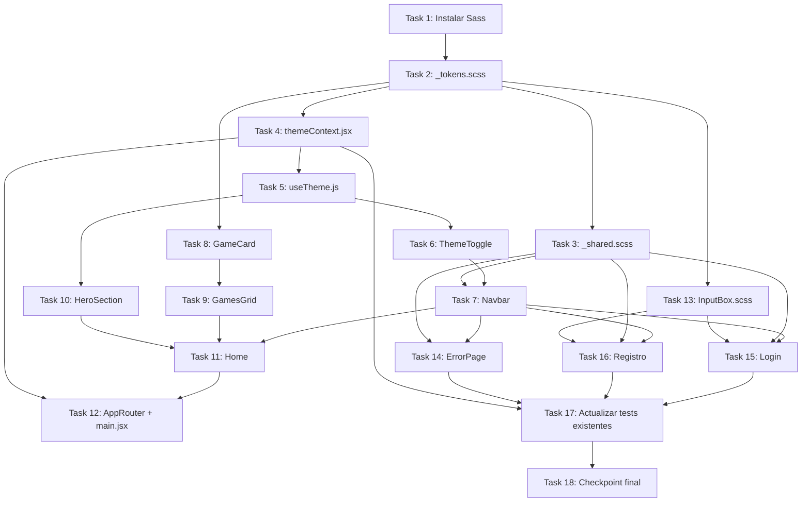

# Implementation Plan: Home con temas visuales (home-diseno)

## Overview

Plan de implementación de la nueva Home pública de GalinGames con dos temas visuales intercambiables (azul/violeta y rojo/gris/negro), un Navbar genérico reutilizable, y la migración a SCSS de las hojas de estilo existentes tocadas por esta feature. Todo el trabajo es frontend (`GalinGames_react/`); no hay cambios de backend. El orden sigue las dependencias reales: primero la infraestructura de tema y estilos compartidos, después el Navbar (que todo lo demás reutiliza), después la Home en sí, y por último la migración visual de Login/Registro/ErrorPage y la actualización de los tests ya existentes que se ven afectados.

---

## Tasks

### Phase 1 — Fundamentos: tema y estilos compartidos

---

- [x] 1. Instalar Sass en el frontend
  **Dependencias:** Ninguna
  **Requisitos:** Req 9.1

  - [x] 1.1 Ejecutar `npm install -D sass` en `GalinGames_react/`
    - Verificar que queda registrado en `package.json`/`package-lock.json`
    - _Requisitos: 9.1_

---

- [x] 2. `src/styles/_tokens.scss` — Design Tokens de ambos temas
  **Dependencias:** Task 1
  **Requisitos:** Req 1.6, 1.7, 9.3, 9.6

  - [x] 2.1 Crear `src/styles/_tokens.scss` con dos bloques `[data-theme="azul"]` y `[data-theme="rojo"]` sobre `:root`, definiendo las variables CSS de la tabla de `design.md` → Design Tokens: `--color-fondo`, `--color-fondo-elevado`, `--color-acento`, `--color-acento-secundario`, `--color-texto`, `--color-texto-tenue`, `--sombra-acento`
    - _Requisitos: 1.6, 1.7, 9.3_

  - [x] 2.2 Importar `_tokens.scss` desde `src/index.css` (o convertir `index.css` a `index.scss` e importarlo ahí) para que las variables estén disponibles globalmente antes de cualquier componente
    - _Requisitos: 9.6_
    - _Nota: se convirtió `index.css` a `index.scss` (con `@use './styles/tokens';`) y se actualizó el import en `main.jsx`. Los valores por defecto de `:root` (sin atributo) son los del tema azul, sirviendo de fallback antes de que `ThemeProvider` aplique `data-theme` vía `useLayoutEffect`._

---

- [x] 3. `src/styles/_shared.scss` — clases reutilizadas entre Login/Registro/ErrorPage
  **Dependencias:** Task 2
  **Requisitos:** Req 7.2, 9.3, 9.4, 9.8, 8.2, 8.4

  - [x] 3.1 Definir `.pagina-tematica` (fondo de página con degradado radial usando `var(--color-fondo)`, sustituye a `.fondo-gaming`), `.pagina-tematica__contenido` (contenedor centrado)
    - _Requisitos: 7.2_

  - [x] 3.2 Definir `.tarjeta-tema` (consolida `.color-fondo` + `.marginForm` + `.contenido-registro` + `.form-box`: fondo `var(--color-fondo-elevado)`, borde y sombra usando `var(--color-acento)`/`var(--sombra-acento)`, `backdrop-filter: blur(...)`)
    - _Requisitos: 7.2, 9.3_

  - [x] 3.3 Definir `.titulo-tema` (sustituye `.videojuego-title`), `.texto-tema` (sustituye `.videojuego-text`) y `.texto-tema--condiciones` (sustituye `.videojuego-conditions`), con la tipografía definitiva del nuevo sistema de diseño (sustituyendo `Press Start 2P`/`VT323`/`Share Tech Mono`)
    - _Requisitos: 7.2_
    - _Nota: se usó `'Rajdhani', 'Segoe UI', system-ui, sans-serif` como pila tipográfica (fuente gaming moderna de trazo anguloso, coherente con el mockup, sin depender de que la fuente esté instalada localmente — con fallbacks del sistema). Si se desea la fuente exacta `Rajdhani` renderizada, quedaría pendiente añadir su `@font-face`/Google Fonts en una tarea futura; no bloquea esta feature porque los fallbacks ya son legibles y consistentes._

  - [x] 3.4 Definir `.boton-primario` (sustituye `.botonRegistro`): degradado `var(--color-acento)` → `var(--color-acento-secundario)`, estados `:hover`/`:focus-visible` anidados
    - _Requisitos: 1.7, 9.3, 9.4_

  - [x] 3.5 Definir la regla común de foco visible (`:focus-visible { outline: 2px solid var(--color-acento); }`) aplicada a enlaces, botones y controles interactivos
    - _Requisitos: 8.2_

  - [x] 3.6 Envolver las transiciones de color/transform de `.tarjeta-tema`, `.boton-primario` y demás elementos animados en `@media (prefers-reduced-motion: no-preference) { ... }`
    - _Requisitos: 8.4_
    - _Nota: implementado como mixin `transicion-suave($propiedades...)` reutilizado por `.tarjeta-tema` y `.boton-primario`, en vez de repetir el media query en cada regla._

---

- [x] 4. `src/globalState/themeContext.jsx` — ThemeProvider
  **Dependencias:** Task 2
  **Requisitos:** Req 1.2, 1.5, 2.1, 2.2, 2.3, 2.4

  - [x] 4.1 Implementar `ThemeContext` y `ThemeProvider` siguiendo el contrato de `design.md` (`useState` inicializado de forma síncrona con `readThemeFromStorage()`, `useLayoutEffect` aplicando `data-theme` al `<html>`, `toggleTheme` con `useCallback` que persiste en `localStorage['gg-theme']`)
    - `readThemeFromStorage()` valida contra el allowlist `['azul', 'rojo']`; cualquier otro valor usa `'azul'` por defecto
    - _Requisitos: 1.2, 1.5, 2.1, 2.2, 2.3_

  - [x] 4.2 Exportar el shape del contexto: `{ theme, toggleTheme }`
    - _Requisitos: 2.4_

  - [x]* 4.3 Escribir tests unitarios de `themeContext.jsx` (mismo patrón que `authContext.test.jsx`)
    - `ThemeProvider` aplica `data-theme="azul"` por defecto sin nada en localStorage
    - `ThemeProvider` aplica `data-theme="rojo"` si `localStorage.getItem('gg-theme') === 'rojo'`
    - Un valor corrupto en localStorage (`'purpura'`) hace que se use `'azul'`
    - `toggleTheme()` alterna el tema y actualiza `localStorage`
    - Cambiar de tema no borra `localStorage['session']` (independencia de Requisito 2.4); cerrar sesión no borra `localStorage['gg-theme']`
    - _Requisitos: 1.2, 1.5, 2.1, 2.3, 2.4_

---

- [x] 5. `src/hooks/useTheme.js`
  **Dependencias:** Task 4
  **Requisitos:** (infraestructura, mismo patrón que `useAuth.js`)

  - [x] 5.1 Implementar y exportar `useTheme()`: `useContext(ThemeContext)`, lanza `Error('useTheme debe usarse dentro de ThemeProvider')` si el contexto es `null`

---

### Phase 2 — Navbar genérico

---

- [x] 6. `NavbarComponente/ThemeToggle.jsx` — botón de cambio de tema
  **Dependencias:** Task 5
  **Requisitos:** Req 1.1, 1.2, 1.4

  - [x] 6.1 Implementar `ThemeToggle.jsx` según el contrato de `design.md`: botón con `onClick={toggleTheme}`, `aria-pressed={theme === 'rojo'}`, `aria-label` dinámico indicando el tema destino
    - _Requisitos: 1.2, 1.4_

  - [x] 6.2 Crear `ThemeToggle.scss` (icono/indicador visual del tema activo, usando `var(--color-acento)`)
    - _Requisitos: 1.1_
    - _Nota: se extrajo el mixin `transicion-suave` de `_shared.scss` a un nuevo parcial `src/styles/_mixins.scss` (usado por ambos), para que `ThemeToggle.scss`/`Navbar.scss` no tuvieran que tirar de las clases de `_shared.scss` solo para acceder al mixin — mantiene la separación de `design.md` (Navbar solo depende de tokens/mixins, no de las clases de página de Login/Registro/ErrorPage)._
    - _**Revisión posterior (a petición del usuario, tras revisar la Phase 2):** el interruptor pista/pulgar se sustituyó por el propio logotipo (`` dentro del botón, `src` según `theme`) con efecto de zoom 3D (`scale` + `rotateY` + `drop-shadow`) en `:hover`/`:focus-visible`. `ThemeToggle.scss` pasó a asumir el recorte/`mix-blend-mode` que antes vivía en `Navbar.scss` → `.navbar__logo`. Ver decisión actualizada en `design.md` y Task 7.1._

  - [x]* 6.3 Escribir tests de `ThemeToggle.jsx`
    - Al hacer click invoca `toggleTheme`
    - `aria-pressed` refleja el tema activo
    - Es activable con teclado (Enter/Espacio) — usar `userEvent` para simular ambas teclas
    - _Requisitos: 1.2, 1.4_

---

- [x] 7. `NavbarComponente/Navbar.jsx` — componente genérico
  **Dependencias:** Task 6, Task 3
  **Requisitos:** Req 3.1, 3.2, 3.3, 3.4, 3.5, 3.6, 3.7, 3.8, 3.9, 4.1, 4.2, 4.3, 4.4, 8.5

  - [x] 7.1 Implementar la estructura semántica base: `<header className="navbar"><nav>...</nav></header>` con el logotipo (`` dentro de `Link to="/"`, `src` según `theme` — `/logo1.png` en `azul`, `/logo2.png` en `rojo`) y el contenedor de tamaño fijo con `object-fit: cover` para evitar la caja de fondo de `logo1.png` (Req 3.1)
    - _Requisitos: 3.1, 8.5_
    - _Nota: `object-position: 50% 32%` y `mix-blend-mode: screen` como primer ajuste; el recorte fino queda para el checkpoint visual (Task 12.4), tal como anticipaba la nota de `tasks.md`._
    - _**Revisión posterior (a petición del usuario):** el logotipo ya no vive en `Navbar.jsx` envuelto en `Link to="/"` — se retiró de ahí y pasó a ser el contenido de `ThemeToggle` (Task 6.2), que ahora ocupa la posición donde estaba el logo. El logotipo deja de navegar a `/`; el enlace "Inicio" (Task 7.2) sigue cubriendo esa navegación. Ver Requisitos 1.1/1.4/3.1 actualizados y decisión en `design.md`._

  - [x] 7.2 Añadir los enlaces de navegación: `Link to="/"` real para "Inicio"; `<span className="navbar__link navbar__link--proximamente" aria-disabled="true">` para "Juegos", "Novedades" y "Comunidad"
    - _Requisitos: 3.2, 3.3, 3.4_

  - [x] 7.3 Integrar `<ThemeToggle />` en el Navbar
    - _Requisitos: 3.5 (mismo conjunto de elementos en ambos temas)_
    - _Nota: tras la revisión de Task 7.1, `<ThemeToggle />` se renderiza una sola vez, en la posición del logotipo, en vez de (además) dentro de `.navbar__acciones`._

  - [x] 7.4 Implementar la zona de sesión: `isAuthenticated ? (username + botón "Cerrar sesión" → logout()) : (Link "Iniciar sesión" a /login + Link "Registrarse" a /registro con clase .boton-primario)`
    - _Requisitos: 4.1, 4.2, 4.3, 4.4_

  - [x] 7.5 Implementar el menú móvil: botón hamburguesa + panel colapsable con `useState` local, visible solo bajo el breakpoint de 768px definido en `Navbar.scss`, sin ocultar logotipo/ThemeToggle/zona de sesión
    - _Requisitos: 3.6_

  - [x] 7.6 Crear `Navbar.scss`: `position: sticky; top: 0;`, `background-color: var(--color-fondo-elevado)`, `backdrop-filter: blur(...)` (+ `-webkit-backdrop-filter`), `z-index` por encima del contenido, sin declarar colores de tema propios (solo `var(--color-*)`)
    - _Requisitos: 3.7, 3.8, 9.6_
    - _Nota (ajuste sobre `design.md`): `Navbar.scss` sí importa `_shared.scss` (además de `_mixins.scss`), para reutilizar literalmente la regla `.boton-primario` en "Registrarse" en vez de duplicarla — el diagrama de `design.md` lo mostraba conectado solo a `_tokens.scss`, pero el Requisito 9.8 pide explícitamente extraer a un parcial reutilizable los botones compartidos entre componentes en lugar de duplicar su CSS. Gracias al sistema de módulos de Sass (`@use`), la CSS de `_shared.scss` solo se emite una vez en el bundle final aunque varios ficheros la importen, así que no hay duplicación real en el CSS compilado._
    - _**Revisión posterior (feedback visual del usuario tras probar la Home real):** el reparto de elementos no coincidía con el mockup. Rehecho como layout de 3 zonas independientes sobre `.navbar__nav` (`position: relative`, sin `max-width`/`margin: auto` para que las zonas lleguen al borde real de la pantalla, no al de un contenedor centrado): (1) `ThemeToggle` (logo) con `position: absolute; left: 1.5rem` pegado al borde izquierdo — al estar en `position: absolute` no fuerza la altura de la barra ni se recorta al hacer zoom en el hover; (2) `.navbar__enlaces` centrado con `position: absolute; left: 50%; transform: translate(-50%, -50%)` y `gap` reducido de `1.5rem` a `1rem`; (3) `.navbar__acciones` empujado al borde derecho con `margin-left: auto` (ya no compite con unos enlaces que ahora están fuera del flujo). `.navbar__menu-movil` pasa a `display: contents` en escritorio para que sus hijos participen directamente del flex de `.navbar__nav`; el bloque `@media` móvil revierte tanto eso como el `position: absolute` de los enlaces, devolviendo el panel colapsable a su comportamiento apilado original. Además, el logotipo cambia de `object-fit: cover` a `object-fit: contain` (nunca recorta la imagen, solo la ajusta dentro de la caja) y la caja pasa de 150×48px a 120×64px._
    - _**Segunda revisión (feedback del usuario, "el logo se ve muy pequeño" + faltaban elementos del mockup):** la caja del logo pasa de 120×64px a 260×140px (`.navbar { min-height }` sube de 64px a 88px para acompañar visualmente, aunque al ser `position: absolute` el logo puede seguir desbordando la barra sin recortarse). Se añaden los elementos que faltaban del mockup (Requisitos 3.10, 4.5, nuevos): icono de búsqueda, selector de idioma "ES" con icono de globo (ambos con el mismo patrón "próximamente" que los enlaces inertes del Requisito 3.4), un divisor vertical decorativo, e icono de usuario junto al texto "Iniciar sesión". Los iconos se implementan como SVG en línea en el nuevo fichero `NavbarIconos.jsx` (sin librería externa), con `aria-hidden="true"` porque el texto/aria-label del elemento contenedor ya aporta el nombre accesible._
    - _Aviso pendiente de confirmación visual: con el logo mucho más grande (260px + margen), en anchos justo por encima del breakpoint móvil (768-900px aprox.) podría quedar poco margen para los enlaces centrados — a revisar por el usuario en el checkpoint visual._
    - _**Tercera revisión (el aviso anterior se confirmó — recorte real reportado por el usuario en anchos intermedios):** se añade el nuevo Requisito 3.6.1 y un tramo de ancho intermedio (`$navbar-breakpoint-categorias: 1100px`) entre el móvil completo (768px) y el escritorio ancho: en ese rango, `.navbar__toggle-categorias` (nuevo botón, mismo icono de tres líneas, centrado en la posición de los enlaces) sustituye a `.navbar__enlaces`, que pasa a `display: none` salvo con el modificador `--desplegado` (un desplegable centrado bajo la barra) controlado por un nuevo estado `categoriasAbiertas`. Búsqueda/idioma/divisor/sesión siguen visibles en su sitio en todo este tramo — solo se oculta lo que no cabía. `cerrarMenu` ahora resetea también `categoriasAbiertas` al pulsar cualquier enlace._
    - _**Cuarta revisión (logo "todavía pequeño"; fallos reales de recorte y borrosidad reportados sobre la versión anterior):** ronda de ajustes sobre `ThemeToggle.scss`, en varios pasos guiados por feedback en vivo del usuario mientras probaba la app:_
      - _`.navbar__nav { min-height }` sube de 88px a 100px; caja del logo, de 260×140px a un tamaño final de 300×168px (`--azul`) / 360×202px (`--rojo`, ligeramente mayor a petición explícita del usuario tras comprobar que ambos temas quedaban igual de grandes)._
      - _Se retira por completo el compensador `transform: scale()` que se había introducido para agrandar `logo1.png` (tenía mucho lienzo vacío/difuminado respecto a `logo2.png`, y con la misma caja+`contain` se veía más pequeño): combinado con el `scale(1.15)` del hover producía un doble escalado que pixelaba/difuminaba la imagen — reportado explícitamente por el usuario ("se difumina y pixela"). Sustituido por `object-fit: cover` con `object-position: 50% 44%` solo para `--azul`, recortando de forma nativa en vez de escalar por CSS; `--rojo` sigue con `contain` sin cambios de fondo._
      - _Posicionamiento vertical: de `top: 50%; transform: translateY(-50%)` (centrado simétrico) a un `top` fijo (`0.4rem` en la versión final) sin transform de centrado — el Navbar está pegado al borde superior real de la ventana (`position: sticky; top: 0`), así que la mitad "de arriba" del desbordamiento de un logo mucho más alto que la barra se recortaba contra el borde del viewport (reportado por el usuario como "se entrecorta arriba"). Un `top` fijo garantiza que el borde superior del logo nunca queda por encima del propio navbar, sea cual sea su altura renderizada._
    - _Como en el resto de esta feature, la calibración final de tamaños/posiciones se hizo de forma iterativa con feedback visual directo del usuario (que sí ve la app renderizada), no analíticamente — si al revisar esta rama en el navegador algo sigue sin verse bien, son ajustes puntuales de valores en `ThemeToggle.scss`/`Navbar.scss`, no de arquitectura._
    - _**Quinta revisión (capturas reales adjuntadas por el usuario, tamaños ya correctos pero `logo1.png` "menos centrado" que `logo2.png`):** dos causas distintas identificadas a partir de las capturas: (1) `object-position: 50% 44%` del recorte `cover` de `--azul` dejaba demasiado hueco vacío arriba y cortaba el símbolo por abajo — corregido a `50% 56%`; (2) al haber quedado `--rojo` (202px) y `--azul` (168px) con alturas de caja distintas tras la petición explícita del usuario de agrandar solo el rojo, la línea del `border-bottom` del navbar cruzaba cada logo en un punto relativo distinto del propio logo (más abajo, proporcionalmente, en el más bajo) — corregido añadiendo `margin-top: 0.9rem` solo a `--azul` (`--rojo` mantiene `margin-top: 0`), igualando el punto de cruce relativo entre ambos temas sin tocar el `top` fijo compartido del botón (que sigue evitando el recorte contra el borde del viewport, Task 7.1 nota anterior)._
    - _**Sexta revisión (feedback en tiempo real, varios mensajes seguidos — "aún se entrecorta arriba" persistiendo pese a mover `object-position` tres veces: 56% → 50% → 45%):** al no desaparecer el "corte" pese a mover el punto de recorte repetidamente en ambas direcciones, se reconsideró la causa: `mix-blend-mode: screen` (pensado originalmente para disimular el fondo difuminado de `logo1.png`, Task 7.1) funde a negro/transparente cualquier zona oscura del PROPIO símbolo (sombras/bisel 3D de las letras "GG") contra el fondo oscuro del navbar — con el recorte `cover` ya tan ajustado, apenas queda fondo que disimular, así que el efecto neto era "borrar" parte del símbolo, no un recorte real. Se quita `mix-blend-mode` (pasa a `normal`) solo para `--azul`. Además, a petición del usuario, se añade `margin-left` (2rem en la versión final de este turno) a `--azul` para alinear su posición horizontal con `--rojo`. Estos últimos valores son la mejor estimación posible sin poder ver el resultado renderizado — pendientes de una revisión visual fresca (recomendable descartar caché del navegador) antes de darlos por buenos definitivamente._
    - _Nota aparte, no relacionada con el logotipo: se corrigió también `index.html`, editado directamente por el usuario para cambiar el favicon de `/vite.svg` a `/logo1.png` — se ajustó `type="image/svg+xml"` a `type="image/png"`, que ya no correspondía tras el cambio._

---

- [x] 7.8 Ajuste del `border-bottom` del Navbar: de una línea sólida al 100% de opacidad a un borde atenuado con brillo difuminado
  **Dependencias:** Task 7.6
  **Requisitos:** (afecta a la percepción visual del Requisito 3.8, feedback directo del usuario — "se ven muy sólidos... quiero un poco de difuminado para que no sea tan cantoso")

  - Nuevo token `--color-acento-borde` en `_tokens.scss` (versión `rgba` al 40% de opacidad del acento de cada tema), en vez de reutilizar `--color-acento` a opacidad completa.
  - Los 3 `border-bottom` de `Navbar.scss` (barra principal, desplegable de categorías del tramo intermedio, panel móvil) pasan a usar `--color-acento-borde`; la barra principal añade además `box-shadow: 0 2px 10px -2px var(--color-acento-borde)` para un brillo suave en vez de un filo duro.

  - [x]* 7.7 Escribir tests unitarios de `Navbar.jsx` (envolviendo en `MemoryRouter` + `AuthProvider` + `ThemeProvider`, mockeando `authService`)
    - Sin sesión: muestra "Iniciar sesión" y "Registrarse"
    - Con sesión (mockear `AuthContext` o loguear vía el mock de `authService`): muestra el `username` y el botón de cerrar sesión, y al pulsarlo se llama a `logout`
    - El logotipo cambia de `src` al pulsar `ThemeToggle`
    - Los enlaces "Juegos"/"Novedades"/"Comunidad" no son `<a>`/`<button>` navegables (verificar `aria-disabled`)
    - _Requisitos: 3.1, 3.4, 4.1, 4.2, 4.3_
    - _Nota: el Navbar todavía no es visible en la app real (no está conectado en ninguna ruta hasta la Phase 3, cuando exista `Home`); la verificación visual en navegador queda para el checkpoint de la Task 12.4._

---

### Phase 3 — Home: Hero, grid de juegos y enrutado

---

- [x] 8. `zonaHome/GameCardComponente/GameCard.jsx`
  **Dependencias:** Task 2
  **Requisitos:** Req 6.2, 6.3, 6.4, 8.3

  - [x] 8.1 Implementar `GameCard.jsx` con props `{ src, alt }`, estado local `error` y `onError` en el `` que activa el fallback (`role="img"` + `aria-label={alt}`) según el contrato de `design.md`
    - _Requisitos: 6.2, 6.4, 8.3_

  - [x] 8.2 Crear `GameCard.scss`: borde/resplandor con `var(--color-acento)` (Req 6.3), sin declarar color de tema propio
    - _Requisitos: 6.3, 9.6_

  - [x]* 8.3 Escribir tests unitarios de `GameCard.jsx`
    - Renderiza la imagen con el `src`/`alt` recibidos
    - Al disparar `onError` en la imagen, muestra el fallback con el `alt` visible y dejar de renderizar el `` roto
    - _Requisitos: 6.2, 6.4_

---

- [x] 9. `zonaHome/GamesGridComponente/GamesGrid.jsx`
  **Dependencias:** Task 8
  **Requisitos:** Req 6.1, 6.5, 8.5

  - [x] 9.1 Definir el array constante de 6 entradas `{ src: '/assassins.jpg', alt: '...' }` (ídem `blooddownwalker.jpg`, `dragonball.jpg`, `fc27.jpg`, `gta.jpg`, `wolverine.jpg`) con `alt` descriptivo por juego, y mapear a `<GameCard />` dentro de un `<section>` con encabezado `<h2>` para lectores de pantalla
    - _Requisitos: 6.1, 8.5_
    - _Nota: el `<h2>` usa la nueva utilidad `.visualmente-oculto` (añadida a `index.scss`) — no aparece en el mockup pero orienta a lectores de pantalla._

  - [x] 9.2 Crear `GamesGrid.scss`: grid de 3 columnas en escritorio, 1 columna bajo el breakpoint móvil (768px), manteniendo la proporción de cada portada
    - _Requisitos: 6.5_

  - [x]* 9.3 Escribir test de `GamesGrid.jsx`: renderiza exactamente 6 `GameCard`
    - _Requisitos: 6.1_

---

- [x] 10. `zonaHome/HeroSectionComponente/HeroSection.jsx`
  **Dependencias:** Task 5
  **Requisitos:** Req 5.2, 5.3, 5.4

  - [x] 10.1 Implementar `HeroSection.jsx`: etiqueta "TENDENCIAS", `<h1>` "LO MÁS JUGADO", texto descriptivo, botón "Ver todos" como `<span aria-disabled="true">` (Req 5.4), e imagen de mando como `background-image` de `.hero__imagen-mando` según `theme` (`/mando.png` en azul, `/mando2.png` en rojo)
    - _Requisitos: 5.2, 5.3, 5.4_

  - [x] 10.2 Crear `HeroSection.scss` consumiendo `var(--color-*)`
    - _Requisitos: 9.6_

  - [x]* 10.3 Escribir test de `HeroSection.jsx`: la imagen de fondo cambia según el tema activo (mockear `useTheme`)
    - _Requisitos: 5.3_

---

- [x] 11. `zonaHome/HomeComponente/Home.jsx`
  **Dependencias:** Task 7, Task 9, Task 10
  **Requisitos:** Req 5.1, 9.5

  - [x] 11.1 Implementar `Home.jsx`: `<><Navbar /><main className="home"><HeroSection /><GamesGrid /></main></>`, sin lógica propia
    - _Requisitos: 5.1, 9.5_

  - [x] 11.2 Crear `Home.scss` (layout general de la página, `var(--color-fondo)`)

  - [x]* 11.3 Escribir test de integración de `Home.jsx`: renderiza Navbar, Hero y los 6 GameCard juntos (envolviendo en `MemoryRouter` + `AuthProvider` + `ThemeProvider`)
    - _Requisitos: 5.1_

---

- [x] 12. Enrutado: `AppRouter.jsx` y `main.jsx`
  **Dependencias:** Task 11, Task 4
  **Requisitos:** Req 5.1, 5.5

  - [x] 12.1 Modificar `AppRouter.jsx`: sustituir el `import Tienda` por `import Home from '../Componentes/zonaHome/HomeComponente/Home'`, y la ruta `/` pasa de `<ProtectedRoute><Tienda /></ProtectedRoute>` a `<Home />` directamente
    - _Requisitos: 5.1, 5.5_
    - _Nota (ajuste sobre `design.md`): se eliminó por completo la función `ProtectedRoute` de `AppRouter.jsx` en vez de dejarla sin usar — al quedar sin ninguna referencia tras este cambio, ESLint la habría marcado como código muerto (`no-unused-vars`). Es trivial de recrear (3 líneas) si una futura zona autenticada la necesita; mantener código genuinamente inalcanzable contradice las convenciones del proyecto._

  - [x] 12.2 Eliminar `src/Componentes/zonaTienda/TiendaComponente/Tienda.jsx` (y la carpeta `zonaTienda/` si queda vacía)
    - _Requisitos: 5.5_

  - [x] 12.3 Modificar `main.jsx`: envolver `<AuthProvider>` con `<ThemeProvider>` (orden: `BrowserRouter` > `ThemeProvider` > `AuthProvider` > `AppRouter`)
    - _Requisitos: (infraestructura, ver design.md → main.jsx)_

  - [x] 12.4 Checkpoint — Arrancar `npm run dev` y verificar manualmente: `/` renderiza la Home sin redirigir a `/login` estando desconectado; el `ThemeToggle` cambia logotipo/mando/bordes de las 6 tarjetas de forma inmediata; recargar la página conserva el último tema elegido
    - _Nota: este entorno no tiene navegador disponible para una verificación visual real. Se comprobó que el servidor de desarrollo arranca y responde 200 en `/` sin errores de consola/compilación, y la lógica de enrutado/tema está cubierta por los 45 tests automatizados (incluidos los de integración de `Home`/`Navbar` con `ThemeProvider`+`AuthProvider`). **La verificación visual real (recorte del logo, aspecto del degradado, comportamiento sticky) queda pendiente de que el usuario la revise en su navegador** — no se marca como verificada más allá de lo que los tests automatizados garantizan._
    - _Aparte: se detectó y corrigió que esta rama, creada antes de que se mergease el PR #10 en `dev`, no tenía el fix de `baseline-browser-mapping` — se reaplicó (`npm i baseline-browser-mapping@latest -D`) directamente en esta rama._

### Phase 4 — Migración visual de Login, Registro, ErrorPage e InputBox

---

- [ ] 13. `InputBox.css` → `InputBox.scss`
  **Dependencias:** Task 2
  **Requisitos:** Req 7.5

  - [ ] 13.1 Renombrar `InputBox.css` a `InputBox.scss`; añadir estilos de borde/foco (`border-color: var(--color-acento)` en `:focus`) sustituyendo el foco azul por defecto de Bootstrap, sin modificar `InputBox.jsx` (mismo comportamiento `required`/truncado ya cubierto en `.specs/login-autenticacion/`)
    - _Requisitos: 7.5_

---

- [ ] 14. `ErrorPage.css` → `ErrorPage.scss` + `ErrorPage.jsx`
  **Dependencias:** Task 7, Task 3
  **Requisitos:** Req 9.2

  - [ ] 14.1 Renombrar `ErrorPage.css` a `ErrorPage.scss`, sustituyendo `.error-page-contenido`/`.error-page-codigo` por reglas anidadas que usen `.tarjeta-tema` y las variables de `_tokens.scss` en vez de los colores morados fijos actuales
    - _Requisitos: 9.2_

  - [ ] 14.2 Modificar `ErrorPage.jsx`: actualizar el import a `./ErrorPage.scss`, incluir `<Navbar />`, y sustituir `fondo-gaming`/`videojuego-title`/`videojuego-text`/`botonRegistro` por `.pagina-tematica`/`.titulo-tema`/`.texto-tema`/`.boton-primario`
    - _Requisitos: 9.2_

---

- [ ] 15. `Login.css` → `Login.scss` + `Login.jsx`
  **Dependencias:** Task 7, Task 3, Task 13
  **Requisitos:** Req 7.1, 7.2, 7.3, 9.2, 9.9

  - [ ] 15.1 Renombrar `Login.css` a `Login.scss`; mover/adaptar la regla de `[role='alert']` existente anidada dentro de la nueva estructura de `.tarjeta-tema`
    - _Requisitos: 9.2_

  - [ ] 15.2 Modificar `Login.jsx`: incluir `<Navbar />`, sustituir el div `fondo-gaming` + wrapper inline por `.pagina-tematica`/`.pagina-tematica__contenido`/`.tarjeta-tema`, y las clases `videojuego-title`/`videojuego-text`/`botonRegistro`/`contenido-registro`/`marginForm` por sus equivalentes de `_shared.scss`; actualizar el import de estilos a `./Login.scss`
    - Sin tocar el estado, `handleSubmit`, las llamadas a `authService` ni el manejo de errores/timeout/429 ya implementados
    - _Requisitos: 7.1, 7.2, 7.4, 9.9_

  - [ ] 15.3 Checkpoint manual — con `npm run dev`, verificar que `/login` se ve correctamente en ambos temas y que el `ThemeToggle` del Navbar actualiza la tarjeta del formulario de inmediato
    - _Requisitos: 7.3_

---

- [ ] 16. `Registro.css` → `Registro.scss` + `Registro.jsx`
  **Dependencias:** Task 7, Task 3, Task 13
  **Requisitos:** Req 7.1, 7.2, 7.3, 9.2, 9.9

  - [ ] 16.1 Renombrar `Registro.css` a `Registro.scss`, anidando `.botonRegistro`/`.videojuego-title`/etc. bajo sus nuevos nombres de `_shared.scss` (ver Task 15.1 como referencia de patrón)
    - _Requisitos: 9.2_

  - [ ] 16.2 Modificar `Registro.jsx`: incluir `<Navbar />`, aplicar el mismo reemplazo de clases que en Login.jsx (Task 15.2) a los dos `return` del componente (formulario y mensaje de éxito), y actualizar el import de estilos a `./Registro.scss`
    - Sin tocar el estado, `handleSubmit`, las llamadas a `authService.register` ni el manejo de errores 400/409/429/timeout ya implementados
    - _Requisitos: 7.1, 7.2, 7.4, 9.9_

  - [ ] 16.3 Checkpoint manual — con `npm run dev`, verificar que `/registro` (incluida la pantalla de éxito tras un registro real) se ve correctamente en ambos temas
    - _Requisitos: 7.3_

---

### Phase 5 — Actualizar tests existentes y checkpoint final

---

- [ ] 17. Envolver los tests existentes afectados con `ThemeProvider`
  **Dependencias:** Task 15, Task 16, Task 14, Task 4
  **Requisitos:** (evitar regresión de la suite ya verificada en `.specs/login-autenticacion/`)

  - [ ] 17.1 Modificar `Login.test.jsx`: el helper `renderLogin()` envuelve además con `<ThemeProvider>` (dentro de `MemoryRouter`, fuera o dentro de `AuthProvider` indistintamente); mockear `authService` sigue igual
    - Verificar que la Propiedad 12 (fast-check, espacios en blanco) sigue pasando con el árbol envuelto
    - _Requisitos: (regresión)_

  - [ ] 17.2 Modificar `Registro.test.jsx`: mismo cambio que 17.1 en su helper de render
    - _Requisitos: (regresión)_

  - [ ] 17.3 Modificar `authContext.test.jsx`: el `Probe`/`LoginProbe` y el resto de tests que rendericen `AuthProvider` junto a componentes que ahora requieren `ThemeContext` (si aplica tras 17.1) se revisan; si `authContext.test.jsx` no renderiza `Navbar`/`Login`/`Registro` directamente, no necesita cambios — confirmar antes de modificar
    - _Requisitos: (regresión)_

  - [ ] 17.4 Modificar `ErrorPage.test.jsx`: envolver con `<AuthProvider>` y `<ThemeProvider>` además del `MemoryRouter` ya existente, ya que `ErrorPage` pasa a incluir `<Navbar />` (Task 14.2)
    - _Requisitos: (regresión)_

  - [ ] 17.5 Ejecutar `npm test` en `GalinGames_react/` y confirmar que la suite completa (incluidas las Propiedades 12 y 16 ya existentes) sigue en verde
    - _Requisitos: (regresión)_

---

- [ ] 18. Checkpoint final — build, lint y revisión visual completa
  **Dependencias:** Task 17

  - [ ] 18.1 Ejecutar `npm run lint` y `npm run build` en `GalinGames_react/` sin errores ni warnings nuevos
  - [ ] 18.2 Con `npm run dev`, recorrer manualmente `/`, `/login`, `/registro` y una ruta de error (`/error/404`) en ambos temas, comprobando: Navbar fijo y semitransparente al hacer scroll, logotipo sin caja de fondo visible, bordes de tarjetas y botones acordes al tema, menú móvil funcional bajo 768px, y persistencia del tema tras recargar
  - [ ] 18.3 Verificar con las herramientas de accesibilidad del navegador (o `axe` si está disponible) que no aparecen problemas de contraste ni de foco visible en ninguno de los dos temas

---

## Notes

- Las sub-tareas marcadas con `*` son opcionales y pueden omitirse para una primera versión más rápida, igual que en `.specs/login-autenticacion/tasks.md`.
- El ajuste fino de `object-position`/escala del logotipo `logo1.png` (Task 7.1) y del recorte de `mando.png`/`mando2.png` en el Hero (Task 10.1) es visual y se termina de calibrar durante los checkpoints manuales (Tasks 12.4, 15.3, 16.3, 18.2), no analíticamente.
- Esta feature no toca el backend (`GalinGames_nodejs/`) ni ningún endpoint de `.specs/login-autenticacion/`.

---

## Task Dependency Graph



```json
{
  "waves": [
    { "wave": 1, "tasks": [1] },
    { "wave": 2, "tasks": [2] },
    { "wave": 3, "tasks": [3, 4, 8, 13] },
    { "wave": 4, "tasks": [5, 9] },
    { "wave": 5, "tasks": [6, 10] },
    { "wave": 6, "tasks": [7] },
    { "wave": 7, "tasks": [11, 14, 15, 16] },
    { "wave": 8, "tasks": [12] },
    { "wave": 9, "tasks": [17] },
    { "wave": 10, "tasks": [18] }
  ]
}
```
