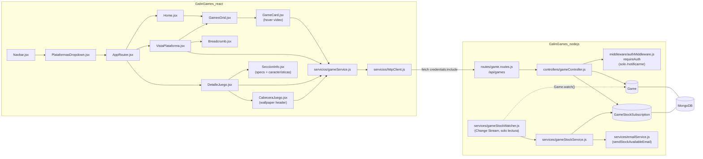
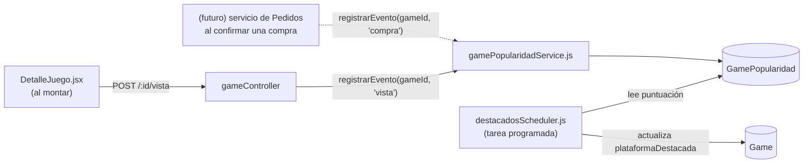

# Design Document — juegos

## Overview

Esta feature sustituye el catálogo hardcodeado del Home por un catálogo real
respaldado por MongoDB: una nueva colección `games` con 6 documentos (los
mismos juegos que hoy están hardcodeados en `GamesGrid.jsx`), un dropdown de
plataformas funcional en el Navbar, dos vistas nuevas (Vista de Plataforma y
Vista de Detalle del Juego) y las reglas de negocio de fecha de estreno y
stock que determinan si un juego se puede comprar, reservar, o si el usuario
puede pedir que se le avise por email.

Se apoya en infraestructura ya existente y no se toca su forma de trabajar:
`httpClient.js` + patrón `servicios/*.js` (frontend), `createXxxController`
+ `requireAuth` + `AppError`/`globalErrorHandler` (backend), `emailService.js`
(se añade un tercer email siguiendo el mismo patrón que
`sendVerificationEmail`/`sendEmailChangeVerification`), y el patrón de
dropdown accesible de `LanguageToggle.jsx`.

Se añaden dos colecciones (`Game`, `GameStockSubscription`) y un router
nuevo (`/api/games`), y en el frontend un dropdown de plataformas, dos
páginas nuevas y las modificaciones de `GamesGrid.jsx`/`GameCard.jsx` para
consumir datos reales.

**Esta aplicación (cara cliente) es exclusivamente de lectura sobre el
catálogo**: no contiene ningún endpoint, script ni lógica que inserte, edite
o borre juegos vía Cloudinary, HTTP o Mongoose. Los 6 documentos `Game` se
insertan a mano en MongoDB (mongosh/Compass) con sus imágenes embebidas en
base64 — ver Requisito 18 y Design Decisions. La gestión de contenido por un
equipo editorial (alta/baja/edición de juegos con roles de administración)
queda fuera de alcance de esta spec y se resolverá en una futura aplicación
de administración.

Quedan fuera de alcance (ver Introduction de `requirements.md`): el flujo
real de compra/checkout/reserva, y cualquier panel de administración.
**Esta app no tiene ninguna vía para mutar `stock`** — ni endpoint HTTP ni
script CLI (Requisito 13.6, ver Design Decisions). El stock se edita siempre
fuera de la app (hoy a mano en MongoDB Compass; en el futuro desde la app de
administración), y `gameStockWatcher.js` reacciona a esos cambios mediante
un MongoDB Change Stream para poder seguir enviando el aviso de
disponibilidad (Requisito 13.4) sin que esta app escriba nada.

## Architecture



## Components and Interfaces

### Backend — archivos nuevos

```
GalinGames_nodejs/src/
├── models/
│   ├── Game.js                        (nuevo)
│   └── GameStockSubscription.js       (nuevo)
├── controllers/
│   └── gameController.js              (nuevo, patrón createGameController)
├── services/
│   ├── gameStockService.js            (nuevo)
│   ├── gameStockWatcher.js            (nuevo: Change Stream de solo lectura sobre Game)
│   └── emailService.js                (modificado: + sendStockAvailableEmail)
├── utils/
│   └── platformSlug.js                (nuevo: mapeo slug URL ↔ enum de plataforma)
└── routes/
    └── game.routes.js                 (nuevo)
```

No hay ningún `scripts/` en esta feature: no existe ninguna vía (CLI, HTTP o
de otro tipo) para que esta app mute `stock` — ver Security y Design
Decisions.

La migración inicial de los 6 juegos (`insertGamesManual.mongosh.js`, sentencias
`mongosh` con los datos e imágenes en base64) fue un script de un solo uso: se
ejecutó a mano en el "MongoDB Shell" de Compass (Requisito 18, Tarea 13 de
`tasks.md`) y se eliminó del repositorio una vez los 6 documentos quedaron en
la colección `games` — MongoDB es ahora la única fuente de la verdad del
catálogo, no el repositorio. Si hace falta insertar o corregir un juego más
adelante a mano, se escribe una sentencia `db.games.updateOne(...)` nueva
directamente en mongosh/Compass.

`cloudinaryService.js` **no se toca en esta feature**: los juegos no usan
Cloudinary (Requisito 18.4, ver Design Decisions); sigue existiendo tal cual
para su único uso actual, el avatar de usuario.

`server.js` monta el router nuevo (sin ampliar `methods` de CORS: todos los
verbos que usa — GET, POST — ya están permitidos):

```js
app.use('/api/games', gameRoutes);
```
Valida: Requisito 15.

`gameController.js` sigue el patrón de inyección de dependencias de
`addressController.js` (`createGameController({ Game, GameStockSubscription })`
— sin `gameStockService`: el envío de notificaciones lo dispara
`gameStockWatcher.js` de forma reactiva, nunca un endpoint de
`gameController.js`, ver Security), exportando `module.exports =
createGameController({...defaults})` + `module.exports.createGameController`.

Firmas principales:

```js
// gameController.js
async function listDestacados(req, res, next)          // GET /destacados
async function listPorPlataforma(req, res, next)        // GET /plataforma/:plataforma
async function getDetalle(req, res, next)                // GET /:id
async function suscribirNotificacion(req, res, next)     // POST /:id/notificarme
```

`platformSlug.js` centraliza el mapeo entre el slug de la URL (minúsculas,
usado tanto en frontend como en el parámetro `:plataforma` del backend) y el
valor real del enum `Game.plataformas[].plataforma`:

```js
const SLUG_TO_PLATFORM = { pc: 'PC', playstation: 'PlayStation', xbox: 'Xbox', nintendo: 'Nintendo' };
function resolvePlatform(slug)   // → 'PC' | 'PlayStation' | 'Xbox' | 'Nintendo' | null
```

`gameStockService.js` centraliza el envío de notificaciones cuando el stock
de una combinación juego+plataforma pasa a ser mayor que 0 (Requisito 13.4):

```js
// gameStockService.js
async function notifySubscribers(gameId, plataforma)
// busca GameStockSubscription de esa combinación, envía el email a cada
// suscriptor vía emailService.sendStockAvailableEmail y borra cada
// suscripción ya notificada (Requisito 13.5)
```

`gameStockWatcher.js` es el único punto de la app que llama a
`notifySubscribers`, y lo hace de forma puramente reactiva (Requisito 13.6):

```js
// gameStockWatcher.js
function start()
// abre Game.watch([...], { fullDocument: 'updateLookup' }) y, en cada
// evento 'change', recorre game.plataformas del documento actualizado
// llamando a gameStockService.notifySubscribers(game._id, plataforma) para
// cada combinación con stock > 0.
```
No compara el stock "antes" con el "después": `notifySubscribers` ya es un
no-op si no hay suscripciones pendientes, y solo puede haberlas si esa
combinación tenía `stock = 0` cuando el cliente se suscribió (el propio
`POST /notificarme` lo exige, Requisito 13). El resultado equivale a
reaccionar solo a la transición 0 → >0, sin necesitar guardar el valor
anterior en ningún sitio ni que la propia app haya provocado el cambio —
funciona igual si el stock se edita a mano en Compass o, en el futuro, desde
la app de administración.

`start()` se invoca desde `server.js` al arrancar (dentro de `try/catch`: si
MongoDB no corre como replica set, el catálogo de lectura sigue funcionando
igualmente, solo se pierde el aviso automático — Requisito 14.5). Requiere
`MONGODB_URI` con `?replicaSet=<nombre>` en `.env` (ver `.env.example`).

### Frontend — archivos nuevos

```
GalinGames_react/src/
├── router/
│   └── AppRouter.jsx                              (modificado: 2 rutas nuevas)
├── servicios/
│   └── gameService.js                             (nuevo)
├── Componentes/
│   ├── compGlobales/
│   │   ├── NavbarComponente/
│   │   │   ├── Navbar.jsx                         (modificado: dropdown real de Juegos)
│   │   │   ├── PlataformasDropdown.jsx             (nuevo, patrón LanguageToggle.jsx)
│   │   │   └── PlataformasIconos.jsx               (nuevo: SVG PC/PlayStation/Xbox/Nintendo)
│   │   └── BreadcrumbComponente/
│   │       └── Breadcrumb.jsx                      (nuevo, genérico)
│   ├── zonaHome/
│   │   ├── GamesGridComponente/GamesGrid.jsx        (modificado: fetch en vez de array estático)
│   │   └── GameCardComponente/GameCard.jsx          (modificado: plataforma+precio, hover vídeo, navegación)
│   └── zonaJuegos/                                  (nuevo, mismo nivel que zonaHome/zonaCliente)
│       ├── VistaPlataformaComponente/
│       │   ├── VistaPlataforma.jsx
│       │   └── VistaPlataforma.scss
│       └── DetalleJuegoComponente/
│           ├── DetalleJuego.jsx
│           ├── DetalleJuego.scss
│           └── components/
│               ├── CabeceraJuego/CabeceraJuego.jsx        (wallpaper, portada, select, chip, acción)
│               ├── SeccionInfo/SeccionInfo.jsx             (contenedor del scroll bajo la cabecera)
│               ├── EspecificacionesTecnicas/EspecificacionesTecnicas.jsx
│               └── CaracteristicasJuego/CaracteristicasJuego.jsx
```

`AppRouter.jsx` añade, junto a las rutas ya existentes:
```jsx
<Route path="/juegos/:plataforma" element={<VistaPlataforma />} />
<Route path="/juegos/detalle/:id" element={<DetalleJuego />} />
```
Ambas rutas son públicas (el catálogo no requiere sesión), a diferencia de
`/mi-cuenta/:seccion`. Valida: Requisitos 1.4, 6.1, 7.1.

`gameService.js`, construido sobre `httpClient.js` (mismo patrón que
`accountService.js`):

```js
async function getJuegosDestacados()                       // GET /api/games/destacados
async function getJuegosPorPlataforma(plataformaSlug)       // GET /api/games/plataforma/:plataforma
async function getJuegoPorId(id)                            // GET /api/games/:id
async function suscribirNotificacion(gameId, plataforma)    // POST /api/games/:id/notificarme
```

`PlataformasDropdown.jsx` reemplaza el `<span aria-disabled>` de
`'navbar.linkJuegos'` dentro del `.map()` de `ENLACES_PROXIMAMENTE`
(`Navbar.jsx`), replicando el esqueleto de `LanguageToggle.jsx`
(`aria-haspopup`, `aria-expanded`, `role="menu"`, cierre por click-fuera y
Escape) con 4 `<Link role="menuitem">` a `/juegos/pc`, `/juegos/playstation`,
`/juegos/xbox`, `/juegos/nintendo`, cada uno con su icono de
`PlataformasIconos.jsx` antes del texto. Valida: Requisito 1.

`GameCard.jsx` se amplía con:
- Props nuevas: `id`, `nombre`, `plataforma`, `precio`, `videoPreviewUrl`.
- Estado `hover` controlado por `onMouseEnter`/`onMouseLeave`, activado solo
  si `window.matchMedia('(hover: hover) and (pointer: fine)').matches`
  (Requisito 4.5).
- Envuelto en `<Link to={`/juegos/detalle/${id}?plataforma=${plataforma}`}>`
  en vez de un `<div>` suelto (Requisito 5).
- Texto `"${nombre}" - ${plataforma}   ${precioFormateado}` (Requisito 3.1),
  con `precioFormateado` vía `Intl.NumberFormat` (Requisito 3.2).

`GamesGrid.jsx` sustituye el array estático `JUEGOS` por
`useEffect(() => { gameService.getJuegosDestacados()... }, [])` con estado
`loading`/`error`/`juegos` (Requisito 2).

`VistaPlataforma.jsx` lee `useParams().plataforma`, pide
`gameService.getJuegosPorPlataforma(plataforma)`, pinta título + subtítulo
(claves i18n `juegos.plataforma.<slug>.titulo`/`.subtitulo`), `Breadcrumb`
(`Inicio > Juegos > <Plataforma>`) y reutiliza `GamesGrid`'s lista de
`GameCard` (mismo componente, distinta fuente de datos). Valida: Requisito 6.

`DetalleJuego.jsx` lee `useParams().id` y `useSearchParams().get('plataforma')`,
pide `gameService.getJuegoPorId(id)` una única vez, y mantiene
`plataformaSeleccionada` en estado local (inicializada con el query param si
viene y es válido para ese juego, si no con `juego.plataformaDestacada`, si
no con la primera de `juego.plataformas`). Cambiar el `<select>` solo
actualiza ese estado local — sin nueva petición (Requisito 9.3). Renderiza
`CabeceraJuego` (fija, con el wallpaper) y, debajo, `SeccionInfo` (specs +
características), que es el contenido que aparece al hacer scroll
(Requisito 7).

## Data Models

### Game (nuevo, `GalinGames_nodejs/src/models/Game.js`)

| Campo | Tipo | Notas |
|---|---|---|
| `nombre` | String, required, trim | |
| `slug` | String, required, unique, lowercase, trim | usado para identificar el documento al insertarlo/corregirlo a mano en MongoDB |
| `descripcion` | String, required | sinopsis del producto (Requisito 19.1); nunca se hardcodea en frontend/i18n (Requisito 19.2) |
| `imagenPortada` | String, required | Data URI base64 (`data:image/jpeg;base64,...`) embebida directamente en el documento — no es una URL de Cloudinary ni de ningún CDN (Requisito 18.4) |
| `imagenWallpaper` | String, default `null` | Data URI base64, mismo criterio que `imagenPortada`; `null` mientras no se disponga de la imagen (Requisito 18.7) |
| `videoPreviewUrl` | String, default `null` | URL externa, no se re-aloja (Requisito 18.6) |
| `fechaEstreno` | Date, required | fecha real de lanzamiento (Requisito 16.1) |
| `plataformaDestacada` | String, enum `['PC','PlayStation','Xbox','Nintendo']`, default `null` | plataforma mostrada en la tarjeta del Home (Requisito 2.5); debe ser una de `plataformas[].plataforma` (validación a nivel de schema) |
| `caracteristicas` | subdocumento (ver abajo) | Requisito 8 |
| `plataformas` | array de subdocumentos `DisponibilidadPlataforma` (ver abajo) | mínimo 1 elemento |

#### `caracteristicas` (subdocumento embebido)

| Campo | Tipo | Notas |
|---|---|---|
| `jugadores.tipo` | String, enum `['individual','multijugador']` | opcional |
| `jugadores.maximo` | Number, min 1 | opcional, solo aplica si `tipo === 'multijugador'` |
| `online` | Boolean, default `false` | |
| `crossplay` | Boolean, default `false` | |
| `hdr` | Boolean, default `false` | |
| `mandosCompatibles` | [String], default `[]` | |

#### `plataformas[]` — `DisponibilidadPlataforma` (subdocumento embebido)

| Campo | Tipo | Notas |
|---|---|---|
| `plataforma` | String, enum `['PC','PlayStation','Xbox','Nintendo']`, required | |
| `formatos` | [String], enum `['fisico','digital']`, required, mínimo 1 | validación custom: si `plataforma === 'PC'`, `formatos` DEBE ser exactamente `['digital']` (Requisito 11.1) |
| `precio` | Number, required, min 0 | por combinación juego+plataforma (Requisito 9.3) |
| `stock` | Number, default 0, min 0 | **nunca se escribe desde esta app**: se edita siempre fuera de ella (Requisito 13.6, ver Security); `gameStockWatcher.js` solo lo observa |
| `especificacionesPC` | subdocumento opcional (solo si `plataforma === 'PC'`) | ver abajo |
| `especificacionesConsola` | subdocumento opcional (solo si `plataforma !== 'PC'`) | ver abajo |

`especificacionesPC`: `{ minimas: { cpu, ram, gpu, almacenamiento,
sistemaOperativo }, recomendadas: { cpu, ram, gpu, almacenamiento,
sistemaOperativo } }` (todos `String` salvo que se prefiera `almacenamiento`
como `Number` en GB — se deja como `String` para poder escribir "65 GB SSD"
tal cual, igual que las fuentes consultadas en `requirements.md`).

`especificacionesConsola`: `{ almacenamiento: String, notas: [String] }`
(p. ej. `notas: ['PS5 Pro Enhanced']`).

Ambos subdocumentos son opcionales de forma independiente: si no se define
ninguno para una combinación, el frontend oculta el bloque de
especificaciones (Requisito 10.3) — cubre directamente a Grand Theft Auto VI
y Marvel's Wolverine, que no tienen versión de PC.

Índices: `GameSchema.index({ slug: 1 }, { unique: true })` (consulta
principal al insertar/corregir un juego a mano); `GameSchema.index({ 'plataformas.plataforma': 1 })`
(consulta de la Vista de Plataforma, Requisito 15.2).

### GameStockSubscription (nuevo, `GalinGames_nodejs/src/models/GameStockSubscription.js`)

| Campo | Tipo | Notas |
|---|---|---|
| `userId` | ObjectId, ref `User`, required | patrón ya usado en `Address.userId` |
| `gameId` | ObjectId, ref `Game`, required | |
| `plataforma` | String, enum `['PC','PlayStation','Xbox','Nintendo']`, required | |
| `createdAt` | Date, `default: Date.now`, immutable | |

Índice único compuesto `{ userId: 1, gameId: 1, plataforma: 1 }` —
garantiza a nivel de base de datos que no se dupliquen suscripciones
(Requisito 13.3); el controlador captura el error `11000` de duplicado
(mismo patrón que `globalErrorHandler.resolveError` ya hace para
`username`/`email`) y responde éxito idempotente en vez de un 409.

El documento se borra tras notificar (`gameStockService.notifySubscribers`,
Requisito 13.5) — no lleva campo `notificado`.

## API Design

Todos los endpoints bajo `/api/games` son públicos salvo
`POST /:id/notificarme`, que requiere `requireAuth` y opera exclusivamente
sobre `req.user.userId` (Requisito 15.4).

### Catálogo

| Método | Ruta | Body | Respuesta éxito | Errores |
|---|---|---|---|---|
| GET | `/api/games/destacados` | — | `200 [{ id, nombre, slug, imagenPortada, plataforma, precio }]` — **proyección reducida** (6 elementos, `plataforma`/`precio` según `plataformaDestacada` de cada juego, sin `descripcion`/especificaciones/`caracteristicas`) | 500 |
| GET | `/api/games/plataforma/:plataforma` | — | `200 [{ id, nombre, slug, imagenPortada, precio }]` — **proyección reducida** (`precio` de esa plataforma concreta) | 404 (`:plataforma` no es un slug válido) |
| GET | `/api/games/:id` | — | `200 { id, nombre, slug, descripcion, imagenPortada, imagenWallpaper, videoPreviewUrl, fechaEstreno, estrenado, caracteristicas, plataformas: [{ plataforma, formatos, precio, stock, especificacionesPC?, especificacionesConsola? }] }` — **proyección completa** | 404 (id inexistente o inválido) |

Las consultas de `listDestacados`/`listPorPlataforma` usan `.select('nombre
slug imagenPortada plataformaDestacada plataformas.plataforma
plataformas.precio')` (Mongoose/Mongo no transmite por red los campos
excluidos de un `.select()`), de forma que el contenido pesado
(`descripcion`, especificaciones, características) nunca viaja en un
listado — cubre el Requisito 19.5 sin necesitar una colección aparte.

Valida: Requisitos 2.1–2.5, 6.3–6.4, 7.1–7.4, 9.1–9.3, 10.1–10.3, 11.1–11.4,
15.1–15.3, 15.5, 16.2, 19.1, 19.2, 19.5.

`estrenado` (booleano) se calcula en el controlador comparando
`fechaEstreno` con `new Date()` en el momento de la petición (Requisito
16.2) y se envía ya resuelto para que el frontend no reimplemente la
comparación de fechas.

`listDestacados` aplica `.limit(6)` (además del filtro
`plataformaDestacada != null`) para cumplir el Requisito 2.2 de forma
robusta según crezca el catálogo, en vez de depender de que existan
exactamente 6 documentos con `plataformaDestacada` asignada en un momento
dado — ver Design Decisions.

### Suscripción de disponibilidad

| Método | Ruta | Body | Respuesta éxito | Errores |
|---|---|---|---|---|
| POST | `/api/games/:id/notificarme` | `{ plataforma }` | `201 { message }` (nueva suscripción) / `200 { message, yaSuscrito: true }` (ya existía) | 400 (`plataforma` inválida o sin stock=0 en esa combinación), 401 (no autenticado), 404 (`:id` inexistente) |

Valida: Requisitos 12.1–12.4 (renumerados en `requirements.md` como
13.1–13.4), 15.4.

El envío real del email (Requisito 13.4/13.5) no ocurre en este endpoint:
ocurre de forma asíncrona cuando `gameStockWatcher.js` detecta —vía Change
Stream, sin que esta app haya escrito nada— que el documento `Game` cambió y
alguna de sus plataformas tiene ahora `stock > 0`, y llama a
`gameStockService.notifySubscribers` (Requisito 13.6).

## Security

- Todos los endpoints de lectura del catálogo son públicos (no exponen
  datos de usuario), consistente con que el catálogo es información de
  producto, no de cuenta.
- `POST /:id/notificarme` es el único endpoint protegido; usa
  `requireAuth` y opera solo sobre `req.user.userId`, nunca sobre un id
  recibido en el body (mismo criterio que `addressController`).
- **No existe ninguna vía para mutar `stock` en esta app**, ni endpoint HTTP
  ni script CLI: evita crear una superficie de escritura que cualquier
  usuario autenticado (u operador con acceso al servidor) podría alcanzar en
  un proyecto sin sistema de roles (ver Design Decisions). El stock se edita
  siempre fuera de esta aplicación.
- `gameStockWatcher.js` es de **solo lectura**: abre un Change Stream
  (`Game.watch()`) para observar la colección, nunca escribe en `Game`. La
  única escritura que realiza esta app relacionada con este flujo es borrar
  la propia `GameStockSubscription` ya notificada (Requisito 13.5) —no toca
  `stock` ni ningún otro campo de `Game`.
- **No existe ninguna vía de inserción/edición/borrado de juegos en esta
  app**, ni HTTP ni por script Node: los 6 documentos ya insertados a mano en
  MongoDB (mongosh/Compass, fuera del proceso de la aplicación) son la única
  fuente de datos del catálogo. Esta app no usa `cloudinaryService.js` para
  juegos ni necesita credenciales adicionales para ello.

## Error Handling

Se reutiliza `globalErrorHandler.js`/`AppError` tal cual: `gameController`
lanza `AppError(mensaje, 404)` cuando el `:id` no existe o `:plataforma` no
resuelve a un slug válido (Requisito 15.5), y `AppError(mensaje, 400)` si el
body de `/notificarme` no incluye una `plataforma` válida para ese juego.

El duplicado de suscripción (índice único de `GameStockSubscription`) se
captura explícitamente en el controlador con `try/catch` sobre el
`err.code === 11000` antes de que llegue a `globalErrorHandler`, para poder
responder `200 { yaSuscrito: true }` en vez de un error (Requisito 12.3).

Frontend: `gameService.js` no añade manejo de error propio — cada página
(`GamesGrid`, `VistaPlataforma`, `DetalleJuego`) usa el mismo contrato
`{ ok, data } | { ok: false, status, message }` de `httpClient.js` que ya
usan `PerfilPanel.jsx`/`DireccionesPanel.jsx`, mostrando un mensaje
traducible (`juegos.errorCarga`) cuando `ok === false`.

## Design Decisions

| Decisión | Alternativas consideradas | Por qué se elige | Requisitos |
|---|---|---|---|
| `plataformas[]` embebido dentro de `Game` | Colección `GamePlatformAvailability` aparte, referenciada por `gameId` | Máximo 4 combinaciones por juego, siempre consultadas junto al juego completo (nunca "todas las combinaciones de todos los juegos" de forma aislada) — una colección aparte solo añadiría joins innecesarios | 13, 14 |
| `plataformaDestacada` como campo fijo persistido en el seed | Elegir la plataforma "destacada" dinámicamente en cada petición a `/destacados` | El conjunto de 6 juegos es estático por ahora; calcularlo en caliente añadiría lógica de "variedad" sin ningún beneficio real hasta que el catálogo crezca | 2.5 |
| Ninguna vía de mutación de `stock` en esta app; `gameStockWatcher.js` reacciona a cambios externos vía MongoDB Change Stream | (1) Endpoint `PATCH .../stock` protegido con `requireAuth`; (2) script CLI (`setGameStock.js`, enfoque inicial de esta spec) ejecutado manualmente por el equipo | El proyecto no tiene sistema de roles/admin, así que un endpoint sería mutable por cualquier usuario autenticado. Un script CLI sí evita eso, pero esta app (cara cliente) va a compartir la responsabilidad de "qué pasa con el stock" con una futura app de administración que hará las mutaciones reales; que la app cliente conserve aunque sea un script capaz de escribir stock entra en conflicto con "esta app es solo de lectura". Un Change Stream deja la app 100% de lectura y reacciona igual sin importar quién mute el stock (edición manual hoy, la futura app de administración mañana), sin tener que cambiar nada cuando esa app exista | 13.6, 14.5 |
| `listDestacados` aplica `.limit(6)` sobre la consulta, no solo el filtro `plataformaDestacada != null` | Confiar en que siempre haya exactamente 6 documentos con `plataformaDestacada` asignada | El Requisito 2.2 exige exactamente 6 tarjetas en el Home; depender de que el número de documentos coincida "por casualidad" con los datos actuales dejaría de cumplirse en cuanto el catálogo creciera (p. ej. la futura app de administración marca un 7º juego como destacado). `.limit(6)` lo garantiza sin importar cuántos documentos cumplan el filtro | 2.2 |
| `GameStockSubscription` se borra tras notificar, sin campo `notificado` | Marcar `notificado: true` y conservar el histórico | Nada en esta feature necesita el histórico de notificaciones enviadas; conservarlo sería un dato muerto. Si el juego se agota de nuevo, el usuario simplemente vuelve a suscribirse (comportamiento ya exigido por el Requisito 13.5) | 13.5 |
| Imágenes de portada/wallpaper embebidas como base64 en el propio documento `Game`, insertado a mano en MongoDB (`scripts/insertGamesManual.mongosh.js`) | Subirlas a Cloudinary desde un script Node de seed (enfoque inicial de esta spec) | Esta app (cara cliente) es solo de lectura sobre el catálogo: la inserción/gestión de juegos es responsabilidad de una futura app de administración con roles, no de este backend. Las imágenes de los 6 juegos de prueba son pequeñas (17–156 KB), muy por debajo del límite de 16 MB por documento BSON, así que embeberlas no supone un problema de tamaño ni de rendimiento en esta fase | 18 (introducción), 18.4, 18.5, 18.10 |
| `especificacionesPC`/`especificacionesConsola` como dos subdocumentos con schema propio | Un único campo `especificaciones: Mixed` sin schema | Mongoose valida la forma de cada uno (evita datos inconsistentes tipo specs de PC en una plataforma de consola) y hace explícito, a nivel de modelo, que ambos son mutuamente independientes y opcionales | 10, 14.2 |
| Vídeo de preview servido directamente desde su URL externa (`gaming-cdn.com`), sin re-alojar en Cloudinary | Descargar y volver a subir cada vídeo a Cloudinary, igual que las imágenes | Esta feature no gestiona subida de contenido multimedia propio (los vídeos ya los proporciona el equipo con URLs estables); descargar/transcodificar vídeo añadiría complejidad y coste de almacenamiento sin ningún requisito que lo exija | 18.6 |
| Precio, stock y especificaciones a nivel de combinación juego+plataforma (no un precio único por juego) | Un único precio/stock por juego, común a todas sus plataformas | Regla de negocio explícita: cambiar de plataforma en el select de la Vista de Detalle debe poder cambiar precio, stock y especificaciones mostradas | 9.3 |
| Slugs de plataforma en minúscula en la URL (`/juegos/pc`, `/juegos/playstation`...) mapeados a los valores del enum interno vía `platformSlug.js` | Usar el valor del enum tal cual en la URL (`/juegos/PC`, `/juegos/PlayStation`...) | Slugs en minúscula son más idiomáticos en URLs y evitan ambigüedad de capitalización en la barra de direcciones; el backend sigue validando y trabajando internamente solo con el enum | 1.4, 6.1, 15.2 |
| Botones "Comprar"/"Reservar" sin `onClick` funcional (o navegando a una ruta que aún no existe) | Implementar un flujo mínimo de "pedido simulado" para que el botón haga algo | Fuera de alcance explícito de `requirements.md` (Introduction); añadir un flujo simulado sería trabajo que se rehará por completo en la spec de pedidos | 12.5 |
| Un único `Game` con proyección de campos por endpoint (`.select()`) | Colección `GameDetails` aparte (descripción/especificaciones/características), referenciada por `gameId` y consultada con un `$lookup`/segunda query solo en la Vista de Detalle | Mongo no transmite por red los campos excluidos de un `.select()`, así que el mismo objetivo (no cargar contenido pesado en los listados) se consigue sin la complejidad operativa de mantener dos colecciones sincronizadas (un `Game` sin su `GameDetails`, o viceversa, sería un estado inconsistente a vigilar). Si el catálogo llegara a decenas de miles de documentos con contenido verdaderamente pesado (no es el caso de texto de specs/sinopsis), se podría reconsiderar entonces | 19.1, 19.5 |

## Futuro (bloqueado) — Ranking dinámico de destacados

Diseño ya decidido para el Requisito 20 (`requirements.md`), documentado
para no perderlo pero **deliberadamente no implementable todavía**: exige
que exista antes una feature de Pedidos/Compras (hoy sin spec) capaz de
emitir el evento de "compra", y un mecanismo de tareas programadas que hoy
no existe en `GalinGames_nodejs`. Ninguna tarea de esta sección debe
ejecutarse hasta que esa dependencia tenga su propio `requirements.md`/
`design.md` aprobados.

### Arquitectura



La futura feature de Pedidos no forma parte de este repo todavía: el
recuadro punteado representa el único punto de integración que deberá
implementar (llamar a `gamePopularidadService.registrarEvento(gameId,
'compra')` al confirmar una compra), sin que `juegos` necesite saber nada
más de `Pedidos`.

### Por qué NO un log de eventos sin límite

La forma "obvia" de modelar esto sería una colección `GameInteraction` con
un documento por evento (`{ gameId, tipo, creadoEn }`) y un job que la
agregase periódicamente. Se descarta como diseño principal (Requisito
20.9): en una tienda con tráfico real esa colección crece sin límite si no
se purga, y agregarla en cada recálculo es cada vez más caro. En su lugar:

- `GamePopularidad` guarda **una puntuación ya agregada** por juego
  (`puntuacion`, `actualizadaEn`), no eventos individuales.
- Cada evento (vista o compra) recalcula la puntuación en el momento,
  aplicando primero el decaimiento acumulado desde `actualizadaEn` y
  sumando después el peso del nuevo evento — igual que el algoritmo
  "hot" de Reddit/Hacker News, pero sin guardar el histórico de votos/
  eventos que ellos sí conservan aparte.
- Como un juego sin ningún evento nuevo nunca dispara un recálculo, la
  puntuación también se recalcula **en lectura** (sin persistir el
  resultado) tanto al leer el ranking bajo demanda como en cada ejecución
  de `destacadosScheduler.js`, para que los juegos que dejan de recibir
  interacción "se enfríen" en el ranking aunque nadie interactúe con
  ellos.

### Data Model

`GalinGames_nodejs/src/models/GamePopularidad.js` (nuevo):

| Campo | Tipo | Notas |
|---|---|---|
| `gameId` | ObjectId, ref `Game`, required, único | un documento por juego |
| `puntuacion` | Number, default 0 | última puntuación calculada y persistida |
| `actualizadaEn` | Date, default `Date.now` | momento del último evento aplicado; base para el decaimiento en lectura |

### Fórmula de puntuación

```
decaimiento(Δt) = e^(-λ · Δt_horas)
puntuación_nueva = puntuación_anterior · decaimiento(tiempo desde actualizadaEn) + peso_evento
```

Con `peso_compra >> peso_vista` (p. ej. 10:1, constantes en
`gamePopularidadService.js`, sin necesidad de panel de administración para
ajustarlas) y `λ` elegido para una semivida de un par de días (p. ej. λ tal
que la puntuación se reduzca a la mitad cada ~48-72h sin actividad nueva).
Con esta fórmula, un juego con pocas ventas muy recientes puede superar a
otro con miles de ventas históricas pero sin actividad actual (Requisito
20.5), porque el histórico decae y solo la actividad reciente pesa.

### Servicios y endpoints nuevos

```js
// gamePopularidadService.js
async function registrarEvento(gameId, tipo)          // tipo: 'vista' | 'compra'
function calcularPuntuacionActual(popularidad)         // aplica el decaimiento en lectura, sin persistir
```

`POST /api/games/:id/vista` (público, sin `requireAuth`, Requisito 20.2):
llama a `registrarEvento(id, 'vista')`. Para mitigar abuso (Requisito
20.8) sin un sistema antifraude completo, se deduplica por un identificador
anónimo de corta duración (cookie no-httpOnly sin datos personales,
Requisito 20.7): una "vista" del mismo identificador para el mismo juego
dentro de una ventana corta (p. ej. 30 min) no vuelve a puntuar.

`destacadosScheduler.js` (tarea programada, librería a decidir en su
momento — p. ej. `node-cron`, hoy no instalada): cada N minutos recalcula
la puntuación en lectura de todos los juegos, toma el top 6, aplica la
regla de variedad de plataformas ya existente (Requisito 2.5) y actualiza
`plataformaDestacada` en `Game` — reutiliza el campo tal cual (ya existe
desde el Requisito 14/tarea 1), solo cambia quién lo escribe: deja de
fijarse a mano y pasa a escribirlo esta tarea. Se invoca desde `server.js`
al arrancar, igual que `gameStockWatcher.js`.

### Design Decisions

| Decisión | Alternativas consideradas | Por qué se elige | Requisitos |
|---|---|---|---|
| Puntuación agregada con decaimiento exponencial (`GamePopularidad.puntuacion`), recalculada en escritura y en lectura | (1) Log de eventos `GameInteraction` agregado por un job; (2) contador simple de "ventas totales" (más comprado de toda la vida); (3) contador de "ventas último N días" sin decaimiento continuo | (1) crece sin límite y es más caro de agregar; (2) no resuelve el caso del enunciado (un clásico sin actividad seguiría destacando); (3) con una ventana fija y sin decaimiento continuo, un juego puede "caerse" bruscamente del ranking en cuanto un evento sale de la ventana, en vez de enfriarse gradualmente | 20.3, 20.5, 20.9 |
| Peso de "compra" muy superior al de "vista" | Pesar ambos por igual | Miles de vistas sin ninguna conversión no deberían destacar un juego sobre otro con pocas ventas reales; las vistas sí deben contar para capturar interés temprano en un juego recién publicado, pero como señal secundaria | 20.4 |
| Deduplicación de "vista" por cookie anónima de corta duración, sin login ni perfil de usuario | (1) Exigir sesión iniciada para contar la vista; (2) no deduplicar en absoluto | (1) excluiría a los usuarios no registrados, que el Requisito 20.2 exige poder contar; (2) permitiría inflar trivialmente la puntuación recargando la página | 20.2, 20.7, 20.8 |
| Recalcular `plataformaDestacada` con una tarea programada, no en cada petición a `/destacados` | Calcular el top 6 en caliente en cada petición al endpoint | `/destacados` es el endpoint más visitado de la app (se pide en cada carga del Home); recalcular el ranking completo del catálogo en cada petición no escala, mientras que leer un campo ya resuelto sí | 20.6 |

## Cobertura de Requisitos

| Requisito | Cubierto por |
|---|---|
| 1. Dropdown de plataformas en el Navbar | `PlataformasDropdown.jsx`, `PlataformasIconos.jsx`, `Navbar.jsx` |
| 2. Grid del Home alimentado por backend | `GET /api/games/destacados`, `GamesGrid.jsx` |
| 3. Contenido y formato de la tarjeta | `GameCard.jsx` |
| 4. Vídeo de preview en hover | `GameCard.jsx` (estado `hover` + `matchMedia`) |
| 5. Navegación tarjeta → detalle | `GameCard.jsx` (`<Link>`), `DetalleJuego.jsx` (query param `plataforma`) |
| 6. Vista de Plataforma | `VistaPlataforma.jsx`, `GET /api/games/plataforma/:plataforma`, `Breadcrumb.jsx` |
| 7. Cabecera (wallpaper) de la Vista de Detalle | `CabeceraJuego.jsx`, `GET /api/games/:id` |
| 8. Características del juego | `CaracteristicasJuego.jsx`, `Game.caracteristicas` |
| 9. Select de plataforma en Vista de Detalle | `DetalleJuego.jsx` (estado `plataformaSeleccionada`) |
| 10. Especificaciones técnicas por plataforma | `EspecificacionesTecnicas.jsx`, `especificacionesPC`/`especificacionesConsola` |
| 11. Formato físico/digital según plataforma | validación de schema en `Game.js` (`formatos` + regla PC) |
| 12. Chip de stock y control de acción condicional | `CabeceraJuego.jsx` (chip + botón según `estrenado`/`stock`) |
| 13. Suscripción a aviso de stock | `POST /:id/notificarme`, `GameStockSubscription`, `gameStockWatcher.js` (Change Stream), `gameStockService.js`, `emailService.sendStockAvailableEmail` |
| 14. Modelo de datos del juego | `Game.js`, `GameStockSubscription.js` |
| 15. Endpoints públicos del catálogo | `game.routes.js`, `gameController.js` |
| 16. Reglas de fecha de estreno | `estrenado` calculado en `gameController.getDetalle`/`listPorPlataforma` |
| 17. Internacionalización | claves nuevas bajo el namespace `juegos` en `es.json`/`en.json` |
| 18. Datos reales de los 6 juegos, insertados manualmente | migración manual vía mongosh/Compass (imágenes en base64), documentada en `tasks.md` |
| 19. Todo el contenido del juego proviene de MongoDB | `Game.descripcion`, proyección reducida vs. completa en `gameController.js`, ausencia de contenido de juego en `es.json`/`en.json` |
| 20. Ranking dinámico de juegos destacados | **Pendiente y bloqueado** — diseño documentado en "Futuro (bloqueado) — Ranking dinámico de destacados"; no implementado hasta que exista una feature de Pedidos/Compras |

Todos los requisitos de `requirements.md` quedan cubiertos salvo el
Requisito 20, deliberadamente pendiente y bloqueado (ver sección "Futuro
(bloqueado)" más arriba); no se detectan huecos sobre el alcance actual de
la feature.
