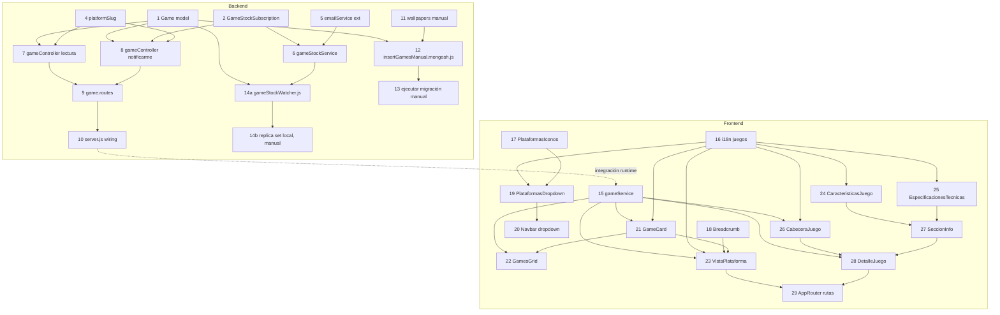

# Implementation Plan: juegos

## Overview

Plan de implementación del catálogo de videojuegos descrito en
`requirements.md` y `design.md`: modelo de datos `Game`/`GameStockSubscription`,
endpoints públicos del catálogo bajo `/api/games` (esta app es solo de
lectura: no hay ninguna vía de inserción/edición/borrado de juegos ni de
mutación de `stock`, ni HTTP ni por script CLI, ni Cloudinary),
`gameStockWatcher.js` (reacciona por MongoDB Change Stream cuando el stock
cambia fuera de la app, para poder seguir enviando el aviso de
disponibilidad), el dropdown de plataformas del Navbar, y las dos vistas
nuevas (Vista de Plataforma y Vista de Detalle del Juego con cabecera
wallpaper + Sección INFO).

Cada tarea de modelo/servicio/controlador/componente incluye sus tests
correspondientes, siguiendo la convención ya existente en el repo
(`GalinGames_nodejs/tests/unit/*`, `*.test.jsx` co-ubicado en frontend). Las
tareas de la sección "Scripts de datos" te guían paso a paso para insertar
tú mismo los 6 juegos (con sus imágenes en base64) directamente en MongoDB
vía `mongosh`/Compass — no son código que corra dentro de la app.

Las tareas se ejecutan de una en una vía `/spec-execute`, en el orden que
respete las dependencias indicadas.

## Tasks

### Backend — Modelos

- [x] 1. Crear `GalinGames_nodejs/src/models/Game.js` (schema completo: `nombre`, `slug` único, `descripcion` required, `imagenPortada`, `imagenWallpaper`, `videoPreviewUrl`, `fechaEstreno`, `plataformaDestacada`, subdocumento `caracteristicas`, array `plataformas[]` con `especificacionesPC`/`especificacionesConsola` opcionales y validación custom de que `PC` solo admite `formatos: ['digital']`, índices `slug` único y `plataformas.plataforma`), + tests en `tests/unit/Game.test.js`
  **Dependencias:** ninguna
  **Requisitos:** 8.4, 11.1, 11.2, 14.1, 14.2, 14.4, 14.6, 16.1, 19.1

- [x] 2. Crear `GalinGames_nodejs/src/models/GameStockSubscription.js` (`userId` ref `User`, `gameId` ref `Game`, `plataforma`, índice único compuesto `{userId,gameId,plataforma}`), + tests en `tests/unit/GameStockSubscription.test.js`
  **Dependencias:** ninguna
  **Requisitos:** 13.1, 13.3, 14.3

### Backend — Servicios

- [ ] ~~3. Generalizar `cloudinaryService.js` con `uploadImage(buffer, folder)`~~ — **eliminada**: los juegos ya no usan Cloudinary (ver `design.md` → Design Decisions, imágenes embebidas en base64 e insertadas a mano). `cloudinaryService.js` queda revertido a su único uso actual, el avatar de usuario, sin ningún cambio de esta feature.
  **Dependencias:** ninguna
  **Requisitos:** — (superada por 18.4, 18.5 en su redacción actual)

- [x] 4. Crear `GalinGames_nodejs/src/utils/platformSlug.js` (`resolvePlatform(slug)` mapeando `pc/playstation/xbox/nintendo` → `PC/PlayStation/Xbox/Nintendo`, `null` si no reconoce el slug), + tests en `tests/unit/platformSlug.test.js`
  **Dependencias:** ninguna
  **Requisitos:** — (soporte interno de 6.3, 15.2, 15.5)

- [x] 5. Añadir `sendStockAvailableEmail` a `GalinGames_nodejs/src/services/emailService.js` (plantilla HTML propia siguiendo el estilo morado "GalinGames" ya usado, enlace a la Vista de Detalle del juego, reutilizando `createEmailService`), + tests en `tests/unit/emailService.test.js`
  **Dependencias:** ninguna
  **Requisitos:** 13.4

- [x] 6. Crear `GalinGames_nodejs/src/services/gameStockService.js` (`notifySubscribers(gameId, plataforma)`: busca `GameStockSubscription` de esa combinación, envía `emailService.sendStockAvailableEmail` a cada suscriptor y borra cada suscripción notificada), + tests en `tests/unit/gameStockService.test.js` con dobles de `emailService`/modelos
  **Dependencias:** Tareas 2, 5
  **Requisitos:** 13.4, 13.5

### Backend — Controlador y rutas

- [x] 7. Crear `GalinGames_nodejs/src/controllers/gameController.js` — `listDestacados`/`listPorPlataforma` con proyección reducida (`.select()` excluyendo `descripcion`/especificaciones/`caracteristicas`) y `getDetalle` con proyección completa (con `estrenado` calculado comparando `fechaEstreno` con `new Date()`), patrón `createGameController({ Game, platformSlug })`, + tests en `tests/unit/gameController.test.js` (incluye test de que el listado NO devuelve `descripcion`)
  **Dependencias:** Tareas 1, 4
  **Requisitos:** 2.1, 2.5, 6.3, 6.4, 7.1, 9.1, 10.1, 10.2, 10.3, 11.3, 11.4, 15.1, 15.2, 15.3, 15.5, 16.2, 19.5

- [x] 8. Añadir a `gameController.js` el handler `suscribirNotificacion` (valida `plataforma` del body contra el juego, exige stock=0 en esa combinación, captura `err.code === 11000` de `GameStockSubscription` y responde `200 { yaSuscrito: true }` en vez de propagar el error), + tests
  **Dependencias:** Tareas 1, 2, 4
  **Requisitos:** 13.1, 13.2, 13.3, 15.4

- [x] 9. Crear `GalinGames_nodejs/src/routes/game.routes.js` (monta `listDestacados`/`listPorPlataforma`/`getDetalle` públicos y `suscribirNotificacion` bajo `requireAuth`), + tests de integración con `supertest`
  **Dependencias:** Tareas 7, 8
  **Requisitos:** 15.1, 15.2, 15.3, 15.4

- [x] 10. Montar `game.routes.js` en `GalinGames_nodejs/server.js` (`app.use('/api/games', gameRoutes)`)
  **Dependencias:** Tarea 9
  **Requisitos:** 15

### Backend — Scripts de datos (inserción manual de los 6 juegos)

- [x] 11. Reunidas las 6 imágenes wallpaper en `C:\Users\carlo\Downloads\Games\Wallpapers\` (`Assassins-wallpaper.jpg`, `Dawnwalker-wallpaper.jpg`, `dragonball-wallpaper.jpg`, `fc27-wallpaper.jpg`, `gta-wallpaper.jpg`, `wolverine-wallpaper.jpg`). Se generaron 6 sentencias `db.games.updateOne({slug}, {$set:{imagenWallpaper: <base64>}})`, una por juego, en ficheros temporales fuera del repo (nunca comiteados, coherente con que esta app no guarda ninguna lógica de inserción/escritura). El usuario las ejecutó en el MongoDB Shell de Compass y verificó con `db.games.find({}, {imagenWallpaper:1})` que ningún juego se quedó en `null`. Los ficheros temporales se han eliminado tras su uso. Los 6 documentos `Game` de la colección `games` quedan así completos: portada, wallpaper y vídeo de preview reales para los 6 juegos.
  **Dependencias:** ninguna
  **Requisitos:** 18.5, 18.7

- [x] 12. Crear `GalinGames_nodejs/scripts/insertGamesManual.mongosh.js`: sentencias `mongosh` (no Node) con los 6 documentos `Game` completos — datos reales fijados en `requirements.md` (fechas de estreno, plataformas, formatos, precios, stock inicial, especificaciones técnicas de PC, características, y una `descripcion`/sinopsis propia de cada juego, nunca en un componente o fichero de i18n) y `imagenPortada` embebida como Data URI base64 leída de `C:\Users\carlo\Downloads\Games\*.jpg`. Cada juego se escribió como un `db.games.updateOne({slug}, {$set: documento}, {upsert:true})` independiente. Eliminó además `assassins.jpg`, `blooddownwalker.jpg`, `dragonball.jpg`, `fc27.jpg`, `gta.jpg` y `wolverine.jpg` de `GalinGames_react/public/` (Requisito 18.10): el frontend ya no sirve estas imágenes desde ahí. **`videoPreviewUrl`** se insertó inicialmente a `null` y se completó después con las 6 URLs reales de `gaming-cdn.com` que diste, vía 6 sentencias `db.games.updateOne({slug}, {$set:{videoPreviewUrl}})` sueltas ejecutadas también en el MongoDB Shell de Compass (Requisito 18.6) — confirmado con `db.games.find({}, {nombre:1, videoPreviewUrl:1})` sin ningún `null`.
  **Dependencias:** Tarea 1
  **Requisitos:** 18.1, 18.2, 18.3, 18.4, 18.6, 18.8, 18.9, 18.10, 19.1, 19.4

- [x] 13. Ejecutado por el usuario en el "MongoDB Shell" de Compass: los 6 documentos de la colección `games` existen con sus datos e imágenes. **El fichero `insertGamesManual.mongosh.js` se ha eliminado del repositorio tras su ejecución** — ya cumplió su función (migración puntual, no forma parte de la app en marcha) y MongoDB es ahora la única fuente de la verdad para el catálogo. Si en el futuro hace falta corregir o añadir un juego a mano, se escribe una sentencia `db.games.updateOne(...)` nueva directamente en mongosh/Compass; no hace falta recrear este script.
  **Dependencias:** Tarea 12
  **Requisitos:** 18 (verificación)

- [x] ~~14. Crear `GalinGames_nodejs/scripts/setGameStock.js` (CLI para mutar stock)~~ — **eliminada**: esta app no tiene ninguna vía para mutar `stock` (ver `requirements.md` → Introduction/Requisito 13.6). Sustituida por la Tarea 14a.
  **Dependencias:** —
  **Requisitos:** — (superada por 13.6, 14.5 en su redacción actual)

- [x] 14a. Crear `GalinGames_nodejs/src/services/gameStockWatcher.js` (`start()`: abre `Game.watch([...], { fullDocument: 'updateLookup' })`; en cada evento `change`, recorre `plataformas` del documento actualizado y llama a `gameStockService.notifySubscribers(gameId, plataforma)` para cada combinación con `stock > 0` — no compara "antes" con "después", `notifySubscribers` ya es un no-op sin suscripciones pendientes; `stop()`: cierra el change stream), + tests en `tests/unit/gameStockWatcher.test.js`. Se invoca desde `server.js` al arrancar, dentro de un `try/catch` no fatal (si MongoDB no es replica set, el catálogo de lectura sigue funcionando).
  **Dependencias:** Tareas 1, 6
  **Requisitos:** 13.6, 14.5

- [x] 14b. Convertido el MongoDB local a replica set de 1 nodo (`replSetName: rs0` en `mongod.cfg`, servicio reiniciado, `rs.initiate()` ejecutado — confirmado primario elegido con `db.hello().isWritablePrimary`), y `MONGODB_URI` actualizada en `.env` con `?replicaSet=rs0`. Verificado arrancando `server.js`: conecta a Mongo y no registra el aviso de "no se pudo iniciar gameStockWatcher" — el Change Stream se abre correctamente.
  **Dependencias:** Tarea 14a
  **Requisitos:** 14.5

### Frontend — Infraestructura

- [ ] 15. Crear `GalinGames_react/src/servicios/gameService.js` (`getJuegosDestacados`, `getJuegosPorPlataforma`, `getJuegoPorId`, `suscribirNotificacion`, sobre `httpClient.js`), + tests
  **Dependencias:** ninguna
  **Requisitos:** — (soporte interno de 2, 6, 7, 13)

- [ ] 16. Añadir el namespace `juegos` a `GalinGames_react/src/i18n/locales/es.json` y `en.json` (dropdown de plataformas, títulos/subtítulos de la Vista de Plataforma, breadcrumb, cabecera, Sección INFO, características, chip de stock, botones Comprar/Reservar/Avisarme, mensajes de estado vacío/error/no encontrado)
  **Dependencias:** ninguna
  **Requisitos:** 17.1, 17.2, 17.3

- [ ] 17. Crear `GalinGames_react/src/Componentes/compGlobales/NavbarComponente/PlataformasIconos.jsx` (SVG inline de PC, PlayStation, Xbox, Nintendo, mismo patrón que `NavbarIconos.jsx`)
  **Dependencias:** ninguna
  **Requisitos:** 1.5

- [ ] 18. Crear `GalinGames_react/src/Componentes/compGlobales/BreadcrumbComponente/Breadcrumb.jsx` (genérico, recibe una lista de `{ label, to? }`), + tests
  **Dependencias:** ninguna
  **Requisitos:** 6.2

### Frontend — Navbar

- [ ] 19. Crear `GalinGames_react/src/Componentes/compGlobales/NavbarComponente/PlataformasDropdown.jsx` (mismo esqueleto que `LanguageToggle.jsx`: `aria-haspopup`, `aria-expanded`, `role="menu"`, cierre por click-fuera/Escape, 4 `<Link role="menuitem">` a `/juegos/pc|playstation|xbox|nintendo` con icono de `PlataformasIconos.jsx`), + tests
  **Dependencias:** Tareas 16, 17
  **Requisitos:** 1.2, 1.3, 1.4

- [ ] 20. Modificar `GalinGames_react/src/Componentes/compGlobales/NavbarComponente/Navbar.jsx`: quitar `'navbar.linkJuegos'` de `ENLACES_PROXIMAMENTE` y montar `PlataformasDropdown` en su lugar, + tests
  **Dependencias:** Tarea 19
  **Requisitos:** 1.1

### Frontend — Home

- [ ] 21. Modificar `GalinGames_react/src/Componentes/zonaHome/GameCardComponente/GameCard.jsx`: props nuevas (`id`, `nombre`, `plataforma`, `precio`, `videoPreviewUrl`), estado `hover` con guardia `matchMedia('(hover: hover) and (pointer: fine)')`, texto `"${nombre}" - ${plataforma}   ${precioFormateado}` (`Intl.NumberFormat`), envoltura `<Link to="/juegos/detalle/:id?plataforma=...">`, + tests
  **Dependencias:** Tareas 15, 16
  **Requisitos:** 3.1, 3.2, 3.3, 3.4, 4.1, 4.2, 4.3, 4.4, 4.5, 5.1, 5.2

- [ ] 22. Modificar `GalinGames_react/src/Componentes/zonaHome/GamesGridComponente/GamesGrid.jsx`: sustituir el array estático `JUEGOS` por `gameService.getJuegosDestacados()` en `useEffect`, con estados `loading`/`error`, + tests
  **Dependencias:** Tareas 15, 21
  **Requisitos:** 2.1, 2.2, 2.3, 2.4

### Frontend — Vista de Plataforma

- [ ] 23. Crear `GalinGames_react/src/Componentes/zonaJuegos/VistaPlataformaComponente/VistaPlataforma.jsx` (lee `useParams().plataforma`, pide `gameService.getJuegosPorPlataforma`, título + subtítulo, `Breadcrumb`, reutiliza `GameCard` en grid, estado vacío/error), + tests
  **Dependencias:** Tareas 15, 16, 18, 21
  **Requisitos:** 6.1, 6.2, 6.3, 6.4, 6.5

### Frontend — Vista de Detalle del Juego

- [ ] 24. Crear `GalinGames_react/src/Componentes/zonaJuegos/DetalleJuegoComponente/components/CaracteristicasJuego/CaracteristicasJuego.jsx` (divs de jugadores/online/crossplay/HDR/mandos compatibles, oculta cada div si el dato no está definido), + tests
  **Dependencias:** Tarea 16
  **Requisitos:** 8.1, 8.2, 8.3

- [ ] 25. Crear `GalinGames_react/src/Componentes/zonaJuegos/DetalleJuegoComponente/components/EspecificacionesTecnicas/EspecificacionesTecnicas.jsx` (bloques mínimas/recomendadas si `plataforma === 'PC'`, disco+notas en el resto, oculta el bloque si no hay datos para esa combinación), + tests
  **Dependencias:** Tarea 16
  **Requisitos:** 10.1, 10.2, 10.3

- [ ] 26. Crear `GalinGames_react/src/Componentes/zonaJuegos/DetalleJuegoComponente/components/CabeceraJuego/CabeceraJuego.jsx` (wallpaper de ancho completo con fondo de respaldo si falta, altura estable, imagen wallpaper recortada tipo banner ancho/poco alto vía `background-size: cover` + `background-position: center` — las imágenes reales no vienen pre-recortadas a ese formato, Requisito 7.6 —, div portada a la izquierda, div derecho con select de plataforma, chip de stock, precio y control Comprar/Reservar/Avisarme según `estrenado`+`stock`, nunca "Comprar" si no está estrenado, llamada a `gameService.suscribirNotificacion` con redirect a login si no autenticado), + tests
  **Dependencias:** Tareas 15, 16
  **Requisitos:** 7.1, 7.2, 7.4, 7.5, 7.6, 9.1, 9.2, 11.3, 11.4, 12.1, 12.2, 12.3, 12.4, 12.5, 13.1, 13.2, 13.3, 16.3

- [ ] 27. Crear `GalinGames_react/src/Componentes/zonaJuegos/DetalleJuegoComponente/components/SeccionInfo/SeccionInfo.jsx` (contenedor bajo la cabecera, sobre fondo normal: pinta el texto de `juego.descripcion` recibido del backend tal cual, sin ningún texto de juego hardcodeado en el componente, y agrupa `EspecificacionesTecnicas` + `CaracteristicasJuego`), + tests
  **Dependencias:** Tareas 24, 25
  **Requisitos:** 7.3, 19.2, 19.3

- [ ] 28. Crear `GalinGames_react/src/Componentes/zonaJuegos/DetalleJuegoComponente/DetalleJuego.jsx` (lee `useParams().id` + `useSearchParams().get('plataforma')`, pide `gameService.getJuegoPorId` una vez, estado `plataformaSeleccionada` que cambia sin refetch, estado "juego no encontrado" traducible, renderiza `CabeceraJuego` + `SeccionInfo`), + tests
  **Dependencias:** Tareas 15, 26, 27
  **Requisitos:** 5.3, 9.3

### Frontend — Routing

- [ ] 29. Modificar `GalinGames_react/src/router/AppRouter.jsx`: añadir `<Route path="/juegos/:plataforma" element={<VistaPlataforma />} />` y `<Route path="/juegos/detalle/:id" element={<DetalleJuego />} />` (rutas públicas), + tests
  **Dependencias:** Tareas 23, 28
  **Requisitos:** 1.4, 6.1, 7.1

## Task Dependency Graph

## Orden de ejecución sugerido (waves)

1. **Backend modelos**: 1, 2
2. **Backend servicios**: 4, 5, 6
3. **Backend controlador y rutas**: 7, 8, 9
4. **Backend wiring**: 10
5. **Backend scripts de datos / watcher reactivo**: 11, 12, 13, 14a, 14b
6. **Frontend infraestructura**: 15, 16, 17, 18
7. **Frontend Navbar**: 19, 20
8. **Frontend Home**: 21, 22
9. **Frontend Vista de Plataforma**: 23
10. **Frontend Vista de Detalle**: 24, 25, 26, 27, 28
11. **Frontend routing**: 29

## Cobertura

| Requisito | Cubierto por |
|---|---|
| 1. Dropdown de plataformas en el Navbar | 17, 19, 20 |
| 2. Grid del Home alimentado por backend | 7, 21, 22 |
| 3. Contenido y formato de la tarjeta | 21 |
| 4. Vídeo de preview en hover | 21 |
| 5. Navegación tarjeta → detalle | 21, 28 |
| 6. Vista de Plataforma | 18, 23, 29 |
| 7. Cabecera (wallpaper) de la Vista de Detalle | 7, 26, 27, 29 |
| 8. Características del juego | 24 |
| 9. Select de plataforma en Vista de Detalle | 7, 26, 28 |
| 10. Especificaciones técnicas por plataforma | 7, 25 |
| 11. Formato físico/digital según plataforma | 1, 7, 26 |
| 12. Chip de stock y control de acción condicional | 26 |
| 13. Suscripción a aviso de stock | 2, 5, 6, 8, 14a, 14b, 26, 27 |
| 14. Modelo de datos del juego | 1, 2, 7, 14b |
| 15. Endpoints públicos del catálogo | 7, 8, 9, 10 |
| 16. Reglas de fecha de estreno | 1, 7, 26 |
| 17. Internacionalización | 16 |
| 18. Datos reales de los 6 juegos, insertados manualmente | 11, 12, 13 |
| 19. Todo el contenido del juego proviene de MongoDB | 1, 7, 12, 27 |

Los 19 requisitos de `requirements.md` y todos los componentes de
`design.md` (modelos, servicios, controlador, rutas, scripts de datos,
componentes React, i18n, wiring de `server.js`) quedan cubiertos por al
menos una tarea.
