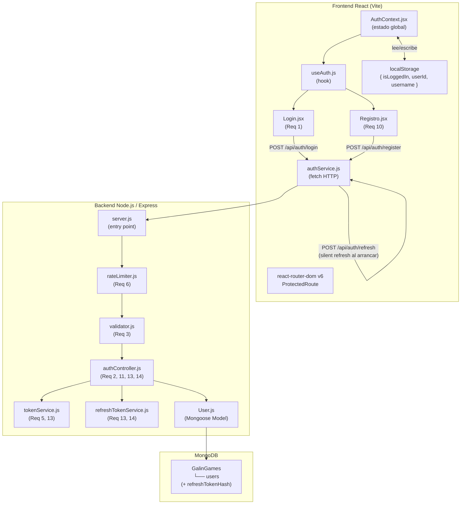
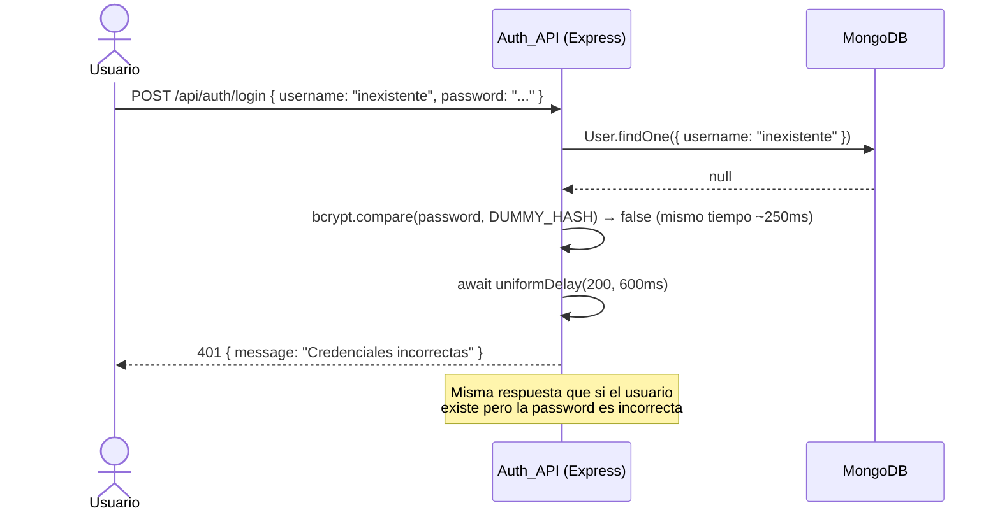
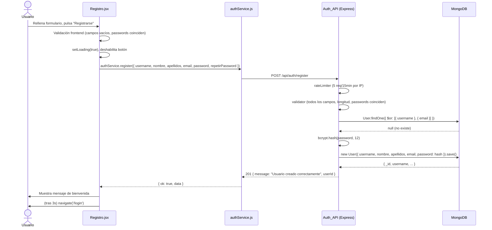
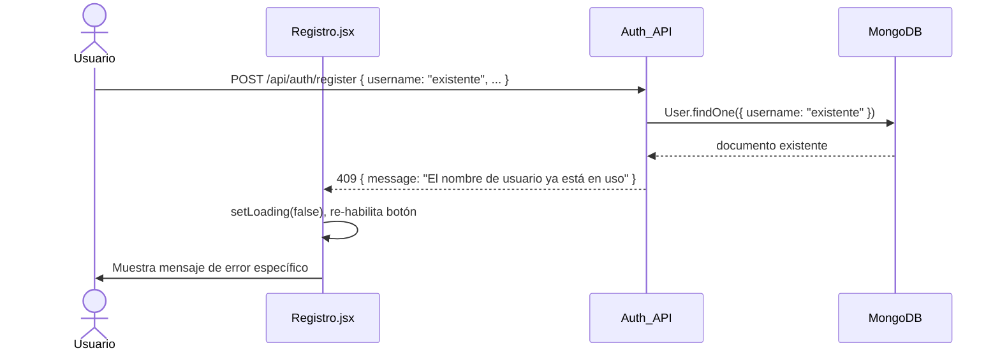
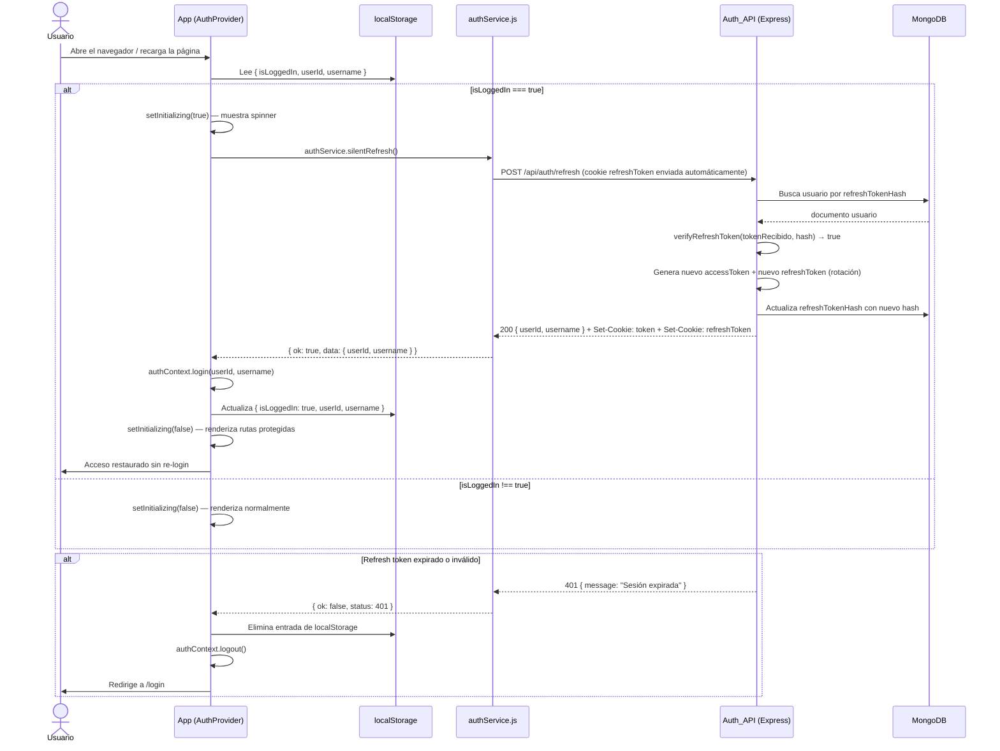

# Design Document

## Overview

Este documento describe el diseño técnico del sistema de autenticación de la tienda de videojuegos GalinGames. El sistema cubre el ciclo completo de alta e inicio de sesión: el formulario de registro (`Registro.jsx`) y el nuevo formulario de login (`Login.jsx`) en el frontend React, conectados a una API REST Express en el backend Node.js, con persistencia en MongoDB (base de datos `GalinGames`, colección `users`).

El diseño sigue el principio de **defensa en profundidad**: validación en el frontend antes de enviar, validación estricta en el backend antes de procesar, hashing de contraseñas con bcrypt (cost 12), tokens JWT con expiración en httpOnly cookies, y protección anti-fuerza bruta con rate limiting por IP y por username.

El sistema implementa un esquema de doble token: un **access token** JWT de corta duración (15 min) en httpOnly cookie para autenticar peticiones, y un **refresh token** opaco de larga duración (7 días) en httpOnly cookie de ruta restringida (`/api/auth/refresh`) para renovar la sesión silenciosamente. La persistencia de sesión entre recargas se gestiona mediante un objeto no sensible `{ isLoggedIn, userId, username }` en localStorage que desencadena un silent refresh automático al arrancar la app.

---

## Architecture



---

## Components and Interfaces

### Backend — `GalinGames_nodejs/`

```
GalinGames_nodejs/
├── src/
│   ├── config/
│   │   ├── db.js              # Conexión Mongoose + validación de MONGODB_URI
│   │   └── env.js             # Validación de variables de entorno al arranque
│   ├── controllers/
│   │   └── authController.js  # Lógica de login y registro
│   ├── middleware/
│   │   ├── authMiddleware.js  # Verificación JWT para rutas protegidas
│   │   ├── rateLimiter.js     # Rate limiting por IP (express-rate-limit)
│   │   ├── validator.js       # Validación y sanitización de entradas
│   │   └── globalErrorHandler.js  # Middleware global de errores — último app.use
│   ├── models/
│   │   └── User.js            # UserSchema Mongoose
│   ├── routes/
│   │   └── auth.routes.js     # Rutas: /login, /register, /logout
│   ├── services/
│   │   ├── tokenService.js         # Generación y verificación de access tokens JWT
│   │   └── refreshTokenService.js  # Generación, hash y rotación de refresh tokens
│   └── utils/
│       └── nullGuard.js       # Defensive guards: requireField, isEmpty, sanitizeResponse
├── .env.example
├── .gitignore
├── package.json
└── server.js                  # Entry point: inicializa Express, conecta BD
```

### Frontend — `GalinGames_react/src/` (modificaciones)

```
src/
├── Componentes/
│   ├── compGlobales/
│   │   ├── InputBoxComponente/
│   │   │   ├── InputBox.jsx   # Sin cambios
│   │   │   └── InputBox.css
│   │   └── ErrorPageComponente/
│   │       ├── ErrorPage.jsx  # NUEVO — página de error global reutilizable
│   │       └── ErrorPage.css  # NUEVO — estilos gaming para página de error
│   └── zonaCliente/
│       ├── LoginComponente/
│       │   ├── Login.jsx      # NUEVO — formulario de login
│       │   └── Login.css      # NUEVO — estilos (reutiliza clases gaming)
│       └── RegistroComponente/
│           ├── Registro.jsx   # MODIFICAR — conectar a authService
│           └── Registro.css
├── globalState/
│   └── authContext.jsx        # NUEVO — React Context de sesión
├── hooks/
│   └── useAuth.js             # NUEVO — hook para consumir AuthContext
├── servicios/
│   └── authService.js         # NUEVO — cliente HTTP (fetch + AbortController)
├── router/
│   └── AppRouter.jsx          # NUEVO — rutas con react-router-dom v6
└── main.jsx                   # MODIFICAR — añadir BrowserRouter + AuthProvider
```

> **localStorage** almacena exclusivamente `{ isLoggedIn: true, userId, username }`. Ningún token ni hash se escribe en localStorage.

---

## Component Details

### authService.js

Módulo de comunicación con la API. Abstrae todos los `fetch` con timeout de 10 segundos via `AbortController`.

```javascript
// Firma de funciones
async function login(username, password)
// → { ok: true, data: { userId, username } }
// → { ok: false, status: 401|400|429|503, message, retryAfter? }

async function register(datos)
// datos: { username, nombre, apellidos, email, password, repetirPassword }
// → { ok: true, data: { message, userId } }
// → { ok: false, status: 400|409|429|503, message, errors? }

async function logout()
// → { ok: true }
// → { ok: false, message }
```

**Implementación de login con timeout:**

```javascript
async function login(username, password) {
  const controller = new AbortController();
  const timeoutId = setTimeout(() => controller.abort(), 10_000);
  try {
    const res = await fetch('/api/auth/login', {
      method: 'POST',
      headers: { 'Content-Type': 'application/json' },
      credentials: 'include',          // envía/recibe cookies httpOnly
      body: JSON.stringify({ username: username.trim(), password }),
      signal: controller.signal,
    });
    clearTimeout(timeoutId);
    const data = await res.json();
    if (!res.ok) {
      return {
        ok: false,
        status: res.status,
        message: data.message,
        retryAfter: res.headers.get('Retry-After'),
        errors: data.errors,
      };
    }
    return { ok: true, data };
  } catch (err) {
    clearTimeout(timeoutId);
    if (err.name === 'AbortError') {
      return { ok: false, status: 0, message: 'La petición tardó demasiado. Inténtalo de nuevo.' };
    }
    return { ok: false, status: 0, message: 'Error de red. Comprueba tu conexión.' };
  }
}
```

### authContext.jsx

Proveedor de contexto de autenticación. El JWT vive en la httpOnly cookie (inaccesible desde JS). El contexto almacena solo los datos no sensibles retornados en el body de la respuesta 200.

```javascript
// Shape del contexto
const AuthContext = React.createContext({
  user: null,           // { userId, username } o null
  isAuthenticated: false,
  login(userId, username) {},   // almacena en estado
  logout() {},                  // limpia estado + llama /api/auth/logout
});
```

### useAuth.js

```javascript
import { useContext } from 'react';
import { AuthContext } from '../globalState/authContext';

export function useAuth() {
  const ctx = useContext(AuthContext);
  if (!ctx) throw new Error('useAuth debe usarse dentro de AuthProvider');
  return ctx;
}
```

### AppRouter.jsx — Rutas

```jsx
// Rutas con react-router-dom v6
<BrowserRouter>
  <Routes>
    <Route path="/login"    element={<Login />} />
    <Route path="/registro" element={<Registro />} />
    <Route path="/"         element={
      <ProtectedRoute>
        <Tienda />
      </ProtectedRoute>
    } />
    {/* Rutas de error accesibles directamente */}
    <Route path="/error/:code" element={<ErrorPage />} />
    {/* Catch-all: cualquier ruta no definida → ErrorPage 404 */}
    <Route path="*" element={<ErrorPage code={404} />} />
  </Routes>
</BrowserRouter>
```

**ProtectedRoute:** Si `isAuthenticated` es false, redirige a `/login` via `<Navigate to="/login" replace />`.

### Login.jsx — Interfaz del formulario

```jsx
// Estado local del componente
const [campos, setCampos] = useState({ username: '', password: '' });
const [error, setError]   = useState('');
const [loading, setLoading] = useState(false);
const [retryCountdown, setRetryCountdown] = useState(0);

// Props recibidas: ninguna (usa useAuth y useNavigate internamente)
// Reutiliza: InputBox (nameInput, labelInput, typeInput, placeholderInput, eventoOnChange)
// Clases CSS: fondo-gaming, contenido-registro, marginForm, videojuego-title,
//             videojuego-text, botonRegistro
```

### tokenService.js (Backend)

```javascript
// Firma de funciones
function generateToken(userId, username)
// → string (JWT firmado HS256)
// Lanza Error si JWT_SECRET < 32 chars

function verifyToken(token)
// → { userId, username, iat, exp }
// Lanza JsonWebTokenError | TokenExpiredError
```

### validator.js (Backend)

```javascript
// Middleware de validación para login
function validateLoginInput(req, res, next)
// Verifica: username (trim, no vacío, ≤50), password (no vacío, ≤128)
// Sin campos extra
// Sin caracteres de control (ASCII < 32)
// En error → res.status(400).json({ errors: [...] }) sin incluir el valor

// Middleware de validación para registro
function validateRegisterInput(req, res, next)
// Verifica: username, nombre, apellidos, email, password, repetirPassword
// password: 8-72 chars, password === repetirPassword
// En error → res.status(400).json({ errors: [...] })
```

---

### ErrorPage.jsx (Frontend)

Componente reutilizable que muestra una página de error con estilo gaming. Recibe el código de error como prop o lo lee de los parámetros de la ruta.

```jsx
// Props aceptadas
// code: number (400 | 401 | 403 | 404 | 429 | 500 | 503)
// message?: string (opcional, sobreescribe el mensaje por defecto)
// retryAfter?: number (segundos, solo para 429 — activa cuenta atrás)

// Mapeo de códigos a títulos y mensajes por defecto
const ERROR_CONFIG = {
  400: { title: 'Petición incorrecta',       message: 'Los datos enviados no son válidos. Revisa el formulario.' },
  401: { title: 'No autorizado',             message: 'Debes iniciar sesión para acceder a este contenido.' },
  403: { title: 'Acceso denegado',           message: 'No tienes permiso para ver esta página.' },
  404: { title: 'Página no encontrada',      message: 'La página que buscas no existe o ha sido movida.' },
  429: { title: 'Demasiadas peticiones',     message: 'Has superado el límite de intentos. Espera un momento.' },
  500: { title: 'Error del servidor',        message: 'Algo ha salido mal en nuestro servidor. Inténtalo más tarde.' },
  503: { title: 'Servicio no disponible',    message: 'El servicio está temporalmente fuera de línea. Vuelve pronto.' },
};

// Estado local
const [countdown, setCountdown] = useState(retryAfter ?? 0); // solo para 429

// Clases CSS reutilizadas: fondo-gaming, videojuego-title, videojuego-text
// Incluye: código grande visible, título, mensaje, botón de volver
```

### globalErrorHandler.js (Backend — middleware Express)

Middleware global de errores registrado como último `app.use` en `server.js`. Captura cualquier error no manejado en rutas anteriores.

```javascript
// Firma del middleware Express de errores (4 parámetros obligatorios)
function globalErrorHandler(err, req, res, next)

// Comportamiento:
// 1. Registra el error completo en consola (stack trace, timestamp, método, ruta)
// 2. Determina el código HTTP:
//    - Si err.status o err.statusCode está definido → usa ese valor
//    - Si es error de Mongoose (ValidationError, CastError) → 400
//    - Si es error de JWT (JsonWebTokenError, TokenExpiredError) → 401
//    - En cualquier otro caso → 500
// 3. Responde con: { "code": <número>, "message": <cadena genérica sin detalles internos> }
// 4. Nunca incluye err.message en producción (solo en desarrollo si NODE_ENV === 'development')
```

### nullGuard.js (Backend — utilidad)

Módulo de utilidades para defensive guards. Evita pasar `undefined`/`null` a funciones sensibles.

```javascript
// Lanza un AppError (con status 400) si el valor es undefined, null o string vacío
function requireField(value, fieldName)
// Uso: requireField(req.body.username, 'username')

// Devuelve true si el valor es null, undefined o string vacío tras trim
function isEmpty(value)
// → boolean

// Sanitiza un objeto eliminando claves con valor undefined antes de JSON.stringify
function sanitizeResponse(obj)
// → objeto limpio sin claves undefined
```

---

### refreshTokenService.js (Backend)

```javascript
// Genera un refresh token opaco aleatorio y devuelve { token, hash }
// token: string base64url de 64 bytes (enviado al cliente en cookie)
// hash: SHA-256 del token (almacenado en MongoDB)
function generateRefreshToken()
// → { token: string, hash: string }

// Verifica que el token recibido coincide con el hash almacenado
// Devuelve true si coinciden, false si no
function verifyRefreshToken(tokenRecibido, hashAlmacenado)
// → boolean

// Firma: async, sin efecto secundario — la persistencia la hace el controller
```

### authService.js — función silentRefresh (Frontend)

```javascript
// Llama a POST /api/auth/refresh usando la cookie httpOnly automáticamente
// Se invoca al arrancar AuthProvider si localStorage.isLoggedIn === true
async function silentRefresh()
// → { ok: true, data: { userId, username } }
// → { ok: false, status: 401 }   ← sesión expirada, redirigir a /login
// → { ok: false, status: 0 }     ← error de red
```

---

## Data Models

### UserSchema (Mongoose)

```javascript
// src/models/User.js
const UserSchema = new mongoose.Schema({
  username: {
    type: String,
    required: [true, 'El nombre de usuario es obligatorio'],
    unique: true,
    trim: true,
    minlength: [3, 'El username debe tener al menos 3 caracteres'],
    maxlength: [50, 'El username no puede superar los 50 caracteres'],
  },
  nombre: {
    type: String,
    required: [true, 'El nombre es obligatorio'],
    trim: true,
    maxlength: [100, 'El nombre no puede superar los 100 caracteres'],
  },
  apellidos: {
    type: String,
    required: [true, 'Los apellidos son obligatorios'],
    trim: true,
    maxlength: [150, 'Los apellidos no pueden superar los 150 caracteres'],
  },
  email: {
    type: String,
    required: [true, 'El email es obligatorio'],
    unique: true,
    lowercase: true,
    trim: true,
    match: [/^\S+@\S+\.\S+$/, 'Formato de email inválido'],
  },
  password: {
    type: String,
    required: [true, 'La contraseña es obligatoria'],
    minlength: [60, 'Longitud mínima para hashes bcrypt'],
    select: false,        // nunca se devuelve en consultas por defecto
  },
  fechaRegistro: {
    type: Date,
    default: Date.now,
    immutable: true,
  },
  refreshTokenHash: {
    type: String,
    default: null,
    select: false,   // nunca se devuelve en consultas por defecto
  },
});

// Índices explícitos (además de unique: true)
UserSchema.index({ username: 1 }, { unique: true });
UserSchema.index({ email: 1 },    { unique: true });
```

**Nota:** `select: false` en el campo `password` garantiza que Mongoose nunca lo incluya en consultas `.find()` ni `.findOne()` a menos que se solicite explícitamente con `.select('+password')` — lo cual solo ocurre durante el flujo de login para la comparación bcrypt.

---

## API Design

### POST /api/auth/login

**Request:**
```json
{
  "username": "string (3-50 chars, sin espacios extremos)",
  "password": "string (1-128 chars)"
}
```

**Respuestas:**

| Código | Condición | Body |
|--------|-----------|------|
| 200 | Credenciales válidas | `{ "message": "Login exitoso", "userId": "...", "username": "..." }` + cookie `token` (access, 15min) + cookie `refreshToken` (7 días, Path=/api/auth/refresh) |
| 400 | Campos ausentes/inválidos/extra | `{ "errors": [{ "field": "username", "rule": "required" }, ...] }` |
| 401 | Credenciales incorrectas | `{ "message": "Credenciales incorrectas" }` (tiempo 200-600ms) |
| 429 | Rate limit superado | `{ "message": "Demasiados intentos", "retryAfter": 300 }` + cabeceras `Retry-After`, `X-RateLimit-Remaining` |
| 500 | Error interno | `{ "message": "Error interno del servidor" }` |

**Cookie de sesión (en respuesta 200):**
```
Set-Cookie: token=<JWT>; HttpOnly; SameSite=Strict; Secure; Path=/; Max-Age=86400
```
En desarrollo: sin atributo `Secure`.

---

### POST /api/auth/register

**Request:**
```json
{
  "username": "string (3-50 chars)",
  "nombre": "string (1-100 chars)",
  "apellidos": "string (1-150 chars)",
  "email": "string (formato email válido)",
  "password": "string (8-72 chars)",
  "repetirPassword": "string (debe coincidir con password)"
}
```

**Respuestas:**

| Código | Condición | Body |
|--------|-----------|------|
| 201 | Registro exitoso | `{ "message": "Usuario creado correctamente", "userId": "<id_MongoDB>" }` |
| 400 | Validación fallida | `{ "errors": [{ "field": "password", "rule": "minlength", "message": "..." }] }` |
| 409 | username o email duplicado | `{ "message": "El nombre de usuario ya está en uso" }` o `{ "message": "El email ya está en uso" }` |
| 429 | Rate limit (5 req/15min) | `{ "message": "Demasiados intentos de registro", "retryAfter": 900 }` |
| 503 | MongoDB no disponible | `{ "message": "Servicio temporalmente no disponible" }` |

---

### POST /api/auth/logout

**Request:** Sin body (la cookie se envía automáticamente por el navegador).

**Respuesta:**
```json
{ "message": "Sesión cerrada correctamente" }
```
Elimina la cookie del JWT estableciendo `Max-Age=0`.

Además de eliminar la cookie `token`, elimina la cookie `refreshToken` estableciendo `Max-Age=0` y actualiza el campo `refreshTokenHash` del usuario a `null` en MongoDB.

---

### POST /api/auth/refresh

**Request:** Sin body. El refresh token se lee automáticamente desde la cookie `refreshToken` (httpOnly, Path=/api/auth/refresh).

**Respuestas:**

| Código | Condición | Body |
|--------|-----------|------|
| 200 | Refresh token válido | `{ "userId": "...", "username": "..." }` + nueva cookie `token` (15min) + nueva cookie `refreshToken` rotada (7 días) |
| 401 | Cookie ausente, token expirado o hash no coincide | `{ "message": "Sesión expirada. Inicia sesión de nuevo." }` + elimina cookie `refreshToken` |
| 429 | Rate limit (20 req/15min por IP) | `{ "message": "Demasiadas peticiones", "retryAfter": N }` |

**Seguridad:**
- El refresh token tiene `Path=/api/auth/refresh` — el navegador solo lo envía a ese endpoint exacto, nunca a `/api/auth/login` ni a ningún otro.
- Si el hash recibido no coincide con el almacenado en MongoDB (posible token robado y reutilizado), el servidor limpia el `refreshTokenHash` del usuario, forzando re-login completo.

---

## Authentication Flows

### Flujo de Login Exitoso

```mermaid
sequenceDiagram
    actor U as Usuario
    participant F as Login.jsx
    participant S as authService.js
    participant BE as Auth_API (Express)
    participant DB as MongoDB

    U->>F: Introduce username + password, pulsa "Entrar"
    F->>F: trim(username), validación campos no vacíos
    F->>F: setLoading(true), deshabilita botón
    F->>S: authService.login(username, password)
    S->>BE: POST /api/auth/login { username, password }
    BE->>BE: rateLimiter (IP check)
    BE->>BE: validator (campos, longitud, sin chars control)
    BE->>DB: User.findOne({ username }).select('+password')
    DB-->>BE: documento usuario
    BE->>BE: bcrypt.compare(password, hash) → true
    BE->>BE: tokenService.generateToken(userId, username)
    BE-->>S: 200 + Set-Cookie: token=JWT; HttpOnly
    S-->>F: { ok: true, data: { userId, username } }
    F->>F: authContext.login(userId, username)
    F->>F: setLoading(false)
    F->>U: navigate('/') — redirige a tienda
```

### Flujo de Login Fallido (Timing Attack Prevention)



### Flujo de Registro Exitoso



### Flujo de Registro con Datos Duplicados



---

### Flujo de Persistencia de Sesión (Silent Refresh al arrancar)



---

## Security

### Middleware de Validación de Entradas

El `validator.js` aplica las siguientes reglas en orden antes de ejecutar cualquier lógica de negocio:

1. **Whitelist de campos:** Solo se aceptan `username` y `password` para login, y `username`, `nombre`, `apellidos`, `email`, `password`, `repetirPassword` para registro. Campos extra → HTTP 400.
2. **Presencia y vaciado:** Cada campo requerido debe estar presente, no ser null y no ser una cadena de solo espacios (`trim() !== ''`).
3. **Longitud máxima:** Se aplica antes del trim para evitar DoS con strings muy largos.
4. **Caracteres de control:** Rechaza cualquier valor que contenga caracteres con código ASCII < 32.
5. **Sin eco del valor en errores:** Los mensajes de error describen la regla violada y el campo, nunca el valor recibido.

### Rate Limiting

```javascript
// rateLimiter.js — configuración con express-rate-limit

// Para POST /api/auth/login
const loginLimiter = rateLimit({
  windowMs: 15 * 60 * 1000,   // 15 minutos
  max: 10,                     // 10 peticiones por IP
  standardHeaders: true,       // Envía Retry-After y X-RateLimit-Remaining
  legacyHeaders: false,
  handler: (req, res) => {
    res.status(429).json({
      message: 'Demasiados intentos de login. Espera antes de volver a intentarlo.',
      retryAfter: Math.ceil(req.rateLimit.resetTime / 1000 - Date.now() / 1000),
    });
  },
  keyGenerator: (req) => {
    // En producción: usa X-Forwarded-For (primera entrada)
    // En desarrollo: usa req.ip
    if (process.env.NODE_ENV === 'production') {
      const forwarded = req.headers['x-forwarded-for'];
      if (!forwarded) return null; // → 503
      return forwarded.split(',')[0].trim();
    }
    return req.ip;
  },
});

// Para POST /api/auth/register
const registerLimiter = rateLimit({
  windowMs: 15 * 60 * 1000,   // 15 minutos
  max: 5,                      // 5 peticiones por IP
  // ... misma configuración
});
```

**Bloqueo por username** (5 intentos / 60s → bloqueo 300s):

Se implementa con un `Map` en memoria (o Redis en producción) que registra intentos fallidos por username. La comprobación se realiza en `authController.js` antes de la comparación bcrypt.

```javascript
// En authController.js
const failedAttempts = new Map(); // username → { count, firstAttempt, blockedUntil }

function isUsernameBlocked(username) {
  const record = failedAttempts.get(username);
  if (!record) return false;
  if (record.blockedUntil && Date.now() < record.blockedUntil) return true;
  // Ventana de 60s expirada → resetear
  if (Date.now() - record.firstAttempt > 60_000) {
    failedAttempts.delete(username);
    return false;
  }
  return false;
}
```

### Configuración JWT

```
Algoritmo: HS256
Payload: { userId, username, iat }
Expiración: configurable vía JWT_EXPIRES_IN (máx. 24h, defecto: 3600s)
Secreto: JWT_SECRET (obligatorio, mínimo 32 caracteres)
```

**Rechazo de JWT_SECRET inseguro:**
```javascript
// src/config/env.js
if (!process.env.JWT_SECRET || process.env.JWT_SECRET.length < 32) {
  console.error('[FATAL] JWT_SECRET es obligatorio y debe tener al menos 32 caracteres');
  process.exit(1);
}
```

### Configuración bcrypt

```javascript
const BCRYPT_COST = 12; // Factor de coste: entre 12 y 14

// Hash en registro
const passwordHash = await bcrypt.hash(password, BCRYPT_COST);

// Comparación en login — SIEMPRE con bcrypt.compare, nunca con ===
const isValid = await bcrypt.compare(passwordPlano, passwordHash);
```

### CORS

```javascript
// server.js
const allowedOrigins = process.env.ALLOWED_ORIGINS
  ? process.env.ALLOWED_ORIGINS.split(',').map(o => o.trim())
  : [];

app.use(cors({
  origin: (origin, callback) => {
    if (!origin || allowedOrigins.includes(origin)) {
      callback(null, true);
    } else {
      callback(new Error('Origen no autorizado'), false);
    }
  },
  credentials: true,     // necesario para enviar/recibir cookies
  methods: ['GET', 'POST'],
  allowedHeaders: ['Content-Type'],
}));
```

### Cabeceras de Seguridad

```javascript
// Aplicadas a todas las respuestas
app.use((req, res, next) => {
  res.setHeader('X-Content-Type-Options', 'nosniff');
  res.setHeader('X-Frame-Options', 'DENY');
  if (process.env.NODE_ENV === 'production') {
    res.setHeader('Strict-Transport-Security', 'max-age=31536000; includeSubDomains');
  }
  next();
});
```

### Resistencia a Timing Attacks

La respuesta de login fallido introduce un retraso uniforme para que no sea posible distinguir "usuario no existe" de "password incorrecta" midiendo el tiempo de respuesta:

```javascript
// authController.js — función auxiliar
async function uniformDelay() {
  const minMs = 200;
  const maxMs = 600;
  const delay = Math.floor(Math.random() * (maxMs - minMs + 1)) + minMs;
  await new Promise(resolve => setTimeout(resolve, delay));
}

// En el flujo de login fallido:
// Si el usuario no existe: bcrypt.compare(password, DUMMY_HASH) + uniformDelay()
// Si la password es incorrecta: bcrypt.compare devuelve false (ya toma ~250ms) + ajuste
```

---

## State Management

### AuthContext.jsx

```jsx
import { createContext, useState, useCallback, useEffect } from 'react';
import { authService } from '../servicios/authService';

export const AuthContext = createContext(null);

export function AuthProvider({ children }) {
  const [user, setUser] = useState(null);         // { userId, username }
  const [initializing, setInitializing] = useState(true); // spinner al arrancar

  // Silent refresh al montar: comprueba localStorage y renueva la sesión
  useEffect(() => {
    const stored = localStorage.getItem('session');
    if (!stored) {
      setInitializing(false);
      return;
    }
    const { isLoggedIn } = JSON.parse(stored);
    if (!isLoggedIn) {
      setInitializing(false);
      return;
    }
    authService.silentRefresh().then(result => {
      if (result.ok) {
        setUser({ userId: result.data.userId, username: result.data.username });
        localStorage.setItem('session', JSON.stringify({
          isLoggedIn: true,
          userId: result.data.userId,
          username: result.data.username,
        }));
      } else {
        localStorage.removeItem('session');
      }
      setInitializing(false);
    });
  }, []);

  const login = useCallback((userId, username) => {
    setUser({ userId, username });
    localStorage.setItem('session', JSON.stringify({ isLoggedIn: true, userId, username }));
  }, []);

  const logout = useCallback(async () => {
    await authService.logout();
    setUser(null);
    localStorage.removeItem('session');
  }, []);

  const value = {
    user,
    isAuthenticated: user !== null,
    initializing,  // true mientras el silent refresh está en curso
    login,
    logout,
  };

  return <AuthContext.Provider value={value}>{children}</AuthContext.Provider>;
}
```

Actualiza también `AppRouter.jsx` para bloquear el renderizado durante `initializing`:

```jsx
import { useAuth } from '../hooks/useAuth';

export default function AppRouter() {
  const { initializing } = useAuth();

  if (initializing) {
    return <div className="loading-screen">Cargando...</div>;
  }

  return (
    <Routes>
      <Route path="/login"    element={<Login />} />
      <Route path="/registro" element={<Registro />} />
      <Route path="/"         element={<ProtectedRoute><Tienda /></ProtectedRoute>} />
    </Routes>
  );
}
```

**Decisión de diseño:** El JWT vive exclusivamente en la httpOnly cookie (no accesible desde JavaScript). El frontend mantiene únicamente `{ userId, username }` en el Context, obtenido del body de la respuesta 200. La persistencia de sesión entre recargas se gestiona mediante un silent refresh automático al arrancar, usando el objeto no sensible en localStorage como señal de que hay una sesión activa.

### main.jsx (modificado)

```jsx
import { BrowserRouter } from 'react-router-dom';
import { AuthProvider } from './globalState/authContext';
import AppRouter from './router/AppRouter';

createRoot(document.getElementById('root')).render(
  <StrictMode>
    <BrowserRouter>
      <AuthProvider>
        <AppRouter />
      </AuthProvider>
    </BrowserRouter>
  </StrictMode>
);
```

---

## Environment Variables

### .env.example (backend)

```bash
# JWT
JWT_SECRET=your-super-secret-key-at-least-32-characters-long
JWT_EXPIRES_IN=3600

# Refresh Token
REFRESH_TOKEN_SECRET=another-super-secret-key-at-least-32-chars
REFRESH_TOKEN_EXPIRES_DAYS=7

# MongoDB
MONGODB_URI=mongodb://localhost:27017/GalinGames

# Servidor
PORT=3001
NODE_ENV=development

# CORS — lista separada por comas
ALLOWED_ORIGINS=http://localhost:5173,http://localhost:3000
```

### Validación al arranque (src/config/env.js)

```javascript
const required = ['JWT_SECRET', 'MONGODB_URI'];

for (const key of required) {
  if (!process.env[key] || process.env[key].trim() === '') {
    console.error(`[FATAL] La variable de entorno ${key} es obligatoria`);
    process.exit(1);
  }
}

if (process.env.JWT_SECRET.length < 32) {
  console.error('[FATAL] JWT_SECRET debe tener al menos 32 caracteres');
  process.exit(1);
}

if (!process.env.REFRESH_TOKEN_SECRET || process.env.REFRESH_TOKEN_SECRET.length < 32) {
  console.error('[FATAL] REFRESH_TOKEN_SECRET es obligatorio y debe tener al menos 32 caracteres');
  process.exit(1);
}

// JWT_EXPIRES_IN: máximo 24 horas (86400 segundos)
const expiresIn = parseInt(process.env.JWT_EXPIRES_IN || '3600', 10);
if (expiresIn > 86400) {
  console.error('[FATAL] JWT_EXPIRES_IN no puede superar 86400 segundos (24 horas)');
  process.exit(1);
}
```

---

## Correctness Properties

*Una propiedad es una característica o comportamiento que debe mantenerse como verdadero en todas las ejecuciones válidas del sistema — esencialmente, una declaración formal sobre lo que el sistema debe hacer. Las propiedades sirven de puente entre las especificaciones legibles por humanos y las garantías de corrección verificables por máquinas.*

---

### Propiedad 1: Login con credenciales válidas devuelve JWT

*Para todo par (username, password) de usuario correctamente registrado en el sistema, una petición a `POST /api/auth/login` con esas credenciales exactas devuelve HTTP 200 con un JWT válido en una httpOnly cookie.*

**Valida: Requisitos 2.3, 5.1, 12.1**

---

### Propiedad 2: Login con credenciales inválidas es uniforme en tiempo y mensaje

*Para todo par (username, password) inválido — ya sea porque el username no existe en la base de datos o porque la password no coincide con el hash almacenado — la respuesta es siempre HTTP 401 con el mismo mensaje genérico, y el tiempo de respuesta está siempre entre 200ms y 600ms, sin revelar la razón del fallo.*

**Valida: Requisitos 2.4, 2.6, 4.5, 12.3, 12.5**

---

### Propiedad 3: Validación del backend rechaza inputs inválidos con formato de error consistente

*Para todo cuerpo de petición de login que contenga un username vacío, mayor de 50 caracteres, con caracteres de control (ASCII < 32), o con campos extra distintos de `username` y `password`, la respuesta es siempre HTTP 400 con un objeto JSON que contiene la propiedad `errors` — sin incluir en ningún mensaje el valor recibido.*

**Valida: Requisitos 3.1, 3.2, 3.4, 3.6, 3.7**

---

### Propiedad 4: Username es normalizado (trim) antes de consultar la base de datos

*Para todo username que contenga espacios en blanco al inicio o al final, el valor utilizado para la búsqueda en la base de datos es siempre la versión recortada (trim), de modo que `" admin "` se busca como `"admin"`.*

**Valida: Requisitos 3.3, 3.5**

---

### Propiedad 5: Las contraseñas nunca se almacenan en texto plano

*Para toda contraseña en texto plano registrada en el sistema, el valor almacenado en el campo `password` de MongoDB es siempre un hash bcrypt con factor de coste entre 12 y 14, y dicho hash nunca es igual léxicamente al texto plano original.*

**Valida: Requisitos 4.1, 4.2, 11.7**

---

### Propiedad 6: El campo password nunca aparece en respuestas JSON

*Para todo endpoint de la API que devuelva datos de usuario — ya sea en registro, login o cualquier consulta — el campo `password` (o `hash`) nunca está presente en el cuerpo JSON de la respuesta.*

**Valida: Requisitos 4.4, 11.9**

---

### Propiedad 7: El payload del JWT contiene únicamente userId y username

*Para todo JWT generado por el sistema, el payload decodificado contiene exactamente los campos `userId`, `username` e `iat` — sin incluir `password`, `email`, `apellidos`, `nombre` ni ningún otro dato sensible.*

**Valida: Requisito 5.3**

---

### Propiedad 8: Las cabeceras de rate limiting están presentes en todas las respuestas al endpoint de login

*Para toda petición al endpoint `POST /api/auth/login`, independientemente del resultado (200, 400, 401, 429), la respuesta incluye las cabeceras `Retry-After` y `X-RateLimit-Remaining` con valores enteros no negativos.*

**Valida: Requisito 6.3**

---

### Propiedad 9: Dos registros con el mismo username resultan en HTTP 409

*Para todo username ya presente en la colección `users`, cualquier intento de registrar un nuevo usuario con ese mismo username devuelve HTTP 409 con un mensaje que indica que el nombre de usuario ya está en uso.*

**Valida: Requisitos 9.5, 11.5**

---

### Propiedad 10: Dos registros con el mismo email resultan en HTTP 409

*Para todo email ya presente en la colección `users`, cualquier intento de registrar un nuevo usuario con ese mismo email devuelve HTTP 409 con un mensaje que indica que el email ya está en uso.*

**Valida: Requisitos 9.5, 11.6**

---

### Propiedad 11: Las cabeceras de seguridad HTTP están presentes en todas las respuestas

*Para toda respuesta emitida por la API, independientemente del endpoint y del resultado, las cabeceras `X-Content-Type-Options: nosniff` y `X-Frame-Options: DENY` están siempre presentes.*

**Valida: Requisitos 8.3, 8.4**

---

### Propiedad 12: Los campos compuestos solo de espacios en blanco son rechazados por los formularios

*Para todo campo de un formulario (login o registro) cuyo valor sea una cadena compuesta únicamente de caracteres de espaciado (espacio, tabulador, salto de línea), el formulario muestra un error de validación y no envía ninguna petición al backend.*

**Valida: Requisitos 1.5, 10.2**

---

### Propiedad 13: El rate limiter bloquea tras 5 intentos fallidos consecutivos por username

*Para todo username, tras exactamente 5 intentos de login fallidos en una ventana de 60 segundos, el siguiente intento devuelve HTTP 429 con el número de segundos de bloqueo en el cuerpo de la respuesta.*

**Valida: Requisito 2.7**

---

### Propiedad 14: El refresh token rota en cada uso

*Para todo refresh token válido usado en `POST /api/auth/refresh`, el token devuelto en la cookie de respuesta es diferente al token recibido en la petición, y el token anterior queda invalidado inmediatamente.*

**Valida: Requisito 13.4**

---

### Propiedad 15: La reutilización de un refresh token ya rotado fuerza re-login

*Si un refresh token ya invalidado (porque fue rotado) se presenta en `POST /api/auth/refresh`, el sistema responde con HTTP 401 y limpia el refreshTokenHash del usuario, invalidando cualquier sesión activa de ese usuario.*

**Valida: Requisito 13.5**

---

### Propiedad 16: localStorage nunca contiene tokens

*Para todo estado de la aplicación, el objeto almacenado en localStorage bajo la clave `session` contiene únicamente los campos `isLoggedIn` (boolean), `userId` (string) y `username` (string), sin ningún token JWT, refresh token, hash ni dato sensible.*

**Valida: Requisito 15.1**

---

### Propiedad 17: El backend nunca pasa undefined o null a funciones criptográficas

*Para toda petición recibida en cualquier endpoint de autenticación, si algún campo requerido es `undefined`, `null` o cadena vacía, la respuesta es HTTP 400 antes de que ese valor llegue a `bcrypt.hash`, `bcrypt.compare`, `jwt.sign` o `jwt.verify`.*

**Valida: Requisitos 16.1, 16.2**

---

### Propiedad 18: El middleware global de errores siempre devuelve JSON estructurado

*Para toda excepción no manejada que llegue al middleware global de Express, la respuesta al cliente es siempre un JSON con los campos `code` y `message`, nunca un stack trace, nunca el texto `"undefined"`, y nunca una respuesta vacía.*

**Valida: Requisitos 16.5, 16.6**

---

## Error Handling

### Jerarquía de errores en el backend

```
Valor undefined/null en campo requerido  → HTTP 400 (nullGuard lanza antes de llegar a bcrypt/JWT)
Error de validación de Mongoose          → HTTP 400 (capturado por globalErrorHandler)
Error de validación de entrada           → HTTP 400 + { code: 400, errors: [...] }
Origen CORS no autorizado               → HTTP 403 + { code: 403, message: "..." }
Credenciales inválidas                   → HTTP 401 + { code: 401, message: genérico } (≥200ms)
JWT inválido o expirado                  → HTTP 401 + { code: 401, message: "..." }
Rate limit superado                      → HTTP 429 + { code: 429, retryAfter }
Username bloqueado                       → HTTP 429 + { code: 429, retryAfter: 300 }
MongoDB no disponible                    → HTTP 503 + { code: 503, message: genérico }
Error no manejado / excepción inesperada → HTTP 500 + { code: 500, message: genérico }
```

### Principios de manejo de errores

1. **Sin filtración de información interna:** Los mensajes de error nunca incluyen stack traces, nombres de archivos, ni detalles de la infraestructura (URI de MongoDB, nombre de colecciones, etc.).
2. **Mensajes de autenticación uniformes:** Los errores 401 de "usuario no existe" y "password incorrecta" son idénticos en cuerpo, cabeceras y tiempo de respuesta.
3. **Logging estructurado (solo en servidor):** Los errores internos se registran en consola con timestamp, pero nunca se exponen al cliente.
4. **Manejo de errores de MongoDB:** Los errores de índice único (código 11000) se capturan y se convierten en HTTP 409 con mensaje específico según el campo duplicado.
5. **Defensive guards con nullGuard:** Antes de llamar a `bcrypt.hash`, `bcrypt.compare`, `jwt.sign` o `jwt.verify`, se invoca `requireField()` para garantizar que el valor existe. Si no existe, se lanza un `AppError` con status 400 que el `globalErrorHandler` captura y responde de forma controlada — nunca llega a las funciones criptográficas un valor no definido.
6. **Respuestas JSON siempre estructuradas:** Todas las respuestas de error del backend incluyen obligatoriamente los campos `code` (número HTTP) y `message` (cadena). El campo `errors` es opcional y solo aparece en errores de validación (400). Ningún campo de respuesta contiene el texto `"undefined"` ni `"null"` como valor de cadena.

### Gestión de errores en el frontend

El componente gestiona tres estados de error distintos:

```javascript
// En Login.jsx / Registro.jsx
const [error, setError] = useState('');               // mensaje de error genérico
const [fieldErrors, setFieldErrors] = useState({});   // errores por campo (registro)
const [countdown, setCountdown] = useState(0);        // cuenta atrás para 429

// Mapeo de respuestas a estados
if (!result.ok) {
  switch (result.status) {
    case 400:
      setFieldErrors(result.errors);         // errores de validación del servidor
      break;
    case 401:
      setError('Credenciales incorrectas. Comprueba tu usuario y contraseña.');
      break;
    case 409:
      setError(result.message);              // mensaje específico de duplicado
      break;
    case 429:
      startCountdown(parseInt(result.retryAfter));
      break;
    case 0:
      setError(result.message);              // timeout o error de red
      break;
    default:
      setError('Ha ocurrido un problema inesperado. Inténtalo más tarde.');
  }
}
```

---

## Testing Strategy

### Enfoque dual: tests unitarios + tests basados en propiedades

Los tests de esta feature se organizan en dos capas complementarias:

**Tests unitarios (examples-based):** Verifican comportamientos concretos, flujos específicos, y condiciones de error particulares. Se usan para:
- Renderizado correcto de componentes React (presencia de campos, clases CSS)
- Comportamiento de UI ante eventos específicos (envío, error 429, timeout)
- Configuración de variables de entorno (smoke tests de arranque)
- Manejo de errores específicos (bcrypt falla, MongoDB no disponible)

**Tests de propiedades (property-based):** Verifican que las propiedades definidas en la sección anterior se cumplan para cualquier input generado aleatoriamente, con un mínimo de 100 iteraciones por propiedad.

### Librería de property-based testing

**Backend (Node.js):** [fast-check](https://fast-check.dev/) — librería de PBT para JavaScript/TypeScript con soporte para arbitrarios personalizados.

**Frontend (React):** fast-check también, combinado con [Vitest](https://vitest.dev/) como test runner (ya compatible con Vite).

### Estructura de tests del backend

```
GalinGames_nodejs/
├── tests/
│   ├── unit/
│   │   ├── tokenService.test.js        # generateToken, verifyToken
│   │   ├── validator.test.js           # validateLoginInput, validateRegisterInput
│   │   ├── authController.test.js      # login, register (con mocks)
│   │   └── rateLimiter.test.js
│   ├── property/
│   │   ├── auth.properties.test.js     # Propiedades 1-13
│   │   └── validator.properties.test.js
│   └── integration/
│       ├── login.integration.test.js   # Con MongoDB real (test DB)
│       └── register.integration.test.js
```

### Estructura de tests del frontend

```
GalinGames_react/
├── src/
│   ├── Componentes/zonaCliente/
│   │   ├── LoginComponente/
│   │   │   └── Login.test.jsx          # Render, validación, flujos
│   │   └── RegistroComponente/
│   │       └── Registro.test.jsx
│   ├── servicios/
│   │   └── authService.test.js         # fetch mocked
│   └── globalState/
│       └── authContext.test.jsx
```

### Configuración de tests de propiedades

Cada test de propiedad referencia su propiedad de diseño con un tag:

```javascript
// Feature: login-autenticacion, Propiedad 2: Login con credenciales inválidas es uniforme en tiempo y mensaje

import fc from 'fast-check';
import { describe, it } from 'vitest';

describe('Propiedad 2: Login con credenciales inválidas', () => {
  it('siempre devuelve 401 con mensaje genérico', async () => {
    await fc.assert(
      fc.asyncProperty(
        fc.string({ minLength: 1, maxLength: 50 }), // username inexistente
        fc.string({ minLength: 1, maxLength: 128 }), // password aleatoria
        async (username, password) => {
          const start = Date.now();
          const res = await request(app)
            .post('/api/auth/login')
            .send({ username, password });
          const elapsed = Date.now() - start;
          
          expect(res.status).toBe(401);
          expect(res.body.message).toBe('Credenciales incorrectas');
          expect(elapsed).toBeGreaterThanOrEqual(200);
          expect(elapsed).toBeLessThanOrEqual(600);
        }
      ),
      { numRuns: 100 }
    );
  });
});
```

### Balance de tests

- **Unitarios:** Máximo 3-5 tests por módulo para cubrir caminos concretos. Evitar tests redundantes con los de propiedades.
- **Propiedades:** Un test por propiedad definida en este documento (13 propiedades).
- **Integración:** 2-3 tests end-to-end con MongoDB real (happy path login, happy path register, login tras register).

---

## Design Decisions

| Decisión | Alternativa considerada | Razón de la elección |
|----------|------------------------|----------------------|
| JWT en httpOnly cookie | JWT en localStorage | Las cookies httpOnly son inaccesibles desde JS, previniendo XSS. localStorage es accesible desde cualquier script. |
| React Context (sin Redux/Zustand) | Redux Toolkit | El estado de auth es simple y global. Redux añadiría boilerplate innecesario para este caso de uso. |
| `select: false` en password | Filtrar manualmente en cada query | Mongoose aplica la exclusión automáticamente, reduciendo el riesgo de olvidar excluirla. |
| Map en memoria para bloqueo por username | Redis | Simplicidad para desarrollo. En producción con múltiples instancias se reemplazaría por Redis. |
| Validación manual vs express-validator | express-validator | Mayor control sobre los mensajes de error y la estructura de respuesta. Sin dependencias adicionales. |
| bcrypt cost 12 | cost 10 (defecto) | Cost 10 es demasiado rápido en hardware moderno (~100ms). Cost 12 (~250ms) hace la fuerza bruta 6x más lenta. |
| Username case-sensitive | case-insensitive | Requisito explícito del cliente (Req 9.6, 12.4). Simplifica la implementación al no necesitar lowercase. |
| Refresh token opaco (random bytes) | JWT como refresh token | Los tokens opacos no contienen información, son más cortos, y solo son válidos verificando contra la BD — si la BD se compromete los tokens ya no sirven. |
| `Path=/api/auth/refresh` en la cookie del refresh token | Cookie sin restricción de ruta | Limita el scope del token: el navegador solo lo envía al endpoint exacto de refresco, reduciendo la superficie de ataque. |
| localStorage solo para `{ isLoggedIn, userId, username }` | Guardar el token en localStorage | Datos no sensibles en localStorage + tokens en httpOnly cookies: XSS puede leer el username pero no puede autenticarse ni hacer refresh. |
| `ErrorPage` en `compGlobales/` importable desde cualquier componente | Manejar errores inline en cada formulario | Centralizar la presentación de errores evita duplicar lógica de UI. Al estar en `compGlobales`, cualquier parte futura de la app (catálogo, carrito, perfil) puede importarla sin dependencia del módulo de auth. |
| `nullGuard.requireField()` antes de funciones criptográficas | Confiar solo en la validación de Express middleware | El guard explícito garantiza que bcrypt/JWT nunca reciben `undefined` independientemente del orden de los middlewares o de refactorizaciones futuras. |
| `globalErrorHandler` como último middleware de Express | Try/catch individual en cada controlador | Un middleware centralizado garantiza que ningún error escapa sin respuesta estructurada, reduce boilerplate y facilita añadir logging centralizado en el futuro. |
