# Implementation Plan: Login y Autenticación GalinGames

## Overview

Implementación completa del ciclo de alta e inicio de sesión para la tienda de videojuegos GalinGames. El plan cubre el backend Node.js/Express (a inicializar desde cero en `GalinGames_nodejs/`) y el frontend React 19/Vite (`GalinGames_react/`), incluyendo seguridad por capas: validación, bcrypt, JWT en httpOnly cookies, refresh token con rotación, rate limiting y defensive guards.

---

## Tasks

### Phase 1 — Backend

---

- [x] 1. Inicializar proyecto Node.js — `GalinGames_nodejs/`
  **Dependencias:** Ninguna
  **Requisitos:** Req 7.1, 7.4, 7.5

  - [x] 1.1 Ejecutar `npm init -y` en `GalinGames_nodejs/` y ajustar `package.json` (name, version, main: `server.js`, scripts: `start`, `dev` con nodemon)
    - Añadir dependencias de producción con versiones exactas: `express`, `mongoose`, `bcryptjs`, `jsonwebtoken`, `express-rate-limit`, `dotenv`, `cors`, `cookie-parser`
    - Añadir dependencias de desarrollo: `nodemon`, `vitest`, `@vitest/coverage-v8`, `fast-check`, `supertest`
    - _Requisitos: 7.1_

  - [x] 1.2 Crear `.gitignore` en `GalinGames_nodejs/` que incluya `node_modules/`, `.env` y `coverage/`
    - _Requisitos: 7.5_

  - [x] 1.3 Crear `.env.example` en `GalinGames_nodejs/` con todas las variables requeridas asignadas a valores de ejemplo no secretos
    - Variables: `JWT_SECRET`, `JWT_EXPIRES_IN`, `REFRESH_TOKEN_SECRET`, `REFRESH_TOKEN_EXPIRES_DAYS`, `MONGODB_URI`, `PORT`, `NODE_ENV`, `ALLOWED_ORIGINS`
    - _Requisitos: 7.4_

  - [x] 1.4 Crear `.env` en `GalinGames_nodejs/` con valores reales de desarrollo (no rastrear con git)
    - Configurar `JWT_SECRET` (mínimo 32 caracteres), `REFRESH_TOKEN_SECRET` (mínimo 32 caracteres), `MONGODB_URI=mongodb://localhost:27017/GalinGames`, `PORT=3001`, `NODE_ENV=development`, `ALLOWED_ORIGINS=http://localhost:5173`
    - _Requisitos: 7.1, 7.2, 7.3_

  - [x] 1.5 Crear la estructura de directorios `src/config/`, `src/controllers/`, `src/middleware/`, `src/models/`, `src/routes/`, `src/services/`, `src/utils/`, `tests/unit/`, `tests/property/`
    - _Requisitos: (estructura del proyecto)_

---

- [x] 2. `src/config/env.js` — Validación de variables de entorno al arranque
  **Dependencias:** Task 1
  **Requisitos:** Req 7.1, 7.2, 7.3, 7.6, 5.7

  - [x] 2.1 Implementar `src/config/env.js` que llame a `dotenv.config()` y valide las variables obligatorias `JWT_SECRET` y `MONGODB_URI`
    - Si `JWT_SECRET` está ausente, vacío o con longitud < 32: `console.error` + `process.exit(1)`
    - Si `MONGODB_URI` está ausente o vacío: `console.error` + `process.exit(1)`
    - Validar también `REFRESH_TOKEN_SECRET` (obligatorio, mínimo 32 caracteres)
    - Validar `JWT_EXPIRES_IN`: si está definido y su valor numérico supera 86400, `console.error` + `process.exit(1)`
    - Exportar objeto `env` con todos los valores validados y el valor por defecto de `JWT_EXPIRES_IN` (3600) si no está definido
    - _Requisitos: 7.1, 7.2, 7.3, 7.6, 5.7_

  - [x]* 2.2 Escribir tests unitarios de `env.js`
    - Verificar que el proceso termina con código 1 cuando falta `JWT_SECRET`
    - Verificar que el proceso termina con código 1 cuando `JWT_SECRET` tiene menos de 32 caracteres
    - Verificar que el proceso termina con código 1 cuando falta `MONGODB_URI`
    - Verificar que el proceso termina con código 1 cuando `JWT_EXPIRES_IN` > 86400
    - _Requisitos: 7.2, 7.3_

---

- [x] 3. `src/config/db.js` — Conexión Mongoose a MongoDB GalinGames
  **Dependencias:** Task 2
  **Requisitos:** Req 9.2, 9.3, 9.4

  - [x] 3.1 Implementar `src/config/db.js` que exporte la función `async connectDB()`
    - Llamar a `mongoose.connect(env.MONGODB_URI)` con la base de datos `GalinGames`
    - En caso de éxito emitir `console.log('[DB] Conexión a MongoDB establecida')`
    - En caso de error emitir `console.error('[DB] Error de conexión:', err.message)` (sin exponer credenciales) y llamar a `process.exit(1)`
    - _Requisitos: 9.2, 9.3, 9.4_

  - [x]* 3.2 Escribir test de humo para `db.js`
    - Verificar que `connectDB` rechaza cuando `MONGODB_URI` es inválida y llama a `process.exit(1)`
    - _Requisitos: 9.4_

---

- [x] 4. `src/models/User.js` — Modelo Mongoose UserSchema
  **Dependencias:** Task 3
  **Requisitos:** Req 9.1, 9.5, 9.6, 4.1

  - [x] 4.1 Definir `UserSchema` en `src/models/User.js` con los campos:
    - `username`: String, required, unique, trim, minlength 3, maxlength 50
    - `nombre`: String, required, trim, maxlength 100
    - `apellidos`: String, required, trim, maxlength 150
    - `email`: String, required, unique, lowercase, trim, match regex email, maxlength 255
    - `password`: String, required, minlength 60, `select: false`
    - `fechaRegistro`: Date, default `Date.now`, `immutable: true`
    - `refreshTokenHash`: String, default null, `select: false`
    - _Requisitos: 9.1, 4.1_

  - [x] 4.2 Añadir índices explícitos `username: 1` y `email: 1` con `{ unique: true }` al schema
    - _Requisitos: 9.5_

  - [x]* 4.3 Escribir tests unitarios del schema
    - Verificar que un documento sin `username` falla la validación de Mongoose
    - Verificar que los campos `password` y `refreshTokenHash` no aparecen en una consulta `.find()` estándar (sin `.select('+password')`)
    - _Requisitos: 9.1, 4.4_

---

- [x] 5. `src/utils/nullGuard.js` — Defensive guards
  **Dependencias:** Task 1
  **Requisitos:** Req 16.1, 16.2, 16.4

  - [x] 5.1 Implementar y exportar `requireField(value, fieldName)`
    - Si `value` es `undefined`, `null` o cadena vacía tras trim: lanzar un `AppError` con `status: 400` y mensaje `"Campo requerido ausente: {fieldName}"`
    - Definir clase `AppError` (o exportarla desde `utils/AppError.js` si se prefiere separar)
    - _Requisitos: 16.1, 16.2_

  - [x] 5.2 Implementar y exportar `isEmpty(value)`
    - Devolver `true` si `value` es `null`, `undefined`, o string vacío tras trim; `false` en caso contrario
    - _Requisitos: 16.1_

  - [x] 5.3 Implementar y exportar `sanitizeResponse(obj)`
    - Devolver copia del objeto sin claves cuyo valor sea `undefined`
    - _Requisitos: 16.4_

  - [x]* 5.4 Escribir tests unitarios de `nullGuard.js`
    - `requireField(null, 'x')` lanza `AppError` con status 400
    - `requireField(undefined, 'x')` lanza `AppError` con status 400
    - `requireField('  ', 'x')` lanza `AppError` con status 400
    - `requireField('valor', 'x')` no lanza
    - `isEmpty('')` devuelve `true`, `isEmpty('a')` devuelve `false`
    - `sanitizeResponse({ a: 1, b: undefined })` devuelve `{ a: 1 }`
    - _Requisitos: 16.1, 16.4_

---

- [x] 6. `src/middleware/validator.js` — Validación y sanitización de entradas
  **Dependencias:** Task 5
  **Requisitos:** Req 3.1, 3.2, 3.3, 3.4, 3.6, 3.7, 11.2, 11.3, 11.4, 16.1

  - [x] 6.1 Implementar middleware `validateLoginInput(req, res, next)`
    - Rechazar con HTTP 400 si existen campos distintos a `username` y `password` (incluir lista de campos no permitidos en `errors`)
    - Rechazar con HTTP 400 si `username` está ausente, vacío tras trim, supera 50 caracteres o contiene caracteres de control (ASCII < 32)
    - Rechazar con HTTP 400 si `password` está ausente, vacío o supera 128 caracteres o contiene caracteres de control
    - Aplicar trim a `username` antes de asignarlo a `req.body.username`
    - El objeto de respuesta de error debe seguir el formato `{ errors: [{ field, rule }] }` sin incluir el valor recibido
    - _Requisitos: 3.1, 3.2, 3.3, 3.4, 3.6, 3.7_

  - [x] 6.2 Implementar middleware `validateRegisterInput(req, res, next)`
    - Aplicar whitelist: `username`, `nombre`, `apellidos`, `email`, `password`, `repetirPassword`; rechazar campos extra con HTTP 400
    - Verificar presencia, no vacío (trim) y longitud máxima 255 en todos los campos
    - Verificar que `password` tiene entre 8 y 72 caracteres
    - Verificar que `password === repetirPassword`
    - Rechazar caracteres de control (ASCII < 32) en todos los campos de cadena
    - Formato de error: `{ errors: [{ field, rule, message }] }`
    - _Requisitos: 11.2, 11.3, 11.4, 3.6, 3.7_

  - [x]* 6.3 Escribir tests unitarios de `validator.js`
    - `validateLoginInput` rechaza con 400 cuando `username` supera 50 caracteres
    - `validateLoginInput` rechaza con 400 cuando hay un campo extra
    - `validateLoginInput` rechaza con 400 cuando `username` contiene `\x01`
    - `validateRegisterInput` rechaza con 400 cuando `password` tiene 7 caracteres
    - `validateRegisterInput` rechaza con 400 cuando `password !== repetirPassword`
    - Los mensajes de error no contienen el valor recibido
    - _Requisitos: 3.1, 3.4, 3.7, 11.3, 11.4_

---

- [x] 7. `src/middleware/rateLimiter.js` — Rate limiting por IP
  **Dependencias:** Task 1
  **Requisitos:** Req 6.1, 6.2, 6.3, 6.4, 6.5, 6.6, 11.10, 14.5

  - [x] 7.1 Implementar y exportar `loginLimiter` usando `express-rate-limit`
    - Ventana: 15 minutos, máximo 10 peticiones por IP
    - `standardHeaders: true` para enviar `Retry-After` y `X-RateLimit-Remaining`
    - `keyGenerator`: en producción usa primera entrada de `X-Forwarded-For`; si está ausente, retornar `null` para activar respuesta 503; en desarrollo usa `req.ip`
    - `handler`: responder con HTTP 429 y `{ message, retryAfter }` calculado desde `req.rateLimit.resetTime`
    - _Requisitos: 6.1, 6.2, 6.3, 6.4, 6.6_

  - [x] 7.2 Implementar y exportar `registerLimiter`
    - Ventana: 15 minutos, máximo 5 peticiones por IP
    - Misma lógica de `keyGenerator` y `handler` que `loginLimiter`
    - _Requisitos: 11.10_

  - [x] 7.3 Implementar y exportar `refreshLimiter`
    - Ventana: 15 minutos, máximo 20 peticiones por IP
    - _Requisitos: 14.5_

---

- [x] 8. `src/services/tokenService.js` — Access token JWT
  **Dependencias:** Task 2, Task 5
  **Requisitos:** Req 5.1, 5.2, 5.3, 5.6, 5.7

  - [x] 8.1 Implementar y exportar `generateToken(userId, username)`
    - Llamar a `requireField` sobre `userId` y `username` antes de llamar a `jwt.sign`
    - Firmar con algoritmo HS256 usando `env.JWT_SECRET`
    - Payload: `{ userId, username }` — sin datos sensibles; `iat` se añade automáticamente por `jsonwebtoken`
    - `expiresIn`: usar `env.JWT_EXPIRES_IN` (entero en segundos, valor por defecto 3600, máx. 86400)
    - _Requisitos: 5.1, 5.2, 5.3, 5.6_

  - [x] 8.2 Implementar y exportar `verifyToken(token)`
    - Llamar a `requireField` sobre `token` antes de llamar a `jwt.verify`
    - Verificar con `env.JWT_SECRET`; dejar que propague `JsonWebTokenError` y `TokenExpiredError` para que el `globalErrorHandler` los capture
    - Devolver el payload decodificado `{ userId, username, iat, exp }`
    - _Requisitos: 5.4, 5.5_

  - [x]* 8.3 Escribir tests unitarios de `tokenService.js`
    - `generateToken` produce un string con tres partes separadas por `.`
    - El payload decodificado contiene exactamente `userId`, `username` e `iat` (más `exp`)
    - Dos tokens generados para el mismo `userId` en instantes distintos producen valores `iat` distintos
    - `verifyToken` lanza `TokenExpiredError` con un token expirado
    - `verifyToken` lanza `JsonWebTokenError` con firma manipulada
    - _Requisitos: 5.3, 5.4, 5.5, 5.6_

---

- [x] 9. `src/services/refreshTokenService.js` — Refresh token opaco
  **Dependencias:** Task 5
  **Requisitos:** Req 13.1, 13.2, 13.3, 13.4, 13.5

  - [x] 9.1 Implementar y exportar `generateRefreshToken()`
    - Generar token opaco con `crypto.randomBytes(64).toString('base64url')` (Node built-in)
    - Calcular hash SHA-256 del token con `crypto.createHash('sha256').update(token).digest('hex')`
    - Devolver objeto `{ token, hash }`
    - _Requisitos: 13.1, 13.3_

  - [x] 9.2 Implementar y exportar `verifyRefreshToken(tokenRecibido, hashAlmacenado)`
    - Calcular SHA-256 de `tokenRecibido` y comparar con `hashAlmacenado`
    - Devolver `true` si coinciden, `false` en caso contrario
    - Llamar a `requireField` sobre ambos argumentos antes de operar
    - _Requisitos: 13.5_

  - [x]* 9.3 Escribir tests unitarios de `refreshTokenService.js`
    - `generateRefreshToken()` devuelve objetos con `token` y `hash` distintos entre sí
    - `verifyRefreshToken(token, hash)` devuelve `true` cuando el hash es correcto
    - `verifyRefreshToken(token, hashDiferente)` devuelve `false`
    - Dos llamadas a `generateRefreshToken()` producen tokens diferentes
    - _Requisitos: 13.3, 13.5_

---

- [x] 10. `src/middleware/authMiddleware.js` — Verificación JWT para rutas protegidas
  **Dependencias:** Task 8
  **Requisitos:** Req 5.4, 5.5

  - [x] 10.1 Implementar y exportar middleware `requireAuth(req, res, next)`
    - Leer el JWT desde `req.cookies.token`
    - Si la cookie está ausente: responder con HTTP 401 `{ code: 401, message: "No autorizado" }`
    - Llamar a `tokenService.verifyToken(token)` y adjuntar el payload a `req.user`
    - Pasar el control a `next()` si el token es válido
    - En caso de `TokenExpiredError`: responder con HTTP 401 `{ code: 401, message: "El token ha expirado" }`
    - En caso de `JsonWebTokenError`: responder con HTTP 401 `{ code: 401, message: "Token inválido" }`
    - _Requisitos: 5.4, 5.5_

---

- [x] 11. `src/middleware/globalErrorHandler.js` — Middleware global de errores
  **Dependencias:** Task 5
  **Requisitos:** Req 16.5, 16.6, 9.4

  - [x] 11.1 Implementar `globalErrorHandler(err, req, res, next)` con firma de 4 parámetros
    - Registrar en consola: timestamp, método HTTP, ruta, y stack trace completo del error
    - Determinar código HTTP:
      - `AppError` con `.status` definido → usar ese valor
      - Error de Mongoose `ValidationError` o `CastError` → 400
      - Error de Mongoose código 11000 (clave duplicada) → 409, con mensaje específico según campo (`username` o `email`)
      - `JsonWebTokenError` o `TokenExpiredError` → 401
      - Cualquier otro → 500
    - Responder siempre con `{ code: <número>, message: <cadena genérica> }`
    - En `NODE_ENV === 'development'`: añadir `err.message` al body solo si no contiene información sensible
    - Nunca incluir stack trace ni valores de campos en la respuesta al cliente
    - _Requisitos: 16.5, 16.6_

  - [x]* 11.2 Escribir tests unitarios de `globalErrorHandler.js`
    - Un `AppError` con status 400 produce respuesta HTTP 400 con campo `code`
    - Un error de Mongoose código 11000 en campo `username` produce HTTP 409 con mensaje sobre username
    - Un `JsonWebTokenError` produce HTTP 401
    - Un `Error` genérico produce HTTP 500
    - Ninguna respuesta contiene el string `"undefined"` como valor de campo
    - _Requisitos: 16.5, 16.6_

---

- [x] 12. `src/controllers/authController.js` — Lógica de autenticación
  **Dependencias:** Task 4, Task 5, Task 8, Task 9
  **Requisitos:** Req 2.1–2.8, 4.2, 4.3, 11.5–11.11, 12.1–12.5, 13.1–13.6, 14.1–14.6

  - [x] 12.1 Implementar función auxiliar `uniformDelay()` (espera aleatoria 200–600 ms)
    - Utilizar `setTimeout` envuelto en una promesa
    - _Requisitos: 2.4, 2.6, 4.5_

  - [x] 12.2 Implementar `Map` en memoria `failedAttempts` y funciones `isUsernameBlocked(username)` y `recordFailedAttempt(username)`
    - Bloquear tras 5 intentos fallidos en ventana de 60 s; duración del bloqueo: 300 s
    - `isUsernameBlocked` resetea el registro si la ventana de 60 s ha expirado
    - _Requisitos: 2.7_

  - [x] 12.3 Implementar y exportar `login(req, res, next)`
    - Llamar a `requireField` para `username` y `password` (ya validados por `validateLoginInput`, como segunda línea de defensa)
    - Verificar si el username está bloqueado por `failedAttempts`; si lo está, responder HTTP 429 con `retryAfter`
    - Buscar usuario con `User.findOne({ username }).select('+password')`
    - Si no existe: ejecutar `bcrypt.compare(password, DUMMY_HASH)` + `uniformDelay()` → HTTP 401
    - Si existe: ejecutar `bcrypt.compare(password, user.password)` (capturar excepción → HTTP 500 vía `next(err)`)
    - Si las credenciales son inválidas: llamar a `recordFailedAttempt(username)` + `uniformDelay()` → HTTP 401
    - Si son válidas: generar access token con `tokenService.generateToken`, generar refresh token con `refreshTokenService.generateRefreshToken`, actualizar `user.refreshTokenHash = hash` en MongoDB
    - Establecer cookie `token` (access, `Max-Age=900`, `HttpOnly`, `SameSite=Strict`, `Secure` solo en producción, `Path=/`)
    - Establecer cookie `refreshToken` (7 días, `HttpOnly`, `SameSite=Strict`, `Secure` solo en producción, `Path=/api/auth/refresh`)
    - Responder HTTP 200 con `{ message, userId, username }`
    - _Requisitos: 2.1, 2.3, 2.4, 2.6, 2.7, 4.2, 4.3, 4.5, 13.1, 13.2, 13.3, 12.3, 12.5_

  - [x] 12.4 Implementar y exportar `register(req, res, next)`
    - Llamar a `requireField` para cada campo requerido
    - Comprobar si `username` ya existe en MongoDB; si sí, HTTP 409 con mensaje específico
    - Comprobar si `email` ya existe en MongoDB; si sí, HTTP 409 con mensaje específico
    - Hashear `password` con `bcrypt.hash(password, 12)` — nunca persistir `repetirPassword`
    - Crear y guardar nuevo `User` con `{ username, nombre, apellidos, email, password: hash }`
    - Responder HTTP 201 con `{ message: "Usuario creado correctamente", userId: user._id }` — sin `password` ni `repetirPassword`
    - Capturar error de MongoDB código 11000 y relanzar como error con status 409 hacia el `globalErrorHandler`
    - Si MongoDB no está disponible: capturar `MongooseServerSelectionError` y responder HTTP 503
    - _Requisitos: 11.5, 11.6, 11.7, 11.8, 11.9, 11.11, 4.1, 12.1_

  - [x] 12.5 Implementar y exportar `refresh(req, res, next)`
    - Leer `refreshToken` desde `req.cookies.refreshToken`; si ausente → HTTP 401
    - Buscar usuario con `refreshTokenHash` no nulo; si no se encuentra → HTTP 401 + limpiar cookie + limpiar `refreshTokenHash`
    - Verificar con `refreshTokenService.verifyRefreshToken(tokenRecibido, user.refreshTokenHash)`
    - Si no coincide (reutilización detectada): limpiar `refreshTokenHash` del usuario, eliminar cookie, HTTP 401
    - Si es válido: generar nuevo access token + nuevo refresh token (rotación), actualizar `refreshTokenHash` en MongoDB
    - Establecer nuevas cookies `token` y `refreshToken`
    - Responder HTTP 200 con `{ userId, username }`
    - _Requisitos: 14.1, 14.2, 14.3, 14.4, 14.6, 13.4, 13.5_

  - [x] 12.6 Implementar y exportar `logout(req, res, next)`
    - Leer `userId` desde `req.cookies.token` (decodificar sin verificar o usar `req.user` si está disponible)
    - Limpiar `refreshTokenHash` del usuario en MongoDB (solo si el usuario existe)
    - Eliminar cookie `token` con `Max-Age=0`
    - Eliminar cookie `refreshToken` con `Max-Age=0`
    - Responder HTTP 200 con `{ message: "Sesión cerrada correctamente" }`
    - _Requisitos: 13.6_

---

- [x] 13. `src/routes/auth.routes.js` — Rutas de autenticación
  **Dependencias:** Task 6, Task 7, Task 12
  **Requisitos:** Req 2.1, 11.1, 13.1, 14.1

  - [x] 13.1 Crear `src/routes/auth.routes.js` con un `Router` de Express y registrar:
    - `POST /login` → `[loginLimiter, validateLoginInput, authController.login]`
    - `POST /register` → `[registerLimiter, validateRegisterInput, authController.register]`
    - `POST /refresh` → `[refreshLimiter, authController.refresh]`
    - `POST /logout` → `[authController.logout]`
    - _Requisitos: 2.1, 11.1, 13.1, 14.1_

---

- [x] 14. `server.js` — Entry point Express con todos los middlewares globales
  **Dependencias:** Task 2, Task 3, Task 11, Task 13
  **Requisitos:** Req 2.8, 7.1, 8.1, 8.2, 8.3, 8.4, 9.2, 16.6

  - [x] 14.1 Crear `server.js` en la raíz de `GalinGames_nodejs/`
    - Importar `env.js` como primera línea (antes de cualquier otro import, para que valide las variables antes de continuar)
    - Configurar `express()` con `express.json()` y `cookie-parser()`
    - _Requisitos: 7.1_

  - [x] 14.2 Configurar middleware CORS con la lista de orígenes de `env.ALLOWED_ORIGINS`
    - `credentials: true`, `methods: ['GET', 'POST']`, `allowedHeaders: ['Content-Type']`
    - Orígenes no autorizados → Error CORS que el `globalErrorHandler` convierte en HTTP 403
    - _Requisitos: 2.8_

  - [x] 14.3 Añadir middleware de cabeceras de seguridad HTTP para todas las respuestas
    - Siempre: `X-Content-Type-Options: nosniff` y `X-Frame-Options: DENY`
    - Solo en producción: `Strict-Transport-Security: max-age=31536000; includeSubDomains`
    - Solo en producción: redirigir HTTP → HTTPS con HTTP 301
    - _Requisitos: 8.1, 8.2, 8.3, 8.4_

  - [x] 14.4 Registrar las rutas de autenticación bajo el prefijo `/api/auth`
    - _Requisitos: 2.1, 11.1_

  - [x] 14.5 Registrar `globalErrorHandler` como **último** `app.use` (después de todas las rutas)
    - Llamar a `connectDB()` antes de `app.listen`; iniciar el servidor solo si la conexión a MongoDB tiene éxito
    - _Requisitos: 9.2, 16.6_

  - [x] 14.6 Checkpoint — Verificar que el servidor arranca y los endpoints responden
    - Ejecutar `npm run dev` y comprobar que `POST /api/auth/login` con body `{}` responde con HTTP 400
    - Comprobar que `POST /api/auth/register` con body `{}` responde con HTTP 400
    - Asegurarse de que todos los tests unitarios existentes pasan con `npx vitest --run`

---

### Phase 2 — Frontend

---

- [x] 15. Instalar `react-router-dom` v6 en el frontend
  **Dependencias:** Ninguna
  **Requisitos:** Req 1.9, 10.5, 15.3, 17.4

  - [x] 15.1 Ejecutar `npm install react-router-dom@6` en `GalinGames_react/`
    - Verificar que la dependencia queda registrada en `package.json` con versión exacta
    - _Requisitos: (infraestructura frontend)_

---

- [x] 16. `src/servicios/authService.js` — Cliente HTTP con AbortController
  **Dependencias:** Task 15
  **Requisitos:** Req 1.4, 1.8, 10.1, 10.8, 13.1, 14.1, 15.2

  - [x] 16.1 Implementar y exportar `login(username, password)`
    - `AbortController` con timeout de 10 s vía `setTimeout`
    - `fetch('/api/auth/login', { method: 'POST', headers, credentials: 'include', body, signal })`
    - Aplicar `username.trim()` antes de enviar
    - Retornar `{ ok: true, data: { userId, username } }` en éxito
    - Retornar `{ ok: false, status, message, retryAfter?, errors? }` en error
    - Capturar `AbortError` → `{ ok: false, status: 0, message: 'La petición tardó demasiado...' }`
    - _Requisitos: 1.4, 1.8, 3.5_

  - [x] 16.2 Implementar y exportar `register(datos)`
    - Misma estructura con `AbortController` de 10 s
    - `POST /api/auth/register` con los seis campos
    - Retornar `{ ok: true, data }` o `{ ok: false, status, message, errors? }`
    - _Requisitos: 10.1, 10.8_

  - [x] 16.3 Implementar y exportar `logout()`
    - `POST /api/auth/logout`, `credentials: 'include'`
    - Retornar `{ ok: true }` o `{ ok: false, message }`
    - _Requisitos: 15.2_

  - [x] 16.4 Implementar y exportar `silentRefresh()`
    - `POST /api/auth/refresh`, `credentials: 'include'`
    - Retornar `{ ok: true, data: { userId, username } }` o `{ ok: false, status }`
    - _Requisitos: 14.1, 14.6, 15.3_

  - [x]* 16.5 Escribir tests unitarios de `authService.js` con fetch mockeado
    - `login` con respuesta 200 devuelve `{ ok: true, data }`
    - `login` con respuesta 401 devuelve `{ ok: false, status: 401 }`
    - `login` con `AbortError` devuelve `{ ok: false, status: 0 }`
    - `silentRefresh` con respuesta 401 devuelve `{ ok: false, status: 401 }`
    - _Requisitos: 1.8, 15.3_

---

- [x] 17. `src/globalState/authContext.jsx` — AuthProvider con persistencia de sesión
  **Dependencias:** Task 16
  **Requisitos:** Req 15.1, 15.2, 15.3, 15.4, 15.5, 15.6, 15.7

  - [x] 17.1 Crear y exportar `AuthContext` y `AuthProvider` en `src/globalState/authContext.jsx`
    - Estado: `user` (`{ userId, username }` o `null`) y `initializing` (boolean, `true` al montar)
    - `useEffect` al montar: leer `localStorage.getItem('session')`, parsear JSON
    - Si `isLoggedIn === true`: llamar a `authService.silentRefresh()`
      - Si devuelve `{ ok: true }`: `setUser(data)`, actualizar localStorage con nuevos `userId`/`username`
      - Si devuelve `{ ok: false }`: `localStorage.removeItem('session')`
    - En ambos casos llamar a `setInitializing(false)` en el bloque `finally`
    - _Requisitos: 15.3, 15.4, 15.5, 15.6_

  - [x] 17.2 Implementar `login(userId, username)` con `useCallback`
    - `setUser({ userId, username })`
    - `localStorage.setItem('session', JSON.stringify({ isLoggedIn: true, userId, username }))`
    - _Requisitos: 15.1, 15.7_

  - [x] 17.3 Implementar `logout()` con `useCallback`
    - Llamar a `authService.logout()`
    - `setUser(null)`
    - `localStorage.removeItem('session')`
    - _Requisitos: 15.2_

  - [x] 17.4 Exportar el shape del contexto: `{ user, isAuthenticated, initializing, login, logout }`
    - _Requisitos: 15.6_

  - [x]* 17.5 Escribir tests unitarios de `authContext.jsx`
    - `AuthProvider` llama a `silentRefresh` al montar si localStorage contiene `{ isLoggedIn: true }`
    - Si `silentRefresh` responde con 401, `localStorage.removeItem` es llamado
    - Llamar a `login` actualiza `user` y escribe en localStorage sin incluir tokens
    - _Requisitos: 15.1, 15.3, 15.5_

---

- [x] 18. `src/hooks/useAuth.js` — Hook de consumo del AuthContext
  **Dependencias:** Task 17
  **Requisitos:** Req 1.3, 10.4, 15.3

  - [x] 18.1 Implementar y exportar `useAuth()`
    - Llamar a `useContext(AuthContext)`
    - Lanzar `Error('useAuth debe usarse dentro de AuthProvider')` si el contexto es `null`
    - Devolver el valor del contexto
    - _Requisitos: (infraestructura frontend)_

---

- [x] 19. `ErrorPage.jsx` + `ErrorPage.css` — Página de error global con estilo gaming
  **Dependencias:** Task 15
  **Requisitos:** Req 17.1, 17.2, 17.3, 17.4, 17.5, 17.6, 17.7, 17.8

  - [x] 19.1 Crear `src/Componentes/compGlobales/ErrorPageComponente/ErrorPage.jsx`
    - Aceptar props: `code` (número) y `retryAfter` (número, opcional)
    - Leer el código también desde `useParams()` si `code` prop no está definida (para la ruta `/error/:code`)
    - Definir objeto `ERROR_CONFIG` con título y mensaje para los códigos 400, 401, 403, 404, 429, 500 y 503
    - Para código 429 con `retryAfter` definido: implementar cuenta atrás con `useState` + `setInterval` actualizado cada segundo, limpiando el intervalo al llegar a 0 o al desmontar
    - Renderizar: código grande visible, título, mensaje (o `retryAfter` countdown), y botón para volver a `/login` o a la página anterior
    - Clases CSS: `fondo-gaming`, `videojuego-title`, `videojuego-text`
    - _Requisitos: 17.1, 17.2, 17.3, 17.6, 17.7_

  - [x] 19.2 Crear `src/Componentes/compGlobales/ErrorPageComponente/ErrorPage.css`
    - Estilos que complementen las clases gaming existentes: centrado vertical, código de error grande (`font-size` prominente), responsividad básica
    - _Requisitos: 17.3_

  - [x]* 19.3 Escribir tests de renderizado de `ErrorPage.jsx`
    - Renderiza el código 404 y el mensaje correcto cuando `code={404}`
    - Renderiza la cuenta atrás cuando `code={429}` y `retryAfter={10}`
    - El botón de volver está presente
    - _Requisitos: 17.2, 17.6, 17.7_

---

- [x] 20. `src/router/AppRouter.jsx` — Router de la aplicación con ProtectedRoute
  **Dependencias:** Task 18, Task 19
  **Requisitos:** Req 1.9, 15.6, 17.4, 17.8

  - [x] 20.1 Crear `src/router/AppRouter.jsx`
    - Importar `useAuth` para leer `initializing`
    - Si `initializing === true`: renderizar `<div className="loading-screen">Cargando...</div>` en lugar de las rutas
    - Definir `ProtectedRoute`: si `!isAuthenticated`, redirigir a `/login` con `<Navigate to="/login" replace />`
    - Registrar rutas:
      - `/login` → `<Login />`
      - `/registro` → `<Registro />`
      - `/` → `<ProtectedRoute><Tienda /></ProtectedRoute>` (importar el componente de tienda existente si existe, o usar un placeholder)
      - `/error/:code` → `<ErrorPage />`
      - `*` → `<ErrorPage code={404} />`
    - _Requisitos: 1.9, 15.6, 17.4, 17.8_

---

- [x] 21. `Login.jsx` + `Login.css` — Formulario de inicio de sesión
  **Dependencias:** Task 16, Task 18, Task 19, Task 20
  **Requisitos:** Req 1.1–1.11

  - [x] 21.1 Crear `src/Componentes/zonaCliente/LoginComponente/Login.jsx`
    - Estado local: `campos { username, password }`, `error`, `loading`, `retryCountdown`
    - Renderizar dos `InputBox` (uno por campo): `name="username"` (maxLength 50) y `name="password"` type password (maxLength 128)
    - Validación en `handleSubmit`: si algún campo está vacío (o solo espacios), mostrar `error` y no enviar
    - Aplicar `preventDefault` en el `onSubmit`
    - Durante la petición: `setLoading(true)`, deshabilitar el botón de envío
    - Al recibir respuesta:
      - HTTP 200: llamar a `authContext.login(userId, username)`, navegar a `/` con `useNavigate`
      - HTTP 401: mostrar mensaje de error genérico, re-habilitar botón
      - HTTP 429: iniciar cuenta atrás con `retryCountdown` usando `Retry-After` del header; deshabilitar botón durante la cuenta atrás; mostrar contador en segundos
      - HTTP 0 (timeout): mostrar mensaje de timeout, re-habilitar botón
      - Cualquier otro: renderizar `<ErrorPage code={status} />` o redirigir a `/error/{status}`
    - Incluir enlace visible hacia `/registro`
    - Aplicar clases: `fondo-gaming`, `contenido-registro`, `marginForm`, `videojuego-title`, `videojuego-text`, `botonRegistro`
    - _Requisitos: 1.1, 1.2, 1.3, 1.4, 1.5, 1.6, 1.7, 1.8, 1.9, 1.10, 1.11_

  - [x] 21.2 Crear `src/Componentes/zonaCliente/LoginComponente/Login.css`
    - Estilos específicos de Login que complementen las clases gaming reutilizadas
    - _Requisitos: 1.2_

  - [x]* 21.3 Escribir tests de renderizado y comportamiento de `Login.jsx`
    - Renderiza los campos `username` y `password`
    - Muestra error de validación si se envía con campos vacíos (no hace fetch)
    - El botón se deshabilita durante `loading`
    - Muestra contador de segundos al recibir respuesta 429
    - Navega a `/` al recibir respuesta 200
    - _Requisitos: 1.5, 1.6, 1.7, 1.9, 1.11_
    - _Nota: el test de "campos vacíos" usa valores compuestos solo de espacios (`'   '`), no cadenas vacías — el atributo `required` nativo de `InputBox` (sin cambios, ver `design.md`) ya bloquea el envío del navegador en el caso de cadena vacía antes de que el handler de React se ejecute._

---

- [x] 22. `Registro.jsx` — Modificar el componente existente para conectarlo al backend
  **Dependencias:** Task 16, Task 18, Task 19
  **Requisitos:** Req 10.1–10.10

  - [x] 22.1 Modificar `src/Componentes/zonaCliente/RegistroComponente/Registro.jsx`
    - Importar `authService.register` y `useNavigate`
    - Añadir estado: `loading`, `error` (mensaje genérico), `fieldErrors` (objeto por campo), `retryCountdown`
    - Añadir validación frontal en `handleSubmit`:
      - Verificar que ningún campo está vacío o solo tiene espacios
      - Verificar que `password === repetirPassword`; si no, mostrar error específico y no enviar
    - `preventDefault` y `setLoading(true)` al enviar
    - Al recibir respuesta:
      - HTTP 201: mostrar mensaje de bienvenida con el username, redirigir a `/login` tras 3 s con `setTimeout` + `useNavigate`
      - HTTP 409: mostrar mensaje específico del servidor (username o email duplicado), re-habilitar botón
      - HTTP 400: mostrar `fieldErrors` del servidor junto al campo correspondiente, re-habilitar botón
      - HTTP 429: iniciar cuenta atrás con `Retry-After`, deshabilitar botón
      - HTTP 0 (timeout): mostrar mensaje de timeout, re-habilitar botón
      - Otros: mostrar mensaje de error genérico, re-habilitar botón
    - Incluir enlace visible hacia `/login`
    - _Requisitos: 10.1, 10.2, 10.3, 10.4, 10.5, 10.6, 10.7, 10.8, 10.9, 10.10_

  - [x]* 22.2 Escribir tests de `Registro.jsx` modificado
    - Muestra error si `password !== repetirPassword`
    - Se deshabilita el botón durante la carga
    - Redirige a `/login` tras recibir HTTP 201
    - Muestra mensaje específico tras HTTP 409
    - _Requisitos: 10.2, 10.3, 10.4, 10.5, 10.6_

---

- [x] 23. `src/main.jsx` — Añadir `BrowserRouter` y `AuthProvider`
  **Dependencias:** Task 17, Task 20
  **Requisitos:** Req 15.3, 15.6

  - [x] 23.1 Modificar `src/main.jsx` para envolver la aplicación con `<BrowserRouter>` y `<AuthProvider>`
    - Importar `BrowserRouter` de `react-router-dom`
    - Importar `AuthProvider` de `./globalState/authContext`
    - Importar `AppRouter` de `./router/AppRouter` y usarlo como hijo directo de `AuthProvider`
    - El orden de wrapping debe ser: `BrowserRouter` > `AuthProvider` > `AppRouter`
    - _Requisitos: 15.3, 15.6_

  - [x] 23.2 Checkpoint final del frontend — Verificar integración completa
    - Arrancar el servidor con `npm run dev` en `GalinGames_react/` y en `GalinGames_nodejs/`
    - Comprobar que la ruta `/login` renderiza el formulario
    - Comprobar que la ruta `/registro` renderiza el formulario de registro
    - Comprobar que una ruta inexistente muestra `ErrorPage` con código 404
    - Verificar que recarga de página con sesión activa ejecuta el silent refresh
    - **Bug de integración encontrado y corregido:** sin proxy configurado, `fetch('/api/...')` desde `authService.js` (rutas relativas, tal como especifica `design.md`) resolvía contra el propio servidor Vite (puerto 5173) en vez del backend (puerto 3001), devolviendo 404 en vez de llegar a Express — a pesar de que el backend ya tenía CORS configurado para `http://localhost:5173`. Se añadió `server.proxy['/api'] → http://localhost:3001` en `vite.config.js` (solo afecta a `vite dev`, no al build de producción). Verificado end-to-end vía curl a través del proxy: registro → login → refresh (con rotación) → logout contra MongoDB real, con el usuario de prueba `checkpoint23test` eliminado al terminar.

---

### Phase 3 — Verificación de Email

---

- [x] 24. Instalar `nodemailer` y configurar variables de entorno de email
  **Dependencias:** Task 2
  **Requisitos:** Req 18.2, 18.3, 18.4, 18.7

  - [x] 24.1 Ejecutar `npm install nodemailer` en `GalinGames_nodejs/`
    - _Requisitos: (infraestructura)_

  - [x] 24.2 Extender `.env.example` con `EMAIL_USER`, `EMAIL_APP_PASSWORD`, `FRONTEND_URL`, `BACKEND_URL`, `EMAIL_VERIFICATION_EXPIRES_HOURS`
    - Valores de ejemplo no secretos (ver `design.md` → Environment Variables)
    - _Requisitos: 18.4_

  - [x] 24.3 Extender `.env` (desarrollo, no rastreado por git) con las mismas variables
    - `EMAIL_USER=GalinGamesShop@gmail.com`, `FRONTEND_URL=http://localhost:5173`, `BACKEND_URL=http://localhost:3001`, `EMAIL_VERIFICATION_EXPIRES_HOURS=24`
    - **`EMAIL_APP_PASSWORD` debe generarla el propio usuario** en https://myaccount.google.com/apppasswords para la cuenta `GalinGamesShop@gmail.com` (requiere verificación en dos pasos activada) — es una credencial real que Claude no puede generar ni debe inventar
    - _Requisitos: 18.4_

  - [x] 24.4 Extender `src/config/env.js` para validar `EMAIL_USER`, `EMAIL_APP_PASSWORD`, `FRONTEND_URL`, `BACKEND_URL` como obligatorias (mismo patrón que `JWT_SECRET`: `console.error` + `process.exit(1)` si faltan)
    - Añadir `EMAIL_VERIFICATION_EXPIRES_HOURS` al objeto `env` exportado, con valor por defecto 24 si no está definida
    - _Requisitos: 18.7_

  - [x]* 24.5 Actualizar tests unitarios de `env.js`
    - Verificar que el proceso termina con código 1 cuando falta `EMAIL_USER` o `EMAIL_APP_PASSWORD`
    - Verificar que `EMAIL_VERIFICATION_EXPIRES_HOURS` toma el valor por defecto 24 si no está definida
    - _Requisitos: 18.7_

---

- [x] 25. `src/models/PendingUser.js` — Modelo Mongoose de registros pendientes de verificación
  **Dependencias:** Task 3
  **Requisitos:** Req 18.1, 18.2, 18.7

  - [x] 25.1 Definir `PendingUserSchema` con los campos: `username`, `nombre`, `apellidos`, `email`, `password` (ya hasheada), `verificationTokenHash` (`select: false`), `createdAt` (default `Date.now`, `immutable`), `expiresAt` (requerido)
    - Mismas reglas de longitud/formato que `UserSchema` (ver `design.md` → PendingUserSchema)
    - _Requisitos: 18.1, 18.2_

  - [x] 25.2 Añadir índices: `username: 1` y `email: 1` con `{ unique: true }`, y un índice TTL sobre `expiresAt` con `{ expireAfterSeconds: 0 }`
    - _Requisitos: 18.7_

  - [x]* 25.3 Escribir tests unitarios del schema
    - Verificar que un documento sin `verificationTokenHash` falla la validación
    - Verificar que `password` y `verificationTokenHash` no aparecen en una consulta `.find()` estándar
    - _Requisitos: 18.1_

---

- [x] 26. `src/services/emailVerificationService.js` — Token opaco de verificación de email
  **Dependencias:** Task 5
  **Requisitos:** Req 18.2, 18.11

  - [x] 26.1 Implementar y exportar `generateVerificationToken()`
    - Generar token opaco con `crypto.randomBytes(32).toString('base64url')`
    - Calcular hash SHA-256 del token
    - Devolver `{ token, hash }` (mismo patrón que `refreshTokenService.generateRefreshToken`)
    - _Requisitos: 18.2_

  - [x] 26.2 Implementar y exportar `verifyVerificationToken(tokenRecibido, hashAlmacenado)`
    - Calcular SHA-256 de `tokenRecibido` y comparar con `hashAlmacenado`
    - Llamar a `requireField` sobre ambos argumentos antes de operar
    - _Requisitos: 18.11_

  - [x]* 26.3 Escribir tests unitarios de `emailVerificationService.js`
    - `generateVerificationToken()` devuelve `token` y `hash` distintos entre sí y entre llamadas
    - `verifyVerificationToken(token, hash)` devuelve `true` con el hash correcto y `false` con uno distinto
    - _Requisitos: 18.2, 18.11_

---

- [x] 27. `src/services/emailService.js` — Envío del correo de verificación con plantilla GalinGames
  **Dependencias:** Task 24
  **Requisitos:** Req 18.3, 18.4, 18.12

  - [x] 27.1 Configurar el `transporter` de `nodemailer` para Gmail usando `env.EMAIL_USER` y `env.EMAIL_APP_PASSWORD`
    - _Requisitos: 18.4_

  - [x] 27.2 Implementar `buildVerificationEmailHtml(username, verificationLink)`
    - HTML con estilos inline (sin CSS externo ni `@font-face`, por compatibilidad con clientes de correo): fondo degradado violeta oscuro coherente con `.fondo-gaming`, tipografía sans-serif en negrita con `letter-spacing` simulando `videojuego-title`
    - Saludo personalizado: `Hola, ${username}`
    - Botón/enlace con el texto exacto **"Haz click aquí para confirmar tu email"** apuntando a `verificationLink`
    - Incluir el enlace también como texto plano de respaldo (accesibilidad y clientes que bloquean botones)
    - _Requisitos: 18.3_

  - [x] 27.3 Implementar y exportar `sendVerificationEmail(to, username, verificationToken)`
    - Construir `verificationLink = \`${env.BACKEND_URL}/api/auth/verify-email?token=${verificationToken}\``
    - Enviar con `transporter.sendMail({ from: '"GalinGames" <EMAIL_USER>', to, subject, html, text })`
    - Dejar que la excepción se propague si el envío falla (el controlador decide cómo reaccionar, Req 18.12) — nunca registrar el token en claro ni `EMAIL_APP_PASSWORD` en logs
    - _Requisitos: 18.3, 18.4, 18.12_

  - [x]* 27.4 Escribir tests unitarios de `emailService.js` con el transporter de `nodemailer` mockeado (sin enviar correos reales)
    - `sendVerificationEmail` llama a `transporter.sendMail` con el `to`, `subject` y un `html` que contiene el texto "Haz click aquí para confirmar tu email" y el `username`
    - `sendVerificationEmail` propaga la excepción si `transporter.sendMail` rechaza
    - _Requisitos: 18.3, 18.12_

---

- [x] 28. `src/middleware/rateLimiter.js` — `verifyEmailLimiter`
  **Dependencias:** Task 7
  **Requisitos:** Req 18.10

  - [x] 28.1 Implementar y exportar `verifyEmailLimiter` usando `express-rate-limit`
    - Ventana: 15 minutos, máximo 20 peticiones por IP
    - Mismo `keyGenerator` que `loginLimiter`; `handler` distinto — redirige a `{FRONTEND_URL}/error/429` en vez de responder JSON, consistente con que `GET /verify-email` nunca responde JSON (ver decisión en Task 29/design.md)
    - _Requisitos: 18.10_

---

- [x] 29. `src/controllers/authController.js` — Registro con verificación pendiente + `verifyEmail`
  **Dependencias:** Task 12, Task 25, Task 26, Task 27
  **Requisitos:** Req 18.1, 18.5, 18.6, 18.8, 18.9, 18.11, 18.12, 18.13

  - [x] 29.1 Modificar `register(req, res, next)`
    - Tras comprobar que `username`/`email` no existen en `users` (409 si existen, como hasta ahora): comprobar también `PendingUser.findOne({ $or: [{ username }, { email }] })`
    - Si existe un `PendingUser` no caducado: generar un nuevo `Verification_Token`, actualizar `verificationTokenHash`, `expiresAt` y el resto de campos (por si cambió la contraseña), reenviar el correo
    - Si no existe: hashear la contraseña con bcrypt (coste 12, como hasta ahora), generar `Verification_Token`, crear el `PendingUser` con `expiresAt = now + env.EMAIL_VERIFICATION_EXPIRES_HOURS horas`
    - Enviar el correo con `emailService.sendVerificationEmail`; si falla, eliminar el `PendingUser` recién creado/actualizado y responder HTTP 500 con mensaje genérico (no `next(err)` silencioso: debe deshacer el `PendingUser` explícitamente)
    - Responder HTTP 201 con `{ message: "Te hemos enviado un correo de verificación. Confirma tu cuenta para poder iniciar sesión." }` — sin `userId` (todavía no existe en `users`), sin distinguir en la respuesta si fue creación o reenvío
    - **Ya no crear el documento `User` en este paso**
    - _Requisitos: 18.1, 18.2, 18.8, 18.9, 18.12, 18.13_

  - [x] 29.2 Implementar y exportar `verifyEmail(req, res, next)`
    - Leer `token` desde `req.query.token`; si ausente → `res.redirect(302, \`${env.FRONTEND_URL}/error/400\`)`
    - Calcular el hash SHA-256 del token (reutilizando la misma función de hash de `emailVerificationService.js`) y buscar `PendingUser.findOne({ verificationTokenHash: hash }).select('+password +verificationTokenHash')`
    - Si no se encuentra, o `expiresAt < Date.now()` (doble comprobación además del TTL de Mongo): si existía pero caducado, eliminarlo; en ambos casos → `res.redirect(302, \`${env.FRONTEND_URL}/error/410\`)`
    - Si es válido: crear `new User({ username, nombre, apellidos, email, password })` (la contraseña ya viene hasheada desde `PendingUser`), guardar, eliminar el `PendingUser`, y `res.redirect(302, \`${env.FRONTEND_URL}/login?verificado=true\`)`
    - Capturar cualquier error inesperado (p.ej. `MongoServerError` en la creación de `User`) y redirigir a `\`${env.FRONTEND_URL}/error/500\`` en vez de propagar a `next(err)` — este endpoint nunca responde JSON (ver `design.md` → Error Handling, excepción documentada)
    - _Requisitos: 18.5, 18.6, 18.11_

---

- [x] 30. `src/routes/auth.routes.js` — Ruta `GET /verify-email`
  **Dependencias:** Task 28, Task 29, Task 13
  **Requisitos:** Req 18.5, 18.10

  - [x] 30.1 Registrar `GET /verify-email` → `[verifyEmailLimiter, authController.verifyEmail]`
    - _Requisitos: 18.5, 18.10_

---

- [x] 31. Checkpoint — Verificar el flujo de verificación de email en el backend
  **Dependencias:** Task 30, Task 24

  - [x] 31.1 Ejecutar `npm run dev` y comprobar manualmente:
    - `POST /api/auth/register` con datos válidos responde 201 y crea un documento en `pendingusers`, **no** en `users`
    - Un segundo `POST /api/auth/register` con el mismo `username` (antes de verificar) responde 201 de nuevo (reenvío), sin crear un segundo `PendingUser`
    - `GET /api/auth/verify-email?token=<token real recibido por correo>` redirige a `{FRONTEND_URL}/login?verificado=true`, crea el documento en `users` y elimina el `PendingUser`
    - `GET /api/auth/verify-email?token=cualquiera-invalido` redirige a `{FRONTEND_URL}/error/410`
    - Tras verificar, `POST /api/auth/login` con las credenciales originales responde 200
    - Verificar que el correo recibido en la bandeja de `GalinGamesShop@gmail.com` (o la cuenta de prueba usada como destinatario) aplica el estilo de marca y contiene el texto exacto "Haz click aquí para confirmar tu email"

---

- [x] 32. Frontend: `ErrorPage.jsx` — Añadir código 410 (enlace caducado/inválido)
  **Dependencias:** Task 19

  - [x] 32.1 Añadir entrada `410` a `ERROR_CONFIG` con título "Enlace caducado" y mensaje explicando que el enlace de verificación no es válido o ha caducado
    - _Requisitos: 18.6_

---

- [x] 33. Frontend: `Registro.jsx` — Actualizar el mensaje de éxito tras HTTP 201
  **Dependencias:** Task 22
  **Requisitos:** Req 10.5, 18.13

  - [x] 33.1 Cambiar el texto de `successMessage` para indicar que se ha enviado un correo de verificación a la dirección proporcionada y que debe confirmarlo para poder iniciar sesión (en vez del mensaje de bienvenida inmediata)
    - Mantener el resto del comportamiento (`setTimeout` + `navigate('/login')` tras 3s) sin cambios
    - _Requisitos: 10.5, 18.13_

---

- [x] 34. Frontend: `Login.jsx` — Banner de verificación exitosa
  **Dependencias:** Task 21, Task 15
  **Requisitos:** Req 18.5

  - [x] 34.1 Leer el query param `verificado` con `useSearchParams` de `react-router-dom`
    - Si `verificado === 'true'`, mostrar un mensaje de confirmación (p.ej. "¡Email verificado correctamente! Ya puedes iniciar sesión.") antes de que el usuario introduzca sus credenciales
    - _Requisitos: 18.5_

---

- [x] 35. Checkpoint final — Flujo de verificación de email end-to-end
  **Dependencias:** Task 31, Task 32, Task 33, Task 34

  - [x] 35.1 Con `npm run dev` en ambos proyectos: completar un registro real desde el formulario `/registro`, comprobar que llega el correo con el diseño de marca, hacer clic en el enlace y verificar que el navegador aterriza en `/login?verificado=true` mostrando el banner de éxito, y que el login con esas credenciales funciona inmediatamente después
    - Comprobar también que un enlace con un token inventado muestra la página de error 410
    - Eliminar cualquier usuario/`PendingUser` de prueba creado durante la verificación

---

### Phase 4 — Testing

---

- [ ] 36. Tests unitarios del backend
  **Dependencias:** Task 8, Task 9, Task 5, Task 6, Task 11, Task 25, Task 26, Task 27, Task 29
  **Requisitos:** Req 3, 4, 5, 16, 18

  - [ ]* 36.1 Añadir tests unitarios de `tokenService.js` en `tests/unit/tokenService.test.js`
    - Cubrir los casos de `generateToken` y `verifyToken` descritos en Task 8
    - Incluir verificación del payload (solo `userId`, `username`, `iat`, `exp`)
    - _Requisitos: 5.1, 5.3, 5.4, 5.5, 5.6_

  - [ ]* 36.2 Añadir tests unitarios de `validator.js` en `tests/unit/validator.test.js`
    - Cubrir los casos de `validateLoginInput` y `validateRegisterInput` descritos en Task 6
    - _Requisitos: 3.1, 3.2, 3.4, 3.6, 3.7, 11.2, 11.3, 11.4_

  - [ ]* 36.3 Añadir tests unitarios de `nullGuard.js` en `tests/unit/nullGuard.test.js`
    - Cubrir los casos de `requireField`, `isEmpty` y `sanitizeResponse` descritos en Task 5
    - _Requisitos: 16.1, 16.2, 16.4_

  - [ ]* 36.4 Añadir tests unitarios de `refreshTokenService.js` en `tests/unit/refreshTokenService.test.js`
    - Cubrir los casos descritos en Task 9
    - _Requisitos: 13.3, 13.5_

  - [ ]* 36.5 Añadir tests unitarios de `emailVerificationService.js` en `tests/unit/emailVerificationService.test.js`
    - Cubrir los casos descritos en Task 26
    - _Requisitos: 18.2, 18.11_

  - [ ]* 36.6 Añadir tests unitarios de `PendingUser.js` en `tests/unit/pendingUser.test.js`
    - Cubrir los casos descritos en Task 25 (validación requerida, `select: false`)
    - _Requisitos: 18.1_

  - [ ]* 36.7 Añadir tests unitarios de `emailService.js` en `tests/unit/emailService.test.js` (transporter mockeado)
    - Cubrir los casos descritos en Task 27
    - _Requisitos: 18.3, 18.12_

  - [ ]* 36.8 Añadir tests unitarios de `authController.register`/`verifyEmail` en `tests/unit/authController.test.js` (con `User`, `PendingUser` y `emailService` mockeados)
    - `register()` crea un `PendingUser` y no un `User` cuando los datos son válidos y únicos
    - `register()` reenvía el correo (sin crear un segundo `PendingUser`) si ya existe uno no caducado con ese `username`/`email`
    - `register()` elimina el `PendingUser` recién creado si `emailService.sendVerificationEmail` rechaza
    - `verifyEmail()` crea el `User`, elimina el `PendingUser`, y redirige a `{FRONTEND_URL}/login?verificado=true` con un token válido
    - `verifyEmail()` redirige a `{FRONTEND_URL}/error/410` con un token inexistente o caducado
    - _Requisitos: 18.1, 18.5, 18.6, 18.8, 18.9, 18.12_

---

- [ ] 37. Tests de propiedades con `fast-check` — Propiedades 1–22
  **Dependencias:** Task 12, Task 14, Task 8, Task 9, Task 29, Task 30
  **Requisitos:** Req 2, 3, 4, 5, 6, 8, 9, 11, 12, 13, 15, 16, 18

  - [ ]* 37.1 `tests/property/auth.properties.test.js` — Propiedades 1, 2, 3, 4
    - **Propiedad 1:** Para todo par `(username, password)` de usuario registrado → HTTP 200 + cookie `token`
      - **Valida: Requisitos 2.3, 5.1, 12.1**
    - **Propiedad 2:** Para todo par inválido → HTTP 401, mensaje genérico, tiempo entre 200–600 ms
      - **Valida: Requisitos 2.4, 2.6, 4.5, 12.3, 12.5**
    - **Propiedad 3:** Para todo cuerpo de login con campo extra, username vacío o con control chars → HTTP 400 con objeto `{ errors }` sin incluir el valor
      - **Valida: Requisitos 3.1, 3.2, 3.4, 3.6, 3.7**
    - **Propiedad 4:** Para todo username con espacios al inicio/fin → se busca siempre la versión recortada
      - **Valida: Requisitos 3.3, 3.5**
    - Usar `fc.assert` con `numRuns: 100` para cada propiedad
    - _Requisitos: 2.3, 2.4, 2.6, 3.1–3.7, 4.5, 12.1, 12.3, 12.5_

  - [ ]* 37.2 `tests/property/auth.properties.test.js` — Propiedades 5, 6, 7
    - **Propiedad 5:** Para toda contraseña en texto plano → el valor almacenado en MongoDB es siempre un hash bcrypt (empieza por `$2b$`), nunca igual al texto plano
      - **Valida: Requisitos 4.1, 4.2, 11.7**
    - **Propiedad 6:** Para todo endpoint que devuelva datos de usuario → el campo `password` nunca aparece en el body de la respuesta
      - **Valida: Requisitos 4.4, 11.9**
    - **Propiedad 7:** Para todo JWT generado → el payload decodificado contiene exactamente `userId`, `username`, `iat` y `exp`
      - **Valida: Requisito 5.3**
    - _Requisitos: 4.1, 4.2, 4.4, 5.3, 11.7, 11.9_

  - [ ]* 37.3 `tests/property/auth.properties.test.js` — Propiedades 8, 9, 10, 11
    - **Propiedad 8:** Para toda petición a `POST /api/auth/login` → las cabeceras `Retry-After` y `X-RateLimit-Remaining` están siempre presentes con valores enteros no negativos
      - **Valida: Requisito 6.3**
    - **Propiedad 9:** Para todo username ya registrado → un segundo registro con ese username devuelve HTTP 409 con mensaje sobre el username
      - **Valida: Requisitos 9.5, 11.5**
    - **Propiedad 10:** Para todo email ya registrado → un segundo registro con ese email devuelve HTTP 409 con mensaje sobre el email
      - **Valida: Requisitos 9.5, 11.6**
    - **Propiedad 11:** Para toda respuesta de la API → las cabeceras `X-Content-Type-Options` y `X-Frame-Options` están siempre presentes con los valores correctos
      - **Valida: Requisitos 8.3, 8.4**
    - _Requisitos: 6.3, 8.3, 8.4, 9.5, 11.5, 11.6_

  - [ ]* 37.4 `tests/property/auth.properties.test.js` — Propiedades 12, 13
    - **Propiedad 12:** Para todo campo de formulario compuesto solo de espacios → el formulario no envía fetch y muestra error de validación
      - **Valida: Requisitos 1.5, 10.2**
      - Implementar con `fc.string()` filtrado a strings con solo `\s` characters usando `fc.stringOf(fc.constantFrom(' ', '\t', '\n'))`
    - **Propiedad 13:** Tras exactamente 5 intentos fallidos consecutivos con el mismo username en ventana de 60 s → el intento 6 devuelve HTTP 429
      - **Valida: Requisito 2.7**
    - _Requisitos: 1.5, 2.7, 10.2_

  - [ ]* 37.5 `tests/property/auth.properties.test.js` — Propiedades 14, 15, 16
    - **Propiedad 14:** Para todo refresh token válido usado en `POST /api/auth/refresh` → el token devuelto en la cookie es diferente al recibido
      - **Valida: Requisito 13.4**
    - **Propiedad 15:** Si un refresh token ya rotado se presenta de nuevo → HTTP 401 + `refreshTokenHash` limpiado en MongoDB
      - **Valida: Requisito 13.5**
    - **Propiedad 16:** Para todo estado de la aplicación → `localStorage.getItem('session')` nunca contiene el substring `"eyJ"` (prefijo de JWT) ni `"refreshToken"`
      - **Valida: Requisito 15.1**
      - Test de frontend con Vitest + `jsdom`
    - _Requisitos: 13.4, 13.5, 15.1_

  - [ ]* 37.6 `tests/property/auth.properties.test.js` — Propiedades 17, 18
    - **Propiedad 17:** Para toda petición con campo requerido `undefined`, `null` o vacío → HTTP 400 antes de que ninguna función criptográfica sea invocada (verificar con spies que `bcrypt.hash`, `bcrypt.compare`, `jwt.sign`, `jwt.verify` no son llamados)
      - **Valida: Requisitos 16.1, 16.2**
    - **Propiedad 18:** Para toda excepción no manejada que llegue al middleware global → la respuesta contiene `code` y `message`, nunca contiene un stack trace, y nunca contiene el texto `"undefined"` como valor
      - **Valida: Requisitos 16.5, 16.6**
    - _Requisitos: 16.1, 16.2, 16.5, 16.6_

  - [ ]* 37.7 `tests/property/emailVerification.properties.test.js` — Propiedades 19, 20, 21, 22
    - **Propiedad 19:** Para todo registro completado, mientras el token no se consuma con éxito → ninguna consulta a `users` por ese `username`/`email` devuelve documento
      - **Valida: Requisitos 18.1, 18.9**
    - **Propiedad 20:** Para todo `Verification_Token` ya consumido → una segunda petición a `GET /api/auth/verify-email` con el mismo token nunca crea un segundo `User` ni redirige a éxito
      - **Valida: Requisitos 18.5, 18.11**
    - **Propiedad 21:** Para todo `PendingUser` con `expiresAt` en el pasado → `GET /api/auth/verify-email` con su token nunca crea un `User`, incluso si el TTL de MongoDB aún no lo ha borrado físicamente
      - **Valida: Requisitos 18.6, 18.7**
    - **Propiedad 22:** Para todo `PendingUser` cuyo token se consume con éxito → un `POST /api/auth/login` inmediato con el `username` y la contraseña originales devuelve HTTP 200
      - **Valida: Requisitos 12.1, 18.5**
    - Usar `fc.assert` con `numRuns: 100` para cada propiedad; requiere MongoDB real (test DB) y `emailService` mockeado para no enviar correos reales
    - _Requisitos: 12.1, 18.1, 18.5, 18.6, 18.7, 18.9, 18.11_

---

## Notes

- Las sub-tareas marcadas con `*` son opcionales y pueden omitirse para un MVP más rápido.
- Cada tarea referencia requisitos específicos para garantizar trazabilidad completa.
- Los checkpoints en Tasks 14.6, 23.2, 31.1 y 35.1 son puntos de integración; si algo falla, deben resolverse antes de continuar.
- Las propiedades de tests (Tasks 37.x) corresponden exactamente a las Propiedades 1–22 definidas en `design.md` (1–18 del núcleo de login/registro/refresh, 19–22 de verificación de email añadidas en la Phase 3).
- **La Phase 3 (Verificación de Email) se añadió tras completar las Phases 1 y 2**, a petición del usuario, antes de ejecutar la Phase 4 (Testing, antes numerada como Phase 3). `requirements.md` y `design.md` se actualizaron primero (Requisito 18, Propiedades 19–22, nuevos componentes `PendingUser`/`emailVerificationService`/`emailService`) y después se regeneraron únicamente las tasks nuevas/afectadas — las Tasks 1–23 ya completadas no se tocaron. Los Requisitos 10.5, 11.9 y 12.1 se corrigieron para reflejar que el registro ya no crea el `User` inmediatamente (ver Requisito 18).
- **`EMAIL_APP_PASSWORD` (Task 24.3) es una credencial real que debe generar el propio usuario** en https://myaccount.google.com/apppasswords para `GalinGamesShop@gmail.com` — no puede generarse ni inventarse durante la ejecución de las tasks.
- **Decisión tomada en Task 27:** `emailService.js` expone `createEmailService(transporter)` (inyección de dependencias) además de `sendVerificationEmail`/`buildVerificationEmailHtml`. Mockear `nodemailer` con `vi.mock`/`vi.doMock` no interceptaba de forma fiable el `require('nodemailer')` interno del módulo en este proyecto (Vitest 4 externaliza el paquete); la inyección de dependencias evita depender de ese mocking y es más simple de testear.
- **Hallazgo de seguridad corregido en Task 27:** `validator.js` no restringe caracteres HTML en `username` (solo caracteres de control y longitud), y `buildVerificationEmailHtml` interpolaba `username` sin escapar en el HTML del correo — un `username` como `` se habría inyectado tal cual en el email de verificación. Se añadió `escapeHtml()` antes de interpolar `username` en la plantilla HTML (el cuerpo `text/plain` no lo necesita). Cubierto con test de regresión.
- **Resuelto — bloqueo de `EMAIL_APP_PASSWORD`:** las dos primeras contraseñas de aplicación proporcionadas fueron rechazadas por Gmail (`535-5.7.8 Username and Password not accepted`); la causa era que la verificación en dos pasos no estaba activada en `GalinGamesShop@gmail.com` (Google ni siquiera muestra la opción de generar contraseñas de aplicación sin ella). Tras activarla, la tercera contraseña de aplicación funcionó (`transporter.verify()` OK) y se completaron los checkpoints 31.1 y 35.1 con envío real.
- **Decisión tomada en Task 31 (feedback del usuario sobre el diseño del correo):** tras ver el primer envío real, se rediseñó `buildVerificationEmailHtml` — (1) se eliminó el enlace de texto plano duplicado bajo el botón (queda solo en el `text` MIME alternativo, para clientes sin HTML); (2) el título "GalinGames" pasó a una franja de ancho completo (`<tr><td>` a 100% del ancho del email, sin `max-width`, sin `border-radius`) en vez de estar dentro de la misma card redondeada que el contenido — `position:absolute` se descartó por soporte CSS muy pobre en clientes de correo, se usó una fila de tabla completa en su lugar; (3) el contenido de texto pasó a estar directamente sobre el fondo principal, ya no dentro de una card superpuesta. Confirmado visualmente por el usuario sobre el correo real antes de completar el checkpoint.
- **Nota sobre 35.1:** el paso de "registro real" se ejecutó vía `curl` directo contra `POST /api/auth/register` (mismo endpoint que llama `authService.js` desde `Registro.jsx`), no tecleando en el formulario del navegador — no había herramienta de automatización de navegador disponible en la sesión. El clic en el enlace del correo y el aterrizaje en `/login?verificado=true` sí se hicieron en un navegador real, confirmado por el usuario.
- **Verificación manual exhaustiva de Tasks 29/30 (sustituye parcialmente al checkpoint 31.1, salvo el envío real de correo, bloqueado por la credencial):** contra MongoDB real, con `npm run dev`, se comprobó: (1) `POST /register` crea `PendingUser` y falla limpiamente con 500 al no poder enviar el correo (credencial inválida), sin dejar `PendingUser` huérfano; (2) insertando manualmente un `PendingUser` con un token conocido, `GET /verify-email?token=...` crea el `User`, borra el `PendingUser` y redirige a `/login?verificado=true`; (3) una segunda petición con el mismo token ya consumido redirige a `/error/410` (token de un solo uso, Propiedad 20); (4) sin `token` en la query redirige a `/error/400`; (5) un token inexistente redirige a `/error/410`; (6) un `PendingUser` con `expiresAt` en el pasado (insertado directamente vía `collection.insertOne` para evitar la validación de Mongoose) redirige a `/error/410` y se elimina explícitamente (Propiedad 21); (7) tras verificar, `POST /login` con las credenciales originales responde 200 (Propiedad 22); (8) un segundo `POST /register` con un `username` que ya tenía un `PendingUser` no caducado actualiza el registro existente sin colisión de índice único y falla igual de limpio en el envío de correo (reenvío, Req 18.8). Todos los usuarios/`PendingUser` de prueba se eliminaron al terminar.
- El campo `password` usa `select: false` en Mongoose — para el flujo de login, añadir `.select('+password')` explícitamente en la consulta del controlador.
- El backend (`GalinGames_nodejs/`) parte desde cero; la Task 1 debe completarse antes que cualquier otra tarea del backend.
- El refresh token usa `Path=/api/auth/refresh` en la cookie — el navegador solo lo envía a ese endpoint exacto.
- **Decisión tomada en Task 12 (confirmada con el usuario):** `refreshTokenService.js` (Task 9) ahora exporta también `hashRefreshToken` (alias de la función interna de hash). `authController.refresh()` calcula el hash del token recibido y busca al usuario con `User.findOne({ refreshTokenHash: hash })` (búsqueda por igualdad exacta) en vez de `findOne({ refreshTokenHash: { $ne: null } })` tal como sugería literalmente esta task — la versión literal solo es correcta si nunca hay más de un usuario con sesión activa en toda la app, lo cual no es el caso (cada persona tiene su propia cuenta, aunque cada dispositivo mantenga solo una sesión). La rama "no coincide / reutilización detectada" de 12.5 queda como red de seguridad adicional aunque, con búsqueda por hash exacto, el caso real de token robado/rotado ya se cubre en la rama "no encontrado".
- **Decisión tomada en Task 14:** el callback de CORS en `server.js` rechaza orígenes no autorizados con `new AppError('Origen no autorizado', 403)` (en vez del `Error` genérico del snippet de `design.md`), para que `globalErrorHandler` (Task 11) lo resuelva automáticamente a HTTP 403 vía su rama `err instanceof AppError`. Verificado end-to-end con curl: `{"code":403,"message":"Origen no autorizado"}`.
- **Verificación end-to-end manual de Task 14 (checkpoint 14.6):** además de los dos casos pedidos (`login`/`register` con `{}` → 400), se probó registro real, login, refresh con rotación de cookie, intento de inyección NoSQL (bloqueado con 400 por el hardening de Task 12) y logout — todo contra una base de datos MongoDB local desechable (`GalinGames-ci`), eliminada al terminar la prueba.
- **Decisión tomada en Tasks 21/22:** `InputBox.jsx` (marcado "sin cambios" en `design.md`) no reenvía el atributo `name` al `<input>` interno, solo `id`. En vez de depender de `e.target.name` (como hacía el `Registro.jsx` original, con un bug latente que sobrescribía siempre la misma clave), `Login.jsx` y `Registro.jsx` usan closures por campo (`handleFieldChange(name)` / `handleUsernameChange` etc.) que capturan el nombre del campo directamente. `InputBox` también renderiza `required` de forma incondicional, por lo que el navegador bloquea el envío nativo cuando un campo está realmente vacío; la validación "solo espacios" en React cubre el resto (Req 1.5/10.2). El límite de caracteres (`maxLength` 50/128 en username/password) se aplica truncando el valor en el handler de cambio, ya que `InputBox` tampoco reenvía `maxLength` al `<input>`.
- **Decisión tomada en Task 20:** no existía ningún componente de tienda en el repo, así que se creó un placeholder mínimo en `src/Componentes/zonaTienda/TiendaComponente/Tienda.jsx` (saludo con `username` vía `useAuth` + botón de logout), tal como permitía la propia task ("o usar un placeholder"). Deberá sustituirse cuando exista la tienda real.
- **Hallazgos de seguridad corregidos durante la implementación de Task 12:** (1) `recordFailedAttempt` ahora se llama también cuando el `username` no existe en `login()`, no solo cuando existe con password incorrecta — si no, el bloqueo por fuerza bruta se convertía en un canal de enumeración de usuarios. (2) `nullGuard.requireField` (Task 5) ahora rechaza también valores que no sean `string` (objetos/arrays), cerrando una inyección NoSQL vía body JSON tipo `{ "username": { "$ne": null } }`. (3) En `logout()`, el `userId` decodificado sin verificar del JWT se valida como `string` antes de usarse en `User.updateOne({ _id: userId }, ...)`, por el mismo motivo.

---

## Task Dependency Graph

```mermaid
graph TD
    T1["Task 1: Init proyecto Node.js"]
    T2["Task 2: env.js"]
    T3["Task 3: db.js"]
    T4["Task 4: User.js (modelo)"]
    T5["Task 5: nullGuard.js"]
    T6["Task 6: validator.js"]
    T7["Task 7: rateLimiter.js"]
    T8["Task 8: tokenService.js"]
    T9["Task 9: refreshTokenService.js"]
    T10["Task 10: authMiddleware.js"]
    T11["Task 11: globalErrorHandler.js"]
    T12["Task 12: authController.js"]
    T13["Task 13: auth.routes.js"]
    T14["Task 14: server.js"]
    T15["Task 15: Instalar react-router-dom"]
    T16["Task 16: authService.js"]
    T17["Task 17: authContext.jsx"]
    T18["Task 18: useAuth.js"]
    T19["Task 19: ErrorPage.jsx + CSS"]
    T20["Task 20: AppRouter.jsx"]
    T21["Task 21: Login.jsx + CSS"]
    T22["Task 22: Registro.jsx (modificar)"]
    T23["Task 23: main.jsx"]
    T24["Task 24: nodemailer + env de email"]
    T25["Task 25: PendingUser.js (modelo)"]
    T26["Task 26: emailVerificationService.js"]
    T27["Task 27: emailService.js"]
    T28["Task 28: verifyEmailLimiter"]
    T29["Task 29: authController.js (register + verifyEmail)"]
    T30["Task 30: auth.routes.js (verify-email)"]
    T31["Task 31: Checkpoint backend verificación email"]
    T32["Task 32: ErrorPage.jsx (código 410)"]
    T33["Task 33: Registro.jsx (mensaje verificación)"]
    T34["Task 34: Login.jsx (banner verificación)"]
    T35["Task 35: Checkpoint final verificación email"]
    T36["Task 36: Tests unitarios backend"]
    T37["Task 37: Tests de propiedades fast-check"]

    T1 --> T2
    T1 --> T5
    T1 --> T7
    T2 --> T3
    T3 --> T4
    T2 --> T8
    T5 --> T6
    T5 --> T8
    T5 --> T9
    T5 --> T11
    T4 --> T12
    T8 --> T10
    T8 --> T12
    T9 --> T12
    T6 --> T13
    T7 --> T13
    T12 --> T13
    T2 --> T14
    T3 --> T14
    T11 --> T14
    T13 --> T14

    T15 --> T16
    T15 --> T19
    T16 --> T17
    T17 --> T18
    T18 --> T20
    T19 --> T20
    T18 --> T21
    T16 --> T21
    T19 --> T21
    T20 --> T21
    T16 --> T22
    T18 --> T22
    T19 --> T22
    T17 --> T23
    T20 --> T23

    T2 --> T24
    T3 --> T25
    T5 --> T26
    T24 --> T27
    T7 --> T28
    T12 --> T29
    T25 --> T29
    T26 --> T29
    T27 --> T29
    T28 --> T30
    T29 --> T30
    T13 --> T30
    T30 --> T31
    T24 --> T31
    T19 --> T32
    T22 --> T33
    T21 --> T34
    T15 --> T34
    T31 --> T35
    T32 --> T35
    T33 --> T35
    T34 --> T35

    T8 --> T36
    T9 --> T36
    T5 --> T36
    T6 --> T36
    T11 --> T36
    T14 --> T36
    T25 --> T36
    T26 --> T36
    T27 --> T36
    T29 --> T36
    T12 --> T37
    T14 --> T37
    T8 --> T37
    T9 --> T37
    T29 --> T37
    T30 --> T37
    T36 --> T37
```



```json
{
  "waves": [
    { "wave": 1, "tasks": [1, 15] },
    { "wave": 2, "tasks": [2, 5, 7] },
    { "wave": 3, "tasks": [3, 6, 8, 9, 11, 24, 26, 28] },
    { "wave": 4, "tasks": [4, 10, 25, 27] },
    { "wave": 5, "tasks": [12, 16] },
    { "wave": 6, "tasks": [13, 17, 29] },
    { "wave": 7, "tasks": [14, 18, 30] },
    { "wave": 8, "tasks": [19, 20, 31, 36] },
    { "wave": 9, "tasks": [21, 22, 32, 37] },
    { "wave": 10, "tasks": [23, 33, 34] },
    { "wave": 11, "tasks": [35] }
  ]
}
```
