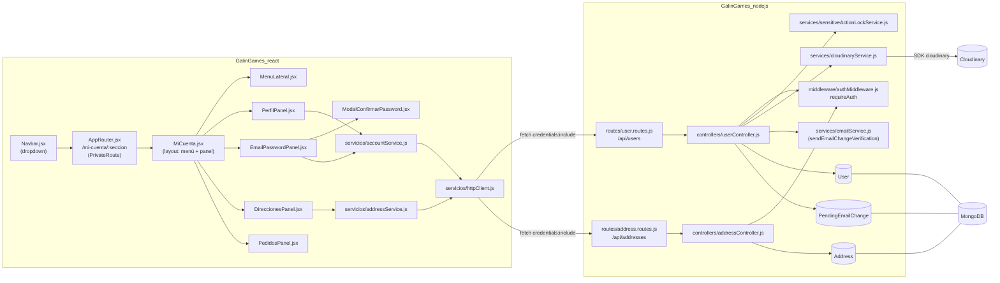

# Design Document — mi-cuenta

## Overview

Esta feature añade una Vista Mi Cuenta protegida (`/mi-cuenta/:seccion`) con
cuatro secciones — Mi perfil, Email y contraseña, Direcciones, Mis pedidos —
accesibles desde el dropdown del Navbar (`Navbar.jsx`), hoy placeholders no
interactivos. "Email y contraseña" es una sección propia del menú (no un
sub-bloque de "Mi perfil": ajuste tras QA manual sobre la primera versión
implementada, que la mostraba dentro de la misma pantalla que los datos
personales).

Se apoya en infraestructura ya existente y no se usa todavía:
`requireAuth` (`GalinGames_nodejs/src/middleware/authMiddleware.js`), las
variables de tema (`_tokens.scss`/`_shared.scss`), y el patrón de token
hash + expiración + colección efímera usado por `PendingUser` para la
verificación de email de registro, que se replica aquí para el cambio de
email post-registro.

Se añaden dos colecciones (`Address`, `PendingEmailChange`), se extiende
`User` con campos de perfil/seguridad, dos routers nuevos (`/api/users`,
`/api/addresses`), y en el frontend un layout de cuenta con menú lateral +
panel de contenido, reutilizando `InputBox`, `boton-primario`, `texto-tema`
y el patrón de `servicios/authService.js` (fetch + `AbortController` +
`credentials: 'include'`).

Quedan fuera de alcance (Requisitos 10 y 15): 2FA real y listado real de
pedidos — solo se implementa su UI de estado ("pendiente" / vacío).

## Architecture



## Components and Interfaces

### Backend — archivos nuevos

```
GalinGames_nodejs/src/
├── models/
│   ├── User.js                       (modificado: nuevos campos)
│   ├── Address.js                    (nuevo)
│   └── PendingEmailChange.js         (nuevo)
├── controllers/
│   ├── userController.js             (nuevo, patrón createUserController)
│   └── addressController.js          (nuevo, patrón createAddressController)
├── services/
│   ├── cloudinaryService.js          (nuevo)
│   ├── sensitiveActionLockService.js (nuevo)
│   └── emailService.js               (modificado: + sendEmailChangeVerification)
├── middleware/
│   └── uploadAvatar.js               (nuevo: multer memoryStorage + filtro de tipo/tamaño)
└── routes/
    ├── user.routes.js                (nuevo)
    └── address.routes.js             (nuevo)
```

`server.js` monta los dos routers nuevos y amplía `methods` de CORS:

```js
app.use('/api/users', userRoutes);
app.use('/api/addresses', addressRoutes);
// cors({ ..., methods: ['GET', 'POST', 'PUT', 'PATCH', 'DELETE'] })
```
Valida: Requisitos 3.1, 12.1, 16.1.

`userController.js` sigue el patrón de inyección de dependencias de
`authController.js` (`createUserController({ User, PendingEmailChange,
cloudinaryService, emailService, sensitiveActionLockService })`), exportando
`module.exports = createUserController({...defaults})` +
`module.exports.createUserController`.

Firmas principales:

```js
// userController.js
async function getMe(req, res, next)                 // GET /me
async function updateMe(req, res, next)               // PATCH /me
async function checkUsername(req, res, next)          // GET /me/check-username
async function uploadAvatar(req, res, next)            // POST /me/avatar
async function verifyPassword(req, res, next)          // POST /me/verify-password
async function requestEmailChange(req, res, next)      // PUT /me/email
async function confirmEmailChange(req, res, next)      // GET /verify-email-change (público)
async function changePassword(req, res, next)          // PUT /me/password
async function deleteAccount(req, res, next)           // DELETE /me
```

```js
// addressController.js
async function listAddresses(req, res, next)           // GET /
async function createAddress(req, res, next)           // POST /
async function updateAddress(req, res, next)            // PUT /:id
async function setDefaultAddress(req, res, next)        // PATCH /:id/predeterminada
async function deleteAddress(req, res, next)            // DELETE /:id
```

`sensitiveActionLockService.js` centraliza la lógica de bloqueo del
Requisito 8, parametrizada por acción, para no duplicarla entre
`verifyPassword`, `changePassword` y `deleteAccount`:

```js
// action: 'emailChange' | 'deleteAccount' | 'changePassword'
function isLocked(user, action)                         // → boolean
function registerFailedAttempt(user, action)            // muta user.sensitiveActionLocks[action], no persiste
function resetLock(user, action)                        // muta a { attempts: 0, blockedUntil: null }
```
El controlador es responsable de `await user.save()` tras mutar el lock,
igual que `authController.login` hace con `refreshTokenHash`.

`cloudinaryService.js` encapsula el SDK (config vía `env.CLOUDINARY_*`) y
expone únicamente lo que el controlador necesita:

```js
async function uploadAvatar(buffer, userId)   // → { url, publicId } (carpeta 'users/<userId>' en Cloudinary)
async function deleteAsset(publicId)          // best-effort, no lanza si publicId es null
```

### Frontend — archivos nuevos

```
GalinGames_react/src/
├── router/
│   ├── AppRouter.jsx                          (modificado: nueva ruta + PrivateRoute)
│   └── PrivateRoute.jsx                        (nuevo)
├── servicios/
│   ├── httpClient.js                           (nuevo: get/post/put/patch/del/postForm)
│   ├── accountService.js                       (nuevo: perfil, avatar, email, password, cuenta)
│   └── addressService.js                       (nuevo: direcciones)
├── Componentes/
│   └── zonaCliente/
│       └── MiCuentaComponente/
│           ├── MiCuenta.jsx                    (layout: menú + divisor + panel)
│           ├── MiCuenta.scss
│           ├── MenuLateral.jsx
│           ├── PerfilPanel.jsx                 (imagen + datos personales + username)
│           ├── EmailPasswordPanel.jsx          (email, contraseña, 2FA, eliminar cuenta)
│           ├── ModalConfirmarPassword.jsx      (reutilizado por email y eliminar cuenta)
│           ├── DireccionesPanel.jsx
│           ├── TarjetaDireccion.jsx
│           ├── FormularioDireccion.jsx
│           └── PedidosPanel.jsx
└── Componentes/compGlobales/NavbarComponente/
    └── Navbar.jsx                              (modificado: enlaces reales del dropdown)
```

`PrivateRoute.jsx` reutiliza `useAuth()` (ya expone `isAuthenticated` /
`initializing`), siguiendo el mismo guard que hoy vive inline en
`AppRouter.jsx` para la pantalla de carga:

```jsx
function PrivateRoute({ children }) {
  const { isAuthenticated, initializing } = useAuth()
  if (initializing) return null // AppRouter ya muestra el loading-screen antes de montar Routes
  return isAuthenticated ? children : <Navigate to="/login" replace />
}
```
Valida: Requisito 1.4.

`AppRouter.jsx` añade:
```jsx
<Route path="/mi-cuenta" element={<Navigate to="/mi-cuenta/perfil" replace />} />
<Route path="/mi-cuenta/:seccion" element={<PrivateRoute><MiCuenta /></PrivateRoute>} />
```
`MiCuenta.jsx` lee `useParams().seccion` (`'perfil' | 'email-password' |
'direcciones' | 'pedidos'`) para determinar la sección activa y navega con
`<Link>` al pulsar un ítem del `MenuLateral` — así la URL siempre refleja
la sección (y "Mis pedidos" del Navbar simplemente enlaza a
`/mi-cuenta/pedidos`, sin lógica adicional). `EmailPasswordPanel` se
renderiza únicamente bajo `seccion === 'email-password'`, como sección
propia del menú — no junto a `PerfilPanel` bajo `'perfil'`. Valida:
Requisitos 1.1, 1.2, 2.1, 2.4.

`Navbar.jsx`: los `<span aria-disabled>` de `navbar.myAccount` y
`navbar.myOrders` pasan a `<Link to="/mi-cuenta/perfil">` /
`<Link to="/mi-cuenta/pedidos">` con `onClick={() =>
setMenuUsuarioAbierto(false)}`. Valida: Requisito 1.5.

`httpClient.js` generaliza el `postJson` ya existente en `authService.js`
(mismo timeout, `AbortController`, `credentials: 'include'`) a los métodos
que esta feature necesita, incluyendo subida de archivo:

```js
async function request(method, url, body)      // JSON body, usado por get/post/put/patch/del
async function get(url)
async function post(url, body)
async function put(url, body)
async function patch(url, body)
async function del(url, body)
async function postForm(url, formData)         // multipart, para el avatar
```
`authService.js` no se toca (su `postJson` interno queda como está); el
nuevo `httpClient.js` es la base para los servicios de esta feature.

## Data Models

### User (extensión de `GalinGames_nodejs/src/models/User.js`)

| Campo | Tipo | Notas |
|---|---|---|
| `telefono` | String, trim, maxlength 30 | opcional, `default: null` |
| `nacionalidad` | String, trim, maxlength 100 | opcional, `default: null` — el frontend envía el código ISO 3166-1 alpha-2 (`"ES"`, `"MX"`...) elegido en el `<select>` de `PerfilPanel.jsx`, pero el modelo no valida contra una lista cerrada: sigue siendo un string libre (ajuste tras QA manual, ver más abajo) |
| `avatarUrl` | String, `default: null` | URL de Cloudinary |
| `avatarPublicId` | String, `select: false`, `default: null` | para poder sustituir/borrar en Cloudinary |
| `sensitiveActionLocks.emailChange` | `{ attempts: Number default 0, blockedUntil: Date default null }`, `select: false` | Requisito 8 |
| `sensitiveActionLocks.deleteAccount` | ídem | Requisito 8 |
| `sensitiveActionLocks.changePassword` | ídem | Requisito 8 (vía 9.4) |

Un único subdocumento `sensitiveActionLocks` con tres claves fijas (en vez
de tres campos sueltos o una colección aparte) porque las tres comparten
exactamente la misma forma y ciclo de vida, y viven siempre junto al
usuario — ver tabla de Design Decisions.

`username`, `nombre`, `apellidos`, `email`, `password` no cambian.

### Address (nuevo, `GalinGames_nodejs/src/models/Address.js`)

| Campo | Tipo | Notas |
|---|---|---|
| `userId` | ObjectId, ref `User`, required | índice no único (varias direcciones por usuario) |
| `tipo` | String, enum `['envio', 'facturacion']`, required | |
| `titulo` | String, required, maxlength 100 | ej. "Casa", "Trabajo" |
| `calle` | String, required, maxlength 200 | |
| `numero` | String, required, maxlength 20 | |
| `pisoPuerta` | String, maxlength 50 | opcional |
| `ciudad` | String, required, maxlength 100 | texto libre (`InputBox`), no viene de ninguna librería |
| `provincia` | String, required, maxlength 100 | el frontend lo elige en un `<select>` (`country-region-data`) salvo el país excepcional sin datos de provincia, ver Design Decisions — el modelo sigue sin validar contra una lista cerrada |
| `codigoPostal` | String, required, maxlength 12 | |
| `pais` | String, required, maxlength 100 | el frontend lo elige en un `<select>` (`i18n-iso-countries`, mismo origen que `User.nacionalidad`) — el modelo sigue sin validar contra una lista cerrada |
| `esPredeterminada` | Boolean, `default: false` | |
| `createdAt` / `updatedAt` | vía `{ timestamps: true }` | |

Índice: `AddressSchema.index({ userId: 1, tipo: 1 })` (consulta principal:
"direcciones de este usuario de este tipo"). No se declara `unique` sobre
`esPredeterminada`: la unicidad "como máximo una predeterminada por
tipo/usuario" (Requisito 14.5) se garantiza en `addressController` (ver
API Design), no a nivel de índice de Mongo.

### PendingEmailChange (nuevo, `GalinGames_nodejs/src/models/PendingEmailChange.js`)

Mismo patrón que `PendingUser.js` (token hash + expiración + índice TTL):

| Campo | Tipo | Notas |
|---|---|---|
| `userId` | ObjectId, ref `User`, required | índice único (una solicitud pendiente por usuario) |
| `newEmail` | String, required, lowercase, mismo `match` que `User.email` | |
| `tokenHash` | String, required, `select: false` | |
| `createdAt` | Date, `default: Date.now`, immutable | |
| `expiresAt` | Date, required | índice TTL `expireAfterSeconds: 0` |

Al solicitar un nuevo cambio de email con una solicitud pendiente previa,
se sobrescribe (`findOneAndUpdate` con `upsert`) igual que
`authController.register` hace con `PendingUser` — evita acumular
documentos huérfanos si el usuario pide varios cambios seguidos.

## API Design

Todos los endpoints bajo `/api/users` y `/api/addresses` requieren
`requireAuth` salvo `GET /api/users/verify-email-change`, que se abre por
navegación directa desde el correo (mismo caso que
`GET /api/auth/verify-email`). En todos, el backend usa exclusivamente
`req.user.userId`, nunca un id recibido en la petición (Requisito 16.2).

### Perfil

| Método | Ruta | Body | Respuesta éxito | Errores |
|---|---|---|---|---|
| GET | `/api/users/me` | — | `200 { nombre, apellidos, username, telefono, nacionalidad, email, avatarUrl }` | 401 |
| PATCH | `/api/users/me` | `{ nombre?, apellidos?, username?, telefono?, nacionalidad? }` | `200` con el documento actualizado (mismo shape que GET) | 400 (validación), 409 (username en uso) |
| GET | `/api/users/me/check-username?username=` | — | `200 { available: boolean }` (siempre `true` si `username` = el actual del usuario) | 400 (falta query) |
| POST | `/api/users/me/avatar` | `multipart/form-data`, campo `avatar` | `200 { avatarUrl }` | 400 (tipo/tamaño inválido), 500 (fallo Cloudinary) |

Valida: Requisitos 3.1–3.6, 4.1–4.5, 5.1–5.5, 6.1–6.5.

`uploadAvatar.js` (multer): `storage: memoryStorage()`,
`limits: { fileSize: 5 * 1024 * 1024 }`, `fileFilter` restringido a
`image/jpeg|png|webp`. El controlador, tras subir con éxito, borra el
`avatarPublicId` anterior del usuario en Cloudinary (Requisito 6.3) antes
de guardar el nuevo.

### Email y contraseña

| Método | Ruta | Body | Respuesta éxito | Errores |
|---|---|---|---|---|
| POST | `/api/users/me/verify-password` | `{ password, action: 'emailChange' }` | `200 { verified: true }` | 401 `{ message }` (contraseña incorrecta), 423 `{ message, blockedUntil }` (bloqueado) |
| PUT | `/api/users/me/email` | `{ password, newEmail }` | `202 { message }` (verificación enviada, email aún no aplicado) | 400, 401/423 (igual que arriba), 409 (email ya en uso) |
| GET | `/api/users/verify-email-change?token=` | — | `302` redirect a `FRONTEND_URL/mi-cuenta/perfil?emailActualizado=true` | `302` a `/error/410` (caducado/inválido), `/error/500` |
| PUT | `/api/users/me/password` | `{ currentPassword, newPassword, repeatNewPassword }` | `200 { message }` | 400 (no coinciden / formato), 401/423 |
| DELETE | `/api/users/me` | `{ password }` | `200 { message }` + `clearAuthCookies` | 401/423 |

Valida: Requisitos 7.1–7.7, 8.1–8.5, 9.1–9.5, 11.1–11.5.

`POST /verify-password` es el paso que abre el modal para email
(Requisito 7.3/7.4): el frontend lo llama al enviar el formulario del
modal; si `verified: true`, cierra el modal y habilita el input de email
**guardando la contraseña ya verificada en estado de componente** (no en
`localStorage`/`sessionStorage`) para reenviarla en `PUT /me/email` al
pulsar "validar" — ese segundo endpoint vuelve a verificarla server-side
(defensa en profundidad: nunca se confía en que el paso 1 haya ocurrido).
Para "Eliminar cuenta" no hace falta este paso intermedio: el propio
`DELETE /api/users/me` recibe la contraseña del modal y verifica+bloquea+
elimina en una sola petición (Requisito 11.2/11.3).

`changePassword` no usa modal (Requisito 9 no lo pide): el propio
`PUT /me/password` verifica `currentPassword` y aplica el lock de la
acción `'changePassword'` si falla.

Respuesta 423 (`Locked`, en vez de reutilizar 429 de `express-rate-limit`
para no confundir este bloqueo de 24h con el rate-limiting de
`loginLimiter`/`registerLimiter` ya existente):
```json
{ "code": 423, "message": "Demasiados intentos. Inténtalo de nuevo en 24 horas.", "blockedUntil": "2026-08-27T10:15:00.000Z" }
```

### Direcciones

| Método | Ruta | Body | Respuesta éxito | Errores |
|---|---|---|---|---|
| GET | `/api/addresses` | — | `200 { envio: Address[], facturacion: Address[] }` (predeterminada primero en cada array) | 401 |
| POST | `/api/addresses` | `{ tipo, titulo, calle, numero, pisoPuerta?, ciudad, provincia, codigoPostal, pais }` | `201 { address, offerReuseForOtherType: boolean }` | 400 |
| PUT | `/api/addresses/:id` | mismos campos que POST (formulario completo, mismo componente que crear) | `200 { address }` | 400, 404 |
| PATCH | `/api/addresses/:id/predeterminada` | — | `200 { address }` | 404 |
| DELETE | `/api/addresses/:id` | — | `200 { message }` | 404 |

Valida: Requisitos 12.1–12.5, 13.1–13.5, 14.1–14.5.

`offerReuseForOtherType` (Requisito 13.2/13.3): `true` solo si, en el
momento de crear, `Address.countDocuments({ userId, tipo: otroTipo }) ===
0`. El frontend, si es `true` y el usuario confirma, hace un segundo
`POST /api/addresses` con `tipo` = el otro tipo y los mismos valores que
ya tiene en el formulario (Requisito 13.4) — no existe endpoint de
"duplicar", se evita esa superficie extra reutilizando el mismo POST.

`setDefaultAddress` (Requisito 14.2/14.5), dentro de `addressController`:
```js
await Address.updateMany({ userId, tipo: address.tipo, esPredeterminada: true }, { esPredeterminada: false });
await Address.updateOne({ _id: address._id }, { esPredeterminada: true });
```
Dos updates secuenciales (no una transacción Mongo): el proyecto ya asume
Mongo standalone en desarrollo (`MONGODB_URI=mongodb://localhost:27017/...`
sin réplica set), donde las transacciones no están disponibles sin
configuración adicional; una inconsistencia momentánea entre ambos
updates no es observable por otro usuario (el recurso es privado por
`userId`) — ver Design Decisions.

`listAddresses` ordena cada array con la predeterminada primero:
`.sort({ esPredeterminada: -1, createdAt: 1 })` (Requisito 14.2 "escala
automáticamente a la primera posición").

### Mis pedidos

Sin API: `PedidosPanel.jsx` renderiza directamente
`t('miCuenta.pedidos.empty')`, sin llamada a `accountService`/backend
(Requisito 15.2).

## Security

- Ningún controlador nuevo fabrica, deriva o adivina un `ObjectId` — toda
  búsqueda de un documento concreto usa el `_id` real ya generado por Mongo
  (cuando se dispone de él, p. ej. `req.user.userId` tras `requireAuth`, o
  el `:id` de una `Address` devuelto en una respuesta anterior) o, si no se
  dispone de él, el valor único de negocio de esa colección:
  `checkUsername` busca por `username` (`User.findOne({ username })`, igual
  que `authController.login`/`register`), `requestEmailChange`/
  `confirmEmailChange` localizan la solicitud pendiente por `tokenHash`
  (`PendingEmailChange.findOne({ tokenHash })`, patrón ya usado por
  `PendingUser`/`emailVerificationService`), nunca por un `_id` supuesto.
- Todos los endpoints nuevos pasan por `requireAuth`, salvo
  `GET /verify-email-change` (Requisito 16.1).
- Ningún endpoint acepta un id de usuario del cliente: siempre
  `req.user.userId` (Requisito 16.2/16.3).
- Contraseñas: `currentPassword`/`password` de estos endpoints se comparan
  con `bcrypt.compare` contra `user.password` (`select('+password')`),
  igual que `authController.login`.
- El bloqueo de 24h (Requisito 8) se persiste en Mongo (a diferencia del
  `failedAttempts` en memoria de `authController.login`), porque debe
  sobrevivir a un reinicio del proceso — ver Design Decisions.
- El correo de verificación de cambio de email reutiliza
  `emailVerificationService.generateVerificationToken()` (token aleatorio
  de 32 bytes + SHA-256 hash almacenado, nunca el token en claro) — mismo
  mecanismo que el registro.
- Subida de avatar: `multer` con `fileFilter` de MIME whitelist y límite
  de 5MB antes de tocar Cloudinary; las credenciales `CLOUDINARY_*` solo
  existen en el backend (`env.js`), nunca se exponen al frontend.
- CORS: se amplía `methods` a `['GET','POST','PUT','PATCH','DELETE']`
  (los nuevos verbos), sin tocar `allowedHeaders: ['Content-Type']` —
  la subida de avatar usa `multipart/form-data`, que el navegador
  serializa con su propio `Content-Type: multipart/form-data; boundary=...`
  sin necesitar una cabecera adicional.
- Eliminar cuenta borra también las `Address` del usuario y su avatar en
  Cloudinary (best-effort, no bloquea la eliminación si Cloudinary falla).

## Error Handling

Se reutiliza `globalErrorHandler.js` / `AppError` tal cual: los
controladores nuevos lanzan `AppError(mensaje, status)` para los casos ya
cubiertos (400/401/403/404/409), y solo el caso 423 (bloqueo) se responde
directamente desde el controlador (no encaja en `resolveError`, que no
conoce ese código) — se añade una rama para `err.status === 423` o,
más simple, se construye la respuesta 423 directamente en
`userController` sin pasar por `next(err)`, igual que `authController.login`
ya responde el 429 de bloqueo directamente en vez de usar `AppError`.

`GET /api/users/verify-email-change` sigue el mismo patrón que
`GET /api/auth/verify-email`: nunca responde JSON, siempre `redirect`
(incluyendo el `catch` con `console.error` + redirect a `/error/500`).

Frontend: `httpClient.js` normaliza toda respuesta no-OK a
`{ ok: false, status, message, errors, blockedUntil }` (extensión directa
de `buildErrorResult` de `authService.js`), y cada panel mapea `status`
a mensaje/estado de UI igual que `Registro.jsx` ya hace con 400/409/429.

## Design Decisions

| Decisión | Alternativas consideradas | Por qué se elige | Requisitos |
|---|---|---|---|
| `Address` como colección aparte con `userId` | Subdocumentos embebidos en `User` | El usuario puede tener varias direcciones por tipo; una colección aparte permite `PATCH` puntual (predeterminada) sin reescribir todo `User`, y evita crecer indefinidamente el documento de usuario | 12, 13, 14 |
| Bloqueo de 24h persistido en `User.sensitiveActionLocks` (Mongo) | Reutilizar el `Map` en memoria de `authController.login` | Un `Map` en memoria se pierde al reiniciar el proceso (`nodemon`); 24h debe sobrevivir a reinicios | 8 |
| Un subdocumento `sensitiveActionLocks` con 3 claves fijas | 3 campos sueltos en `User`; colección `Lock` aparte | Misma forma y ciclo de vida para las 3 acciones; una colección aparte sería sobre-ingeniería para un dato que vive y muere con el usuario | 8, 9.4, 11.4 |
| `PendingEmailChange` como colección aparte (patrón `PendingUser`) | Subdocumento `pendingEmail` embebido en `User` con TTL index anidado | Un TTL index en Mongo borra el **documento completo** al expirar, no el subcampo — embebido en `User` borraría la cuenta entera al caducar la solicitud | 7.5, 7.7 |
| `PUT /me/email` reverifica la contraseña (recibida del estado del modal) en vez de un token de confirmación de un paso previo | Endpoint `verify-password` emite un token de confirmación de un solo uso con expiración corta | Menos superficie nueva (sin gestor de tokens de corta duración); cada endpoint mutante ya reverifica por sí mismo, consistente con "nunca confiar en el paso anterior" | 7.2–7.5 |
| Predeterminada: 2 updates secuenciales (`updateMany` + `updateOne`) | Transacción Mongo (`session.withTransaction`) | El `MONGODB_URI` del proyecto es un standalone de desarrollo sin réplica set; el recurso es privado por usuario, por lo que una inconsistencia de milisegundos entre ambos updates no es observable por nadie más | 14.2, 14.5 |
| Reutilización de dirección al otro tipo: segundo `POST` desde el frontend con los mismos datos | Endpoint dedicado `POST /:id/duplicar` | Evita una ruta extra solo para copiar campos que el frontend ya tiene en el formulario | 13.2–13.4 |
| HTTP 423 para el bloqueo de 24h | Reutilizar 429 (como el login) | 429 ya lo usa `express-rate-limit` para ventanas cortas (15 min); usar el mismo código confundiría "espera unos minutos" con "espera 24 horas" en el frontend | 8.2, 8.3 |
| `httpClient.js` nuevo en vez de ampliar `authService.js` | Añadir `get/put/patch/del` directamente dentro de `authService.js` | `authService.js` es específico de login/registro/refresh/logout; extraer el cliente HTTP genérico evita tocar un módulo ya probado y lo deja reutilizable para futuras features | — (calidad interna) |
| Nacionalidad alimentada por el paquete npm `i18n-iso-countries` (datos ISO 3166-1 locales, `code` alpha-2 como valor, nombre oficial localizado como texto) | Llamar a una API pública de países en cada carga del panel | Sin llamada de red ni límite de rate en cada visita a "Mi perfil"; los nombres ya salen en el idioma activo de la app reutilizando el propio `i18next` en vez de otro mecanismo de i18n; el backend no cambia (sigue siendo el mismo `String` libre del modelo `User`) | 4.2, 4.3 (ajuste tras QA manual) |
| `ComboboxSelect.jsx` (combobox propio: botón + `<ul role="listbox">`, en `compGlobales/ComboboxSelectComponente/` — antes `NacionalidadSelect.jsx` en Mi Cuenta, generalizado en la Tarea 46 al reutilizarse también para País/Provincia) en vez de un `<select>` nativo | `<select>` nativo con `<option>` | El popup de opciones de un `<select>` nativo lo pinta el sistema operativo, no el CSS de la página — en Windows salía con fondo claro pese a que la caja cerrada sí heredaba el estilo oscuro de `.form-control` (bug real de QA); un listbox propio es HTML/CSS normal, así que su fondo sí es controlable. `getNacionalidades()` no cambia, solo cambia qué componente pinta la lista | 4.2, 4.3 (ajuste tras QA manual) |
| Provincia de `FormularioDireccion.jsx` alimentada por el paquete npm `country-region-data` (MIT, país→región/provincia, datos locales) | `country-state-city` (país→provincia→ciudad en un único paquete, cubriría también Ciudad) | `country-state-city` es GPL-3.0 (copyleft): empaquetarlo podría obligar a licenciar el proyecto entero bajo GPL. `country-region-data` es MIT y ~630KB (frente a los ~17MB de `country-state-city`). No cubre ciudad — no existe una librería pequeña y con licencia permisiva equivalente para ~250 países completos (las que sí tienen datos de ciudad, p. ej. `cities.json`/`all-the-cities`, son bases de datos mundiales de varios MB) — Ciudad se queda como `InputBox` de texto libre, decisión explícita del usuario | 13.1–13.4 (ajuste tras petición de usuario) |
| `Address.pais`/`Address.provincia` guardan el nombre visible (no el código ISO alpha-2), a diferencia de `User.nacionalidad` (Tarea 44, guarda el código) | Guardar también el código ISO en Address, igual que en User | `TarjetaDireccion.jsx` ya muestra `pais`/`provincia` tal cual, sin ningún lookup código→nombre en ningún otro punto de la app (a diferencia de Nacionalidad, que sí necesita sobrevivir a un cambio de idioma) — guardar el nombre evita ese lookup en cada sitio que lo muestre, a costa de un `find()` en `nacionalidades` cuando `FormularioDireccion.jsx` necesita el código para consultar `country-region-data` (que indexa por `countryShortCode`) | 13.1–13.4 |
| Confirmación de "eliminar dirección" con `window.confirm` nativo (en `TarjetaDireccion.jsx`, mismo criterio que "eliminar avatar" en `PerfilPanel.jsx`) | Modal de confirmación propio (`ModalConfirmarPassword.jsx` reutilizado o uno nuevo) | Borrar una dirección no es una "sensitive action" del Requisito 8 (no hay bloqueo de intentos ni reverificación de contraseña) — un modal a medida sería sobre-ingeniería para una confirmación simple | — (petición de usuario) |
| Verde fijo (`#4caf50`) para el indicador de "predeterminada" (icono + borde de `TarjetaDireccion`), no `var(--color-acento)` del tema activo | Mantener el color de acento del tema, como el resto de la Vista Mi Cuenta | Petición explícita de usuario: un único color reconocible para "predeterminada" en las dos tarjetas a la vez (envío y facturación), independiente de si el tema activo ya usa ese mismo tono de rojo/azul para otras cosas de la interfaz | — (petición de usuario) |
| Solo una dirección de facturación por usuario, forzado ocultando el botón "+ Nueva dirección" del bloque de facturación en el frontend (`permiteNueva`) en vez de validarlo también en el backend | Rechazar en `POST /api/addresses` con 409/400 si ya existe una dirección de facturación | El backend no impedía crear una segunda de todas formas antes de esta decisión; añadir la validación ahí es trabajo futuro razonable pero no lo pidió el usuario — el camino normal (UI) ya no lo permite, quedaría como hueco solo alcanzable llamando a la API directamente | — (petición de usuario) |
| Primera dirección de cada tipo (envío/facturación) marcada `esPredeterminada:true` automáticamente en `createAddress` | Dejarlo en `false` y exigir un `PATCH .../predeterminada` manual tras crearla (comportamiento original) | Petición de usuario: con una única dirección de un tipo, no tiene sentido que el usuario tenga que marcarla como predeterminada a mano en un paso aparte — cubre tanto el alta por el modal como la reutilización para el otro tipo (mismo controlador) | — (petición de usuario) |
| ~~`@formkit/auto-animate` para animar el reordenamiento~~ — **revertido** (Tarea 49): instalado y verificado funcionando (Tarea 48), pero el usuario decidió no seguir adelante con la animación y pidió quitar toda la lógica. Desinstalado, sin rastro en `package.json` ni en el código | — | Decisión explícita de usuario tras ver el resultado, no un problema técnico — la animación llegó a funcionar (verificado con `Element.prototype.animate` y forzando `disrespectUserMotionPreference`) | — (petición de usuario) |
| `DireccionesPanel.cargar({ mostrarCargando })`: solo la carga inicial desmonta el árbol para el "Cargando...", los refrescos tras una acción no | Mantener un único `loading` para toda carga (comportamiento original) | Bug real de QA: con un único `loading`, cada refresco (predeterminada/eliminar/guardar) desmontaba y remontaba `<TarjetaDireccion>` desde cero, así que ni la reconciliación por `key` de React ni `auto-animate` podían detectar el reordenamiento — la animación de arriba no se veía por esto, no por la librería en sí | — (petición de usuario, encontrado depurando la Tarea 48) |

## Cobertura de Requisitos

| Requisito | Cubierto por |
|---|---|
| 1. Acceso desde Navbar | `Navbar.jsx` (enlaces), `PrivateRoute.jsx`, `AppRouter.jsx` |
| 2. Layout general | `MiCuenta.jsx`, `MiCuenta.scss` (divisor, cuadrícula, `_tokens.scss`) |
| 3. Consulta de datos de perfil | `GET /api/users/me`, `PerfilPanel.jsx` |
| 4. Edición de datos personales | `PATCH /api/users/me`, `PerfilPanel.jsx` |
| 5. Validación de username | `GET /api/users/me/check-username`, `PerfilPanel.jsx` |
| 6. Avatar → Cloudinary | `POST /api/users/me/avatar`, `cloudinaryService.js`, `uploadAvatar.js` |
| 7. Modificar email protegido | `POST /verify-password`, `PUT /me/email`, `GET /verify-email-change`, `PendingEmailChange`, `ModalConfirmarPassword.jsx` |
| 8. Bloqueo 24h | `sensitiveActionLockService.js`, `User.sensitiveActionLocks` |
| 9. Cambio de contraseña | `PUT /api/users/me/password` |
| 10. 2FA pendiente | `EmailPasswordPanel.jsx` (bloque estático) |
| 11. Eliminar cuenta | `DELETE /api/users/me`, `ModalConfirmarPassword.jsx` |
| 12. Listado de direcciones | `GET /api/addresses`, `DireccionesPanel.jsx`, `TarjetaDireccion.jsx` |
| 13. Crear + reutilizar entre tipos | `POST /api/addresses`, `FormularioDireccion.jsx` |
| 14. Predeterminada + editar | `PATCH /:id/predeterminada`, `PUT /:id` |
| — Eliminar dirección (fuera de requirements.md, petición directa de usuario) | `DELETE /api/addresses/:id`, `TarjetaDireccion.jsx` (confirmación con `window.confirm`) |
| 15. Mis pedidos (vacío) | `PedidosPanel.jsx` |
| 16. Protección de datos | `requireAuth` en todos los routers nuevos, `req.user.userId` en todos los controladores |

Todos los requisitos de `requirements.md` quedan cubiertos; no se detectan
huecos.
