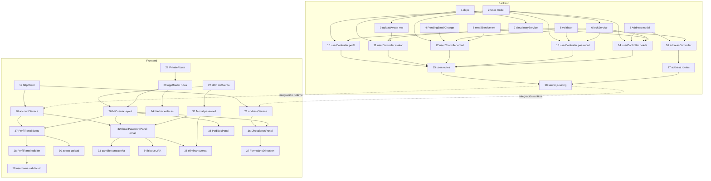

# Implementation Plan: mi-cuenta

## Overview

Plan de implementación de la Vista Mi Cuenta (perfil, email/contraseña,
direcciones, mis pedidos) descrita en `requirements.md` y `design.md`. Las
tareas backend crean los modelos, servicios, controladores y rutas nuevas
bajo `/api/users` y `/api/addresses`; las tareas frontend crean el layout
de la vista, sus paneles y los servicios que los conectan al backend.
Cada tarea de modelo/servicio/controlador/componente incluye sus tests
correspondientes, siguiendo la convención ya existente en el repo
(`GalinGames_nodejs/tests/unit/*`, `*.test.jsx` co-ubicado en frontend).

Las tareas se ejecutan de una en una vía `/spec-execute`, en el orden que
respete las dependencias indicadas.

## Tasks

### Backend — Infraestructura

- [x] 1. Añadir dependencias `cloudinary` y `multer` a `GalinGames_nodejs/package.json` e instalarlas
  **Dependencias:** ninguna
  **Requisitos:** 6.1

- [x] 2. Extender `GalinGames_nodejs/src/models/User.js` con `telefono`, `nacionalidad`, `avatarUrl`, `avatarPublicId` y el subdocumento `sensitiveActionLocks` (`emailChange`, `deleteAccount`, `changePassword`), + tests en `tests/unit/User.test.js`
  **Dependencias:** ninguna
  **Requisitos:** 3.1, 3.2, 6.1, 8.1

- [x] 3. Crear `GalinGames_nodejs/src/models/Address.js` (schema completo, índice `{ userId: 1, tipo: 1 }`), + tests en `tests/unit/Address.test.js`
  **Dependencias:** ninguna
  **Requisitos:** 12.1, 12.2, 13.1, 14.1

- [x] 4. Crear `GalinGames_nodejs/src/models/PendingEmailChange.js` (patrón `PendingUser`: token hash + índice TTL), + tests en `tests/unit/PendingEmailChange.test.js`
  **Dependencias:** ninguna
  **Requisitos:** 7.5, 7.7

- [x] 5. Añadir a `GalinGames_nodejs/src/middleware/validator.js` los validadores `validateUpdateProfileInput`, `validateAddressInput` y `validateChangePasswordInput`, + tests en `tests/unit/validator.test.js`
  **Dependencias:** ninguna
  **Requisitos:** 4.4, 9.3, 12.5, 13.5

### Backend — Servicios

- [x] 6. Crear `GalinGames_nodejs/src/services/sensitiveActionLockService.js` (`isLocked`, `registerFailedAttempt`, `resetLock` parametrizados por `action`), + tests en `tests/unit/sensitiveActionLockService.test.js`
  **Dependencias:** Tarea 2
  **Requisitos:** 8.1, 8.2, 8.3, 8.4, 8.5

- [x] 7. Crear `GalinGames_nodejs/src/services/cloudinaryService.js` (`uploadAvatar`, `deleteAsset`, config vía `env.CLOUDINARY_*`), + tests en `tests/unit/cloudinaryService.test.js` (con SDK mockeado)
  **Dependencias:** Tarea 1
  **Requisitos:** 6.1, 6.3

- [x] 8. Añadir `sendEmailChangeVerification` a `GalinGames_nodejs/src/services/emailService.js` (plantilla HTML propia, reutilizando `createEmailService`), + tests en `tests/unit/emailService.test.js`
  **Dependencias:** ninguna
  **Requisitos:** 7.5

- [x] 9. Crear `GalinGames_nodejs/src/middleware/uploadAvatar.js` (multer `memoryStorage`, límite 5MB, `fileFilter` de MIME image/jpeg-png-webp), + tests en `tests/unit/uploadAvatar.test.js`
  **Dependencias:** Tarea 1
  **Requisitos:** 6.2

### Backend — Controladores y rutas de usuario

- [x] 10. Crear `userController.js` — `getMe` y `updateMe` (incluye `checkUsername`), con inyección de dependencias tipo `createUserController`, + tests en `tests/unit/userController.test.js`
  **Dependencias:** Tareas 2, 5
  **Requisitos:** 3.1, 3.2, 3.6, 4.1, 4.2, 4.3, 4.4, 4.5, 5.1, 5.2, 5.3, 5.4, 5.5, 16.2, 16.3

- [x] 11. Añadir a `userController.js` el handler `uploadAvatar` (usa `cloudinaryService` + borra `avatarPublicId` anterior), + tests
  **Dependencias:** Tareas 2, 7, 9
  **Requisitos:** 6.1, 6.2, 6.3, 6.4, 6.5

- [x] 12. Añadir a `userController.js` `verifyPassword`, `requestEmailChange` y `confirmEmailChange` (usa `sensitiveActionLockService`, `PendingEmailChange`, `emailService`), + tests
  **Dependencias:** Tareas 2, 4, 6, 8
  **Requisitos:** 7.1, 7.2, 7.3, 7.4, 7.5, 7.6, 7.7, 8.1, 8.2, 8.3, 8.4, 8.5

- [x] 13. Añadir a `userController.js` el handler `changePassword`, + tests
  **Dependencias:** Tareas 2, 5, 6
  **Requisitos:** 9.1, 9.2, 9.3, 9.4, 9.5

- [x] 14. Añadir a `userController.js` el handler `deleteAccount` (borra también `Address` del usuario y su avatar en Cloudinary, best-effort), + tests
  **Dependencias:** Tareas 2, 3, 6, 7
  **Requisitos:** 11.1, 11.2, 11.3, 11.4, 11.5

- [x] 15. Crear `GalinGames_nodejs/src/routes/user.routes.js` (monta todos los endpoints de `userController` bajo `requireAuth`, salvo `GET /verify-email-change`), + tests de integración con `supertest`
  **Dependencias:** Tareas 10, 11, 12, 13, 14
  **Requisitos:** 16.1

### Backend — Controlador y rutas de direcciones

- [x] 16. Crear `addressController.js` — `listAddresses`, `createAddress` (con `offerReuseForOtherType`), `updateAddress`, `setDefaultAddress`, + tests en `tests/unit/addressController.test.js`
  **Dependencias:** Tareas 3, 5
  **Requisitos:** 12.1, 12.2, 12.3, 12.4, 12.5, 13.1, 13.2, 13.3, 13.5, 14.1, 14.2, 14.3, 14.4, 14.5, 16.2, 16.3

- [x] 17. Crear `GalinGames_nodejs/src/routes/address.routes.js` (bajo `requireAuth`), + tests de integración con `supertest`
  **Dependencias:** Tarea 16
  **Requisitos:** 16.1

### Backend — Wiring final

- [x] 18. Montar `user.routes.js` y `address.routes.js` en `GalinGames_nodejs/server.js`, ampliar `methods` de CORS a `['GET','POST','PUT','PATCH','DELETE']`
  **Dependencias:** Tareas 15, 17
  **Requisitos:** 16.1

### Frontend — Infraestructura y routing

- [x] 19. Crear `GalinGames_react/src/servicios/httpClient.js` (`get/post/put/patch/del/postForm`, mismo patrón `AbortController`/timeout que `authService.js`), + tests
  **Dependencias:** ninguna
  **Requisitos:** — (soporte interno)

- [x] 20. Crear `GalinGames_react/src/servicios/accountService.js` (perfil, avatar, email, password, eliminar cuenta), + tests
  **Dependencias:** Tarea 19
  **Requisitos:** 3.1, 4.4, 5.1, 6.1, 7.2, 7.5, 9.2, 11.3

- [x] 21. Crear `GalinGames_react/src/servicios/addressService.js` (listar, crear, editar, marcar predeterminada), + tests
  **Dependencias:** Tarea 19
  **Requisitos:** 12.1, 13.1, 14.2, 14.4

- [x] 22. Crear `GalinGames_react/src/router/PrivateRoute.jsx` (usa `useAuth`, redirige a `/login`), + tests
  **Dependencias:** ninguna
  **Requisitos:** 1.4

- [x] 23. Modificar `GalinGames_react/src/router/AppRouter.jsx`: rutas `/mi-cuenta` (redirect) y `/mi-cuenta/:seccion` protegida, + tests
  **Dependencias:** Tarea 22, Tarea 26 (importa `<MiCuenta />`; reordenado tras la Tarea 26 en la ejecución real para que cada commit sea auto-consistente)
  **Requisitos:** 1.1, 1.2

- [x] 24. Modificar `Navbar.jsx`: convertir los `` de "Mi cuenta"/"Mis pedidos" en `<Link>` a `/mi-cuenta/perfil` y `/mi-cuenta/pedidos`, + tests
  **Dependencias:** Tarea 23
  **Requisitos:** 1.1, 1.2, 1.5

- [x] 25. Añadir namespace `miCuenta.*` a `GalinGames_react/src/i18n/locales/es.json` y `en.json` (menú, perfil, email/contraseña, direcciones, pedidos, modal)
  **Dependencias:** ninguna
  **Requisitos:** 2.7

### Frontend — Layout de la vista

- [x] 26. Crear `MiCuentaComponente/MiCuenta.jsx`, `MenuLateral.jsx` y `MiCuenta.scss` (menú lateral + divisor coloreado por tema + cuadrícula de inputs + integración del `Navbar`), + tests
  **Dependencias:** Tareas 23, 25 (implementado antes que la Tarea 23 en la ejecución real: compone los paneles ya creados; el propio `AppRouter` depende de que este componente exista primero)
  **Requisitos:** 1.3, 2.1, 2.2, 2.3, 2.4, 2.5, 2.6

### Frontend — Mi perfil

- [x] 27. Crear `PerfilPanel.jsx` (parte 1): consulta `GET /me`, pinta imagen redonda + `border-bottom` temático + datos personales en modo lectura, inputs vacíos si no hay dato, + tests
  **Dependencias:** Tareas 20, 26 (implementado antes que la Tarea 26 en la ejecución real: componente hoja, no depende de `MiCuenta.jsx` para probarse)
  **Requisitos:** 3.1, 3.2, 3.3, 3.4, 3.5, 3.6

- [x] 28. Añadir a `PerfilPanel.jsx` el modo edición de datos personales ("Modificar datos personales" + lápiz temático, guardar/cancelar), + tests
  **Dependencias:** Tarea 27
  **Requisitos:** 4.1, 4.2, 4.3, 4.4, 4.5

- [x] 29. Añadir a `PerfilPanel.jsx` la validación en tiempo real del nombre de usuario (mensaje verde/rojo, bloqueo de guardado, caso "sin cambios"), + tests
  **Dependencias:** Tarea 28
  **Requisitos:** 5.1, 5.2, 5.3, 5.4, 5.5

- [x] 30. Añadir a `PerfilPanel.jsx` la subida de imagen de perfil (icono, validación de tipo/tamaño en cliente, estado de carga, `POST /me/avatar`), + tests
  **Dependencias:** Tarea 27
  **Requisitos:** 6.1, 6.2, 6.3, 6.4, 6.5

### Frontend — Email y contraseña

- [x] 31. Crear `ModalConfirmarPassword.jsx` (modal reutilizable con estilos por tema, X de cierre, mensaje de error, aviso de bloqueo 24h), + tests
  **Dependencias:** Tarea 25
  **Requisitos:** 7.2, 7.4, 8.2, 8.3

- [x] 32. Crear `EmailPasswordPanel.jsx` (parte 1): input de email de solo lectura + flujo "Modificar email" (modal → habilitar input → "validar" → `PUT /me/email`), + tests
  **Dependencias:** Tareas 20, 26, 31 (implementado antes que la Tarea 26 en la ejecución real: `EmailPasswordPanel` es un componente hoja que no depende de `MiCuenta.jsx` para poder probarse)
  **Requisitos:** 7.1, 7.2, 7.3, 7.4, 7.5, 7.6, 7.7

- [x] 33. Añadir a `EmailPasswordPanel.jsx` el formulario de cambio de contraseña (actual/nueva/repetir, validación de coincidencia, `PUT /me/password`), + tests
  **Dependencias:** Tarea 32
  **Requisitos:** 9.1, 9.2, 9.3, 9.4, 9.5

- [x] 34. Añadir a `EmailPasswordPanel.jsx` el bloque estático de "2FA pendiente", + tests
  **Dependencias:** Tarea 32
  **Requisitos:** 10.1, 10.2

- [x] 35. Añadir a `EmailPasswordPanel.jsx` el botón "Eliminar cuenta" (reutiliza `ModalConfirmarPassword`, `DELETE /me`, logout + redirect), + tests
  **Dependencias:** Tareas 32, 31
  **Requisitos:** 11.1, 11.2, 11.3, 11.4, 11.5

### Frontend — Direcciones

- [x] 36. Crear `DireccionesPanel.jsx` y `TarjetaDireccion.jsx` (dos bloques envío/facturación, listado con `GET /addresses`, lámina con icono predeterminada + lápiz, botón "+ Nueva dirección"), + tests
  **Dependencias:** Tareas 21, 26 (implementado antes que la Tarea 26 en la ejecución real: componente hoja, no depende de `MiCuenta.jsx` para probarse)
  **Requisitos:** 12.1, 12.2, 12.3, 12.4, 12.5, 14.1, 14.2, 14.3

- [x] 37. Crear `FormularioDireccion.jsx` (crear/editar dirección, validación de campos, aplica margin right entre el input del email y el separador para que el separador quede mas centralizado en el medio y haya la misma separacion entre input email e imput contraseña y el separador quede bien alineado
pregunta de reutilización entre tipos), + tests
  **Dependencias:** Tarea 36
  **Requisitos:** 13.1, 13.2, 13.3, 13.4, 13.5, 14.4

### Frontend — Mis pedidos

- [x] 38. Crear `PedidosPanel.jsx` (mensaje de estado vacío "Aún no tienes ningún pedido registrado"), + tests
  **Dependencias:** Tarea 26
  **Requisitos:** 15.1, 15.2

### Frontend — Ajustes tras QA manual

- [x] 39. Separar "Email y contraseña" como sección propia del menú lateral (ya no se renderiza junto a `PerfilPanel` bajo "Mi perfil"): añadir el 4º ítem a `MenuLateral.jsx`, la clave `miCuenta.menu.emailPassword` en `es.json`/`en.json`, y la rama `seccion === 'email-password'` en `MiCuenta.jsx` (`SECCIONES_VALIDAS` actualizado), + tests
  **Dependencias:** Tareas 26, 32
  **Requisitos:** 2.1 (actualizado), 2.4

- [x] 40. Corregir estilos de `.form-control:disabled` en `InputBox.scss` (compartido): el fondo/color por defecto de Bootstrap dejaba el texto ilegible sobre fondo claro; se fuerza el mismo fondo/color oscuro que el resto de la app, solo cambia el cursor — el campo deja de ser clicable pero no cambia visualmente, + tests
  **Dependencias:** ninguna
  **Requisitos:** 3.2 (legibilidad de datos ya insertados)

- [x] 41. Centrar y acotar el ancho de `PerfilPanel.jsx`/`EmailPasswordPanel.jsx` (`max-width` + `margin: 0 auto`) para que el avatar, el separador y la cuadrícula de inputs compartan el mismo eje horizontal en vez de que la cuadrícula quede pegada al borde izquierdo mientras avatar/separador aparecen centrados en todo el ancho del panel
  **Dependencias:** Tareas 27, 32
  **Requisitos:** 2.5 (cuadrícula), ajuste visual sin requisito EARS dedicado

- [x] 42. Segunda ronda de ajustes visuales tras QA manual con la app real:
  - Teléfono/Nacionalidad vuelven a ser editables aunque no tengan valor previo (Requisito 4.3 revisado en requirements.md), y `handleGuardar` de `PerfilPanel.jsx` envía también campos que antes no tenían valor — verificado extremo a extremo contra el backend real (persiste tras recargar).
  - Columnas de `PerfilPanel__grid` de ancho fijo (240px) + `justify-content:center` en vez de `1fr 1fr`: con columnas elásticas el input (más estrecho que la columna) dejaba un margen distinto a cada lado del divisor central — con columnas fijas el margen es simétrico por construcción.
  - `MiCuenta.jsx` deja de usar la clase compartida `.pagina-tematica` (degradado radial "80% 0%" pensado para Login/Registro) y pasa a un fondo plano `var(--color-fondo)`, igual que `Home.scss`: el degradado se mezclaba con la sombra del `border-bottom` del Navbar dando la falsa sensación de que la sombra "se extendía" más por un lado.
  - Sombra difusa (`--sombra-acento` / mismo patrón que el `border-bottom` del Navbar) en el avatar, el icono de cámara, el separador bajo el avatar, el divisor de la cuadrícula de `PerfilPanel` y el divisor vertical de `MiCuenta` entre menú y contenido — en vez de líneas/bordes sólidos "a secas".
  - `EmailPasswordPanel.jsx` unifica email y contraseña en dos columnas (`__columnas`): email a la izquierda con "Modificar email" debajo, contraseña a la derecha conservando su disposición interna en sub-columnas ("Contraseña actual" | "Nueva contraseña"/"Repetir nueva contraseña", ajustadas para caber en el espacio disponible) con "Cambiar contraseña" debajo — cada botón de acción queda bajo el campo al que corresponde.
  **Dependencias:** Tareas 28, 39, 41
  **Requisitos:** 2.5, 4.2, 4.3, 4.4 (revisados)

- [x] 43. Tercera ronda de ajustes visuales sobre `EmailPasswordPanel.jsx` tras QA manual:
  - "Cambiar contraseña" deja de ser un `.boton-primario` sólido y pasa a texto+icono de lápiz, mismo estilo que "Modificar email" (`__modificar`).
  - Ambos disparadores de edición quedan a la misma altura izquierda/derecha: `__col-email`/`__col-password` en `display:flex; flex-direction:column` + `align-items:stretch` en `__columnas` (ambas columnas igualan su altura a la más alta) + `margin-top:auto` en cada disparador, independientemente de que una columna tenga más campos que la otra.
  - Más separación entre la columna de email y la de contraseña (`gap` de `__columnas` ampliado).
  - Línea divisoria vertical entre ambas columnas, mismo tratamiento (sombra difusa) que el divisor de `MiCuenta.scss` y el de `PerfilPanel__grid`.
  **Dependencias:** Tarea 42
  **Requisitos:** 2.2, 2.5 (mismo tratamiento visual de divisores que el resto de la Vista Mi Cuenta)

- [x] 44. Campo Nacionalidad de `PerfilPanel.jsx`: de `InputBox` de texto libre a `<select>` (`nacionalidades.js`, nuevo), con la lista de países cargada del paquete npm `i18n-iso-countries` (registrado para `es`/`en`) en vez de una API externa — `value` es el código ISO alpha-2, texto visible el nombre oficial en el idioma activo (`i18n.language`). Claves `miCuenta.perfil.fieldNacionalidadPlaceholder` añadidas a `es.json`/`en.json`. El modelo `User.nacionalidad` no cambia (sigue siendo `String` libre, ver Data Models)
  **Dependencias:** Tarea 27
  **Requisitos:** 4.2, 4.3 (ajuste tras QA manual, ver Design Decisions)

- [x] 45. Ronda de ajustes visuales sobre Nacionalidad y layout de `MiCuenta.jsx` tras QA manual:
  - `NacionalidadSelect.jsx` (nuevo) sustituye el `<select>` nativo de la Tarea 44: combobox propio (botón + `<ul role="listbox">` portado a `document.body` con `position:fixed`, patrón ARIA "select-only combobox") porque el popup de opciones de un `<select>` nativo lo pinta el sistema operativo y no se puede estilar (salía con fondo muy claro/gris pese a que la caja cerrada sí heredaba el tema oscuro). `getNacionalidades()` no cambia.
  - Fondo del popup sólido (`var(--color-fondo)`, no `var(--color-fondo-elevado)` que es semitransparente): flotaba sobre contenido arbitrario de la página y se veía "lo de debajo".
  - Posición y alto máximo del popup calculados en cada apertura/scroll/resize desde `getBoundingClientRect()` del botón, siempre hacia abajo (sin "flip" hacia arriba, quedaba feo) — se apoya en el padding-bottom ampliado de `.mi-cuenta` (ver más abajo) para tener hueco real de scroll.
  - `.mi-cuenta` padding-bottom `4rem` → `18rem` y `.mi-cuenta__panel` con `min-height: 28rem`: da hueco de scroll consistente entre secciones para popups que abren hacia abajo, y evita que el divisor/menú salten de alto al cambiar de sección.
  - `MenuLateral.jsx` centrado verticalmente respecto al divisor (`align-self: center` en `.menu-lateral`, reseteado a `auto` por debajo de 800px donde `.mi-cuenta__contenedor` pasa a columna) — antes quedaba pegado arriba mientras el divisor (que sí estira) creció con el nuevo `min-height` del panel.
  **Dependencias:** Tarea 44
  **Requisitos:** 2.2, 2.4, 4.2, 4.3 (ajuste tras QA manual)

## Task Dependency Graph

## Orden de ejecución sugerido (waves)

1. **Backend base**: 1, 2, 3, 4, 5
2. **Backend servicios**: 6, 7, 8, 9
3. **Backend controladores usuario**: 10, 11, 12, 13, 14
4. **Backend controlador direcciones + rutas**: 16, 17, 15
5. **Backend wiring**: 18
6. **Frontend base**: 19, 22, 25
7. **Frontend servicios + routing**: 20, 21, 23, 24
8. **Frontend layout**: 26
9. **Frontend perfil**: 27, 28, 29, 30
10. **Frontend email/contraseña**: 31, 32, 33, 34, 35
11. **Frontend direcciones y pedidos**: 36, 37, 38

## Cobertura

Los 16 requisitos de `requirements.md` y todos los componentes de
`design.md` (modelos, servicios, controladores, rutas, componentes React,
i18n, wiring de `server.js`/CORS) quedan cubiertos por al menos una tarea.
No se detectan huecos.
