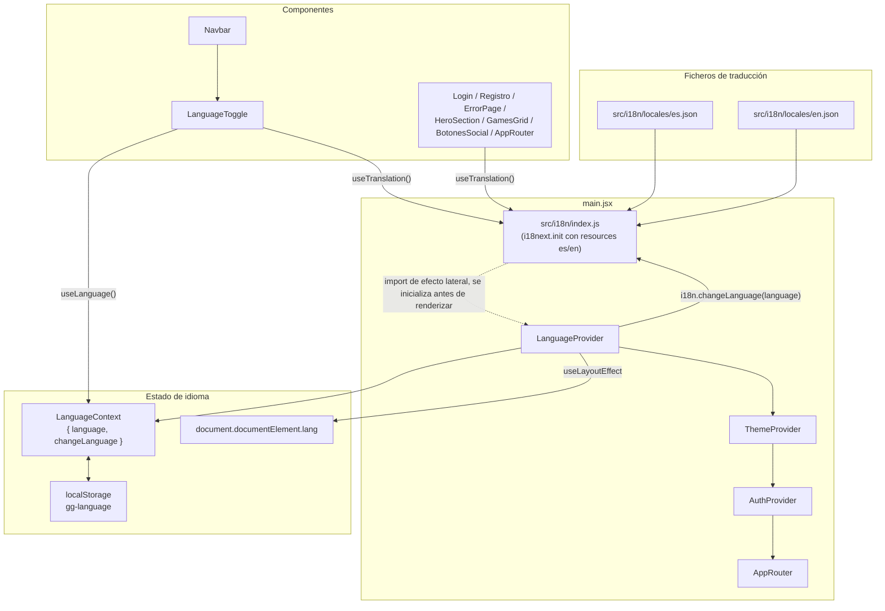

# Design Document

## Overview

Se introduce `react-i18next` en `GalinGames_react` para centralizar todo el texto visible en dos ficheros de recursos, `es.json` (idioma por defecto) y `en.json`, y se añade un `LanguageToggle` en el `Navbar` para cambiar entre ambos.

La solución replica el patrón ya existente en el proyecto para el tema visual (`ThemeContext` / `ThemeProvider` / `useTheme` / `ThemeToggle`), de modo que un desarrollador que ya conozca `themeContext.jsx` reconoce inmediatamente la forma de `languageContext.jsx`:

- Un **contexto propio (`LanguageContext`)** mantiene el idioma activo (`es` | `en`), lo persiste en `localStorage` y aplica el atributo `lang` sobre `<html>` — igual que `ThemeProvider` aplica `data-theme`.
- **`i18next`/`react-i18next`** actúan como motor de traducción puro: reciben el idioma activo vía `i18n.changeLanguage()` y resuelven `t('namespace.clave')` en cada componente. No sustituyen al contexto propio, lo complementan (el contexto decide *qué* idioma está activo y gestiona `lang`/persistencia; i18next decide *cómo* se resuelve cada clave a texto).
- **`LanguageToggle`** es un botón + dropdown accesible, estructuralmente análogo al menú de usuario ya existente en `Navbar.jsx` (`navbar__menu-usuario`): mismo patrón de `useState` + `useRef` + cierre por click-fuera/`Escape`.

## Architecture



## Components and Interfaces

### Ficheros nuevos

```
GalinGames_react/
  src/
    i18n/
      index.js                          # init de i18next + react-i18next
      locales/
        es.json                         # idioma por defecto / fallback
        en.json
    globalState/
      languageContext.jsx                # LanguageProvider (análogo a themeContext.jsx)
      languageContext.test.jsx
    hooks/
      useLanguage.js                     # análogo a useTheme.js
    Componentes/compGlobales/NavbarComponente/
      LanguageToggle.jsx                 # nuevo, sustituye al <span className="navbar__idioma">
      LanguageToggle.scss
      LanguageToggle.test.jsx
```

### Ficheros modificados (no exhaustivo de detalle línea a línea, ver tasks.md)

`main.jsx`, `Navbar.jsx` (+ `.scss`), `ThemeToggle.jsx`, `Login.jsx`, `Registro.jsx`, `ErrorPage.jsx`, `BotonesSocial.jsx`, `HeroSection.jsx`, `GamesGrid.jsx`, `AppRouter.jsx`, `CLAUDE.md`, `package.json` (nuevas dependencias), y los `*.test.jsx` existentes que rendericen cualquiera de los anteriores (deben envolver con `LanguageProvider`).

### `src/i18n/index.js`

```js
import i18n from 'i18next'
import { initReactI18next } from 'react-i18next'
import es from './locales/es.json'
import en from './locales/en.json'

i18n.use(initReactI18next).init({
  resources: {
    es: { translation: es },
    en: { translation: en },
  },
  lng: 'es',
  fallbackLng: 'es',
  interpolation: { escapeValue: false }, // React ya escapa el texto renderizado
  returnEmptyString: false,
})

export default i18n
```

Import de efecto lateral desde `main.jsx` (antes del `createRoot(...).render(...)`) para que los recursos estén listos de forma **síncrona** antes del primer render — cubre Requisito 7.2 (sin parpadeo de claves sin resolver).

### `src/globalState/languageContext.jsx`

```js
import { createContext, useState, useCallback, useLayoutEffect } from 'react'
import i18n from '../i18n'

export const LanguageContext = createContext(null)

const LANGUAGE_STORAGE_KEY = 'gg-language'
const IDIOMAS_VALIDOS = ['es', 'en']

function readLanguageFromStorage() {
  const stored = localStorage.getItem(LANGUAGE_STORAGE_KEY)
  return IDIOMAS_VALIDOS.includes(stored) ? stored : 'es'
}

export function LanguageProvider({ children }) {
  const [language, setLanguage] = useState(readLanguageFromStorage)

  useLayoutEffect(() => {
    document.documentElement.setAttribute('lang', language)
    i18n.changeLanguage(language)
  }, [language])

  const changeLanguage = useCallback((next) => {
    if (!IDIOMAS_VALIDOS.includes(next) || next === undefined) return
    setLanguage(next)
    localStorage.setItem(LANGUAGE_STORAGE_KEY, next)
  }, [])

  const value = { language, changeLanguage }

  return <LanguageContext.Provider value={value}>{children}</LanguageContext.Provider>
}
```

Cubre Requisitos 1.2, 1.3 (fallback `es`), 2.2, 2.5, 2.6.

### `src/hooks/useLanguage.js`

```js
import { useContext } from 'react'
import { LanguageContext } from '../globalState/languageContext'

export function useLanguage() {
  const ctx = useContext(LanguageContext)
  if (!ctx) throw new Error('useLanguage debe usarse dentro de LanguageProvider')
  return ctx
}
```

### `main.jsx` (orden de providers)

```jsx
import './i18n' // efecto lateral: inicializa i18next antes del primer render
...
<BrowserRouter>
  <LanguageProvider>
    <ThemeProvider>
      <AuthProvider>
        <AppRouter />
      </AuthProvider>
    </ThemeProvider>
  </LanguageProvider>
</BrowserRouter>
```

`LanguageProvider` envuelve a `ThemeProvider` (orden arbitrario entre ambos, no hay dependencia real), pero **debe** envolver a todo componente que use `useLanguage()` — en particular `Navbar`/`LanguageToggle`, y también `Login`/`Registro` (que renderizan su propio `ThemeToggle` fuera del `Navbar`, pero no `LanguageToggle` — ver Requisito 3, el selector de idioma vive únicamente en el `Navbar`).

### `LanguageToggle.jsx`

Estructura calcada de `navbar__menu-usuario` en `Navbar.jsx` (mismo patrón `useState` + `useRef` + `useEffect` de click-fuera/`Escape`, Requisito 3.6):

```jsx
import { useState, useRef, useEffect } from 'react'
import { useTranslation } from 'react-i18next'
import { useLanguage } from '../../../hooks/useLanguage'
import { IconoGlobo } from './NavbarIconos'
import './LanguageToggle.scss'

function LanguageToggle() {
  const { t } = useTranslation()
  const { language, changeLanguage } = useLanguage()
  const [abierto, setAbierto] = useState(false)
  const contenedorRef = useRef(null)

  useEffect(() => {
    if (!abierto) return undefined
    const handleClickFuera = (e) => {
      if (contenedorRef.current && !contenedorRef.current.contains(e.target)) setAbierto(false)
    }
    const handleTecla = (e) => { if (e.key === 'Escape') setAbierto(false) }
    document.addEventListener('mousedown', handleClickFuera)
    document.addEventListener('keydown', handleTecla)
    return () => {
      document.removeEventListener('mousedown', handleClickFuera)
      document.removeEventListener('keydown', handleTecla)
    }
  }, [abierto])

  const handleSeleccionar = (idioma) => {
    changeLanguage(idioma)
    setAbierto(false)
  }

  return (
    <div className="language-toggle" ref={contenedorRef}>
      <button
        type="button"
        className="language-toggle__boton"
        aria-haspopup="true"
        aria-expanded={abierto}
        aria-label={t('languageToggle.ariaLabel')}
        onClick={() => setAbierto((prev) => !prev)}
      >
        <IconoGlobo />
        <span>{language.toUpperCase()}</span>
      </button>
      {abierto && (
        <ul className="language-toggle__dropdown" role="menu" aria-label={t('languageToggle.menuLabel')}>
          <li role="none">
            <button
              type="button"
              role="menuitem"
              className="language-toggle__opcion"
              aria-disabled={language === 'es'}
              disabled={language === 'es'}
              onClick={() => handleSeleccionar('es')}
            >
              {t('languageToggle.spanish')}
            </button>
          </li>
          <li role="none">
            <button
              type="button"
              role="menuitem"
              className="language-toggle__opcion"
              aria-disabled={language === 'en'}
              disabled={language === 'en'}
              onClick={() => handleSeleccionar('en')}
            >
              {t('languageToggle.english')}
            </button>
          </li>
        </ul>
      )}
    </div>
  )
}

export default LanguageToggle
```

Cubre Requisitos 3.1–3.6 y 4.1–4.5. Nota: `disabled` (además de `aria-disabled`) en la opción activa evita que `onClick` dispare `changeLanguage` con el idioma ya activo, sin necesidad de comprobarlo dentro de `handleSeleccionar`.

En `Navbar.jsx`, dentro de `navbar__utilidades`, se sustituye:

```diff
- <span className="navbar__idioma" aria-disabled="true" title="Idioma (próximamente)">
-   <IconoGlobo />
-   ES
- </span>
+ <LanguageToggle />
```

## Data Models

No hay modelos de base de datos — el "modelo de datos" de esta feature son los ficheros de recursos de traducción. Estructura: un único namespace (`translation`, el default de i18next) por idioma, con claves organizadas por prefijo de componente/sección (`keySeparator` por defecto `.`).

Mapa de claves (idéntica estructura en `es.json` y `en.json`, solo cambia el valor). `{{variable}}` indica interpolación:

**`common`** (texto compartido literal entre varios componentes)
| Clave | Valor `es` |
|---|---|
| `common.loading` | Cargando... |
| `common.backToHome` | ‹ Volver al inicio |
| `common.backToHomeAria` | Volver al inicio |
| `common.retryIn` | Vuelve a intentarlo en {{seconds}} segundos. |
| `common.timeoutError` | La petición tardó demasiado. Inténtalo de nuevo. |

**`navbar`**
`ariaLabel`, `linkInicio`, `linkJuegos`, `linkNovedades`, `linkComunidad`, `toggleCategoriasOpenAria`, `toggleCategoriasCloseAria`, `toggleMenuOpenAria`, `toggleMenuCloseAria`, `searchTitle`, `cartTitle`, `userMenuAria`, `loginAria`, `support`, `myAccount`, `myOrders`, `logout`

**`languageToggle`**
`ariaLabel` (Cambiar idioma), `menuLabel` (Selector de idioma), `spanish` (Español), `english` (English)

**`themeToggle`**
`ariaLabelToBlue` (Cambiar a tema azul), `ariaLabelToRed` (Cambiar a tema rojo), `logoAlt` (GG Games)

**`hero`**
`title` (LO MÁS JUGADO), `discoverSubtitle` (Descubre lo que la comunidad está jugando ahora mismo.), `ctaViewAll` (Ver todos ›)

**`gamesGrid`**
`title` (TENDENCIAS ›) — los nombres de los juegos (`alt`) quedan fuera (Requisito 5.4)

**`errorPage`**
`backToLogin`, `retryCountdown` ({{seconds}}), `unknownCode` (???), `defaultTitle`, `defaultMessage`, y `codes.<código>.title` / `codes.<código>.message` para `400/401/403/404/410/429/500/503`

**`login`**
`title`, `emailVerifiedSuccess`, `usernameLabel`, `passwordLabel`, `validationRequired`, `invalidCredentials`, `tooManyAttempts`, `submit`, `submitLoading`, `noAccountYet`, `forgotPassword`

**`registro`**
`title`, `fieldUsername`, `fieldNombre`, `fieldApellidos`, `fieldEmail`, `fieldPassword`, `fieldRepetirPassword`, `termsAlert`, `validationRequired`, `passwordMismatch`, `usernameOrEmailInUse`, `reviewFields`, `tooManyRequests`, `unexpectedError`, `successMessage` ({{username}}, {{email}}), `acceptTerms` (con `<1>` embebido, ver Trans más abajo), `submit`, `submitLoading`, `alreadyHaveAccount`

**`botonesSocial`**
`continueWith` ({{proveedor}} — Facebook/Google/Apple/Discord NO se traducen, viajan como variable), `orDivider`

Ejemplo de fichero (extracto real, mismo formato en ambos idiomas):

```json
// es.json
{
  "hero": {
    "title": "LO MÁS JUGADO",
    "discoverSubtitle": "Descubre lo que la comunidad está jugando ahora mismo.",
    "ctaViewAll": "Ver todos ›"
  }
}
```

```json
// en.json
{
  "hero": {
    "title": "MOST PLAYED",
    "discoverSubtitle": "Discover what the community is playing right now.",
    "ctaViewAll": "View all ›"
  }
}
```

### Casos especiales de migración

- **`Navbar.ENLACES_PROXIMAMENTE`**: pasa de array de texto (`['Juegos', 'Novedades', 'Comunidad']`, usado también como `key` de React) a array de claves (`['navbar.linkJuegos', 'navbar.linkNovedades', 'navbar.linkComunidad']`); se resuelve con `t(clave)` en el render y se sigue usando la propia clave como `key` de React (sigue siendo estable y única).
- **`ErrorPage.ERROR_CONFIG`**: pasa de objeto estático `{ 404: { title, message } }` a una función `getErrorConfig(code, t)` que, si `code` está en la lista de códigos soportados, devuelve `{ title: t(\`errorPage.codes.${code}.title\`), message: t(\`errorPage.codes.${code}.message\`) }`, y si no, `{ title: t('errorPage.defaultTitle'), message: t('errorPage.defaultMessage') }`.
- **`Registro.CAMPOS_FORM`**: el campo `label` pasa a guardar la clave de traducción (`'registro.fieldUsername'`, no el texto), resuelta con `t(field.label)` al renderizar cada `InputBox`.
- **`InputBox.jsx`**: no necesita `useTranslation()` propio — recibe `labelInput`/`placeholderInput` ya traducidos como props desde `Login`/`Registro` (que sí llaman a `t()`).
- **Texto con enlace embebido** (`registro.acceptTerms`, "Acepto los términos y condiciones y la *política de privacidad*"): se resuelve con el componente `<Trans>` de `react-i18next`, no partiendo la frase en dos claves independientes, para no romper el orden gramatical en inglés:

  ```jsx
  <Trans i18nKey="registro.acceptTerms">
    Acepto los términos y condiciones y la <a href="#" className="text-primary text-decoration-underline">política de privacidad</a>
  </Trans>
  ```

  con `es.json`: `"acceptTerms": "Acepto los términos y condiciones y la <1>política de privacidad</1>"`.

## API Design

No aplica — feature exclusivamente de frontend, sin nuevos endpoints ni cambios en `GalinGames_nodejs`.

## Error Handling

- **Clave inexistente**: comportamiento por defecto de `i18next` (sin `parseMissingKeyHandler` personalizado) — se muestra la propia clave como texto, nunca una pantalla en blanco ni una excepción (Requisito 5.5).
- **Idioma persistido inválido**: `readLanguageFromStorage()` valida contra `IDIOMAS_VALIDOS` y cae a `'es'` si el valor no es reconocido (Requisito 2.6), igual que `readThemeFromStorage()` hace con temas inválidos.
- **`useLanguage()` fuera de `LanguageProvider`**: lanza `Error('useLanguage debe usarse dentro de LanguageProvider')`, igual que `useTheme()` — error de programación detectable en desarrollo/tests, no un caso a manejar en producción.
- **Carga de recursos**: al ser JSON importados de forma estática (bundle de Vite), no hay estado de carga asíncrona que gestionar ni posibilidad de fallo de red (Requisito 7.2).

## Impacto en tests existentes

- `es.json` usa como valor **exactamente** el texto español que ya está hardcodeado hoy en cada componente, así que los tests existentes que hacen aserciones sobre texto en español (`Navbar.test.jsx`, `ThemeToggle.test.jsx`, `Login.test.jsx`, `Registro.test.jsx`, `ErrorPage.test.jsx`) no deberían necesitar cambiar sus aserciones de texto, solo su *render helper*.
- Todo `render(...)` que monte un componente que (directa o indirectamente vía `Navbar`) use `useTranslation()` o `useLanguage()` debe envolverse también en `<LanguageProvider>`, igual que ya se envuelve en `<ThemeProvider>`.
- `src/tests/setup.js` debe importar `../i18n` como efecto lateral, para que `i18next` esté inicializado antes de que cualquier test renderice un componente que llame a `useTranslation()` (evita depender de que cada test importe `main.jsx`, que nunca se importa en tests).
- Se añaden `languageContext.test.jsx` (mismo esquema que `themeContext.test.jsx`: valor por defecto, valor inválido en storage, persistencia) y `LanguageToggle.test.jsx` (mismo esquema que `ThemeToggle.test.jsx`: estado inicial, apertura de dropdown, opción activa deshabilitada, selección con teclado, cierre con `Escape`/click-fuera).

## Actualización de `CLAUDE.md` (Requisito 6)

Se añade una nueva sección al final de `CLAUDE.md`, tras "Comandos disponibles":

```markdown
## Internacionalización (i18n)

El proyecto usa `react-i18next`. Todo texto visible para el usuario en
`GalinGames_react` DEBE resolverse mediante una clave de traducción
(`useTranslation()` + `t('namespace.clave')`), nunca como literal en el JSX.

- Las claves se escriben en inglés, cortas y descriptivas (ej. `hero.discoverSubtitle`),
  namespaced por componente/sección (`navbar.*`, `login.*`, `common.*`, ...).
  Nunca se usa el texto completo como clave.
- Toda clave nueva se añade en `src/i18n/locales/es.json` (idioma de referencia)
  **y** en `en.json`, con la misma estructura de claves.
- Texto con datos dinámicos usa interpolación `{{variable}}` de i18next, no
  concatenación de strings.
- Al generar `design.md`/`tasks.md` de una feature nueva, las tareas que
  introduzcan texto de interfaz deben incluir explícitamente la adición de
  las claves correspondientes a `es.json`/`en.json`.
```

Cubre Requisitos 6.1, 6.2, 6.3.

## Dependencias nuevas

`package.json` (`GalinGames_react`) añade a `dependencies`: `i18next`, `react-i18next`. No se necesita configuración adicional en `vite.config.js` (Vite soporta `import x from './y.json'` de forma nativa) ni en `eslint.config.js`.

## Design Decisions

| Decisión | Alternativa considerada | Por qué se descarta | Requisitos que cubre |
|---|---|---|---|
| Contexto propio `LanguageContext`/`LanguageProvider` que envuelve a `i18next` | Usar únicamente `i18n.language`/`i18n.changeLanguage` sin contexto propio, leyendo el idioma directamente de la instancia de `i18next` en cada componente | No hay sitio natural para aplicar `document.documentElement.lang` ni para persistir en `localStorage` con el mismo patrón que `ThemeProvider`; forzaría lógica duplicada o un `useEffect` ad-hoc en `LanguageToggle` en vez de en un único punto | 1.2, 2.2, 2.5, 2.6 |
| Un único namespace `translation` con claves `dot.separadas` por prefijo de componente | Namespaces reales de i18next (un fichero por sección, carga perezosa con `i18next-http-backend`) | La app es pequeña y todo el texto se carga de una vez; namespaces reales añaden complejidad (carga asíncrona, `Suspense`) sin beneficio at this scale | 5.6, 5.7 |
| `<Trans>` para `registro.acceptTerms` (frase con enlace embebido) | Partir en dos claves (`acceptTermsPrefix` + `privacyPolicyLink`) y concatenar en JSX | Concatenar rompe el orden gramatical al traducir a idiomas donde el enlace no va al final de la frase; `Trans` mantiene la frase completa traducible como unidad | 5.1, 5.6 |
| `LanguageToggle` siempre muestra icono de globo + código del idioma **activo** (no el idioma al que cambiarías) | Mostrar el idioma alternativo (patrón inverso, como estaba redactado en un primer borrador) | Decisión explícita del usuario tras aclaración: el botón refleja el estado actual, y el dropdown (con la opción activa deshabilitada) es donde se elige el otro idioma | 3.2, 4.2, 4.3 |
| `es.json` con los mismos literales de texto que ya existen hoy en el código | Redactar textos "limpios"/revisados de nuevo al migrar | Minimiza el riesgo de romper tests existentes que aseveran texto en español, y separa la migración a i18n (esta feature) de cualquier revisión de copy (fuera de alcance) | 5.1, 5.2 |

## Requirements Coverage

| Requisito | Cubierto por |
|---|---|
| 1.1, 1.2, 1.3 | `LanguageProvider` (`lng`/`fallbackLng: 'es'`, `readLanguageFromStorage` por defecto `'es'`) |
| 2.1, 2.2, 2.3 | `LanguageToggle.handleSeleccionar` → `changeLanguage` → `LanguageProvider` (`i18n.changeLanguage` + `document.documentElement.lang`) |
| 2.4 | Estado en `LanguageContext` (nivel `main.jsx`, no por página) — persiste entre navegaciones de `react-router` sin remount |
| 2.5, 2.6 | `LANGUAGE_STORAGE_KEY`/`readLanguageFromStorage`/`IDIOMAS_VALIDOS` en `languageContext.jsx` |
| 3.1–3.6 | `LanguageToggle.jsx` |
| 4.1–4.5 | `LanguageToggle.jsx` (dropdown) |
| 5.1, 5.2, 5.3, 5.4 | Mapa de claves en `Data Models` + casos especiales de migración |
| 5.5 | Comportamiento por defecto de `i18next` (ver `Error Handling`) |
| 5.6, 5.7 | Convención de nombres aplicada en todo el mapa de claves (`namespace.claveDescriptivaEnIngles`) |
| 6.1, 6.2, 6.3 | Sección "Actualización de `CLAUDE.md`" |
| 7.1 | `changeLanguage` solo actualiza estado de React, sin `reload()`/navegación |
| 7.2 | `src/i18n/index.js` inicializado de forma síncrona antes del primer render |
| 7.3 | Providers a nivel `main.jsx` (fuera de `AppRouter`), mismo estado en todas las rutas |
