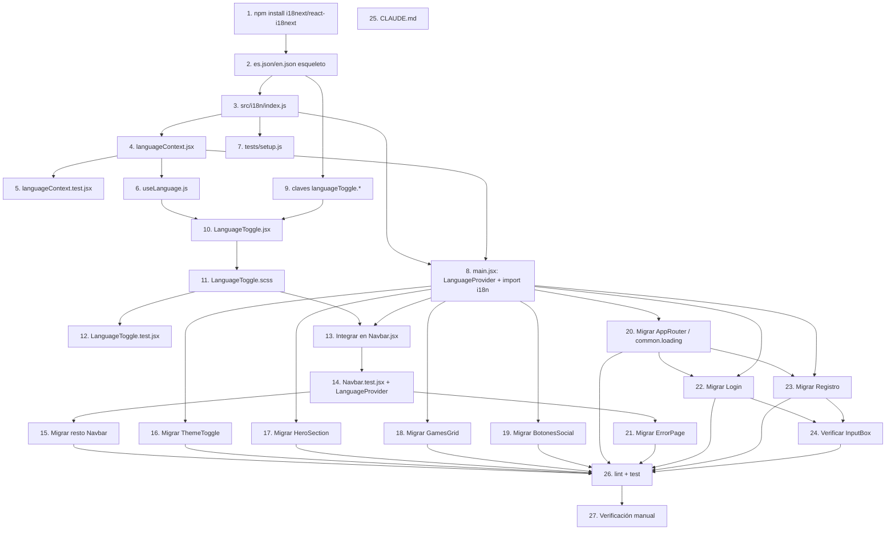

# Implementation Plan: selector-idioma

## Overview

Plan de implementación de la internacionalización (`react-i18next`) y el selector de idioma ES/EN del `Navbar` en `GalinGames_react`, siguiendo `design.md`. Las tareas van de lo estructural (dependencias, `LanguageProvider`, `i18next`) al `LanguageToggle`, y después a la migración de texto componente por componente, terminando con la actualización de `CLAUDE.md` y la verificación cruzada. Cada tarea de migración de texto añade sus claves a `es.json`/`en.json` **y** consume `t()`/`useTranslation()` en el mismo paso, para que cada commit deje el componente en un estado consistente (nunca claves huérfanas ni texto a medio migrar).

## Tasks

### Fase 0 — Dependencias

- [x] 1. Instalar `i18next` y `react-i18next` en `GalinGames_react/package.json`
  **Dependencias:** ninguna
  **Requisitos:** infraestructura (soporta todos los siguientes)

### Fase 1 — Infraestructura base de i18n

- [x] 2. Crear el esqueleto de los ficheros de recursos `src/i18n/locales/es.json` y `src/i18n/locales/en.json` (objeto vacío `{}` en ambos, misma ubicación)
  **Dependencias:** Tarea 1
  **Requisitos:** 5.7 (estructura base sobre la que se apoya la convención de namespaces)

- [x] 3. Crear `src/i18n/index.js` con la inicialización de `i18next` + `initReactI18next` (`lng: 'es'`, `fallbackLng: 'es'`, `interpolation.escapeValue: false`), importando los JSON de la Tarea 2
  **Dependencias:** Tarea 2
  **Requisitos:** 1.3, 7.2

- [x] 4. Crear `src/globalState/languageContext.jsx` (`LanguageContext`, `LanguageProvider`, `LANGUAGE_STORAGE_KEY = 'gg-language'`, `readLanguageFromStorage`, `changeLanguage`), replicando el patrón de `themeContext.jsx`
  **Dependencias:** Tarea 3
  **Requisitos:** 1.2, 2.2, 2.5, 2.6

- [x] 5. Crear `src/globalState/languageContext.test.jsx` (idioma por defecto `es` sin storage previo, valor inválido en storage cae a `es`, `changeLanguage` persiste en `localStorage` y actualiza `document.documentElement.lang`), mismo esquema que `themeContext.test.jsx`
  **Dependencias:** Tarea 4
  **Requisitos:** 1.2, 1.3, 2.2, 2.5, 2.6

- [x] 6. Crear `src/hooks/useLanguage.js` (hook que lee `LanguageContext` y lanza si no hay `LanguageProvider` ancestro), análogo a `useTheme.js`
  **Dependencias:** Tarea 4
  **Requisitos:** 1.2, 2.2

- [x] 7. Actualizar `src/tests/setup.js` para importar `../i18n` como efecto lateral, garantizando que `i18next` esté inicializado antes de cualquier test que renderice un componente con `useTranslation()`
  **Dependencias:** Tarea 3
  **Requisitos:** 7.2 (aplicado también a la suite de tests)

- [x] 8. Actualizar `src/main.jsx`: importar `./i18n` antes del render, y envolver `AppRouter` con `<LanguageProvider>` (fuera o dentro de `ThemeProvider`, ambos deben quedar dentro de `LanguageProvider` para poder usar `useLanguage()`)
  **Dependencias:** Tareas 3, 4
  **Requisitos:** 1.1, 1.2, 2.4, 7.1, 7.3

### Fase 2 — `LanguageToggle`

- [x] 9. Añadir el namespace `languageToggle` (`ariaLabel`, `menuLabel`, `spanish`, `english`) a `es.json` y `en.json`
  **Dependencias:** Tarea 2
  **Requisitos:** 5.6, 5.7

- [x] 10. Crear `LanguageToggle.jsx` (botón con icono de globo + código de idioma activo, dropdown accesible con `role="menu"`/`role="menuitem"`, cierre por click-fuera/`Escape`, opción del idioma activo `disabled`+`aria-disabled`), según el diseño de `design.md`
  **Dependencias:** Tareas 6, 9
  **Requisitos:** 2.1, 2.2, 2.3, 3.1, 3.2, 3.3, 3.4, 3.5, 3.6, 4.1, 4.2, 4.3, 4.4, 4.5

- [x] 11. Crear `LanguageToggle.scss` (estilos del botón trigger y del dropdown, reutilizando tokens/patrón visual de `navbar__dropdown` y `navbar__icono-usuario`)
  **Dependencias:** Tarea 10
  **Requisitos:** 3.1, 3.2, 4.1

- [x] 12. Crear `LanguageToggle.test.jsx` (estado inicial `ES` con dropdown cerrado, apertura con click/teclado, opción `ES` deshabilitada por defecto, selección de `EN` cambia idioma/`lang`/icono y cierra el dropdown, cierre con `Escape` y con click fuera), mismo esquema que `ThemeToggle.test.jsx`
  **Dependencias:** Tarea 11
  **Requisitos:** 2.1, 2.2, 2.3, 3.3, 3.6, 4.1, 4.2, 4.3, 4.4

### Fase 3 — Integración del `LanguageToggle` en el Navbar

- [ ] 13. En `Navbar.jsx`, sustituir el bloque estático `...ES` por `<LanguageToggle />` dentro de `navbar__utilidades`
  **Dependencias:** Tareas 11, 8
  **Requisitos:** 3.1

- [ ] 14. Actualizar el render helper de `Navbar.test.jsx` (y cualquier otro test que monte `Navbar`, p. ej. `ErrorPage.test.jsx`) para envolver con `<LanguageProvider>`, y añadir un test de que `LanguageToggle` aparece y es funcional dentro del `Navbar`
  **Dependencias:** Tarea 13
  **Requisitos:** 3.1 (verificación de integración)

### Fase 4 — Migración de texto por componente

- [ ] 15. Migrar `Navbar.jsx` (resto de texto): namespace `navbar` en `es.json`/`en.json` (`ariaLabel`, enlaces, aria-labels de toggles, `searchTitle`/`cartTitle`, menú de usuario, `loginAria`); `ENLACES_PROXIMAMENTE` pasa a array de claves (`navbar.linkJuegos`, etc.) resueltas con `t()`
  **Dependencias:** Tarea 14
  **Requisitos:** 5.1, 5.2, 5.6, 5.7

- [ ] 16. Migrar `ThemeToggle.jsx`: namespace `themeToggle` (`ariaLabelToBlue`, `ariaLabelToRed`, `logoAlt`) en `es.json`/`en.json`; actualizar `ThemeToggle.test.jsx` para envolver con `LanguageProvider`
  **Dependencias:** Tarea 8
  **Requisitos:** 5.1, 5.2, 5.6, 5.7

- [ ] 17. Migrar `HeroSection.jsx`: namespace `hero` (`title`, `discoverSubtitle`, `ctaViewAll`) en `es.json`/`en.json`; actualizar `HeroSection.test.jsx`
  **Dependencias:** Tarea 8
  **Requisitos:** 5.1, 5.2, 5.6, 5.7

- [ ] 18. Migrar `GamesGrid.jsx`: namespace `gamesGrid` (`title`) en `es.json`/`en.json`, dejando `alt` de cada juego sin traducir (nombres propios); actualizar `GamesGrid.test.jsx`
  **Dependencias:** Tarea 8
  **Requisitos:** 5.1, 5.2, 5.4, 5.6, 5.7

- [ ] 19. Migrar `BotonesSocial.jsx`: namespace `botonesSocial` (`continueWith` con interpolación `{{proveedor}}`, `orDivider`) en `es.json`/`en.json`, manteniendo los nombres de proveedor (Facebook/Google/Apple/Discord) sin traducir
  **Dependencias:** Tarea 8
  **Requisitos:** 5.1, 5.2, 5.3, 5.6, 5.7

- [ ] 20. Migrar `AppRouter.jsx`: namespace `common` (`loading`) en `es.json`/`en.json`
  **Dependencias:** Tarea 8
  **Requisitos:** 5.1, 5.2, 5.6, 5.7

- [ ] 21. Migrar `ErrorPage.jsx`: namespace `errorPage` (`backToLogin`, `retryCountdown` con `{{seconds}}`, `unknownCode`, `defaultTitle`, `defaultMessage`, `codes.<código>.title`/`codes.<código>.message` para 400/401/403/404/410/429/500/503) en `es.json`/`en.json`; `ERROR_CONFIG` pasa de objeto estático a función `getErrorConfig(code, t)`; actualizar `ErrorPage.test.jsx` (envolver con `LanguageProvider`, incluido por el `Navbar` que renderiza)
  **Dependencias:** Tarea 14
  **Requisitos:** 5.1, 5.2, 5.3, 5.5, 5.6, 5.7

- [ ] 22. Migrar `Login.jsx`: namespace `login` (`title`, `emailVerifiedSuccess`, `usernameLabel`, `passwordLabel`, `validationRequired`, `invalidCredentials`, `tooManyAttempts`, `submit`, `submitLoading`, `noAccountYet`, `forgotPassword`) + reutilización de `common.retryIn`/`common.timeoutError`/`common.backToHome`/`common.backToHomeAria` en `es.json`/`en.json`; actualizar `Login.test.jsx` (envolver con `LanguageProvider`)
  **Dependencias:** Tarea 8, Tarea 20 (reutiliza `common.*`)
  **Requisitos:** 5.1, 5.2, 5.3, 5.6, 5.7, 7.3

- [ ] 23. Migrar `Registro.jsx`: namespace `registro` (`title`, `fieldUsername`, `fieldNombre`, `fieldApellidos`, `fieldEmail`, `fieldPassword`, `fieldRepetirPassword`, `termsAlert`, `validationRequired`, `passwordMismatch`, `usernameOrEmailInUse`, `reviewFields`, `tooManyRequests`, `unexpectedError`, `successMessage` con `{{username}}`/`{{email}}`, `acceptTerms` vía `<Trans>` con `<1>` embebido, `submit`, `submitLoading`, `alreadyHaveAccount`) + reutilización de `common.*`; `CAMPOS_FORM` pasa a guardar claves de traducción resueltas con `t()` al renderizar; actualizar `Registro.test.jsx` (envolver con `LanguageProvider`)
  **Dependencias:** Tarea 8, Tarea 20 (reutiliza `common.*`)
  **Requisitos:** 5.1, 5.2, 5.3, 5.6, 5.7, 7.3

- [ ] 24. Verificar `InputBox.jsx`: confirmar que no requiere cambios (recibe `labelInput`/`placeholderInput` ya traducidos desde `Login`/`Registro`) — tarea de verificación, sin cambio de código esperado
  **Dependencias:** Tareas 22, 23
  **Requisitos:** 5.1

### Fase 5 — Proceso y documentación

- [ ] 25. Actualizar `CLAUDE.md` añadiendo la sección "Internacionalización (i18n)" (regla de claves en vez de texto plano, namespacing, interpolación, y su aplicación a futuras features spec-driven), según el texto propuesto en `design.md`
  **Dependencias:** ninguna (documental, puede hacerse en paralelo al resto)
  **Requisitos:** 6.1, 6.2, 6.3

### Fase 6 — Verificación final

- [ ] 26. Ejecutar `npm run lint` y `npm test` (`vitest run`) en `GalinGames_react` con todos los cambios aplicados; corregir cualquier regresión antes de dar la feature por completa
  **Dependencias:** Tareas 15–24
  **Requisitos:** cobertura cruzada de todos los anteriores

- [ ] 27. Verificación manual con el servidor de desarrollo (`npm run dev`): comprobar que el botón de idioma en el `Navbar` muestra `ES` por defecto, que el dropdown deshabilita `Español` y permite seleccionar `English`, que al seleccionarlo cambia el texto de toda la página, el atributo `lang` del `<html>` y el icono/código mostrado, que la preferencia persiste tras recargar, y que se mantiene al navegar entre `/`, `/login`, `/registro` y una ruta de error (`/error/404`)
  **Dependencias:** Tarea 26
  **Requisitos:** 1.1, 1.2, 2.1, 2.2, 2.3, 2.4, 2.5, 3.1–3.6, 4.1–4.5, 7.1, 7.3

## Task Dependency Graph

## Requirements Coverage

Todos los requisitos de `requirements.md` quedan cubiertos:

- **Requisito 1** (idioma español por defecto): Tareas 3, 4, 8
- **Requisito 2** (cambio a inglés): Tareas 4, 8, 10, 12
- **Requisito 3** (botón accesible): Tareas 10, 11, 12, 13
- **Requisito 4** (dropdown): Tareas 10, 12
- **Requisito 5** (migración de texto): Tareas 15–24
- **Requisito 6** (regla en `CLAUDE.md`): Tarea 25
- **Requisito 7** (sin recarga/errores): Tareas 3, 8, 26, 27
